## 传统词向量缺陷与attention的解决办法

传统的词向量表示方法, 无法解决一词多意的问题, 如下图, mole, 有3中意思:
1. American shrew mole: 美洲鼩鼹(qú yǎn), 其中mole是指鼹鼠.
2. One mole of carbon dioxide: 一摩尔二氧化碳, 其中mole是指摩尔, 1摩尔是$6.02 x 10^{23}$
3. Take a biopsy of the mole:对这颗痣进行活检, 其中mole是指痣

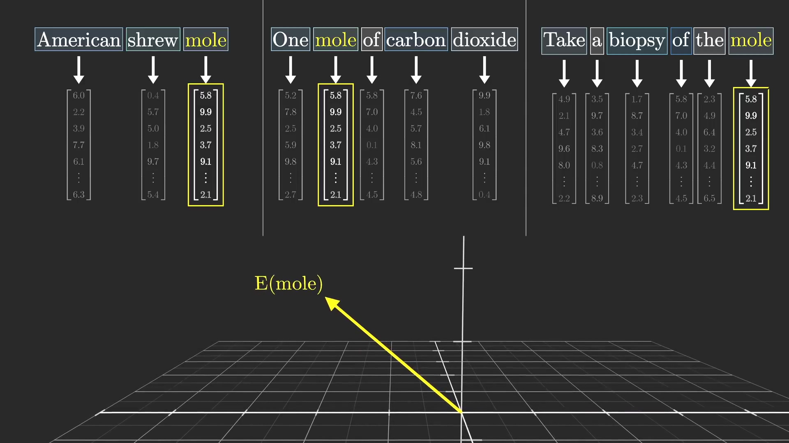

可以看到mole有3中意思, 但是只有一种向量表示. 如下图, mole向量可以看成是3种表示的加权和.

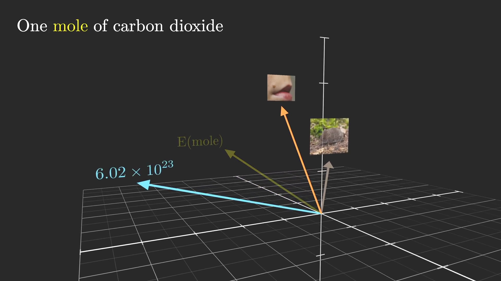

attention的解决办法就是根据上下文, 增加一个向量, 改变mole的原本向量表示, 以表达真实的含义.

如在mole原始向量增加一个向量, 来表示American shrew mole中的mole. 

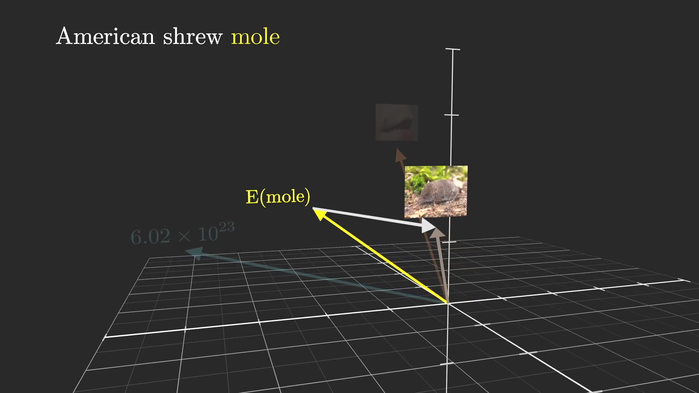

又如在mole原始向量增加一个向量, 来表示One mole of carbon dioxide中的mole.

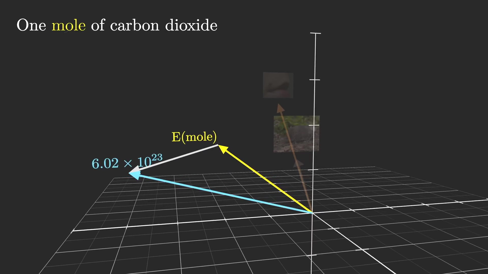

## 注意力机制的实现方法

a fluffy(毛茸茸的) blue(蓝色的) creature(生物) roamed(漫步) the verdant(翠绿的) forest(森林).

下图中, 上方是每个单词的原始意思是, 下方是根据上下文的学习的新意思.
creature(生物)原本是个creature(生物), 用$\vec{E}_4$来表示. 当模型结合了它前面的两个修饰词fluffy(毛茸茸的) blue(蓝色的), 则生成了新的creature(生物)表示, 用$\vec{E}_4'$表示.

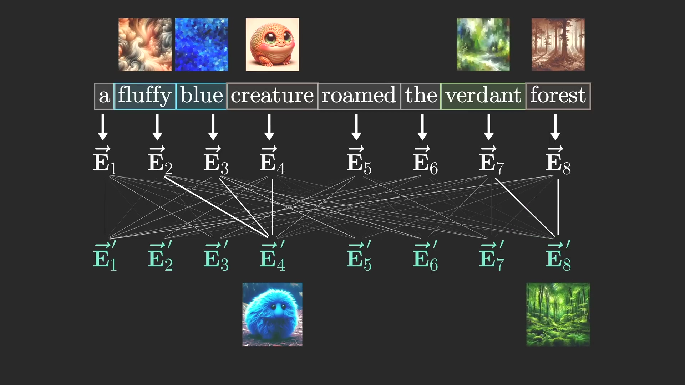

这种注意力(attention)机制的实现是通过3个向量QKE来实现的.

### Query向量

Query矩阵$W_Q$乘以creature(生物)的向量表示$\vec{E}_4$得到Query向量$\vec{Q}_4$. Query向量的主要作用是询问周围是否有和自己相关词语, 这个案例中具体是问creature(生物)之前有形容词嘛?

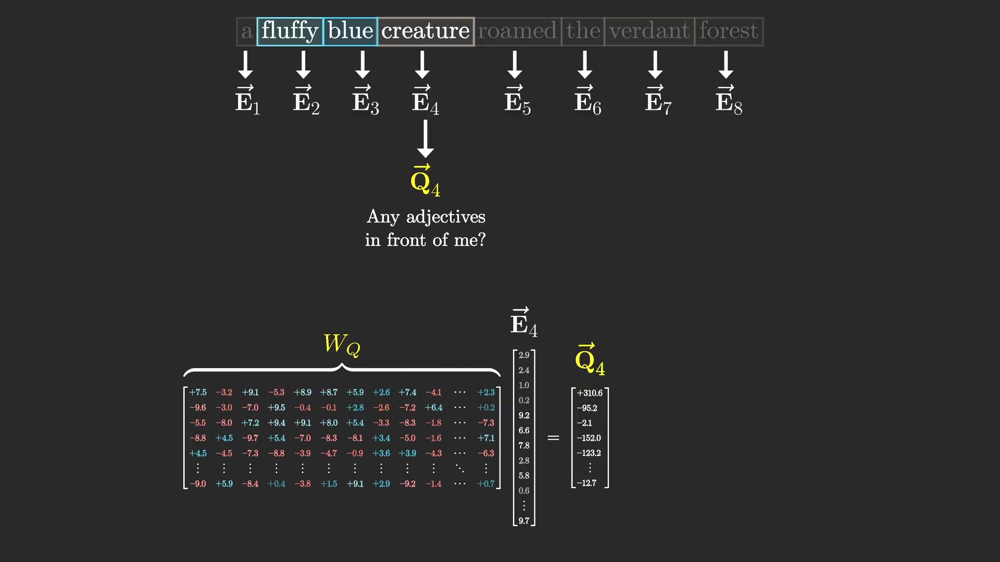

当然, 每个词语都会得到一个Query向量.

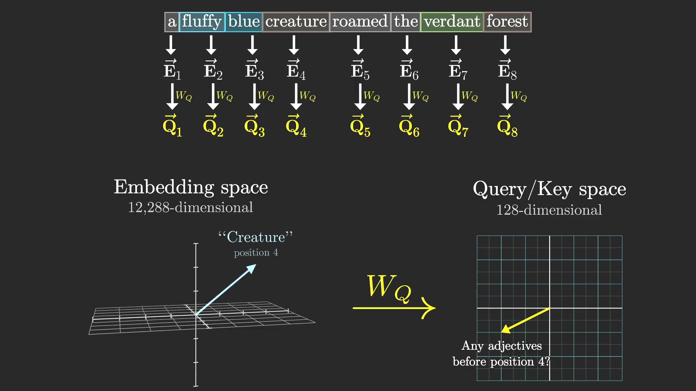

### Key向量

和Query向量一样, 每个单词也会创建一个Key向量, 用来回答Query的询问. 如下图, 通过Key矩阵$W_k$乘以单词向量表示, 得到Key向量, fluffy(毛茸茸的)$\vec{K}_2$, blue(蓝色的)$\vec{K}_3$

然后将Query向量和Key向量相乘, 既可以得到词语的相关程度. 如果$\vec{Q}$和$\vec{K}$相似, 则他们的内积就回越大.

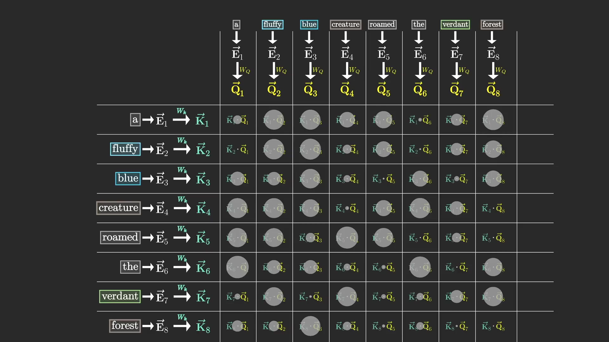

可以看到creature(生物)的最相关联的单词fluffy(毛茸茸的)和blue(蓝色的)被匹配到了.
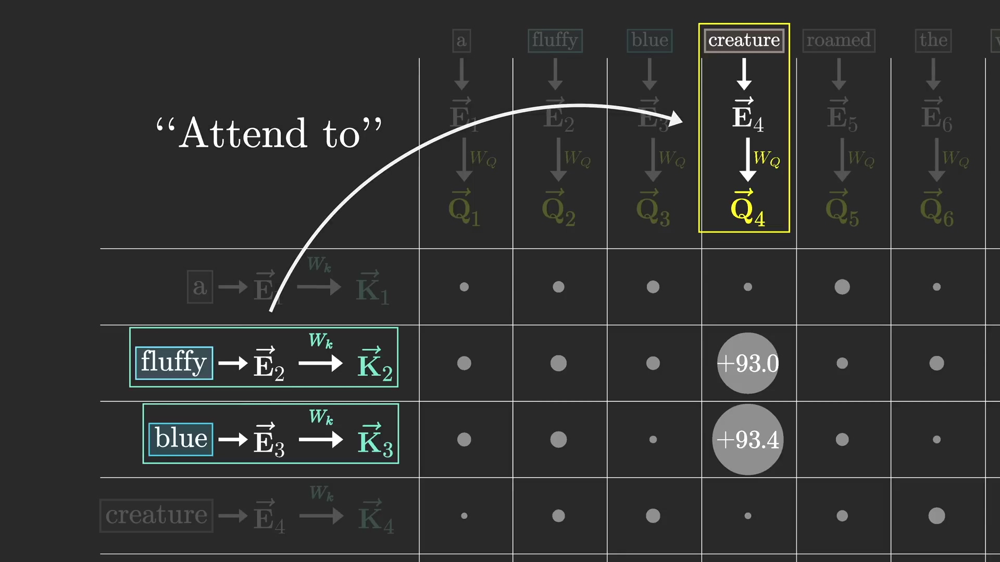

后续还会对该值进行归一化和softmax处理.

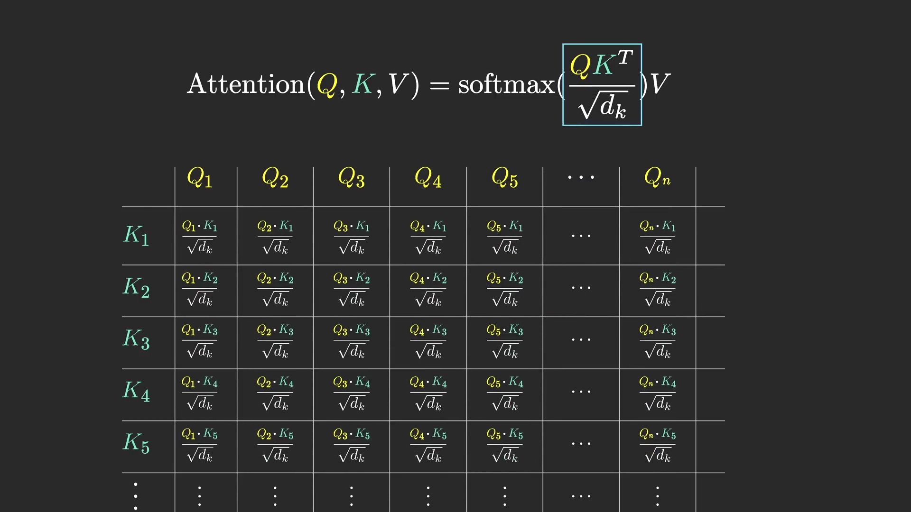

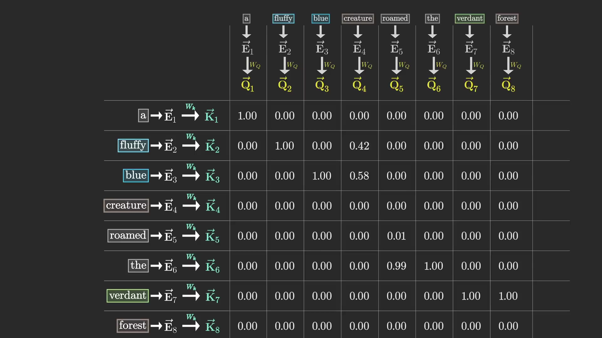

总结: Query和Key向量的作用是找到相关联的词, 既是attention.

### Value向量

Query向量和Key向量找到了关联词, 还需要Value向量最终生成attention注意力向量.

如下图creature(生物), 要转移到fluffy(毛茸茸的) creature(生物).
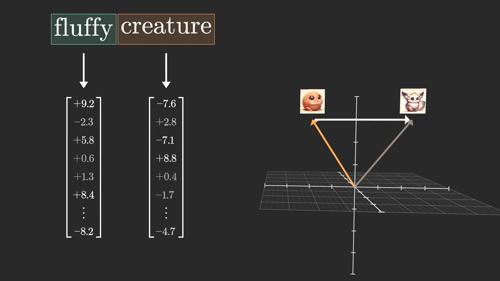

首先取出fluffy(毛茸茸的)的向量表示, 与Value矩阵$W_V$相乘得到Value向量.
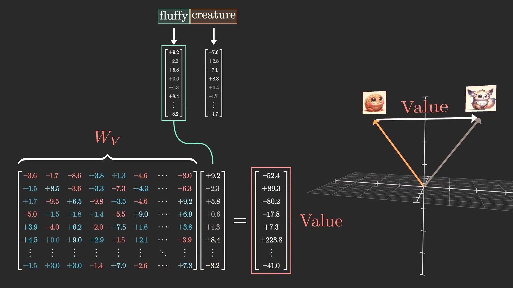

同理取出blue(蓝色的)的向量表示, 与Value矩阵W_V$相乘得到Value向量.
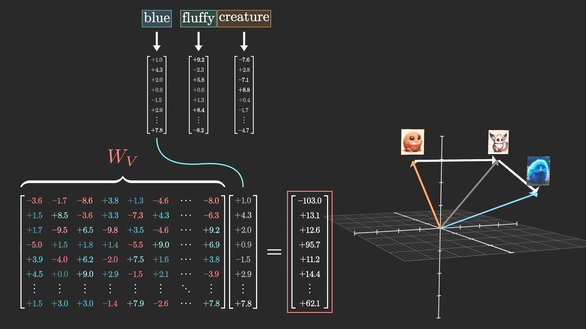

同理, 计算所有词语的Value向量, 然后和之前的Q向量和K向量计算的结果相乘, 并相加得到$\Delta \vec{E}_4$, 这个就是creature(生物)的注意力转移向量. $\vec{E}_4 + \Delta \vec{E}_4 = \vec{E}_4'$

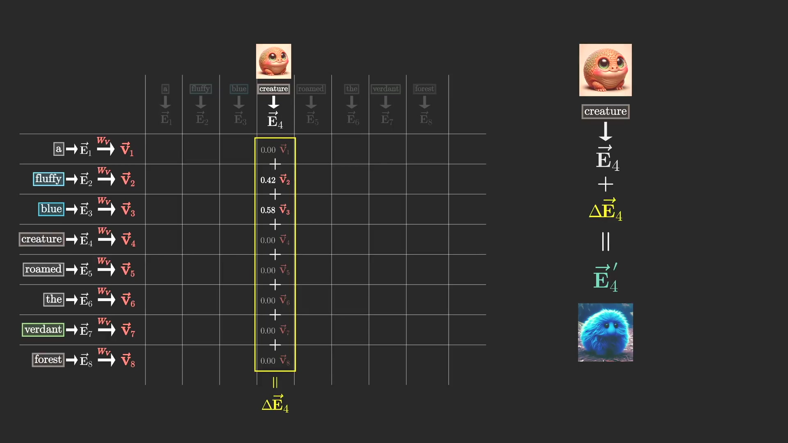

Value矩阵可以表示为Value_up和Value_down矩阵.

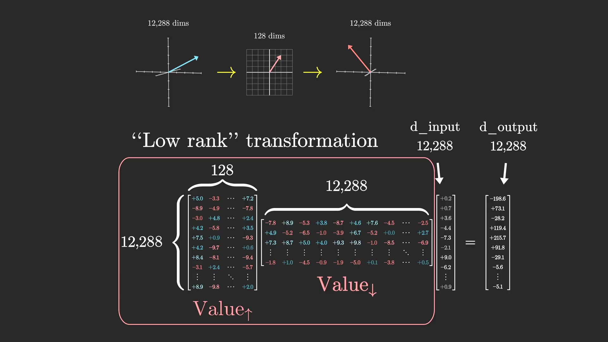

## 多头机制(Multi-headed attention)

上述的QKV向量计算, 会并行96个计算, 

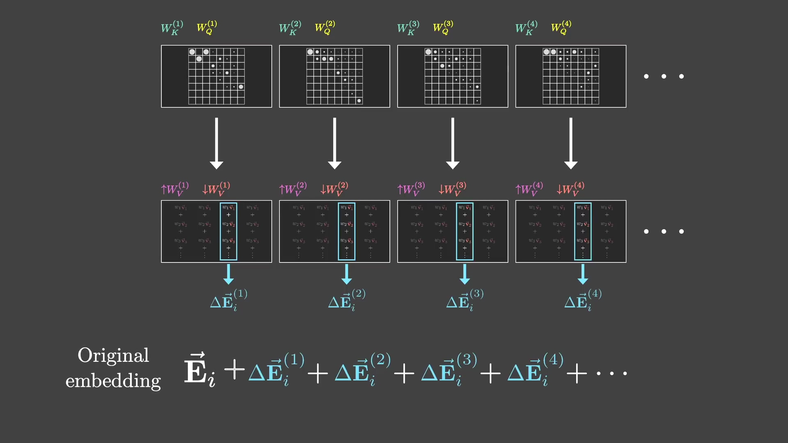

## attention的参数计算

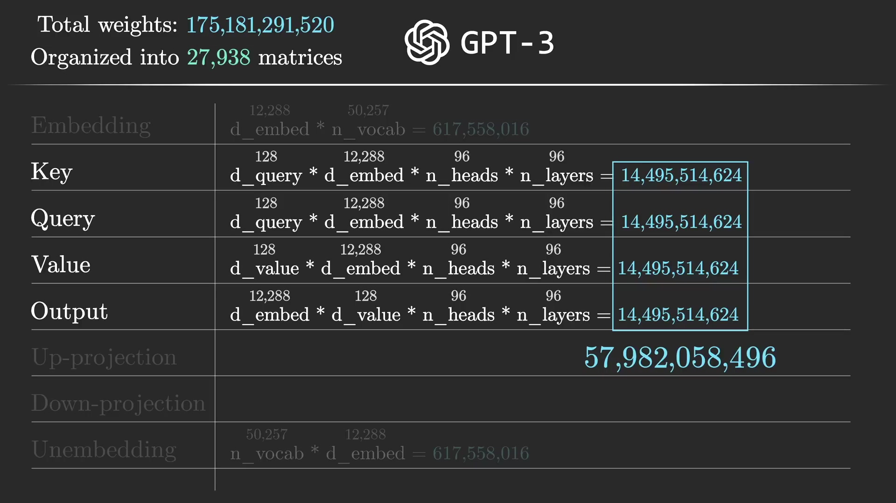

## 参考
1. https://www.youtube.com/playlist?list=PLZHQObOWTQDNU6R1_67000Dx_ZCJB-3pi
