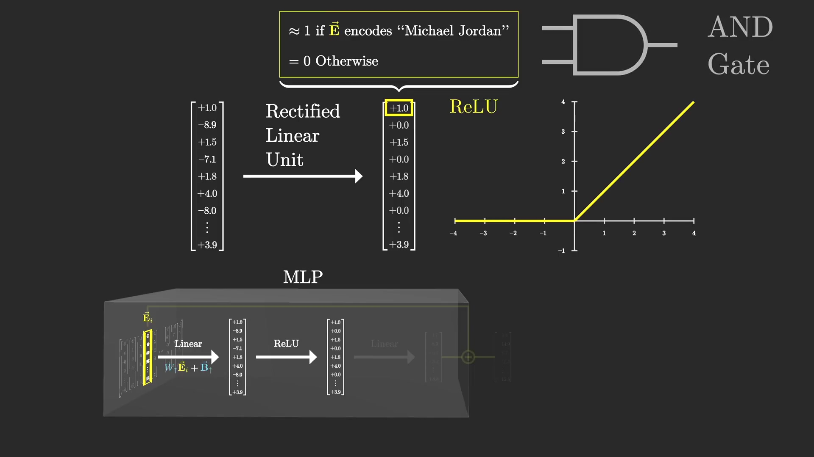

# MLP

多层感知机(MultiLayer Perceptron, MLP)

## MLP流程

每一个词向量会经过:
1. 升维线性层
2. ReLU层
3. 降维线性层
4. 和原始向量加和

对于每个词向量都要进行此操作:

Michael Jordan plays Basketball.为例, 输入是Michael Jordan(这里应该指的是Jordan, 通过前面的注意力机制, 将Michael Jordan关联在一起). 经过线性, ReLU, 线性转换后得到Basketball向量, 再和原向量相加, 即可得到Michael Jordan plays Basketball.

## 升维线性层

第一个全连接权重矩阵, 第一行可以看层是在解决该词向量$\vec{E}$是否包含了`Michael Jordan`的含义, 如果等于1, 则包含, 如果不等于1则不包含.

同理, 第二行可以理解为这个词语是英文嘛?
所以全连接每个神经元都在处理一个问题, 有多少个神经元(多少行)就是处理了多少个问题.

另外需要注意的是, 该权重矩阵总共有4 x 12288行, 可得到4 x 12288长度的向量,  既对原始向量进行了升维.

## 线性整流函数(ReLU, rectified linear unit)

线性层虽然能计算出第一名字Michael和第二个名字组合的数值大小, 但是不能判断哪个是正确的, 所以需要ReLU来进行最终的判断, 将Michael Jordan的对应的区域划为正确.

RuLU函数实现了类似AND Gate的作用.

## 降维线性层

降维线性层将4 x 12288长度向量, 降低到1 x 12288

这次, 矩阵我们按列来理解, 矩阵乘法可以看成每列乘以左侧向量的对应的数值, 再相加. 而左侧每一列可以看成包含了部分信息, 如第1列$\vec{C}_0$可能包含了$\vec{Basketball}$, $\vec{Chicago Bulls}$等. 右侧向量每一行的位置的数值, 是之前计算的概率值, 0或1, 表示是否采用左侧矩阵列向量包含的信息. 

## 总结

经过升维, ReLU, 降维后就可以将Michael Jordan Basketball联系起来了.

升维和降维所需要的参数

## 参考
1. https://www.youtube.com/playlist?list=PLZHQObOWTQDNU6R1_67000Dx_ZCJB-3pi