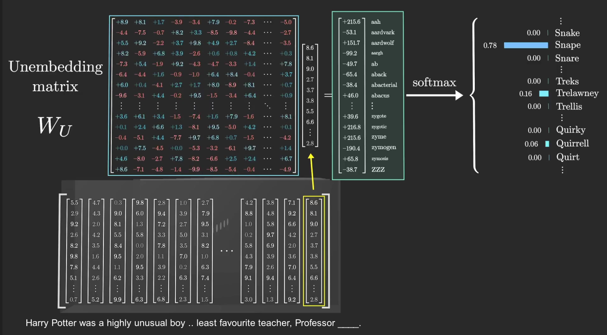

`Harry Potter` was a highly unusual boy .. `least favourite teacher`, `Professor` ____. 根据语句中的关键词, 我们猜出空白处最大可能是snape. 而模型是将attention部分的输出乘以Unembedding矩阵得到每个词语预估值, 再通过softmax转换为概率.

## 参考
1. https://www.youtube.com/playlist?list=PLZHQObOWTQDNU6R1_67000Dx_ZCJB-3pi