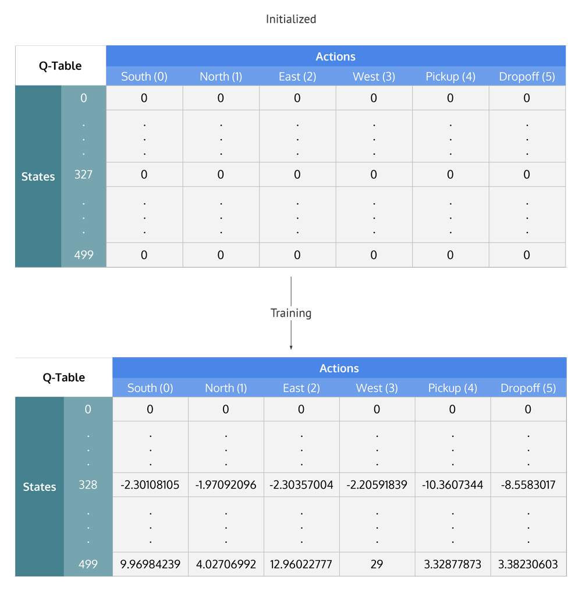

# taxi

训练一个可以在指定地点接乘客并送到另个指定地点的出租车，我们希望这辆出租车可以：
1. 在正确的地方接上乘客
2. 在正确的地方放下乘客
3. 以最快的速度放下乘客

我们需要考虑的有：奖励，状态以及行为

## 奖励
智能体如果能正确的放下乘客，则会收到高的正向的奖励，因为这是我们最期待的结果
智能体如果错误的放下乘客，则会收到负向的惩罚
智能体每移动一步都会受到轻微的负向惩罚，之所以受到惩罚是因为我们期望智能体能够以最快的速度接送乘客，之所以轻微是因为相比送错乘客，迟到是比较轻微的

## 状态空间(state space)
状态空间是出租车所有可能的情形(possible situations). 

假设:
1. 整个路面是5*5的表格, 也就是说有25个可以通过的格子, 上图出租车的位置是(3,1)
2. 我们有4个车站(R,G,Y,B), 可以上下乘客, 他们的坐标分别是`[(0,0), (0,4), (4,0), (4,3)]`.当前乘客在Y, 他要去得地点是R.
3. 乘客得状态有4+1=5种, 其中4种是4个车站, 另外1种是在车里
所以出租车的环境(environment)一共有5*5*5*4=500种可能的情况

## 行为空间(action space)
行为空间: 智能体在某个状态下可以做的所有行为的集合
在这个例子中, 出租车可以进行移动和放上和放下乘客, 也就是6中行为:
1. 向南移动(south)
2. 向北移动(north)
3. 向东移动(east)
4. 向西移动(west)
5. 放上乘客(pickup)
6. 放下乘客(dropoff)

注意, 在某些状态下, 出租车不能进行某些行为, 比如:撞墙. 每次撞墙时, 我们都会施加惩罚, 然后让出租车保持当前状态不变.

## Gym
Gym 已经帮我们准备好了环境

```python
import gym
env = gym.make('Taxi-v3', render_mode="human")
env.reset()
env.render()
print("Action Space {}".format(env.action_space))  # 6
print("State Space {}".format(env.observation_space))  # 500
```


Gym的核心接口时env, 它有如下的方法:
1. `env.reset`:重置环境, 返回随机的初始化状态
2. `env.step(action)`: 做一个行为, 返回:
  - observation
  - reward 该行为获得的奖励
  - done 是否成功的放上和放下乘客, 我们也成为一个episode
  - info 额外的一些信息, 可以用于debug
3. `env.render`: 渲染当前的环境帧

### Action space

将Action space进行编码:
0 = south
1 = north
2 = east
3 = west
4 = pickup
5 = dropoff


### State Space
将State Space进行编码:
0~499分别对应了出租车的位置, 乘客得位置 和 目的地的位置.
```python
state = env.encode(3, 1, 2, 0) # (taxi row, taxi column, passenger index, destination index)
print("State:", state)
```


### Reward Table
当环境创建之后, 会初始化一个奖励表格, 行是所有的状态, 列是所有的行为. 表格的形状是: states * actions.

使用`env.P[state]`来查看当前状态的所有行为的奖励.
```python
env.P[328]
## {0: [(1.0, 428, -1, False)],
##  1: [(1.0, 228, -1, False)],
##  2: [(1.0, 348, -1, False)],
##  3: [(1.0, 328, -1, False)],
##  4: [(1.0, 328, -10, False)],
##  5: [(1.0, 328, -10, False)]}
```
返回结果的结构是: `{action: [(probability, nextstate, reward, done)]}`
  - 0-5代表行为(south, north, east, west, pickup, dropoff)
  - probability 总是1
  - `nextstate`是如果执行了某个行为, 将会进入的状态
  - 所有的行动(movement)行为都会有-1的惩罚, 而放上和放下乘客在当前状态下会有-10的惩罚(因为当前不是上下车的地点)
  - `done`: 是否成功的放上和放下乘客. 每次成功的放下乘客旧完成了一个训练(episode)


## 强化学习(reinforcement learning)

### 公式
奖励表格将会记录当前状态下某个行为获得的收益, 这个收益称为Q-value, 在Q-table种可以通过(state,action)来查询.
Q-values随机初始化, 智能体在环境中采取不同的行为来获得奖励, 公式为:
$Q[state,action] \rightarrow Q[state,action] + \alpha$reward + \gamma maxQ[nextState,allAction]-Q[state,action]$$
其中:
$\alpha$是学习速率, 类似于监督学的概念
$\gamma$是折算系数, 决定了未来状态获益对本次(state, action)的影响. $\gamma$越大表示智能体会更多的考虑未来收益, 越小则表示智能体会更多的考虑当前状态下的奖励.


### Q-table
Q-table是一个500(state)行, 6(action)列的矩阵.初始化全部为0, 然后再训练中会进行更新



### Q-learn的过程
1. 初始化Q-table, 值为0.
2. 初始化一个随机的状态$S$
3. 在当前状态$S$下, 在所有可能的行为种, 随机选择一个行为$(A), 并进入下一个状态$S'$
4. 选择$S'$中所有行为中最大Q-value的值和奖励
5. 根据公式来更新Q-table中$$S,A$$的Q-value
6. 设置下一个状态$S'$为当前的状态$S$
7. 如果目标达成, 则结束当前的训练, 并重新开始下一轮的训练


### 代码

```python
import gym
env = gym.make('Taxi-v3', render_mode="human")
## env.reset()
## env.render()

import numpy as np
q_table = np.zeros([env.observation_space.n, env.action_space.n])


"""Training the agent"""
import random
## Hyperparameters
alpha = 0.1
gamma = 0.6
epsilon = 0.1
## For plotting metrics
all_epochs = []
all_penalties = []
for i in range(1, 100001):
    state = env.reset()[0]
    epochs, penalties, reward, = 0, 0, 0
    done = False
    while not done:
        if random.uniform(0, 1) < epsilon:
            action = env.action_space.sample() # Explore action space
        else:
            action = np.argmax(q_table[state]) # Exploit learned values
        print(env.step(action))
        next_state, reward, done, _, info = env.step(action) 
        old_value = q_table[state, action]
        next_max = np.max(q_table[next_state])
        new_value = (1 - alpha) * old_value + alpha * (reward + gamma * next_max)
        q_table[state, action] = new_value
        if reward == -10:
            penalties += 1
        state = next_state
        epochs += 1
    if i % 100 == 0:
        print(f"Episode: {i}")
print("Training finished.\n")


"""Evaluate agent's performance after Q-learning"""

total_epochs, total_penalties = 0, 0
episodes = 100

for _ in range(episodes):
    state = env.reset()[0]
    epochs, penalties, reward = 0, 0, 0
    
    done = False
    
    while not done:
        action = np.argmax(q_table[state])
        state, reward, done, info, _ = env.step(action)

        if reward == -10:
            penalties += 1

        epochs += 1

    total_penalties += penalties
    total_epochs += epochs

print(f"Results after {episodes} episodes:")
print(f"Average timesteps per episode: {total_epochs / episodes}")
print(f"Average penalties per episode: {total_penalties / episodes}")
```

### 超参数
$\alpha$: learning rate
$\gamma$: 如果更关注短期收益, 则减小, 如果更关注长期收益, 则增大
$\epsilon$: exploration (choosing a random action) and exploitation (choosing actions based on already learned Q-values)


## 参考
1. https://www.learndatasci.com/tutorials/reinforcement-q-learning-scratch-python-openai-gym/
2. https://www.gymlibrary.dev/environments/toy_text/taxi/
