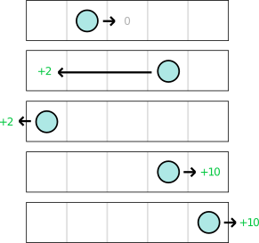

# statistics

就像训练狗坐的动作一样。刚开始，狗会对你的命令做出各种随机的动作。偶然一次，它坐下了，然后你立刻给了他一个奖励。当我们重复这个动作多次时，它就会学会根据命令坐下。

假设有如下相连的房间：

我们已知的信息是：
1. 总共有五个房间
2. 可能的行为(action)是前进(Forward)和后退(Backward)
3. 前进只能是一步，如果在最右边的最后一个房间前进等价于原地踏步
4. 后退是直接跳到最左边的第一个房间
5. 将在进入某个房间后获得奖励(reward)
我们未知的信息是：
1. 进入最后一个房间会获得+10的奖励
2. 进入第一个房间会获得+2的奖励
3. 进入其他房间不会获得奖励

## Q-learning algorithm

上述公式总结起来就是：
根据奖励和下一个状态最大的奖励来更新当前行为的估计。

$\lambda$折扣系数(discount): 衡量下个状态的`最大`行为值和当前状态的行为值的差别。
$\alpha$学习速率(learning rate): 如果过大可能会错误最优值，如果设置过小，则很难收敛。

我们的策略是：
1. 选择最大值的行为
2. 一些时候做一些冒险行为，比如选择最小值的行为
3. 如果某个状态下的所有可选行为都是0，则进行随机选择
4. 开始100%是冒险行为，然后逐渐降低到0%
5. 折扣系数=0.95
6. learning_rate=0.1

为什么要设置冒险行为？
因为我们的策略是贪婪的(每次都选择最大值的行为)，所以需要设置冒险行为来保证所有的<状态, 行为>都被涉及。
为什么要衰减冒险行为？
因为最好的到达最优解的方法就是：首先，进行激进的探索，然后不断的降低移动，进行保守的探索。

下面是Q-learning的实验演示：

Current State: 当前的状态以及行为，以及所获得的奖励
Q-table: 第一行表示前进，第二行表示后退，每一个元素表示Q值($Q(s_t,a_t)$)

最初Q-table中的每个元素值都是0，说明agent没有任何学习的知识，所以最初是随机游走。
State=1 Action=Forward：小球从第一个房间，`随机`向前移动，奖励为0，max_Q(2,F|B)值也为0，所以Q(1,F)更新结果为0
State=2 Action=Forward：小球从第二个房间，`随机`向前移动，奖励为0，max_Q(3,F|B)值也为0，所以Q(2,F)更新结果为0
State=3 Action=Backward：小球从第三个房间，`随机`向后移动到第一个房间，奖励为+2，max_Q(1,F|B)值为0，所以Q(2,B)更新结果为$0+0.1*[2+0.95*max(0,0)-0]=0.2$

State=1 Action=Backward：小球从第一个房间，随机向后移动到第一个房间，奖励为+2，max_Q(1,F|B)值为0，所以Q(2,F)更新结果为$0+0.1*[2+0.95*max(0,0)-0]=0.2$
State=1 Action=Forward：小球从第一个房间，`冒险`向前移动，奖励为0，max_Q(2,F|B)值也为0，所以Q(2,F)更新结果为0。注意小球在第一个房间时，后退的Q值大，如果不`冒险`则会一直后退。
State=2 Action=Forward：小球从第二个房间，`随机`向前移动，奖励为0，max_Q(3,F|B)值也为+0.2，所以Q(2,F)更新结果$0+0.1*[0+0.95*max(0,0.2)-0]=0.019$
State=3 Action=Forward: 小球从第三个房间，`冒险`向前移动，奖励为0，max_Q(4,F|B)值也为0，所以Q(3,F)更新结果为0。
State=4 Action=Forward: 小球从第四个房间，`随机`向前移动，奖励为10，max_Q(4,F|B)为0，所以Q(4,F)更新结果为$0+0.1*[10+0.95*max(0,0)-0]=+0.1$

State=5 Action=Forward: 小球从第五个房间，`随机`前进，到第五个房间，奖励为+10，max_Q(5,F|b)值为0，所以Q(5|F)更新结果为$0+0.1*[10+0.95*max(0,0)-0]=+1.0$
State=5 Action=Backward: 小球从第五个房间，`冒险`后退，到第一个房间，奖励为+2，max_Q(1,F|B)值为0.2，所以Q(5,B)更新结果为$0+0.1*[2+0.95*max(0,0.2)-0]=+0.219$

State=1 Action=Forward: 小球从第一个房间，`冒险`前进，到第二个房间，奖励为0，max_Q(2,F|B)值为+0.019，所以Q(1|F)更新结果为$0+0.1*[0+0.95*max(0.019,0)-0]=+0.002$
State=2 Action=Forward：小球从第二个房间，`随机`前进，到第三个房间，奖励为0，max_Q(3,F|B)值为0.2，所以Q(2|F)更新结果为$0.019+0.1*[0+0.95*max(0,0.2)-0.019]=+0.036$
State=3 Action=Forward：小球从第三个房间，`冒险`前进，到第四个房间，奖励为0，max_Q(4,F|B)值为1.0，所以Q(3|F)更新结果为$0+0.1*[0+0.95*max(1,0)-0]=0.095$。注意此时前进的Q-table已经逐渐形成了`指向`。

经过多轮迭代，Q-table最终形成，可以看到每一列前进的Q-value都大于后退的

## 参考
1. https://valohai.com/blog/reinforcement-learning-tutorial-part-1-q-learning/
2. https://stackabuse.com/introduction-to-reinforcement-learning-with-python/
3. https://builtin.com/machine-learning/reinforcement-learning-with-python
4. https://www.learndatasci.com/tutorials/reinforcement-q-learning-scratch-python-openai-gym/
5. https://blog.floydhub.com/an-introduction-to-q-learning-reinforcement-learning/
6. https://www.geeksforgeeks.org/ml-reinforcement-learning-algorithm-python-implementation-using-q-learning/
7. https://www.guru99.com/reinforcement-learning-tutorial.html
8. https://www.datacamp.com/tutorial/introduction-reinforcement-learning
9. https://wiki.pathmind.com/deep-reinforcement-learning
