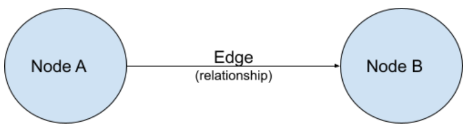
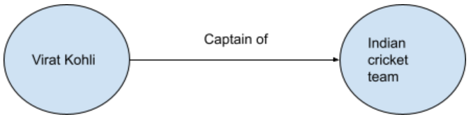

# function


## 知识图谱
知识图谱是使用图结构进行存储的信息的方法, 由节点(node)和边(edge)组成.

在知识图谱中, 节点保存了实体(entity)信息, 边保存了实体与实体关系(relationship)信息. 下图是最简单的知识图谱.

## 知识图谱的表示
如下图所示, 左边是实体`Virat Kohli`(人名), 右边是实体`Indian cricket team`(队名), 边是关系`captain of`(队长). 这个知识图谱表示的含义就是`Virat Kohli is captain of the Indian cricket team`



```python
import pandas as pd
import spacy
from spacy.matcher import Matcher 
import networkx as nx
import matplotlib.pyplot as plt


nlp = spacy.load('en_core_web_sm')
candidate_sentences = pd.read_csv("./data.csv")

## 获取实体
def get_entities(sent):
    ent1 = ""  # 实体1 source
    ent2 = ""  # 实体2
    prv_tok_dep = ""  # 前一个token的依存关系
    prv_tok_text = ""  # 前一个token
    prefix = ""
    modifier = ""

    for tok in nlp(sent):
        if tok.dep_ != "punct": # 如果token是标点(punctuation)则跳过
            if tok.dep_ == "compound":  # 如果token是依存关系是复合(compound)
                prefix = tok.text
                if prv_tok_dep == "compound":  # 将相连的依存关系是compound, 链接起来
                    prefix = prv_tok_text + " " + tok.text
            if tok.dep_.endswith("mod") == True:  # 如果token是修饰词(modifier)
                modifier = tok.text
                if prv_tok_dep == "compound":  # 将相连的依存关系是compound, 链接起来
                    modifier = prv_tok_text + " " + tok.text
            if tok.dep_.find("subj") == True:  # 如果是主语
                ent1 = modifier + " " + prefix + " " + tok.text
                prefix = ""
                modifier = ""
                prv_tok_dep = ""
                prv_tok_text = ""
                ## chunk 4
            if tok.dep_.find("obj") == True:  # 如果是宾语
                ent2 = modifier + " " + prefix + " " + tok.text

            prv_tok_dep = tok.dep_
            prv_tok_text = tok.text
    return [ent1.strip(), ent2.strip()]


get_entities("the car film had 200 patents")  # ['car film', '200  patents']


entity_pairs = []
for i in candidate_sentences["sentence"]:
    entity_pairs.append(get_entities(i))

## 获取关系
def get_relation(sent):
    doc = nlp(sent)
    matcher = Matcher(nlp.vocab)
    
    pattern = [{'DEP':'ROOT'}, 
            {'DEP':'prep','OP':"?"},
            {'DEP':'agent','OP':"?"},  
            {'POS':'ADJ','OP':"?"}]   # 定义关系抽取的格式

    matcher.add("matching_1", [pattern]) 
    matches = matcher(doc)
    start = matches[0][1]
    end= matches[0][2]
    span = doc[start:end] 
    return(span.text)

get_relation("John completed the task")  # completed

relations = [get_relation(i) for i in candidate_sentences['sentence']]

## 创建知识图谱
source = [i[0] for i in entity_pairs]  # extract subject
target = [i[1] for i in entity_pairs]  # extract object
kg_df = pd.DataFrame({'source':source, 'target':target, 'edge':relations})
kg_df

## 绘制所有的数据
G=nx.from_pandas_edgelist(kg_df, "source", "target", 
                        edge_attr=True, create_using=nx.MultiDiGraph())
plt.figure(figsize=(12,12))
pos = nx.spring_layout(G)
nx.draw(G, with_labels=True, node_color='red', edge_cmap=plt.cm.Blues, pos = pos)
plt.show()

## 仅仅绘制关系为composed by的数据
G=nx.from_pandas_edgelist(kg_df[kg_df['edge']=="composed by"], "source", "target", 
                        edge_attr=True, create_using=nx.MultiDiGraph())

plt.figure(figsize=(12,12))
pos = nx.spring_layout(G, k = 0.5) # k regulates the distance between nodes
nx.draw(G, with_labels=True, node_color='red', node_size=1500, edge_cmap=plt.cm.Blues, pos = pos, font_weight='bold')
plt.show()
```

参考:
https://analyticsindiamag.com/hands-on-guide-to-building-knowledge-graph-for-named-entity-recognition/
https://stackabuse.com/courses/graphs-in-python-theory-and-implementation/lessons/representing-graphs-in-code/
https://www.kaggle.com/code/nageshsingh/build-knowledge-graph-using-python