# tpl

## 基础概率知识
### Distributions
有三个变量(variables):分别是智力(intelligence)/难度(difficult)/评级(Grade).
一个学生的智力(Intelligence(I)),有两个值, 可能低(low), 也可能高(high), 两种情况
他学习的课程难度(Difficult(D)), 有两个值, 可能简单(easy), 也可能困难(hard), 两种情况
他最终的评级(Grade(G)), 有三个值, 可能有A, B, C 三种情况
下表联合概率分布(Joint Distribution), 最后一列是P(I,D,G)
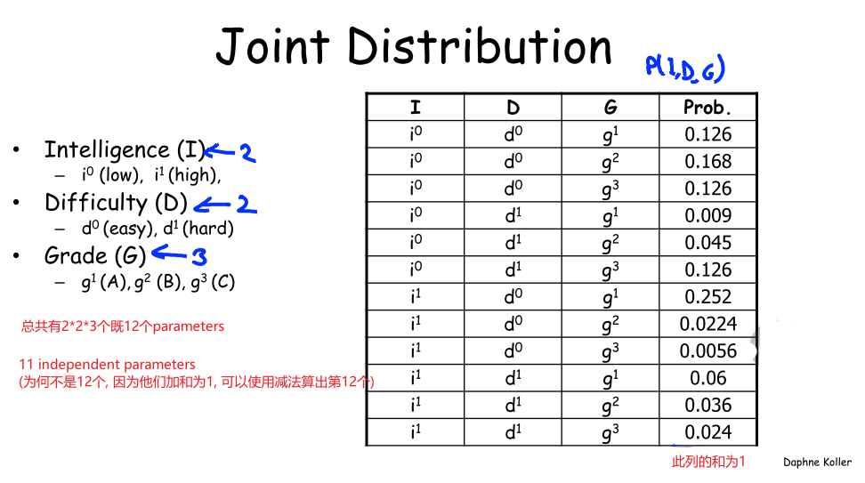
### Condition
联合概率分布(Joint Distribution)最大的用处就是计算条件概率(Condition)
假设我们观察(observe)G=g1, 我们就可以将包含g2, g3的所有概率去除, 这样的操作称为Reduction.
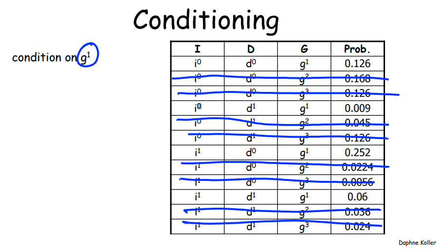
取出所有G=g1,并对其重新标准化(Renormalization), 就得到了条件概率
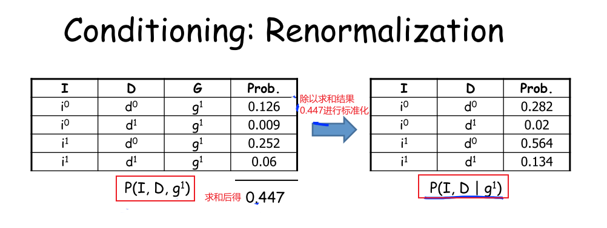
### Marginalization
Marginalization(边缘化) 变量I, 就是将变量I消除
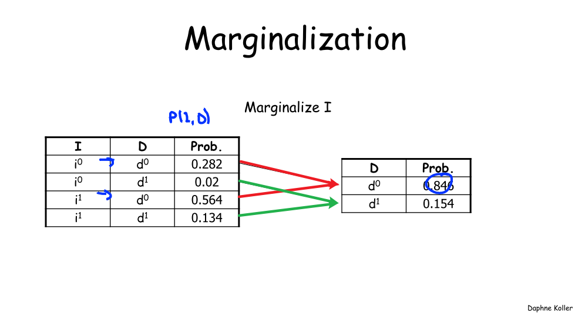
### Factors
factor可以是function或table
### Factor Product
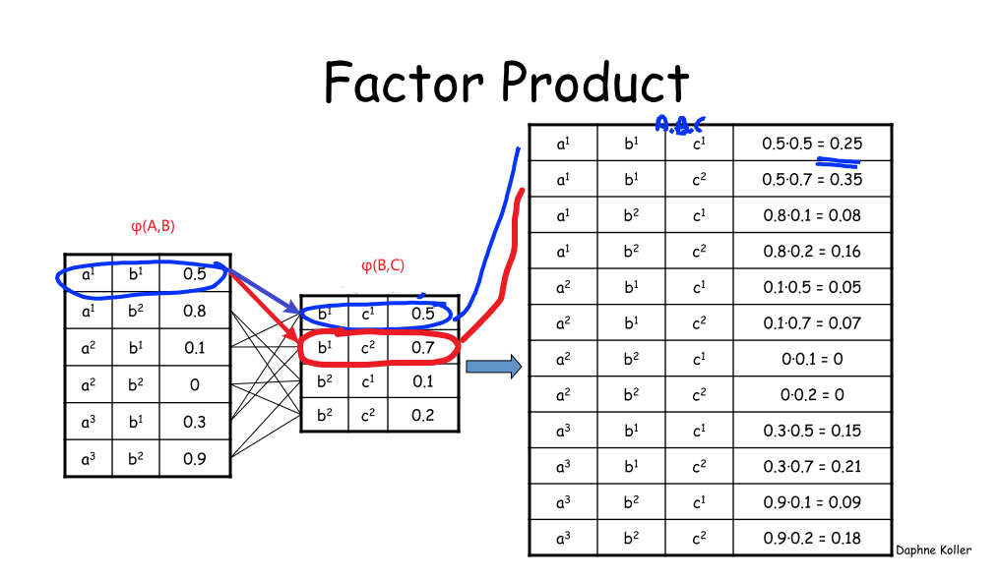
### Factor Marginalization
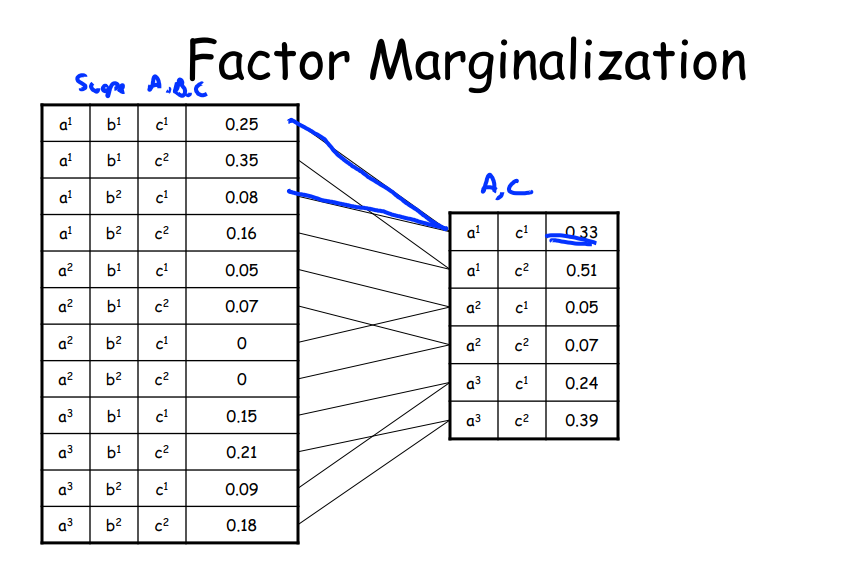
### Factor Reduction
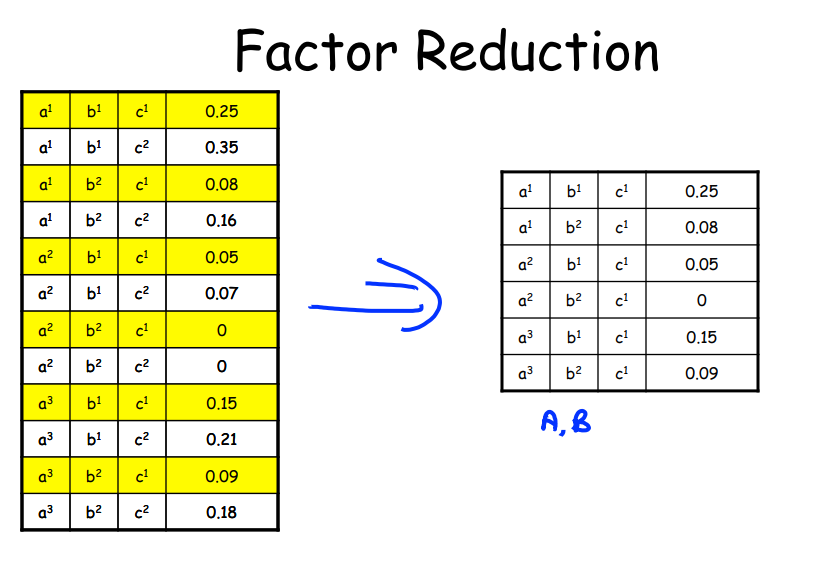

## 实例说明
给出五个变量(Variables):
1. 智力(Student Intelligence)
2. 难度(Course Difficulty)
3. 分数评级(Grade)
4. SAT(Student SAT)
5. 推荐信(Reference Letter)
构建如下的贝叶斯网络.每一个节点就是一个CPD(Conditional Probability Distribution), 也称为一个因子(factor). 我们有五个节点, 就是有五个CPD, 五个因子(factor).
Difficulty 和 Intelligence 是unconditional distribution
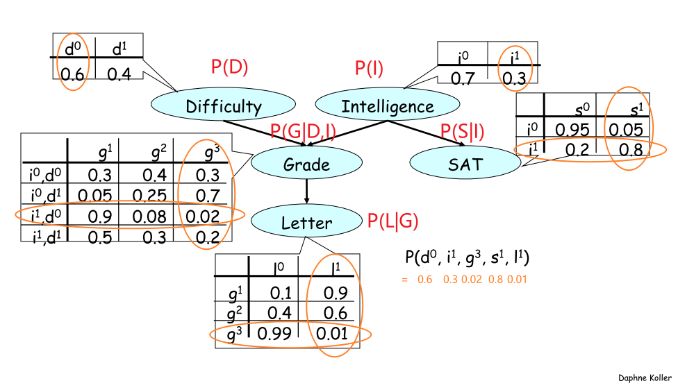
6. 计算联合概率P(D,I,G,S,L)
P(D,I,G,S,L) = P(D)P(I)P(G|I,D)P(S|I)P(L|G)
$P(d^0,i^1,g^3,s^1,l^1)=0.6*0.3*0.02*0.8*0.01$

7. 计算单个事件概率P(S)
  1. 先计算联合分布(joint distribution) 
  2. 再进行边缘化(Marginalization)
$P(s^0,i^0)=P(s^0|i^0)*P(i^0)=$0.95 * 0.7 = 0.665
$P(s^0,i^1)=P(s^0|i^1)*P(i^1)=0.2*0.3=0.06$
$P(s^0)=P(s^0,i^0)+P(s^0,i^1)=0.665+0.06=0.725$
$P(s^1,i^0)=P(s^1|i^0)*P(i^0)=0.05 * 0.7 = 0.035$
$P(s^1,i^1)=P(s^1|i^1)*P(i^1)=0.8*0.3=0.24$
$P(s^1)=P(s^1,i^0)+P(s^1,i^1)=0.035+0.24=0.275$


贝叶斯网络的定义:
- A directed acyclic graph(DAG) G whose nodes represent the random variables$X_1,...,X_n$
- For each node $X_i$ a CPD $P(X_i|par_G(X_i))$
Bayesian network: 表示了一个joint distribution
$P(X_1,...,x_n) = \prod_i^nP(X_i|Par_G(X_i))$
Bayesian network legal:
8. $P>=0$
9. $\sum P = 1$

## Conditional Independence
### Conditional Independence
╞是satisfy sign
⊥是independence sign
| 是conditon sign

### independence
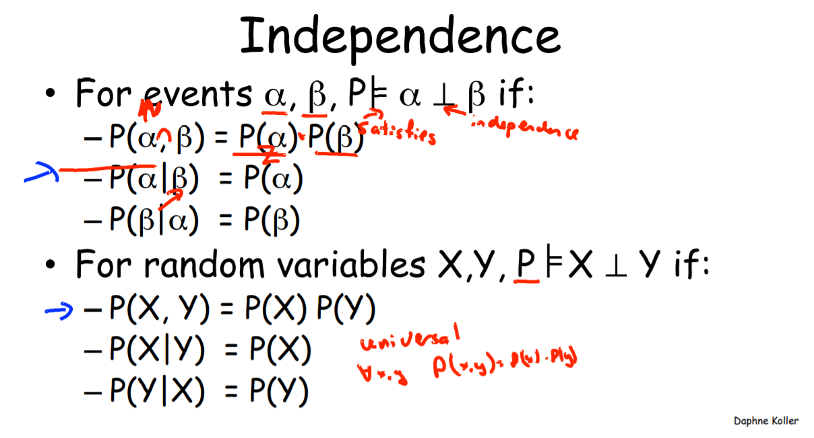
具体的例子:
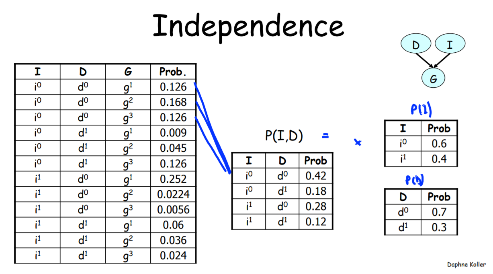
### Conditional Independence
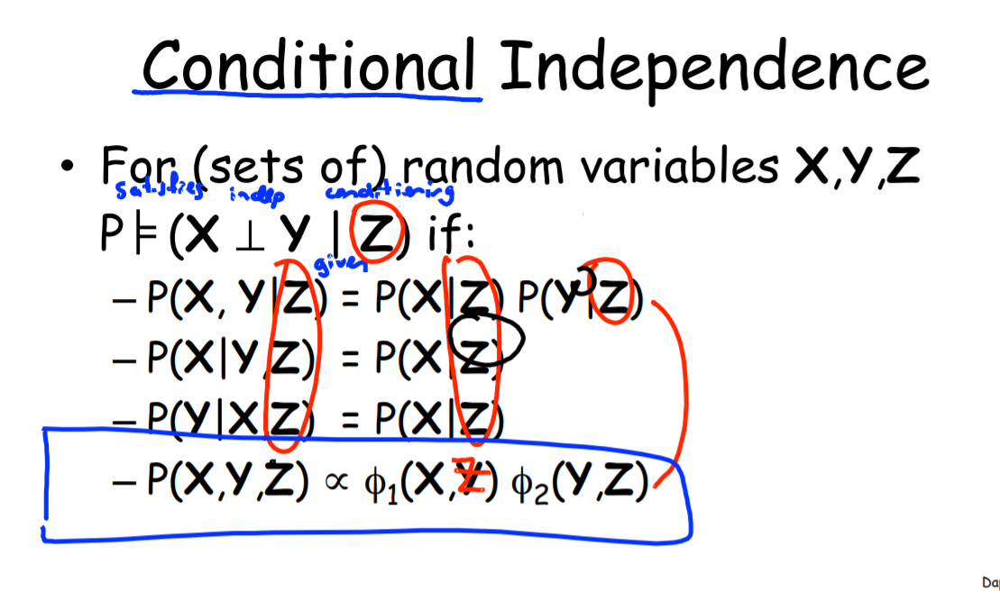
具体案例:
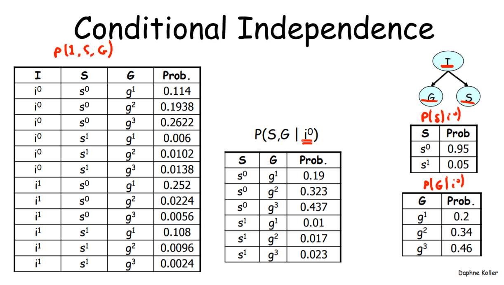


## 推理
### 结果推理(Causal reasoning)
知道了事件的一个原因后，我们会改变对事件结果的预估。
[9.png](9.png)
1. $P(l^1)\approx0.5$ 在没有任何前提下, 得到1评价的概率是0.5
2. $P(l^1|i^0)\approx 0.39$当知道该学生intelligence为low时, 得到1 letter的概率降到0.39
3. $P(l^1|i^0, d^0)\approx 0.51$当知道该学生的intelligence为low时, 且Difficulty为easy时, 得到1 letter的概率为0.51

### 证据推理(Evidential Reasoning)
当我们知道了事件的结果后，我们会改变对引发事件的原因的判断。
4. $p(d^1)=0.4$
5. 在已知学生得到了C的评价后$p(d^1|g^3)\approx0.63$,相比之前的0.4上升了,既课程的为难的概率上升了
同理$P(i^1|g^3)\approx0.08$,也既是说, 该同学为high intelligence的概率降低了
[10.png](10.png)

### 中间结果证据间推理(Intercausal Reasoning)
从图中来看结果在中间.现实意义是: 有多个原因导致了某个事件的发生，如果我们已经知道了事件的结果，那么对其中一个原因的观察，会改变我们对另一个原因的判断。

当告知课程难度是hard时, $P(i^1|g^3,d^1)\approx0.11$,上升了, 应为课程变难了 ,所以是高智商的概率也变大了.
[11.png](11.png)
一下是对Intercausal Reasoning的解释:
[12.png](12.png)


## Flow of Probabilistic Influence
注意这里的w, 是没有被观测的.
1. x->y 比如 Grade->Letter
2. x<-y 比如 Grade<-Letter
3. x->w->y 比如 Difficulty -> Grade -> Letter
4. x<-w<-y 比如 Difficulty <- Grade <- Letter
5. x<-w->y 比如 Grade <- Intelligence -> SAT
6. x ->w <-y 比如 Difficulty -> Grade <- Intelligence 
只要不存在V型(第6种),整个influence flow就是有效的
[18.png](18.png)
## When can X influence Y Given evidence about Z
当W未被观察室, 3,4,5的X都可以影响Y
如果W,且他的所有descendants没有被观测, 6中 X不能影响Y
当W被观察时, 3,4,5的X都不可以影响Y, 因为此时Y只受到W的影响, 既W将此流阻断了
如果W,且他的所有descendants被观测, 6中 X能影响Y, 可以参考:Intercausal Reasoning的解释
[19.png](19.png)
也即是
7. 对于evidence n structure, 当evidence不被观察时, 能流动, 当evidence被观察时, 阻塞不能流动
8. 对于causal v structure,  当causal被观察时, 能流动, 当causal不被观察时, 不能流动

所以可以得到更广泛的结论:
[20.png](20.png)

## d-分离
D-分离是寻找网络节点之间的条件独立性的一种方法, 在用贝叶斯网络进行预测，诊断推理等方面，可以提高计算速度，减少计算复杂性。
### 直接连接
当X和Y通过一条边直接连接时, 则称$X\rightarrow Y$, XY不独立
### 间接连接
[21.png](21.png)
1. 结果作用(图a):
  1. Z未被观察, XY不独立
  2. Z被观察, XY独立
2. 证据作用(图b):
  1. Z未被观察, XY不独立
  2. Z被观察, XY独立
3. 共同证据作用(图c):
  1. Z未被观察, XY不独立
  2. Z被观察, XY独立
4. 共同结果作用(图d):
  1. Z未被观察, XY独立
  2. Z被观察, XY不独立

### 总结
对于DAG的任意路径,满足下面条件的任意一条, 则该路径是阻塞的:
5. 路径中存在某个节点Z, 是结果/证据/共同证据, 并且X被观测
6. 路径中存在某个节点Z, 是共同结果节点, 且Z或Z的儿子不被观测
如果XY间, 所有路径都是阻塞的, 那么XY就是关于Z条件独立, 否则XY相互依赖
### 应用
7. 判断Difficulty与SAT是否在Letter条件下独立
  1. Difficulty到SAT只有一条路径D->G->I->S.
  2. 路径上有节点Grade是共同结果, 且Grade的儿子Letter被观测, 所以Difficulty和Intelligence依赖.
  3. 路径上有节点Intelligence是共同证据, 且Intelligence没有被观测, 所以Grade和SAT依赖
综合上面结果, Difficulty和SAT在给定Letter条件下依赖.

## I-MAP
[22.png](22.png)


## 独立性判断
### 独立
1. Local Independencies:在给定$$X$$父节点的条件下, $$X$$独立于非子孙节点, 既:
$$X\bot NonDesc(X)|P_a(X)$$
$$NonDesc(X)$$表示非$$X$$的子孙节点
$$P_a(X)$$表示$$X$$的父节点
2. Global Independencies:
第一种情况:两个节点直接连接, 无论方向
[23.png](23.png)
无论更改任何节点都会影响另一个.
[24.png](24.png)
第二种情况:
Causal: 当$$B$$被观察时,将阻断$$A \rightarrow C$$的影响, $$(A \perp C | B)$$
Evidential: 当$$B$$被观察时,将阻断$$A \rightarrow C$$的影响,$$(A \perp C | B)$$
Common Evidence: 当B未知时, 将阻断$$A \rightarrow C$$的影响,$$(A \perp C )$$
Common Cause: 当$$B$$被观察时,将阻断$$A \rightarrow C$$的影响,$$(A \perp C | B)$$

总结
对于DAG的任意路径,满足下面条件的任意一条, 则该路径是阻塞的:
1. 路径中存在某个节点Z, 是结果/证据/共同证据, 并且X被观测
2. 路径中存在某个节点Z, 是共同结果节点, 且Z或Z的儿子不被观测
如果XY间, 所有路径都是阻塞的, 那么XY就是关于Z条件独立, 否则XY相互依赖

应用
3. 判断Difficulty与SAT是否在Letter条件下独立
  1. Difficulty到SAT只有一条路径D->G->I->S.
  2. 路径上有节点Grade是共同结果, 且Grade的儿子Letter被观测, 所以Difficulty和Intelligence依赖.
  3. 路径上有节点Intelligence是共同证据, 且Intelligence没有被观测, 所以Grade和SAT依赖
综合上面结果, Difficulty和SAT在给定Letter条件下依赖.
```python
#Listing all Independencies
alarm_model.get_independencies()
## Getting the local independencies of a variable.
model.local_independencies('G')
'''
(G _|_ S | I, D)
'''
## Getting all the local independencies in the network.
model.local_independencies(['D', 'I', 'S', 'G', 'L'])
'''
(D _|_ I, S)
(I _|_ D)
(S _|_ G, L, D | I)
(G _|_ S | I, D)
(L _|_ I, D, S | G)
'''
## Active trail: For any two variables A and B in a network if any change in A influences the values of B then we say
##               that there is an active trail between A and B.
## In pgmpy active_trail_nodes gives a set of nodes which are affected (i.e. correlated) by any
## change in the node passed in the argument.
model.active_trail_nodes('D')
'''
{'D': {'D', 'G', 'L'}}
'''
model.active_trail_nodes('D', observed='G')
'''
{'D': {'D', 'I', 'S'}}
'''
## Check for d-separation between variables
print(model.is_dconnected('D', 'I'))
print(model.is_dconnected('D', 'L', observed=['G']))
```


PGM-cn
https://www.coursera.org/learn/probabilistic-graphical-models/lecture/tEZ6S/factors
https://www.coursera.org/learn/probabilistic-graphical-models/resources/7ct5V
https://blog.csdn.net/github_36326955/article/details/73089182
https://zhuanlan.zhihu.com/p/80399641?ivk_sa=1024320u
https://my.oschina.net/dillan/blog/134011