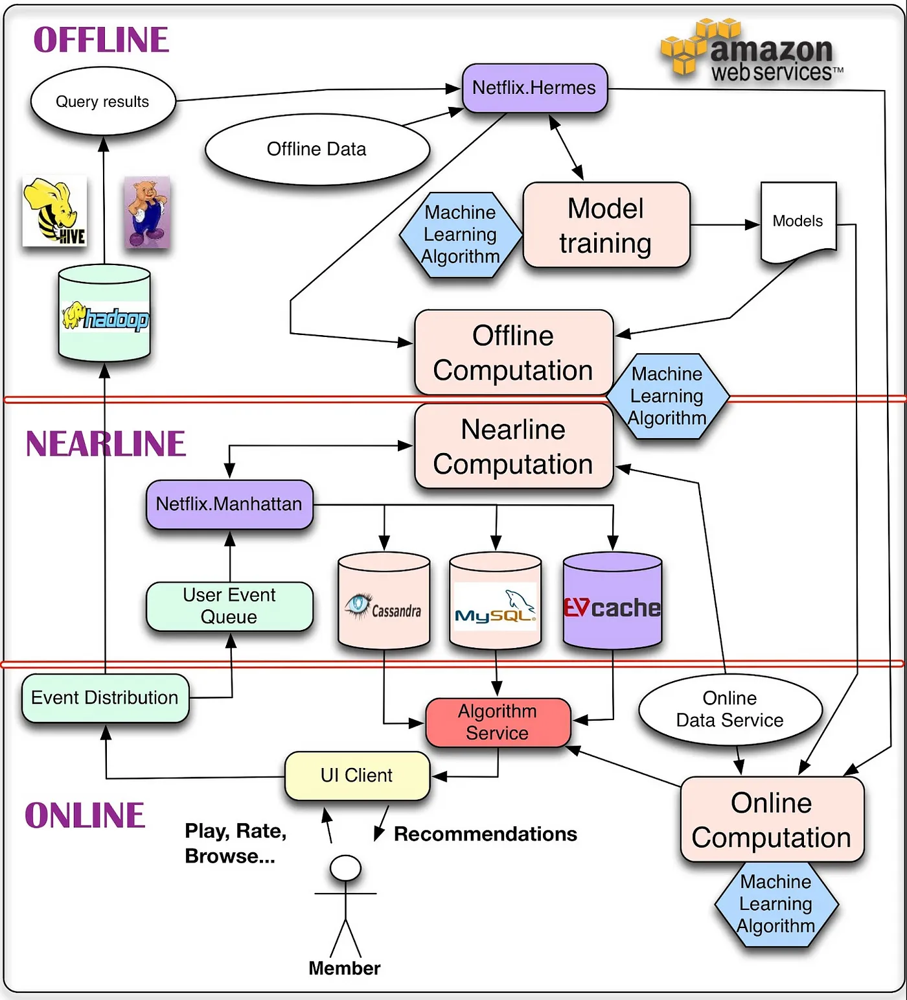

# RecSys_系统架构

## Netflix推荐系统架构

## 离线层(offline)

离线层是计算量最大的一个部分，它的特点是不依赖实时数据，也不需要实时提供服务。需要实现的主要功能模块是：

1. 数据处理、数据存储；
2. 特征工程、离线特征计算；
3. 离线模型的训练；

这里我们可以看出离线层的任务是最接近学校中我们处理数据、训练模型这种任务的，不同可能就是需要面临更大规模的数据。离线任务一般会按照天或者更久运行，比如每天晚上定期更新这一天的数据，然后重新训练模型，第二天上线新模型。目前主流的做法是HDFS，收集到我们所有的业务数据，通过HIVE等工具，从全量数据中抽取出我们需要的数据，进行相应的加工，离线阶段主流使用的分布式框架一般是Spark。

如果我们只使用用户离线数据，最大的不足就是无法反应用户的实时兴趣变化，这就促使了近线层的产生。

## 近线层(nearline)

近线层的主要特点是准实时，它可以获得实时数据，然后快速计算提供服务，但是并不要求它和在线层一样达到几十毫秒这种延时要求。

它适合处理一些对延时比较敏感的任务，比如：
1. 特征的事实更新计算：例如统计用户对不同type的ctr，推荐系统一个老生常谈的问题就是特征分布不一致怎么办，如果使用离线算好的特征就容易出现这个问题。近线层能够获取实时数据，按照用户的实时兴趣计算就能很好避免这个问题。
2. 实时训练数据的获取：比如在使用DIN、DSIN这行网络会依赖于用户的实时兴趣变化，用户几分钟前的点击就可以通过近线层获取特征输入模型。
3. 模型实时训练：可以通过在线学习的方法更新模型，实时推送到线上；

如今Flink、Storm等工具一统天下。

## 在线层(online)

最大的特点是对响应延时有要求，因为它是直接面对用户群体的，你可以想象你打开抖音淘宝等界面，几乎都是秒刷出来给你的推荐结果的，不会说还需要让你等待几秒钟时间。所有的用户请求都会发送到在线层，在线层需要快速返回结果，它主要承担的工作有：

1. 模型在线服务；包括了快速召回和排序；
2. 在线特征快速处理拼接：：根据传入的用户ID和场景，快速读取特征和处理；
3. AB实验或者分流：根据不同用户采用不一样的模型，比如冷启动用户和正常服务模型；
4. 运筹优化和业务干预：比如要对特殊商家流量扶持、对某些内容限流；

典型的在线服务是用过RESTful/RPC等提供服务，一般是公司后台服务部门调用我们的这个服务，返回给前端。具体部署应用比较多的方式就是使用Docker在K8S部署。而在线服务的数据源就是我们在离线层计算好的每个用户和商品特征，我们事先存放在数据库中，在线层只需要实时拼接，不进行复杂的特征运算，然后输入近线层或者离线层已经训练好的模型，根据推理结果进行排序，最后返回给后台服务器，后台服务器根据我们对每一个用户的打分，再返回给用户。

## 参考
1. https://datawhalechina.github.io/fun-rec/#/ch01/ch1.2
2. https://netflixtechblog.com/system-architectures-for-personalization-and-recommendation-e081aa94b5d8

