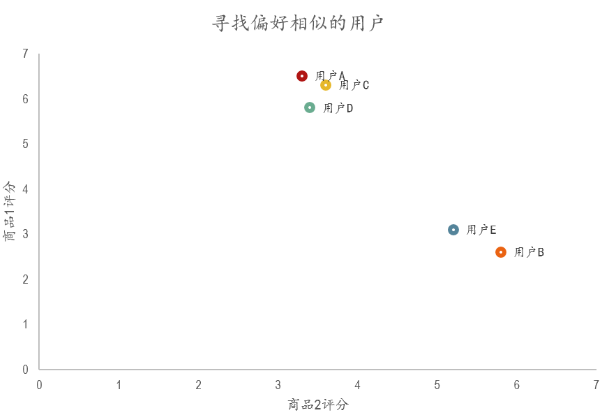
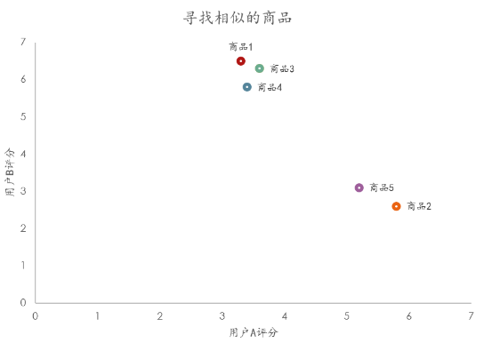

协同过滤（collaborative filtering，CF）包含两部分:

1. 协同，基于用户之间或物品之间的相似性或关联性来进行推荐，让多种信息源进行协作；
2. 过滤，从大量的用户-物品评分数据中筛选或过滤出最相关的推荐结果；

下图就是一个使用协同过滤来预测用户喜好的例子。可以看到，最终的目的就是根据其他用户的行为来预测当前用户的行为。这也就是后续会提到的user-user策略。

在这里的预测结果中可以看到，最后这名用户由于和2、3位置的用户在前两个问题上表现接近，所以认为他也和这两个人一样不喜欢看视频。

协同过滤推荐算法分为两类，分别是基于用户的协同过滤算法(user-based collaboratIve filtering)，和基于物品的协同过滤算法(item-based collaborative filtering)。简单的说就是：人以类聚，物以群分。

## 基于用户的协同过滤算法(user-based collaboratIve filtering)

基于用户的协同过滤算法是通过用户的历史行为数据发现用户对商品或内容的喜欢(如商品购买，收藏，内容评论或分享)，并对这些喜好进行度量和打分。在有相同喜好的用户间进行商品推荐。简单的说就是如果A,B两个用户都购买了x,y,z三本图书，并且给出了5星的好评。那么A和B就属于同一类用户。可以将A看过的图书w也推荐给用户B。

我们模拟了5个用户对两件商品的评分，来说明如何通过用户对不同商品的态度和偏好寻找相似的用户。在示例中，5个用户分别对两件商品进行了评分。这里的分值可能表示真实的购买，也可以是用户对商品不同行为的量化指标。例如，浏览商品的次数，向朋友推荐商品，收藏，分享，或评论等等。这些行为都可以表示用户对商品的态度和偏好程度。

|        | 商品1 | 商品2 |
| ------ | ------ | ------ |
| 用户A  | 3.3    | 6.5    |
| 用户B  | 5.8    | 2.6    |
| 用户C  | 3.6    | 6.3    |
| 用户D  | 3.4    | 5.8    |
| 用户E  | 5.2    | 3.1    |

从表格中很难直观发现5个用户间的联系，我们将5个用户对两件商品的评分用散点图表示出来后，用户间的关系就很容易发现了。在散点图中，Y轴是商品1的评分，X轴是商品2的评分，通过用户的分布情况可以发现，A,C,D三个用户距离较近。用户A(3.3 6.5)和用户C(3.6 6.3)，用户D(3.4 5.8)对两件商品的评分较为接近。而用户E和用户B则形成了另一个群体。

### 欧几里德距离评价

欧几里德距离评价是一个较为简单的用户关系评价方法。原理是通过计算两个用户在散点图中的距离来判断不同的用户是否有相同的偏好。

通过公式我们获得了5个用户相互间的欧几里德系数，也就是用户间的距离。系数越小表示两个用户间的距离越近，偏好也越是接近。在下面的表格中，可以发现，用户A&C用户A&D和用户C&D距离较近。同时用户B&E的距离也较为接近。与我们前面在散点图中看到的情况一致。

| 用户组合 | 数值 |
| ---- | ---- |
| 用户A&B | 4.63 |
| 用户A&C | 0.36 |
| 用户A&D | 0.71 |
| 用户A&E | 3.89 |
| 用户B&C | 4.30 |
| 用户B&D | 4.00 |
| 用户B&E | 0.78 |
| 用户C&D | 0.54 |
| 用户C&E | 3.58 |
| 用户D&E | 3.24 |

### 皮尔逊相关度评价

### 余弦距离

评分区间为1-5。目标是要给用户1从项目4、5中推荐一个：

|    | l1 | l2 | l3 | l4 | l5 |
|----|----|----|----|----|----|
| u1 | 5  | 1  | 4  |?   |?   |
| u2 | 5  | /  | 3  | 2  | 5  |
| u3 | 1  | 4  | 2  | 5  | 2  |

1. 首先计算目标用户u1和其他两个用户u2, u3的相似度，计算的时候只考虑共同打分的项目：

    1. sim(u1,u2)=cosine([5,4],[5,3])=0.99
    2. sim(u1,u3)=cosine([5,1,4],[1,4,2])=0.57

2. 加权平均

    1. $R_{u_1,I4}=(0.99 * 2+0.57 * 5)/(0.99+0.57)=3.09$
    2. $R_{u_1,I5}=(0.99 * 5+0.57 * 2)/(0.99+0.57)=3.9$

直接计算余弦相似度并不一定捕获两组评分的相反程度以及处理无用信息。
1. 没有办法考虑用户的喜爱/讨厌程度
2. 如果一个用户对所有项目的打分完全一样，那么这个用户的分数对于推荐起不到任何帮助。

构建mean-centered utility matrix，在原有打分表基础上，将每个用户的打分项掉该用户的打分均值。此时0代表没有信息。而符号的正负就可以反映出来用户喜欢还是讨厌。这一方法叫做Adjusted Cosine Similarity。

处理之后，表格的信息变成：

|    | l1   | l2   | l3   | l4 | l5 |
|----|------|------|------|----|----|
| u1 | 5/3  | -7/3 | 2/3  |?   |?   |
| u2 | 5/4  | —    | -3/4 | -7/4 | 5/4 |
| u3 | 4/5  | 6/5  | -4/5 | 11/5 | -4/5|

1. 首先计算目标用户u1和其他两个用户u2, u3的相似度，计算的时候只考虑共同打分的项目：

    1. sim(u1,u2)=0.61 
    2. sim(u1,u3)=-0.64

2. 加权平均
    1. $R_{u_1, l_4} = \frac{0.61 \times (-7/4) - 0.6411/5}{(0.61 + 0.64)} = -1.98$

    2. $R_{u_1, l_5} = \frac{0.615/4 - 0.61 \times (-4/5)}{(0.61 + 0.64)} = 1.00$

### 基于用户的冷启动问题

以上是基于用户的协同过滤算法。这个算法依靠用户的历史行为数据来计算相关度。也就是说必须要有一定的数据积累(冷启动问题)。对于新网站或数据量较少的网站，还有一种方法是基于物品的协同过滤算法。

## 基于物品的协同过滤算法(item-based collaborative filtering)

通过计算不同用户对不同物品的评分获得物品间的关系。基于物品间的关系对用户进行相似物品的推荐。这里的评分代表用户对商品的态度和偏好。简单来说就是如果用户A同时购买了商品1和商品2，那么说明商品1和商品2的相关度较高。当用户B也购买了商品1时，可以推断他也有购买商品2的需求。

表格中是两个用户对5件商品的评分。在这个表格中我们用户和商品的位置进行了互换，通过两个用户的评分来获得5件商品之间的相似度情况。单从表格中我们依然很难发现其中的联系，因此我们选择通过散点图进行展示。

|        | 用户A | 用户B |
| ------ | ------ | ------ |
| 商品1  | 3.3    | 6.5    |
| 商品2  | 5.8    | 2.6    |
| 商品3  | 3.6    | 6.3    |
| 商品4  | 3.4    | 5.8    |
| 商品5  | 5.2    | 3.1    |

### 欧几里德距离评价

通过欧几里德系数可以发现，商品间的距离和关系与前面散点图中的表现一致，商品1,3,4距离较近关系密切。商品2和商品5距离较近。

| 商品组合 | 数值 |
| ---- | ---- |
| 商品1&2 | 4.63 |
| 商品1&3 | 0.36 |
| 商品1&4 | 0.71 |
| 商品1&5 | 3.89 |
| 商品2&3 | 4.30 |
| 商品2&4 | 4.00 |
| 商品2&5 | 0.78 |
| 商品3&4 | 0.54 |
| 商品3&5 | 3.58 |
| 商品4&5 | 3.24 |

### 皮尔逊相关度评价

### 余弦相似度

为了让I2的相似度不至于都是1，所以把中间的空缺值补上了：

|    | l1 | l2 | l3 | l4 | l5 |
|----|----|----|----|----|----|
| u1 | 5  | 1  | 4  |?   |?   |
| u2 | 5  | 3  | 3  | 2  | 5  |
| u3 | 1  | 4  | 2  | 5  | 2  |

1. 我们需要计算项目之间的相似度了，所以此时计算相似度的向量就应该是列向量。

    1. sim(I1,I4)=0.55
    2. sim(I2,I4)=0.96
    3. sim(I3,I4)=0.82
    4. sim(I1,I5)=0.98
    5. sim(I2,I5)=0.85
    6. sim(I3,I5)=0.98

2. 进行加权平均：
    1. $R_{u1,J4} = [0.55 + 0.961 + 0.824]/(0.55 + 0.96 + 0.82) = 3.00$
    2. $R_{u1,J5} = [0.985 + 0.851 + 0.984]/(0.55 + 0.96 + 0.82) = 4.15$

## User-based算法与Item-based算法对比

1. User-based

    基本思想是如果用户A喜欢物品a，用户B喜欢物品a、b、c，用户C喜欢a和c，那么认为用户A与用户B和C相似，因为他们都喜欢a，而喜欢a的用户同时也喜欢c，所以把c推荐给用户A。该算法用最近邻居（nearest-neighbor）算法找出一个用户的邻居集合，该集合的用户和该用户有相似的喜好，算法根据邻居的偏好对该用户进行预测。User-based算法存在两个重大问题：

    1. 数据稀疏性。一个大型的电子商务推荐系统一般有非常多的物品，用户可能买的其中不到1%的物品，不同用户之间买的物品重叠性较低，导致算法无法找到一个用户的邻居，即偏好相似的用户。

    2. 算法扩展性。最近邻居算法的计算量随着用户和物品数量的增加而增加，不适合数据量大的情况使用。

2. Iterm-based

    基本思想是预先根据所有用户的历史偏好数据计算物品之间的相似性，然后把与用户喜欢的物品相类似的物品推荐给用户。还是以之前的例子为例，可以知道物品a和c非常相似，因为喜欢a的用户同时也喜欢c，而用户A喜欢a，所以把c推荐给用户A。

    因为物品直接的相似性相对比较固定，所以可以预先在线下计算好不同物品之间的相似度，把结果存在表中，当推荐时进行查表，计算用户可能的打分值，可以同时解决上面两个问题

## 参考
1. https://blog.csdn.net/OuDiShenmiss/article/details/109218342
2. https://www.cnblogs.com/Diyo/p/11333596.html
3. https://zhuanlan.zhihu.com/p/686778699
4. https://mp.weixin.qq.com/s?__biz=MzU1NTMyOTI4Mw==&mid=2247496363&idx=1&sn=0d2b2ac176e2a72eb2e760b7b591788f&chksm=fbd740c7cca0c9d16c76fdeb1a874a53f7408d8125b2e1bed3173ecb69d131167c1c9c35c71f&scene=21#wechat_redirect
5. https://datawhalechina.github.io/fun-rec/#/ch02/ch2.1/ch2.1.1/mf
6. https://github.com/solidglue/Recommender_System/blob/master/02_Recall/02_01_Item_cf.ipynb

