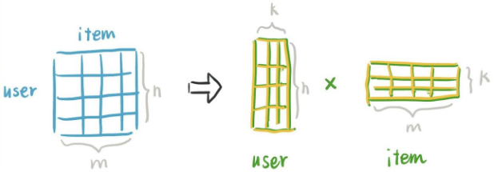

# 基于模型的方法

## 矩阵分解算法简介

矩阵分解算法就是把原来的user-item评分表拆分成用户表示矩阵与item表示矩阵的乘积，其中k可以理解成为表示的维度。通过种种方法得到两个表示矩阵之后，两个矩阵相乘所得到的特定位置的数值就是用户的期望评分。

直观一点，以电影推荐为例，这k个维度可以分别是喜剧、动作、悬疑等，每个维度的数值代表用户对这个类别的喜欢程度或者电影与这个类别的接近程度。

不过在具体的学习中就是学习到一个抽象的embedding表示。每个k的含义并不清楚，此时又被叫做隐因子、隐变量等。我想这一点对于学习机器学习的应该都不陌生了，就不过多掰扯了。

## 奇异值分解SVD

## 参考

1. <https://www.cnblogs.com/Diyo/p/11333596.html>
2. <https://zhuanlan.zhihu.com/p/686778699>
