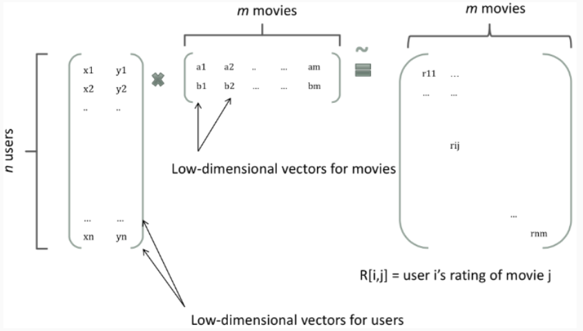

# FM

## 背景

在进行CTR预估时，往往要对单特征进行组合，做法主要有两大类：FM系列与Tree系列。

因子分解机（Factorization Machine），是由Konstanz大学（德国康斯坦茨大学）Steffen Rendle（现任职于Google）于2010年最早提出的，旨在解决大规模稀疏数据下的特征组合问题。


## 前言

FM旨在解决大规模稀疏数据下的特征组合问题，那么大规模稀疏数据是怎么来的呢？在现实生活中，以用户访问某网站的日志为例，我们可以发现许多特征是类别特征，如用户访问的是频道（channel）信息，如”news”, “auto”, “finance”等。

假设channel特征有10个取值，分别为{“auto”,“finance”,“ent”,“news”,“sports”,“mil”,“weather”,“house”,“edu”,“games”}。部分训练数据如下：


user|channel
--|--
user1|sports
user2|news
user3|finance
user4|house
user5|edu
user6|news

需要对categorical型特征进行one-hot编码（独热编码），即将categorical型特征转化为数值型特征。channel特征转化后的结果如下：

user|chn-auto|chn-finance|chn-ent|chn-news|chn-sports|chn-mil|chn-weather|chn-house|chn-edu|chn-games
--|--|--|--|--|--|--|--|--|--|--
user1|0|0|0|0|1|0|0|0|0|0
user2|0|0|0|1|0|0|0|0|0|0
user3|0|1|0|0|0|0|0|0|0|0
user4|0|0|0|0|0|0|0|1|0|0
user5|0|0|0|0|0|0|0|0|1|0
user6|0|0|0|1|0|0|0|0|0|0

由one-hot编码带来的数据稀疏性会导致特征空间变大。上面的例子中，一维categorical特征在经过one-hot编码后变成了10维数值型特征。在数据稀疏性的现实情况下，我们如何去利用这些特征来提升learning performance？可以考虑特征的关联性。

为什么要考虑特征之间的关联信息？

大量的研究和实际数据分析结果表明：某些特征之间的关联信息（相关度）对事件结果的的发生会产生很大的影响。从实际业务线的广告点击数据分析来看，也证实了这样的结论。比如男生比较喜欢篮球，就可以将性别和爱好的特征组合起来。

如何表达特征之间的关联？

表示特征之间的关联，最直接的方法的是构造组合特征。样本中特征之间的关联信息在one-hot编码和浅层学习模型（如LR、SVM）是做不到的。目前工业界主要有两种手段得到组合特征：

1. 人工特征工程（数据分析＋人工构造）
2. 通过模型做组合特征的学习（深度学习方法、FM/FFM方法）

FM就可以学习特征之间的关联。$x_ix_j$表示特征$x_i$和$x_j$的组合，当$x_i$和$x_j$都非零时，组合特征$x_ix_j$才有意义。

## 二阶多项式回归模型

$$y(x)=w_0 + \sum_{i=1}^n w_i x_i + \sum_{i=1}^n\sum_{j=i+1}^n w_{ij}x_i x_j$$

其中：
1. $w_0 + \sum_{i=1}^n w_i x_i$是线性回归
2. $\sum_{i=1}^n\sum_{j=i+1}^n w_{ij}x_i x_j$ 是交叉项(组合特征)

其中，n表示特征维度，截距$w_0 \in R$, $w={w_1,w_2,...,w_n} \in R^n$, $w_{ij} \in R^{n \times n}$为模型的参数

交叉项中的组合特征参数总共有$\frac{n(n-1)}{2}$,在这里，任意两个交叉项参数$w_{ij}$都是独立的，然而在数据非常稀疏的实际应用场景中，交叉项参数的学习是很困难的。

因为我们知道，回归模型的参数w的学习结果就是从训练样本中计算充分统计量，而在这里交叉项的每一个参数$w_{ij}$需要大量的$x_i$$x_j$同时非零的样本数据。由于样本本阿里就很稀疏，所以能够满足$x_i$,$x_j$都非零的样本数就会更少。训练样本不充分，学到的参数$w_{ij}$就不是充分统计的结果，导致参数$w_{ij}$不准确。

那么，如何在降低数据稀疏问题给模型性能带来的重大影响的同时，有效地解决二阶交叉项参数的学习问题呢？矩阵分解方法已经给出了解决思路。

在基于Model-Based的系统过滤中，一个rating矩阵可以分解为user和item矩阵，每个user和item都可以采用一个隐向量表示，如图：


上图把每个user表示成了一个二维向量，同时也把item表示成一个二维向量，两个向量的内积就是矩阵中user对item的打分。

根据矩阵分解的启发，如果把多项式模型中二阶交叉项参数$w_{ij}$组成一个对称矩阵$W$(对角元素设置成正实数), 那么这个矩阵就可以分解为$W=VV^T, V \in R^{n \times k}$, 其中第i行对应着第i维特征的隐向量。即，每一个特征都有一个长度为k的隐变量来替代。

将每个交差项参数的内积$<v_i,v_j>$表示，是FM模型的核心思想。


## FM模型表达
以二阶FM模型为例：

$$y(x)=w_0 + \sum_{i=1}^n w_i x_i + \sum_{i=1}^n\sum_{j=i+1}^n <v_i,v_j>x_i x_j$$

其中，$v_i$表示第i特征的隐向量，$<.,.>$表示两个长度为k的向量的内积，计算公式为：

$$<v_i,v_j> = \sum_{f=1}^{k}v_{i,f} \cdot v_{j,f}$$

公式解读：

1. 线性模型＋交叉项

    直观地看FM模型表达式，前两项是线性回归模型的表达式，最后一项是二阶特征交叉项（又称组合特征项），表示模型将两个互异的特征分量之间的关联信息考虑进来。用交叉项表示组合特征，从而建立特征与结果之间的非线性关系。

2. 交叉项系数 → 隐向量内积

    由于FM模型是在线性回归基础上加入了特征交叉项，模型求解时不直接求特征交叉项的系数$w_{ij}$(因为对应的组合特征数据稀疏，参数学习不充分），故而采用隐向量的内积$<v_i,v_j>$表示$w_{ij}$

    具体地，FM求解过程中的做法是：对每一个特殊分量$x_i$引入隐向量$v_i=(v_{i,1},...,v_{i,k})$利用$v_iv_j^T$内积结果对交叉项的系数$w_{ij}$进行估计，公式表示为$w_{ij}=v_iv_j^T$


## 代码实现


### fastFM

http://ibayer.github.io/fastFM/index.html

### pyFM

```python
from pyfm import pylibfm
from sklearn.feature_extraction import DictVectorizer
import numpy as np
train = [
    {"user": "1", "item": "5", "age": 19},
    {"user": "2", "item": "43", "age": 33},
    {"user": "3", "item": "20", "age": 55},
    {"user": "4", "item": "10", "age": 20},
]
v = DictVectorizer()

X = v.fit_transform(train)

print(X.toarray())

# [[ 19.   0.   0.   0.   1.   1.   0.   0.   0.]
#  [ 33.   0.   0.   1.   0.   0.   1.   0.   0.]
#  [ 55.   0.   1.   0.   0.   0.   0.   1.   0.]
#  [ 20.   1.   0.   0.   0.   0.   0.   0.   1.]]

y = np.repeat(1.0,X.shape[0])

fm = pylibfm.FM()

fm.fit(X,y)

fm.predict(v.transform({"user": "1", "item": "10", "age": 24}))
```


```python
import numpy as np
from sklearn.feature_extraction import DictVectorizer
from sklearn.model_selection import train_test_split
from pyfm import pylibfm
from sklearn.linear_model import LogisticRegression
from sklearn.datasets import make_classification
import  scipy.sparse
from sklearn.metrics import accuracy_score

X, y = make_classification(n_samples=1000,n_features=100, n_clusters_per_class=1)  # 1000个样本，100个特征，默认2分类

## 直接转化为稀疏矩阵，对有标称属性的数据集不能处理。
## X = scipy.sparse.csr_matrix(X)
## X_train, X_test, y_train, y_test = train_test_split(X, y, test_size=0.1, random_state=42)

## 由于大部分情况下，数据特征都是标称属性，所以需要先转化为字典，再转化稀疏矩阵。（转化为系数矩阵的过程中标称数据自动one-hot编码，数值属性保留）

data = [ {v: k for k, v in dict(zip(i, range(len(i)))).items()}  for i in X]  # 对每个样本转化为一个字典，key为特征索引（0-99），value为特征取值

X_train, X_test, y_train, y_test = train_test_split(data, y, test_size=0.1, random_state=42)

v = DictVectorizer()

X_train = v.fit_transform(X_train)  # 转化为稀疏矩阵的形式，fm算法只能是被这种格式

X_test = v.transform(X_test)  # 转化为稀疏矩阵的形式，fm算法只能是被这种格式

## print(X_train.toarray())   # 打印二维矩阵形式

## 建模、训练、预测、评估

fm = pylibfm.FM(num_factors=50, num_iter=300, verbose=True, task="classification", initial_learning_rate=0.0001, learning_rate_schedule="optimal")
fm.fit(X_train,y_train)
y_pred_pro = fm.predict(X_test)  # 预测正样本概率
for i in range(len(y_pred_pro)):
    if y_pred_pro[i]>0.5:
        y_pred_pro[i] = 1
    else:
        y_pred_pro[i] = 0
print("fm算法 验证集log损失: %.4f" % accuracy_score(y_test,y_pred_pro))


lr = LogisticRegression(verbose=True)
lr.fit(X_train,y_train)
y_pred_pro = lr.predict(X_test)  # 预测正样本概率
print("逻辑回归 验证集log损失: %.4f" % accuracy_score(y_test,y_pred_pro))

'''
fm算法 验证集log损失: 0.7000
[LibLinear]逻辑回归 验证集log损失: 0.8800
'''
```

我们发现，代码跑得很慢，并且精度也很差。因此，一个新的封装了FM和FFM的工具包xLearn应运而生。

xlearn的优势：
1. 通用性好，包括主流的算法（lr, fm, ffm 等），用户不用再切换于不同软件之间
2. 性能好,测试 xLearn 可以比 libfm 快13倍，比 libffm 和 liblinear 快5倍
3. 易用性和灵活性，xLearn 提供简单的 python 接口，并且集合了机器学习比赛中许多有用的功能
4. 可扩展性好。xLearn 提供 out-of-core 计算，利用外存计算可以在单机处理 1TB 数据

### pytorch

```python
import torch
from fmpytorch.second_order.fm import FactorizationMachine

class MyModel(torch.nn.Module):
    def __init__(self):
        super(MyModel, self).__init__()
        self.linear = torch.nn.Linear(100, 50)
        self.dropout = torch.nn.Dropout(.5)
    # This makes a fm layer mapping from 50-D to 1-D.
    # The number of factors is 5.
        self.fm = FactorizationMachine(50, 5)

    def forward(self, x):
        x = self.linear(x)
        x = self.dropout(x)
        x = self.fm(x)
        return x
```


## 参考
1. https://modelzoo.co/model/fmpytorch
1. https://www.jianshu.com/p/152ae633fb00
1. https://blog.csdn.net/anshuai_aw1/article/details/83747171
1. http://www.52caml.com/head_first_ml/ml-chapter9-factorization-family/
1. https://tech.meituan.com/2016/03/03/deep-understanding-of-ffm-principles-and-practices.html
1. https://blog.csdn.net/John_xyz/article/details/78933253
1. https://blog.csdn.net/luanpeng825485697/article/details/80145533