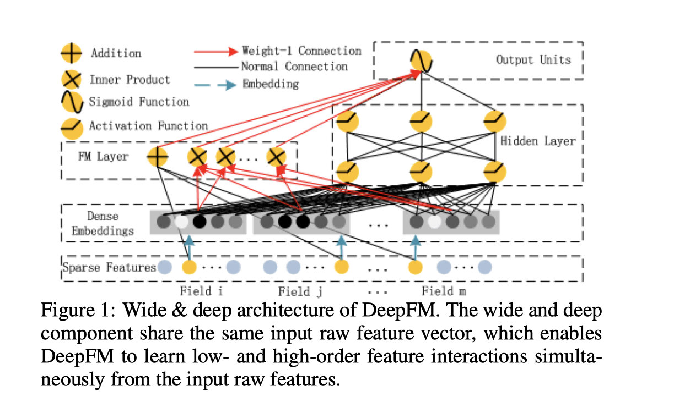
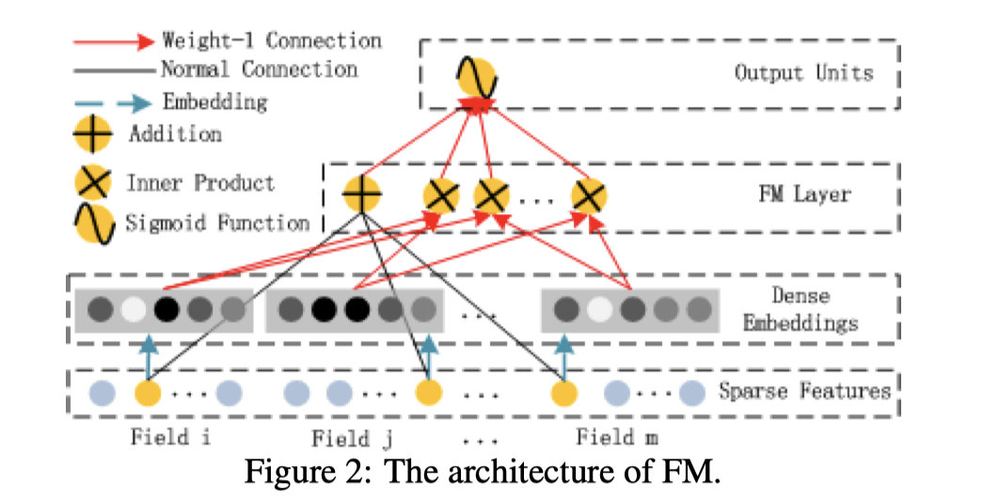

# deepFM

推荐系统一般都会严格地按照预估的CTR进行排序。所以这其中的关键问题就是准确地预估CTR。

一般来说常规的推荐系统当中的特征分为四个部分

1. 用户特征
    1. 用户属性特征，是关于用户的一些信息。比如是男是女，是否是高收入群体，是否是高消费群体，成为平台的用户多久了，偏好平台当中什么类目的商品等等。
    2. 用户行为特征，比如用户在浏览这个商品之前还看过哪些其他的商品，他登陆平台多久了，等等。

2. 商品特征，就是关于item的一些信息，比如价格、类目、折扣、评价等等。
3. 上下文特征，比如当前的时间，是早上还是晚上，比如item展示的位置等等。

显然用户是否会点击某一个item是由以上这四个部分的信息共同作用的，比如给一个高富帅推兰博基尼或者是百达翡丽就是有吸引力的，给一个连听都没听说过的屌丝推同样的内容显然就屁用没有。也就是说商品的特征和用户的特征之间是存在逻辑上的关联的，我们一般称为特征的交叉。

这些交叉信息往往是隐式的，也就是我们不能直接描述和形容出来的。举个简单的例子，可能并不是所有富人都喜欢奢侈品，有些可能就喜欢电子消费品，还有些可能喜欢服装或者是旅行。人的喜好是很复杂的，我们很难用固定的规则去描述。所以这就需要模型能有这样的能力去学习这些特征之间的潜在联系，对这些潜在交叉信息把握越好的模型，一般也都拥有越好的效果。

比如我们分析了主流的app store市场之后发现，在饭点的时候，用户经常会下载外卖类的app，这说明了app的类别和时间之间存在交叉关系。再比如我们发现年轻的男生往往喜欢设计类游戏，这说明了app的类别与用户的性别之间也存在交叉关系。像是这样的交叉信息还有很多，从Wide & Deep模型的经验当中我们可以学到考虑低维和高维交叉特征之后，模型的效果会更好。

这里面的一个关键挑战是如何高效地对特征之间的交叉信息进行建模，其中的一些比较容易理解，也比较容易做出特征来，然而大部分的交叉信息是隐式的，难以直观理解的，比如啤酒和尿布的例子就是一个，只有大数据挖掘才能发现。即使是直观上容易理解的部分，由于涉及的数量太大，也不可能通过手工来全部处理。

之后paper当中拉踩了一下同行，首先说明了单纯的CNN以及RNN效果不好，这个比较容易想明白，RNN主要应用场景是序列场景，比如文本、音频等，用在CTR预估上并不合适。CNN也是一样，主要应用在图片等高维度的数据当中，也不太适合推荐场景。

## 方案

我们假设训练集当中一共有n条样本，每一条样本可以写成$(X,y)$。其中$X$是一个m个field组成的向量，包含了用户和item组成的特征。$y \in (0,1)$,y = 0表示用户没有点击，y =1 表示用户点击。

我们再来看样本的特征，这m维特征可以看成两部分组成，第一部分是类别特征，比如性别、地理位置、收入情况等等。第二种是连续性特征，比如平均花费、平均停留时间等等。类别特征（categorical feature）一般被表示成一个one-hot之后的向量，而一个连续特征，一般就是表示它自己，当然也可以离散化成one-hot向量。

我们把这些特征全部处理完之后，整个向量会转化成 $x=[x_{field1},...,x_{fieldm}]$这里的每一个field和向量一一对应。由于这当中做了一些离散化的处理，会使得x向量变得非常稀疏。所以我们要做的就是在这样特征比较稀疏的样本上简历一个CTR预测模型。

## DeepFM

这张图看起来可能会有点乱，我们可以先忽略一些局部的细节，先从整体上把握。这个模型可以分成两个部分，分别是FM部分以及Deep部分。这两个部分的输入是一样的，并没有像Wide & Deep模型那样做区分。

其实这个模型还是比较好理解的，神经网络也就是Deep的部分用来训练这些特征的一维的关联以及联系，而FM模型会通过隐藏向量V的形式来计算特征之间的二维交叉的信息。最后一维和二维的信息汇总到一起，进入sigmoid层，获得最终的结果。

### FM部分

FM部分其实就是因子分解机，我们在之前的文章当中曾经专门剖析过。FM会考虑所有特征之间两两交叉的情况，相当于人为对左右特征做了交叉。但是由于n个特征交叉的组合是$n^2$这个量级，所以FM设计了一种新的方案，对于每一个特征i训练一个向量$V_i$,当i和j两个特征交叉的时候，通过$V_i \cdot V_j$来计算两个特征交叉之后的权重。

### Deep部分

从图中我们可以看到，所有的特征都会被转化成embedding向量作为Deep部分的输入。CTR预估的模型和图片以及音频处理的模型有一个很大的不同，就是它的维度会更大，并且特征会非常稀疏，还伴有类别连续、混合、聚合的特点。在这种情况下，使用embedding向量来把原始特征当中的信息压缩到低维的向量就是一种比较好的做法了，这样模型的泛化能力会更强，要比全是01组成的multi-hot输入好得多。

### 细节

这张图展示了这个部分局部的结构，我们可以看到所有特征转成的embedding向量拥有相同的维度k。并且和FM模型当中的维度也是一样的，并且这个embedding的初始化也是借用FM当中的二维矩阵V来实现的。我们都知道V是一个d x k的二维矩阵，而模型原始输入是一个d维的01向量，那么和V相乘了之后，自然就转化成了d x k的embedding了。

## 参考

1. [DeepFM: A Factorization-Machine based Neural Network for CTR Prediction](https://www.ijcai.org/proceedings/2017/0239.pdf)