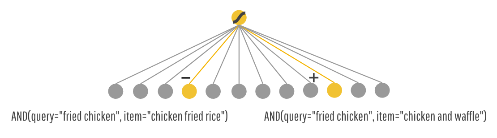
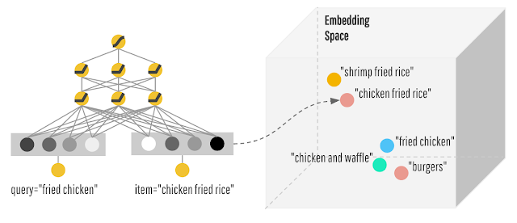
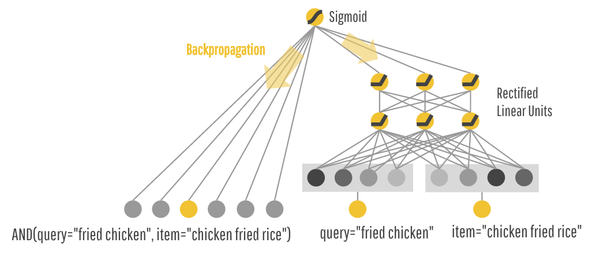
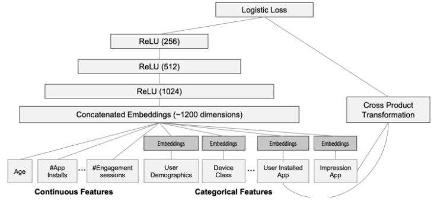

# DeepWide

Google的应用商店团队Google Play于2016年提出的Wide&Deep模型. Wide&Deep模型正如其名，分别包含了Wide部分和Deep部分。其中Wide部分的作用是让模型具有较强的“记忆能力”(memorization)；而Deep部分的作用是让模型具有“泛化能力”(generalization)。

假设一个点餐的APP, 用户只需要输入它想要的某种食物(query)，点餐app就可以预测出用户最喜欢的食物(item)。如果用户下单了app推荐的食物，那么得分为1，否则为0。


## Wide

首先使用Wide模型来处理这个问题, 这个模型预测一个消费概率$P(consumption|query, item)$, 即对于一个特定的query和推荐的item，它被消费的概率有多大？点餐APP会将概率最大的(query, item)组合推荐给客户.

举个例子, P(consumption|query='fried chicken', item='chicken and waffles')的概率很高, 而P(consumption|query="fried chicken", item="chicken fried rice")的概率很低, 说明当用户输入fried chicken, 更想获得的是chicken and waffles, 而不是chicken fried rice.

Wide模型记录了用户的偏好.




## Deep

过了一段时间，用户对app的推荐内容感到疲倦，他们希望app能够推荐一些符合他们口味，但同时又能带来新鲜感的食物。因此我们选择Deep模型来解决这个问题，Deep模型会对每个query和item都生成低维的稠密embedding向量，并且在embedding空间中来查找彼此比较接近的ietm。举个例子，你会发现搜索炸鸡的用户一般也不会介意再吃个汉堡。下图展示了Deep模型示意图，可以看到在Embedding空间中，炸鸡和汉堡彼此距离比较近。




## Deep & Wide

但是Deep模型也有它自身的问题，就是泛化过度，即给用户推荐了不太相关的物品。通过查询历史数据，我们发现实际上存在两种不同的query-item关系。

1. 精准查询，用户输入了非常精准的食物描述，比如冰脱脂牛奶拿铁咖啡(iced decaf latte with nonfat milk)，我们不能因为它与热全脂拉铁咖啡(hot latte with whole milk)在Embedding空间中比较相近就推荐给用户。
2. 宽泛查询，比如用户输入了类似海鲜(seafood)或者意大利食物(italian food)这样的关键字，根据这种具有宽泛意义的关键词可以找到非常多相关的item。

了解到了这些问题之后，一个很自然的想法就是将Wide和Deep模型结合起来使用，如下图：



对于两个稀疏特征query="fried chicken" 以及 item="chicken fried rice"，我们同时丢入Wide模型(左边)和Deep模型(右边)进行训练。这样模型就兼具了记忆和泛化的能力，从而可以达到更好的推荐效果。


## 公式描述

### wide

这个公式在LaTeX语法中的描述如下：
$$
y = w^T [x, \phi(x)] + b
$$

其中:
1. $x$表示原始特征
2. $\phi(x)$表示叉乘特征.

    叉乘特征是通过特定的变换函数对特征进行组合得来的，其中论文使用的是交叉积变换函数，其定义如下：
    
    $$
    \phi_k(x) = \prod_{i = 1}^{d} x_i^{c_{ki}} \quad c_{ki} \in \{0, 1\}
    $$

    其中, $c_{ki}$是布尔变量, 当第$i$个特征值属于第$k$个组合特征时，$c_{ki}=1$，否则为0；$x_i$是第$i$个特征的值。例如，对于组合特征"AND(query='fried chicken', item='chicken fried rice')"来说，只有当query中uery='fried chicken'和item='chicken fried rice'这两个特征都为1的时候，组合特征才为1，否则为0。


### deep

Deep模型其实就是一个前馈神经网络，网络会对一些稀疏特征(如ID类特征)学习一个低维的稠密Embedding向量，维度通常在O(10)~O(100)之间，然后与一些原始稠密特征一起作为网络的输入，依次通过若干隐层进行前向传播，每一个隐层都执行以下计算：


这个公式在LaTeX语法中的表示如下：

$$
a^{(l+1)} = f (W^{(l)} a^{(l)} + b^{(l)})
$$


其中$f$是激活函数，这里选用的是ReLU，$a^{(l)},b^{(l)},w^{(l)}$分别是第$l$层的激活值，偏置，以及权重矩阵。

## Wide&Deep联合训练

论文特意强调了Wide模型和Deep模型是联合(Joint)训练的，与集成(Ensemble)是不同的，集成训练是每个模型单独训练，再将模型结果汇总。因此每个模型都会学的足够好的时候才会进行汇总，故每个模型相对较大。而对于Wide&Deep的联合训练而言，Wide部分只是为了补偿Deep部分缺失的记忆能力，它只需要使用一小部分的叉乘特征，故相对较小。

Wide&Deep模型采用的Logistic Loss函数，模型的预测值定义如下：


这个公式在LaTeX语法中的描述如下：

$$
P(Y = 1|x) = \sigma (w_{ide}^T [x, \phi(x)] + w_{dep}^T a^{(lf)} + b)
$$


其中Y是二值化的类别标签，$\sigma (\cdot)$是Sigmoid激活函数，$\phi(x)$是对原始特征$x$进行交叉积转换后的叉乘特征，$b$是偏置值。$w_{wide}$是所有的wide模型的权重，$w_{deep}$是应用在最后一层神经元的激活值上的权重矩阵。

关于模型训练，论文对Wide部分使用了FTRL算法并且加上了L1正则化，对于Deep部分使用了AdaGrad算法。


论文使用的Wide&Deep模型结构如下：



Wide部分的输入仅仅是已安装应用和曝光应用两类特征，其中已安装应用代表用户的历史行为，而曝光应用代表当前的待推荐应用。选择这两类特征的原因是充分发挥Wide部分“记忆能力”强的优势。


```python
import torch
import torch.nn as nn

class Wide(nn.Module):
    def __init__(self, input_dim):
        super(Wide, self).__init__()
        # hand-crafted cross-product features
        self.linear = nn.Linear(in_features=input_dim, out_features=1)

    def forward(self, x):
        return self.linear(x)

class Deep(nn.Module):
    def __init__(self, config, hidden_layers):
        super(Deep, self).__init__()
        self.dnn = nn.ModuleList([nn.Linear(layer[0], layer[1]) for layer in list(zip(hidden_layers[:-1], hidden_layers[1:]))])
        self.dropout = nn.Dropout(p=config['deep_dropout'])

    def forward(self, x):

        for layer in self.dnn:
            x = layer(x)
            # 如果输出层大小是1的话，这里再使用了个ReLU激活函数，可能导致输出全变成0，即造成了梯度消失，导致Loss不收敛
            x = torch.relu(x)
        x = self.dropout(x)
        return x

class WideDeep(nn.Module):
    def __init__(self, config, dense_features_cols, sparse_features_cols):
        super(WideDeep, self).__init__()
        self._config = config
        # 稠密特征的数量
        self._num_of_dense_feature = dense_features_cols.__len__()
        # 稠密特征
        self.sparse_features_cols = sparse_features_cols

        self.embedding_layers = nn.ModuleList([
            # 根据稀疏特征的个数创建对应个数的Embedding层，Embedding输入大小是稀疏特征的类别总数，输出稠密向量的维度由config文件配置
            nn.Embedding(num_embeddings = num_feat, embedding_dim=config['embed_dim'])
                for num_feat in self.sparse_features_cols
        ])

        # Deep hidden layers
        self._deep_hidden_layers = config['hidden_layers']
        self._deep_hidden_layers.insert(0, self._num_of_dense_feature + config['embed_dim'] * len(self.sparse_features_cols))

        self._wide = Wide(self._num_of_dense_feature)
        self._deep = Deep(config, self._deep_hidden_layers)
        # 之前直接将这个final_layer加入到了Deep模块里面，想着反正输出都是1，结果没注意到Deep没经过一个Linear层都会经过Relu激活函数，如果
        # 最后输出层大小是1的话，再经过ReLU之后，很可能变为了0，造成梯度消失问题，导致Loss怎么样都降不下来。
        self._final_linear = nn.Linear(self._deep_hidden_layers[-1], 1)

    def forward(self, x):
        # 先区分出稀疏特征和稠密特征，这里是按照列来划分的，即所有的行都要进行筛选
        dense_input, sparse_inputs = x[:, :self._num_of_dense_feature], x[:, self._num_of_dense_feature:]
        sparse_inputs = sparse_inputs.long()

        sparse_embeds = [self.embedding_layers[i](sparse_inputs[:, i]) for i in range(sparse_inputs.shape[1])]
        sparse_embeds = torch.cat(sparse_embeds, axis=-1)
        # Deep模块的输入是稠密特征和稀疏特征经过Embedding产生的稠密特征的
        deep_input = torch.cat([sparse_embeds, dense_input], axis=-1)

        wide_out = self._wide(dense_input)
        deep_out = self._deep(deep_input)
        deep_out = self._final_linear(deep_out)

        assert (wide_out.shape == deep_out.shape)

        outputs = torch.sigmoid(0.5 * (wide_out + deep_out))
        return outputs

    def saveModel(self):
        torch.save(self.state_dict(), self._config['model_name'])

    def loadModel(self, map_location):
        state_dict = torch.load(self._config['model_name'], map_location=map_location)
        self.load_state_dict(state_dict, strict=False)
```


## 参考
1. [原论文](https://arxiv.org/pdf/1606.07792)
2. https://www.jianshu.com/p/eb0cd2cfe75c
3. https://research.google/blog/wide-amp-deep-learning-better-together-with-tensorflow/
4. https://github.com/HeartbreakSurvivor/RsAlgorithms/blob/main/Test/widedeep_test.py
5. https://bbs.huaweicloud.com/blogs/341709
6. https://www.kaggle.com/code/matanivanov/wide-deep-learning-for-recsys-with-pytorch/notebook
7. https://jrzaurin.github.io/infinitoml/2021/05/28/pytorch-widedeep_iv.html
8. https://zhuanlan.zhihu.com/p/53361519
9. https://blog.csdn.net/google19890102/article/details/78171283
10. https://ithelp.ithome.com.tw/articles/10225452