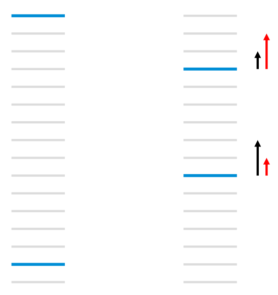

# lambdaRank

如图所示，每个线条表示一个文档，蓝色表示相关文档，而灰色表示不相关文档，排在前面的文档将优先展示给用户。由于RankNet只关心两两文档之间的顺序，忽视了文档的具体顺序信息，那么当面对左图的情形时，假设此时损失值为13，RankNet通过把排在首位的相关文档下调3个位置，排在倒数第二的相关文档上调5个位置，从而将损失值降为11.但是，对于用户来说，通常更关注top k个结果的顺序，在优化过程中下调top结果中的相关文档并不能令用户满意。

图右图左边黑色的箭头表示RankNet下一轮的调度方向和强度，但用户真正需要的时右边红色箭头代表的方向和强度，即更关注靠前位置的相关文档的排序位置的提升。

所以，排序中的评价指标NDCG更能反应用户对相关性的潜在要求。这里问题就来了：能不能通过NDCG指标来定义梯度呢？

LambdaRank正是基于这个思想演化而来，其中Lambda指的就是红色箭头，代表下一次迭代优化的方向和强度，也就是梯度。

我们来看看LambdaRanke是如何通过NDCG指标定义梯度的。首先，对于RankNet的梯度，我们有如下推导：

$$ 
\frac{\partial L}{\partial w_k} = \sum_{(i,j) \in P} \frac{\partial L_{ij}}{\partial w_k} = \sum_{(i,j) \in P} \left( \frac{\partial L_{ij}}{\partial s_i} \frac{\partial s_i}{\partial w_k} + \frac{\partial L_{ij}}{\partial s_j} \frac{\partial s_j}{\partial w_k} \right)
$$

进一步的，可以观察到对模型s的求导有下面的对称性：

$$
\begin{aligned}
        \frac{\partial L_{ij}}{\partial s_i} & {} = \frac{\partial \biggl\{\frac12 (1 - S_{ij})\sigma\cdot(s_i - s_j) + \log\Bigl\{1 + \exp\bigl(-\sigma\cdot(s_i - s_j)\bigr)\Bigr\}\biggr\}}{\partial s_i}\\
         & {}= \frac12 (1 - S_{ij})\sigma - \frac{\sigma}{1 + \exp\bigl(\sigma\cdot(s_i - s_j)\bigr)} \\
         & {}= \sigma\Biggl[\frac12(1 - S_{ij}) - \frac{1}{1 + \exp\bigl(\sigma\cdot(s_i - s_j)\bigr)}\Biggr] \\
         & {}= -\frac{\partial L_{ij}}{\partial s_j}
\end{aligned}
$$

因此，LambdaRank有如下关于文档$x_i$和$x_j$的Lambda定义：

$$
\lambda_{ij} \equiv \frac{\partial L_{ij}}{\partial s_i} = -\frac{\partial L_{ij}}{\partial s_j}
$$

因为$(i,j)$是有序的, 所以$S_{ij}=1$, 于是上述公式可以进一步简化：
$$
\lambda_{ij} \equiv - \frac{\sigma}{1 + e^{\sigma\cdot(s_i - s_j)}}
$$

至此可以得到每个文档$x_i$的Lambda值为：

$$
\lambda_i = \sum_{(i,j) \in I} \lambda_{ij} - \sum_{(j,i) \in I} \lambda_{ij}
$$

公式中的I是文档对$(x_i,x_j)$的集合，其中文档$x_i$排在$x_j$前面，即更相关。

为了加强排序中顺序前后的重要性，LambdaRank进一步在Lambda中引入评价指标Z(如NDCG)，可以这么理解Lambda，Lambda量化了一个待排序的文档在下一次迭代时应该调整的方向和强度。

$$
\lambda_{ij}=\frac{\partial C(s_i-s_j)}{\partial s_i} = \frac{-\sigma}{1+e^{\sigma\cdot(s_i-s_j)}}|\Delta_{NDCG}|
$$

可以看出，LambdaRank不是通过显示定义损失函数再求梯度的方式对排序问题进行求解，而是分析排序问题需要的梯度的物理意义，直接定义梯度，可以反向推导出LambdaRank的损失函数为：

$$
L_{ij} = \log \{1 + \exp(\sigma(s_i - s_j))\}|\Delta_{NDCG}|
$$

## 参考
1. https://www.zhihu.com/question/341082668
1. https://liam.page/2016/07/10/a-not-so-simple-introduction-to-lambdamart/
2. https://zhuanlan.zhihu.com/p/270608987
3. https://www.microsoft.com/en-us/research/wp-content/uploads/2016/02/MSR-TR-2010-82.pdf
4. https://www.cnblogs.com/genyuan/p/9788294.html
5. https://www.cnblogs.com/bentuwuying/p/6690836.html
6. https://blog.csdn.net/c9Yv2cf9I06K2A9E/article/details/123058894
7. https://www.microsoft.com/en-us/research/wp-content/uploads/2016/02/lambdarank.pdf
8. https://zhuanlan.zhihu.com/p/138235048