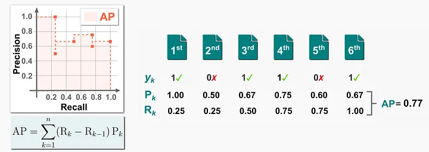

# Mean Average Precision (MAP)

MAP用来评估二分类相关度(binary relevance), 既一个文档(document)的得分y只能是1相关和0不相关.

对于一个询问q(query)和相关的文档d(document)$(d_1, d_2, ..., d_n)$, 检查前k个文档是相关(y=1)还是不相关(y=0).

当k值设置不同时, 我们会获得不同的$P_k$和$R_k$, 得到不同的精准-召回曲线(precision-recall curve), 在精准召回曲线下方的面积即是Average Precision(AP).

对于m个询问(queries), 计算他们的平均值, 既是Mean Average Precision (MAP).

