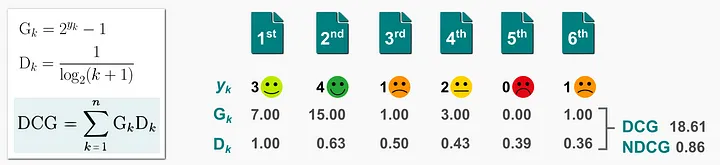

# NDCG

NDCG: Normalized Discounted Cumulative Gain(归一化折损累计增益)

当我们检索推荐排序，网页返回了与推荐排序相关的链接列表。列表可能会是[A,B,C,G,D,E,F],也可能是[C,F,A,E,D]，现在问题来了，当系统返回这些列表时，怎么评价哪个列表更好？

## dataset

item|relevance
--|--
A|0.5
B|0.9
C|0.3
D|0.6
E|0.1

## G(Gain)

表示物品(item)和请求(query)的相关性得分:


$$ G = rel(i) $$

其中:
1. $i$ 是物品的ID
2. $rel(i)$ 相关性得分, 由人工标注.


## CG(Cumulative Gain)

表示对K个item的Gain进行累加。

$$ CG_k = \sum_{i=1}^{k}rel(i) $$

CG只是单纯累加相关性，不考虑位置信息。

1. 如果返回一个list_1=[A,B,C,D,E]，那list_1的CG为0.5+0.9+0.3+0.6+0.1=2.4
2. 如果返回一个list_2=[D,A,E,C,B]，那list_2的CG为0.6+0.5+0.1+0.3+0.9=2.4

所以，顺序不影响CG得分。如果我们想评估不同顺序的影响，就需要使用另一个指标DCG来评估。

## DCG(Discounted Cumulative Gain)

考虑排序顺序的因素，使得排名靠前的item增益更高，对排名靠后的item进行折损。DCG的思想是：list中item的顺序很重要，不同位置的贡献不同，一般来说，排在前面的item影响更大，排在后面的item影响较小。（例如一个返回的网页，肯定是排在前面的item会有更多人点击）。所以，相对CG来说，DCG使排在前面的item增加其影响，排在后面的item减弱其影响。

$$ DCG_k=\sum_{i=1}^{k}\frac{rel(i)}{log_2{(i+1)}} $$


怎么实现这个思想呢？DCG在CG的基础上，给每个item的相关性比上log2(i+1)，i越大，log2(i+1)的值越大，相当于给每个item的相关性打个折扣，item越靠后，折扣越大。

例如, list_1=[A,B,C,D,E], 其对应计算如下：

i|$rel(i)$|$log(i+1)$|$rel(i)/log(i+1)$
--|--|--|--
1 = A|0.5|1|0.5
2 = B|0.9|1.59|0.57
3 = C|0.3|2|0.15
4 = D|0.6|2.32|0.26
5 = E|0.1|2.59|0.04

list_1的 DCG_1= 0.5+0.57+0.15+0.26+0.04=1.52


list_2=[D,A,E,C,B]，其对应计算如下：

i|$rel(i)$|$log(i+1)$|$rel(i)/log(i+1)$
--|--|--|--
1 = D|0.6|1|0.6
2 = A|0.5|1.59|0.31
3 = E|0.1|2|0.05
4 = C|0.3|2.32|0.13
5 = B|0.9|2.59|0.35

list_2的 DCG_2= 0.6+0.31+0.05+0.13+0.35=1.44

DCG_1 > DCG_2, 所以在这个例子里list_1优于list_2。


## NDCG(Normalized DCG)

### IDGC(ideal DCG)

在NDCG之前，先了解一些IDGC(ideal DCG)--理想的DCG，IDCG的依据是：是根据rel(i)降序排列，即排列到最好状态。算出最好排列的DCG，就是IDCG。IDCG=最好排列的DCG

对于上述的例子，按照rel(i)进行降序排列的最好状态为list_best=[B,D,A,C,E]

i|$rel(i)$|$log(i+1)$|$rel(i)/log(i+1)$
--|--|--|--
1 = B|0.9|1|0.9
2 = D|0.6|1.59|0.38
3 = A|0.5|2|0.25
4 = C|0.3|2.32|0.13
5 = E|0.1|2.59|0.04


IDCG = DCG_best = 0.9+0.38+0.25+0.13+0.04=1.7 (理所当然，IDCG>DCG_1和DCG_2)


### NDCG

因为不同query的搜索结果有多有少，所以不同query的DCG值就没有办法来做对比。所以提出NDCG。

$$ NDCG = \frac{DCG}{IDCG}  $$

所以NDGC使用DCG/IDCG来表示，这样的话，NDCG就是一个相对值，那么不同query之间就可以通过NDCG值进行比较评估。




## 代码实现

```python
# import required package 
from sklearn.metrics import ndcg_score, dcg_score
import numpy as np
 
# Relevance scores in Ideal order
true_relevance = np.asarray([[3, 2, 1, 0, 0]])
 
# Relevance scores in output order
relevance_score = np.asarray([[3, 2, 0, 0, 1]])
 
# DCG score
dcg = dcg_score(true_relevance, relevance_score)
print("DCG score : ", dcg)
 
# IDCG score
idcg = dcg_score(true_relevance, true_relevance)
print("IDCG score : ", idcg)
 
# Normalized DCG score
ndcg = dcg / idcg
print("nDCG score : ", ndcg)
 
# or we can use the scikit-learn ndcg_score package
print("nDCG score (from function) : ", ndcg_score(
    true_relevance, relevance_score))
```


## 参考

1. https://zhuanlan.zhihu.com/p/448686098
2. https://towardsdatascience.com/learning-to-rank-a-complete-guide-to-ranking-using-machine-learning-4c9688d370d4