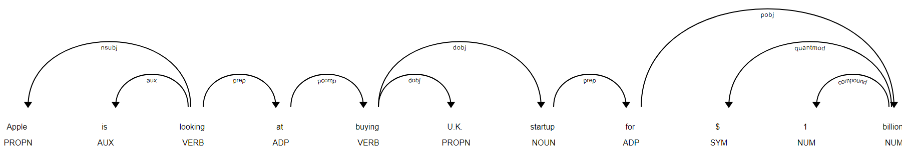

# pos


```python
import spacy

nlp = spacy.load("en_core_web_sm")
doc = nlp("Apple is looking at buying U.K. startup for $1 billion")

for token in doc:
    print(token.text, token.lemma_, token.pos_, token.tag_, token.dep_,
            token.shape_, token.is_alpha, token.is_stop)

```
注意: 由于spacy存储都是基于哈希值的, 所以在获得具体值时, 需要在变量后面加上`_`. 


TEXT|LEMMA|POS|TAG|DEP|SHAPE|ALPHA|STOP
--|--|--|--|--|--|--|--|--
Apple|apple|PROPN|NNP|nsubj|Xxxxx|True|False
is|be|AUX|VBZ|aux|xx|True|True
looking|look|VERB|VBG|ROOT|xxxx|True|False
at|at|ADP|IN|prep|xx|True|True
buying|buy|VERB|VBG|pcomp|xxxx|True|False
U.K.|u.k.|PROPN|NNP|compound|X.X.|False|False
startup|startup|NOUN|NN|dobj|xxxx|True|False
for|for|ADP|IN|prep|xxx|True|True
$|$|SYM|$|quantmod|$|False|False
1|1|NUM|CD|compound|d|False|False
billion|billion|NUM|CD|pobj|xxxx|True|False

字段解释:
Text: 原始的文本
Lemma: 词语的基本形式, 比如`is`的基本形式是`be`
POS: UPOS part-of-speech tag.
Tag: detailed part-of-speech tag.
Dep: Syntactic dependency
Shape: 词语的形状 – 大小写, 标点, 数字.
is alpha: 是字母(alpha character)?
is stop: 停止词 i.e. the most common words of the language?




## 词性标注
https://spacy.io/usage/linguistic-features#pos-tagging
https://spacy.io/api/annotation#pos-tagging