## seq2seq的问题
编码器的输出是固定长度的向量. 意味着, 无论输入语句的长度如何, 都会被转换为长度相同的向量, 可能会造成信息溢出, 如下图:

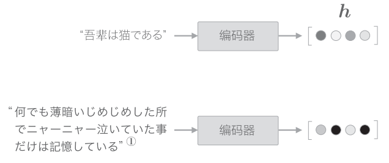

## 编码器的改进
编码器的输出的长度应该根据输入文本的长度相应的改变, 一个方法1就是将各个时刻的LSTM层的隐状态全部输出.

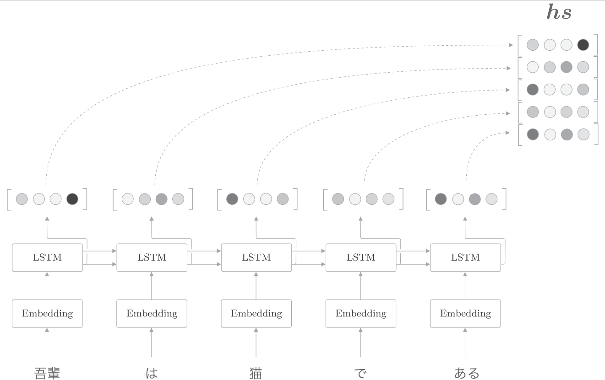

使用各个时刻的隐状态向量, 可以获得和输入的单词数相同数量的向量. 如上图, 输入了5个单词, 此时编码器输出5个向量.

在许多深度学习框架中, 初始化RNN层时可以选择是发那会"全部时刻的隐状态", 还是返回"最后时刻的隐状态".

输入"猫"时的LSTM层的输出(隐状态)受此时输入的单词"猫"的影响最大. 因此, 可以认为这个隐状态向量蕴含了许多"猫的成分", 按照这个理解, 编码器输出的$hs$矩阵就可视为各个单词对应的向量的集合, 如下图:

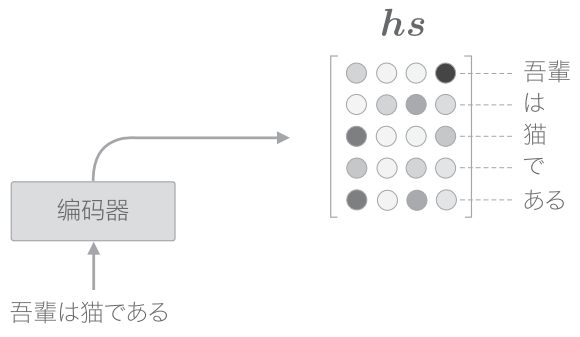

## 解码器的改进1
在seq2seq中, 是将编码器的LSTM层的"最后"的隐状态放入了解码器的LSTM层的"最初"的隐状态, 如下图所示:

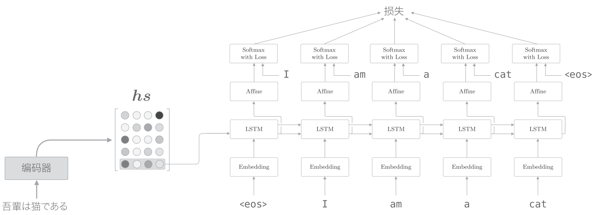

如上图, 如果使用$hs$, 则只提取了最后一行, 再将其传递给解码器.

我们在将"吾輩は猫である"这句话翻译成英文时, 会用到"吾輩 = I", "猫 = cat"这样的知识. 也就是说, 我们专注于某个单词, 随时对这个单词进行转换. 我们的目标是仅关注必要的信息, 并根据该信息进行时序转换, 这个机制称为Attention. 如下图:

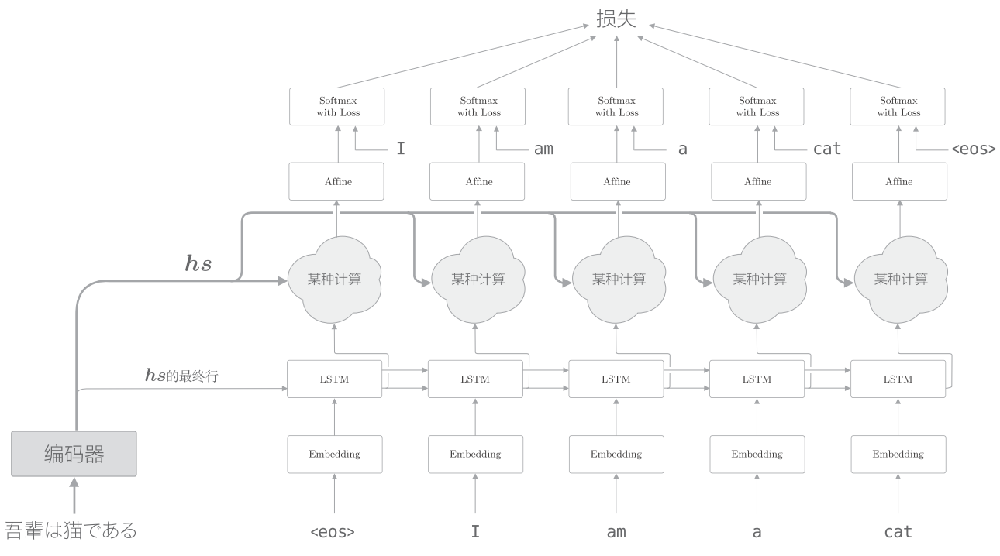

如上图, 我们新增一个进行"某种计算"的层. 这个"某种计算"接收解码器各个时刻的LSTM层的隐状态和编码器的$hs$. 然后, 从中选出必要的信息, 并输出到Affine层. 与之前一样, 编码器的最后的隐藏状态向量传递给解码器最初的LSTM层.

具体来说, 就是从$hs$中选出与各个时刻解码器输出的单词有对应关系的单词向量, 比如, 当解码器输出"I"时, 从$hs$中选出"吾輩"的对应向量. 我们希望通过某种操作实现这种选择操作. 不过这里有个问题, 就是选择(从多个事物中选取若干个)这一操作时无法进行微分的. 也就不能计算梯度, 实现反向传播.

解决这个问题的思路很简单, 就是度量表示各个单词重要度的权重.

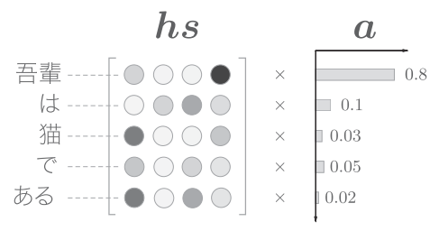

如上图, 使用表示各个单词重要度的权重$a$计算和单词向量$hs$的加权和, 可以获得目标向量, 如下图:

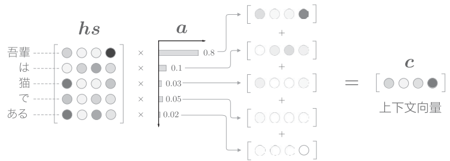

如上图, 计算单词向量的加权和, 这里将结果称为上下文向量, 并用符号$c$表示. "吾輩"对应的权重为0.8, 意味着上下文向量$c$中含有很多"吾輩"向量的成分. 如果"吾輩"对应的权重为1, 其他单词对应的权重为0, 就相当于"选择"了"吾輩".

## 解码器的改进2
计算各个单词权重$a$的方法是:
首先, 从编码器的处理开始到解码器第一个LSTM层输出隐状态向量的处理为止的流程如图:

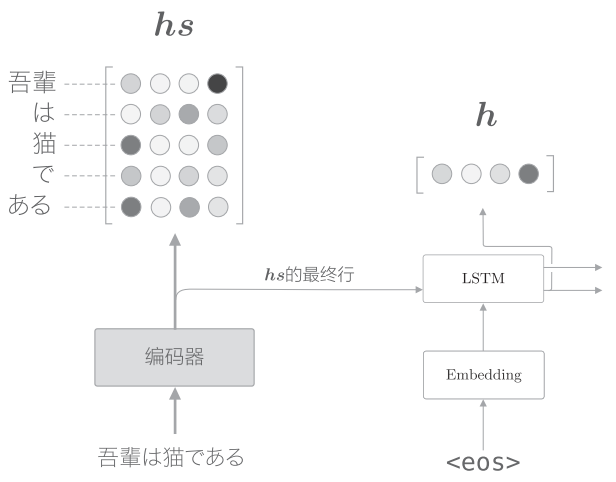

$h$表示解码器的LSTM层隐状态. 我们的目标是用数值表示这个$h$在多大程度上和$hs$的各个单词向量"相似". 我们使用简单的向量内积.

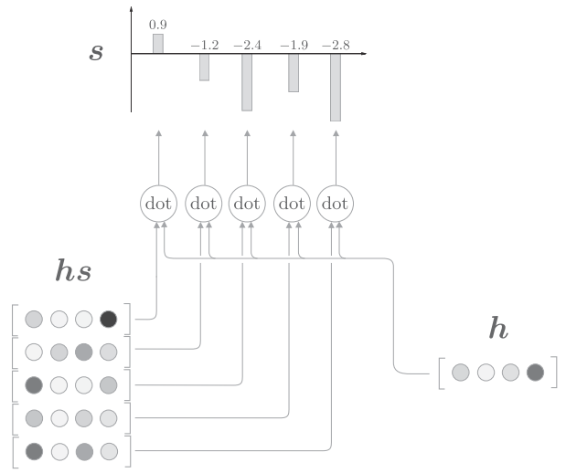

如上图, 通过内积算出$h$和$hs$的各个单词向量之间的相似度, 并将其结果表示为$s$. 这个$s$是正规化之前的值, 也称为得分. 接下来使用Softmax函数对$s$进行正规化.

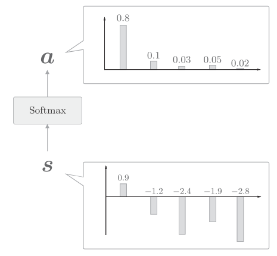

如上图, 使用Softmax函数后, 输出的$a$的各个元素的值在0.0~1.0, 总和为1, 这样就求得了表示各个单词权重的$a$.

## 解码器改进3
解码器改进1 实现了 Weight Sum层, 解码器改进2实现了Attention Weight层, 将二者结合起来:

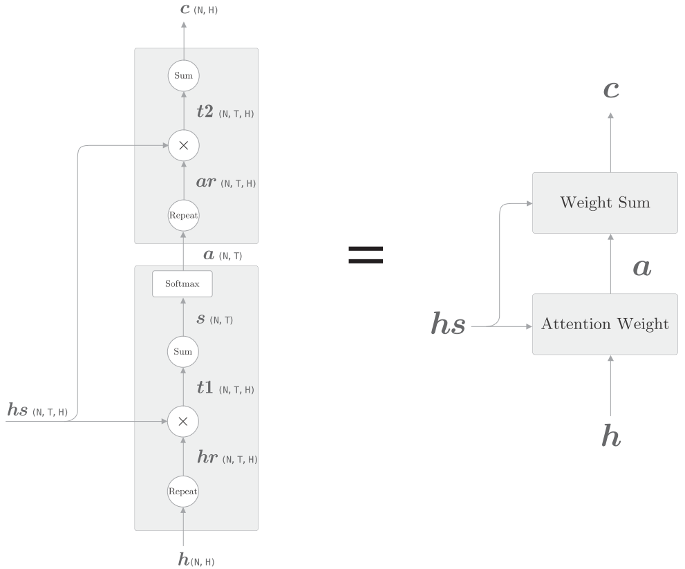

如上图:
- Attention Weight关注编码器输出的各个单词向量$hs$, 并计算各个单词的权重$a$

- Weight Sum层计算$a$和$hs$的加权和, 并输出上下文向量$c$.

我们将这一系列计算称为Attention层.

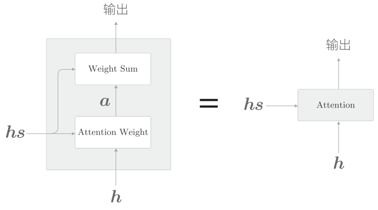

下图是完整的Attention:

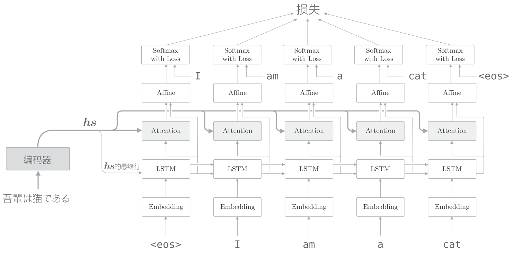

##  residual connection
在加深层时使用到重要技巧是残差连接(residual connection), 是一种跨层的连接技巧.

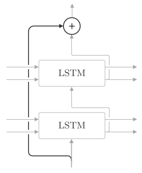

如上图, 在残差连接处, 有两个输出被相加. 这个加法(对应元素相加)非常重要, 因为加法在反向传播时"按原样"传播梯度, 所以残差连接中的梯度可以不受任何影响地传播到前一层.

## Attention 应用

### 翻译
从"基于规则的翻译"到"基于用例的翻译",再到"基于统计的翻译". 而现在神经机器防疫(Neural Machine Translation)取代了过往的技术.

GNMT(Google Neural Machine Translation)使用的就是Attention的技术

### Transformer
RNN需要基于上一个时刻的计算结果逐步进行计算, 因此不可能在事件方向上并行计算RNN. 在使用了GPU的并行计算环境下进行深度学习时, 这一点会成为很大的瓶颈, 于是就有了避开RNN的动机.

所以关于去除RNN的研究(或者说可以并行计算的RNN的研究)很活跃, 其中著名的就是Transformer模型. 在`Attention is all you need`这篇论文中提出. 正如标题所示, Transformer不用RNN, 而用Attention进行处理.

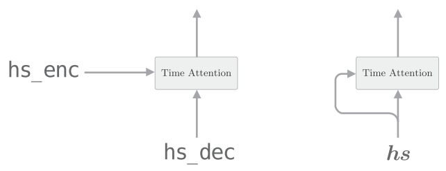

如上图, 我们用Attention求解了翻译这种两个时序数据之间的对应关系. Time Attention层的两个输入中输入的是不同的时序数据. 而Self-Attention的两个输入中输入的是同一个时序数据.

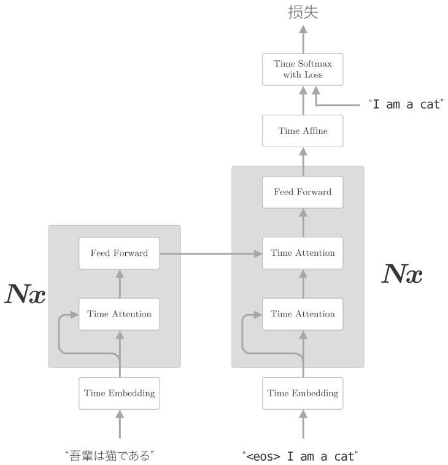

如上图, Transformer中用Attention代替了RNN. 编码器和解码器两者都使用了Self-Attention.

$N_x$表示灰色背景包围的元素被堆叠了N次. 

上图是简化了的Transformer, 实际上, 除了这个架构外, Skip Connection, Layer Normalization等技巧也会被用到. 另外还有, 编码时序数据位置信息(Positional Encoding, 位置编码)等.

Transformer可以控制计算量, 充分利用GPU并行及带来的好处.

