HMM 的全称是 Hidden Markov Model，中文是隐马尔可夫模型

一般当天气是晴天(Sunny, S)时, 心情是高兴(Happy, H); 当天气是雨天(Rain, R)时, 心情是烦躁(Grumpy, G):

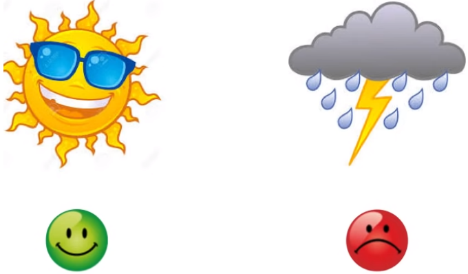

但二者之间不是必然关系, 而是概率关系:
1. 如果是晴天, 则80%高兴, 20%烦躁
2. 如果是雨天, 则40%高兴, 60%烦躁

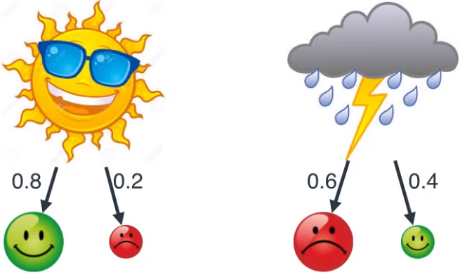

如果一周的的心情是高兴-烦躁-高兴-烦躁-高兴-烦躁(HGHGHG), 那么可以简单推断一周的天气情况是晴天-雨天-晴天-雨天-晴天-雨天(SRSRSR)

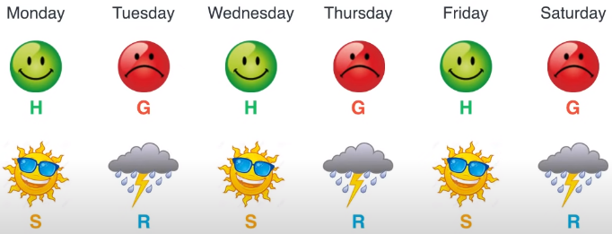

问题是, 心情可以向过山车, 但是天气晴天-雨天-晴天的情况很少见.

连续两天的天气可以用概率来描述:
1. 如果今天是晴天, 则明天是晴天的概率是80%, 明天是雨天的概率是20%
2. 如果今天是雨天, 则明天是晴天的概率是40%, 明天是雨天的概率是60%

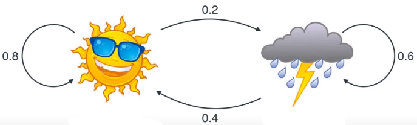

这样, 就建立了一个隐马尔可夫模型(Hidden Markov Model, HMM)模型, 它包含4个概念:
1. 观测值(observation): 看得到的, 比如心情是高兴, 还是烦躁
2. 隐状态(hidden state): 看不到的, 比如天气是晴天, 还是雨天
3. 转换概率(transition probability): 隐状态转换的概率
    1. 今天 晴天 到明天 晴天 和 雨天 的概率，本例分别是 0.8 和 0.2
    2. 今天 雨天 到明天 晴天 和 雨天 的概率，本例分别是 0.4 和 0.6
4. 发射概率(emission probability): 从隐含状态到观测值的概率
    1. 晴天 到 高兴 和 烦躁 的概率，本例分别是 0.8 和 0.2
    2. 雨天 到 高兴 和 烦躁 的概率，本例分别是 0.4 和 0.6

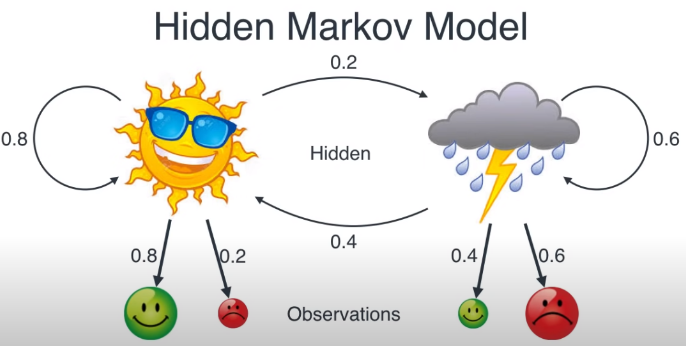

## 估计转换概率

假设收集了 16 天的天气数据。统计出“晴天-晴天”和“晴天-雨天”的个数

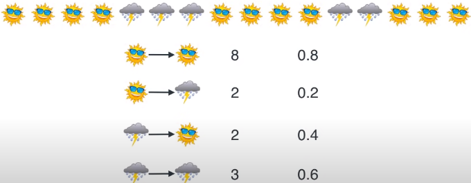

1. 晴天-晴天的转换概率: 8/10=0.8. ✨既前一天是晴天的条件下, 后一天是晴天的概率. 首先数一下前后2个是晴天-晴天的组合, 共8个, 如红色线所示; 然后数一下前后2个是晴天-阴天的组合, 共2个, 如绿色线所示, 所以晴天-晴天的转换概率为: 8/(8+2)=0.8

    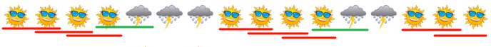

2. 晴天-阴天的转换概率为: 2/(8+2)=0.2
3. 阴天-晴天的转换概率为: 2/(3+2)=0.4
4. 阴天-阴天的转换概率为: 3/(3+2)=0.6

这样, 我们就得到转换概率:

## 估计输出概率

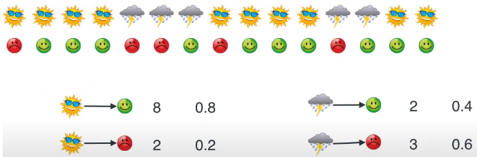

1. 晴天-高兴的发射概率: 8/10=0.8
2. 晴天-烦躁的发射概率: 2/10=0.2
3. 阴天-高兴的发射概率: 2/5=0.4
4. 阴天-烦躁的发射概率: 3/5=0.6

得到发射概率:

## 在没有男生情绪和前一天天气情况下, 晴天和雨天的概率是多少?

假设今天是晴天，可能是因为昨天是晴天造成的，也可能是因为昨天是雨天造成的。如下图所示得到第一个方程: 
S = 0.8S + 0.4R, 其中 0.8 是 “昨天 S - 今天 S” 的转换概率，0.4 是 “昨天 R - 今天 S” 的转换概率。

假设今天是雨天，可能是因为昨天是晴天造成的，也可能是因为昨天是雨天造成的。如下图所示得到第两个方程:
R = 0.2S + 0.6R, 其中 0.2 是 “昨天 S - 今天 R” 的转换概率，0.6 是 “昨天 R - 今天 R” 的转换概率。

仔细分析这两个方程是等价的，这样两个未知量一个方程解不出来，还需要一个. 又因为只有晴天和阴天两种情况, 所以可得:
S + R = 1

根据上述3个公式, 求解出 S = 2/3，R = 1/3。

✨这个结论, 可以直接统计出来, 16天的提起情况, 去掉尾部一个, 还剩15天, 然后直接统计S = 10/15 = 2/3, R = 5/15 = 1/3. 问题是为什么底数不是16?

## 如果心情是高兴, 那么晴天和雨天的概率是多少?

以上节最后结果为基准（ 2/3 可能性是晴天），先看两种情况。
1. 情况一：当女友知道男友高兴时，，最优推断是大于 2/3 可能性（比如 4/5）是晴天。
2. 情况二：当女友知道男友烦躁时，最优推断是小于 2/3 可能性（比如 2/5）是晴天。

那么这个具体概率值是多少呢？用贝叶斯定理（Bayes Theorem）来计算。这里只需要计算一天的概率，因此不需要转换概率，只需要输出概率。
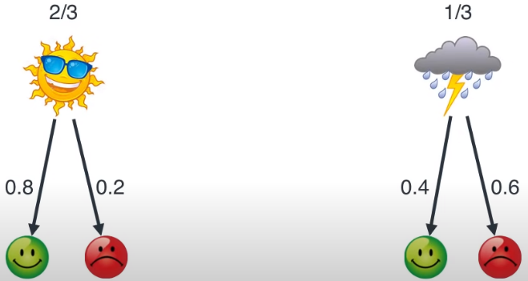

1. 因为晴天和雨天的概率为 2/3 和 1/3，不严谨地将其整数化用 2 个晴天和 1 天雨天代表概率。
1. 根据“晴天-高兴”和“晴天-烦躁”的输出概率 0.8 和 0.2，再不严谨地将其整数化用 8 个高兴 (8/10) 和 2 天烦躁 (2/10) 代表输出概率。
2. 根据“雨天-高兴”和“雨天-烦躁”的输出概率 0.4 和 0.6，再不严谨地将其整数化用 2 个高兴 (2/5) 和 3 天烦躁 (3/5) 代表输出概率。

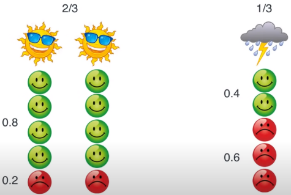

回到该问题，如果男生高兴，那么晴天的概率是多少？简单，首先统计出所有男生高兴的次数，10 次。
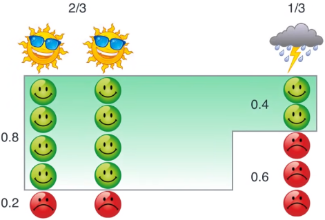

1. 10 次高兴中有 8 次发生在晴天，因此“当男生高兴时晴天”的条件概率为P(晴天|烦躁) = 8/10。
2. 10 次高兴中有 2 次发生在雨天，因此“当男生高兴时雨天”的条件概率为 2/10。

同理:

1. 5 次烦躁中有 2 次发生在晴天，因此“当男生烦躁时晴天”的条件概率为 2/5。
2. 5 次烦躁中有 3 次发生在雨天，因此“当男生烦躁时雨天”的条件概率为 3/5。

✨贝叶斯公式P(A|B) = P(B|A)*P(A)/P(B)

## 如果情绪是“高兴-烦躁-高兴”，那么这连续三天的天气是什么？
有可能是“晴天-雨天-晴天”，但怎么得到这个结果的呢？

### 枚举法(极大似然法)
一个简单粗暴的方法就是穷举法，3 天每天 2 种天气一共 2^3 = 8 种组合，根据转换概率和输出概率计算下列 8 组概率，找一个最大值即可：

1. 晴天-晴天-晴天
1. 晴天-晴天-雨天
1. 晴天-雨天-晴天
1. 晴天-雨天-雨天
1. 雨天-晴天-晴天
1. 雨天-晴天-雨天
1. 雨天-雨天-晴天
1. 雨天-雨天-雨天

✨既极大似然法

回顾两个观测值和两个隐含状态的缩写：
1. 观测值：高兴（H）、烦躁（G）
1. 隐状态：晴天（S）、雨天（R）
先从两天开始，男生的心情是高兴-烦躁，让推断这两天的天气是什么。穷举出以下四种情况，并计算每种情况发生的概率。

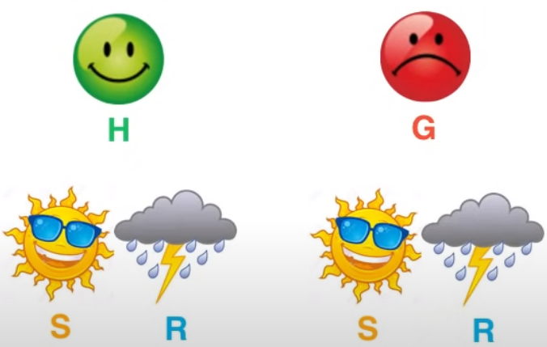

总共有四种可能
1. 晴天-晴天
2. 晴天-雨天
3. 雨天-晴天
4. 雨天-雨天

将穷举的四种组合发生概率全部计算出来，如下图所示，得到 晴天-晴天 的概率最大，0.085。该方法也叫做最大似然法（maximum likelihood）。计算公式为: 初始天气的概率 x 初始输出概率 x 初始转移概率 x 第二天输出概率

1. 晴天-晴天: 0.67 x 0.8 x 0.8 x 0.2 = 0.085
2. 晴天-雨天: 0.67 x 0.8 x 0.2 x 0.6 = 0.064
3. 雨天-晴天: 0.33 x 0.4 x 0.4 x 0.2 = 0.011
4. 雨天-雨天: 0.33 x 0.4 x 0.6 x 0.6 = 0.048
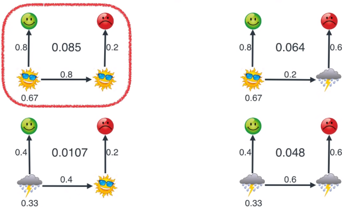

三天的情况:

男生的心情是高兴-烦躁-高兴，推断这三天的天气是什么。
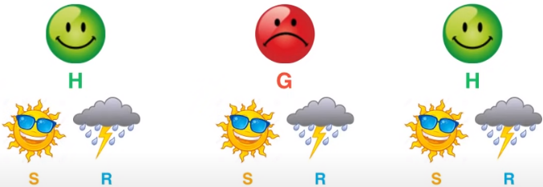

同理穷举出以下八种情况，并计算每种情况发生的概率。
1. 晴天-晴天-晴天: 
2. 晴天-晴天-雨天: 
3. 晴天-雨天-晴天: 2/3 x 0.8 x 0.2 x 0.6 x 0.4 x 0.8 = 0.02048
1. 雨天-晴天-晴天:
2. 雨天-晴天-雨天:
3. 雨天-雨天-晴天:
4. 雨天-雨天-雨天:

最终得到 SSS 的概率最大。

当天数为 N 时，需要穷举的情况为 2^N，当 N 很大时，这种暴力穷举法根本行不通，我们需要更高效的方法，一种算法就是下节要讲的维特比（Viterbi）算法。

## 维特比Viterbi

1. 从起点星期一开始，天气为 S 的概率为 0.67，天气为 R 的概率是 0.33（答案由问题二解答）。

    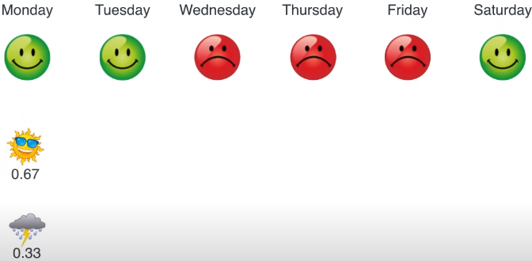

1. 从起点星期一开始, 计算当天气为 S 和 R 而导致心情 H 的概率（用输出概率）：

    1. 先看星期一的晴天（用输出概率）: P(高兴|晴天) = 0.67 x 0.8 = 0.533
    2. 再看星期一的阴天（用输出概率）: P(高兴|阴天) = 0.33 x 0.4 = 0.133

    因为 0.533 > 0.133，发现 晴天 比 雨天 导致心情 高兴 的可能性更大。

    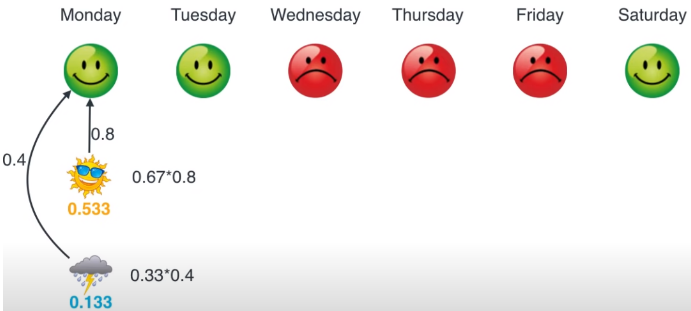

2. 到了星期二, 有两种情况晴天和雨天

    1. 先看星期二的 晴天，可从星期一的 晴天 和 雨天 而来（用输出概率和转换概率）：

        1. P(高兴|晴天-晴天) = 0.533 x 0.8 x 0.8 = 0.341
        2. P(高兴|雨天-晴天) = 0.133 x 0.4 x 0.8 = 0.043

        因为 0.341> 0.043，发现 晴天-晴天 比 雨天-晴天 导致心情 高兴 的可能性更大。

        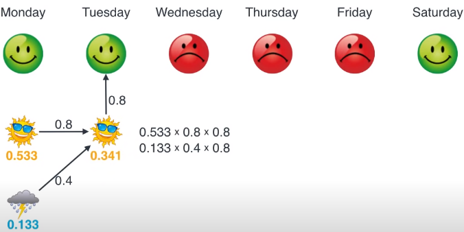

    2. 看星期二的 R，可从星期一的 S 和 R 而来（用输出概率和转换概率）：

        1. P(高兴|晴天-雨天) = 0.533*0.2*0.4 = 0.043
        1. P(高兴|雨天-雨天) = 0.133*0.6*0.4 = 0.032

        因为 0.043 > 0.032，发现 晴天-雨天 比 雨天-雨天 导致心情 高兴 的可能性更大。

        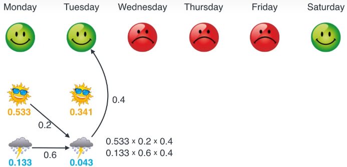

4. 接着从星期三到星期六，一直可按照上述算法，得到截止到某一天是 晴天 或 雨天 而导致当天心情是 高兴 或 烦躁 的最大概率值。具体过程如下面动图所示。

    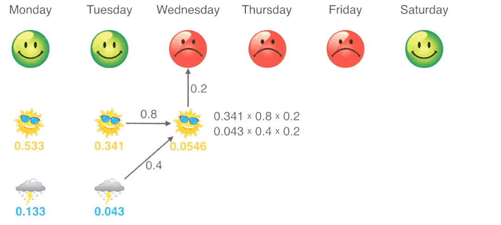

    1. P(H|星期一 = S) = 0.533
    2. P(H|星期一 = R) = 0.133
    3. max( P(HH|星期二 = S) )= 0.341
    4. max( P(HH|星期二 = R) ) = 0.043
    5. max( P(HHG|星期三 = S) )= 0.0546
    6.  max( P(HHG|星期三 = R) ) = 0.041
    7.  max( P(HHGG|星期四 = S) ) = 0.0087
    8.  max( P(HHGG|星期四 = R) ) = 0.0147
    9. max( P(HHGGG|星期五 = S) ) = 0.0014
    10. max( P(HHGGG|星期五 = R) ) = 0.0053
    11. max( P(HHGGGH|星期六 = S) )= 0.0017
    12. max( P(HHGGGH|星期六 = R) ) = 0.0013

5. 沿着日期，找出每个日期下的最大值连成一条线，就是要找到的天气链，晴天-晴天-晴天-雨天-雨天-晴天。

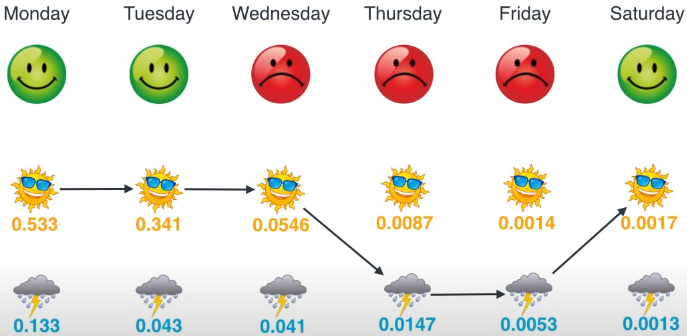

## 参考
- [超级简单的HMM算法详解](https://zhuanlan.zhihu.com/p/497045631)
- [一文读懂NLP之隐马尔科夫模型（HMM）详解加python实现](https://blog.csdn.net/Elenstone/article/details/104902120)
- [机器学习｜隐马尔可夫模型-中文分词实现](https://zhuanlan.zhihu.com/p/116011442)

