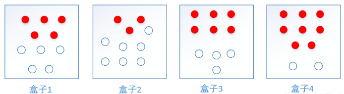

隐马尔科夫模型（Hidden Markov Model，HMM）, 是结构最简单的动态贝叶斯网（dynamic Bayesian network，也被称作有向图模型），HMM是可以用于标注问题的统计数学模型，描述由隐藏的马尔科夫链随机生成观测序列的过程，属于生成模型。

## HMM解决的问题

1. 问题是基于序列的，比如时间序列、状态序列。
2. 问题中有两类数据
    1. 一类是可以观测到的，即观测序列
    2. 一类是不能观察到的，即状态序列(隐藏序列)

如果问题有了这两个特征，那么这个问题一般可以使用HMM模型尝试解决，例如，说一句话，发出的声音是观测序列，想表达的意思是隐藏状态序列；写文章的过程可以想象为先在脑海中构思好一个满足语法的词性序列，然后再将每个词性填充为具体的词语。

隐藏的马尔科夫链随机生成的状态的序列，称为状态序列（state sequence），记作$y$；每个状态生成一个观测，而由此产生的观测的随机序列，称为观测序列（observation sequence），记作$x$。序列的每一个位置又可以看作一个时刻。

假设有四个盒子，每个盒子里都装有红白两种颜色的球，如下表：

|盒子|1|2|3|4|
|----|----|----|----|----|
|红球数|5|3|6|8|
|白球数|5|7|4|2|

按照下面的方法抽球，产生一个球的颜色观察序列：

1. 从4个盒子里以等概率随机选取一个盒子，从这个盒子里随机抽取一个球，记录颜色后，放回；
2. 从当前盒子随机转移到下一个盒子，规则是：如果当前盒子是盒子1，那么下一个盒子一定是盒子2，如果当前是盒子2或者3，那么分别以概率0.4和0.6转移到左边或右边的盒子，如果当前盒子是4，那么各以0.5的概率停留在盒子4或者转移到盒子3；
3. 确定转移盒子后，再从这个盒子里随机抽取一个球，记录其颜色，放回；
4. 重复2,3步骤3次

一共抽取出来5个球，得到一个球的颜色观察序列：红, 红, 白, 白, 红

在这个过程中，观察者只能观测到球的颜色序列，观测不到球是从哪个盒子取出的，即观察不到盒子的序列。
这个例子中有两个随机序列，一个是盒子的序列（状态序列），一个是球的颜色的观测序列（观测序列），前者是隐藏的，后者是可以观测的。

## HMM的两个假设

每个事件的发生概率只取决于前一个事件。将满足该假设的连续多个事件串联在一起，就构成了马尔科夫链。在NLP语境下，可以将事件具象为单词，于是马尔科夫模型就是二元语法。

第一个假设：将马尔科夫假设作用于状态序列，假设当前状态$y_t$仅仅依赖于前一个状态$y_{t-1}$
，连续多个状态构成隐马尔科夫链$y$。数学表达式为：

$p(y_t|y_{t - 1}, X_{t - 1}, y_{t - 2}, X_{t - 2}, y_{t - 3}, X_{t - 3},\ldots,y_1,x_1)=p(y_t|y_{t - 1}), t = 1,2,3,\ldots,T$。

有了隐马尔科夫链，如何建立与观测序列$x$的联系呢？HMM做了第二个假设:

第二个假设：任意时刻的观测$x_t$只依赖于该时刻的状态$y_t$，与其他时刻的状态或观测独立无关。数学表达式为：

$p(x_t|y_T,x_T,y_{t - 1},X_{t - 1},\ldots,y_{t + 1},X_{t + 1},y_t,y_{t - 1},X_{t - 1},\ldots,y_1,x_1)=p(x_t|y_t),t = 1,2,3,\ldots,T$。

## HMM模型

### 状态集合
设$Q$是所有可能的状态的集合

$$Q=\{q_1,q_2,\ldots,q_N\}, 其中, N是可能的状态数$$

上述盒子的案例中, 状态集合是

$$\boldsymbol{Q}=\{盒子1，盒子2，盒子3，盒子4\}，N=4$$

### 观测集合
$V$是所有可能的观测集合

$$V=\{v_1,v_2,v_3,\ldots,v_M\}, 其中, M是可能的观测数$$

上述盒子的案例中, 观测集合是

$$V=\{\color{red}红，\color{black}白\}$$

## 初始状态概率向量
初始概率向量指的是系统启动时进入的第一个状态$y_1$成为初始状态，$y$有$N$种取值，从$\boldsymbol{Q}$集合中选取一个，即$y \in \{q_1,q_2,...,q_N\}$。由于$y_1$是第一个状态，是一个独立的离散随机变量，可以用$p(y_1|\boldsymbol{\pi})$来描述，$y_1$只由$\pi$来控制，其中$\boldsymbol{\pi}=(\pi_1,\pi_2,\pi_3,...,\pi_N)^T,0\leq\pi_i\leq1,\sum\limits^{N}_{i=1}{\pi_i}$.

在盒子的案例中:

初始状态概率向量为$\boldsymbol{\pi}=(0.25,0.25,0.25,0.25)^T$，原因是第一次是等概率随机抽取一个盒子。

## 状态转移概率矩阵

$y_1$确定之后，如何转移状态到$y_2$?乃至$y_n$？

根据HMM模型的第一个假设：$t+1$时刻的状态仅仅取决于$t$时刻的状态。类似发射概率矩阵，对于$t$时刻的每一种状态，$y_{t+1}$是一个离散的随机变量，取值有$N$种。$t$时刻一共可能有$N$种状态，所以从$t$时刻到$t+1$时刻的状态转移矩阵为$N\times N$的方阵，称为状态转移概率矩阵$\boldsymbol{A}$:

$\boldsymbol{A}=[a_{ij}]_{N\times N}=[p(y_{t+1}=v_j|y_t=v_i)]_{N\times N}$
​

其中 ，$p(y_{t+1}=s_j|y_t=s_i)$, 表示$t$时刻的状态为$v_i$，$t+1$时刻的状态为$v_j$的概率。

|当前状态|下一状态是状态 1|状态 2|状态 N|
|----|----|----|----|
|状态 1||||
|状态 2||||
|状态 N||||

初始状态概率向量、状态转移概率矩阵与发射概率矩阵称为HMM模型的三元组$\lambda=(\boldsymbol{\pi},A,B)$，只要三元组确定了，HMM模型就确定了。

在盒子的案例中:
$$
\boldsymbol{A}=
\begin{bmatrix}
 0 & 1 & 0 & 0\\
 0.4 & 0 & 0.6 & 0\\
 0 & 0.4 & 0 & 0.6\\
 0 & 0 & 0.5 & 0.5
\end{bmatrix}
$$

## 发射概率矩阵

$y_1$确定之后，怎么产生$x_1$呢？如何确定$x_1$的概率分布呢？

根据第二个假设：当前观测值$x_1$仅取决于当前的状态$y_1$，对于从$\boldsymbol{Q}$中取出的每一种状态$y_1$，$x_1$都可以从$\boldsymbol{V}$集合中的$M$个值选一个，所以对于每一个$y$, $x$都是一个独立的离散随机变量，其概率参数对应一个向量，维度为$M$，即$\boldsymbol{x} \in \{v_1,v_2,...,v_N\}$。由于一共有$N$种$y$，所以这些向量构成了一个$N\times M$矩阵，称为发射概率矩阵$\boldsymbol{B}$。

$\boldsymbol{B}=[b_{ij}]_{N\times M}=[p(x_t=v_i|y_t=q_j)]_{N\times M}$

其中，$p(x_t=v_i|y_t=q_j)$代表t时刻，隐藏状态$y_t$是$q_j$ ，由这个状态产生的观测值$x_t$等于$v_i$ 的概率。

|状态|观测值 1|观测值 2|观测值 M|
|----|----|----|----|
|状态 1||||
|状态 2||||
|状态 N||||

在盒子的案例中: 
$$
\boldsymbol{B} = 
\begin{bmatrix}
 0.5 & 0.5\\
 0.3 & 0.3\\
 0.6 & 0.4\\
 0.8 & 0.2
\end{bmatrix}
$$

## 状态序列和观测序列的长度

状态序列和观测序列的长度$T=5$，原因是一共观测了5次。

### HMM的整体表示

HMM 模型用三元组来表示$\lambda=(\boldsymbol{\pi,A,B})$：

## HMM模型的三个基本问题
HMM模型一个可以解决三个问题：

1. 概率计算问题：给定模型参数$\lambda=(\boldsymbol{\pi},A,B)$，和一个观测序列$\boldsymbol{x}$,，计算在这个模型参数$\lambda$下，观测序列出现的最大概率，即$p(\boldsymbol{x}|\lambda)$的最大值。
2. 模型训练问题：给定训练集$(\boldsymbol{x}^{(i)},\boldsymbol{y}^{(i)})$，估计模型参数$\lambda=(\boldsymbol{\pi},A,B)$，使得在该模型下观测序列概率$p(\boldsymbol{x}|\lambda)$最大，即使用极大似然估计得方法估计参数。
3. 序列预测问题：已知模型参数$\lambda=(\boldsymbol{\pi},A,B)$，给定观测序列$\boldsymbol{x}$，求最有可能的状态序列$\boldsymbol{y}$，即求$p(\boldsymbol{y}|\boldsymbol{x})$的最大值。

## 参考

- [一文读懂NLP之隐马尔科夫模型（HMM）详解加python实现](https://blog.csdn.net/Elenstone/article/details/104902120)