# seq2seq


seq2seq模型也称为Encoder-Decoder模型, 既该模型包含了Encoder(编码器)和Decoder(解码器).

考虑将日语翻译成英语, 如下图:
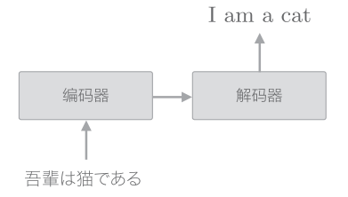
首先对"吾輩は猫である"这句话进行编码, 然后将编码好的信息传递给解码器, 由解码器生成目标文本.
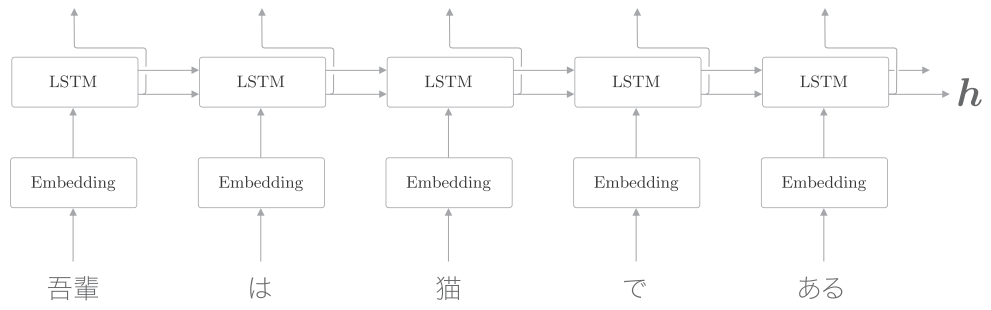
编码器利用LSTM将时序数据转换为隐状态$h$.隐状态$h$是LSTM层的最后一个隐状态, 其中编码了翻译输入文本所需的信息.隐状态$h$是一个固定长度的向量.
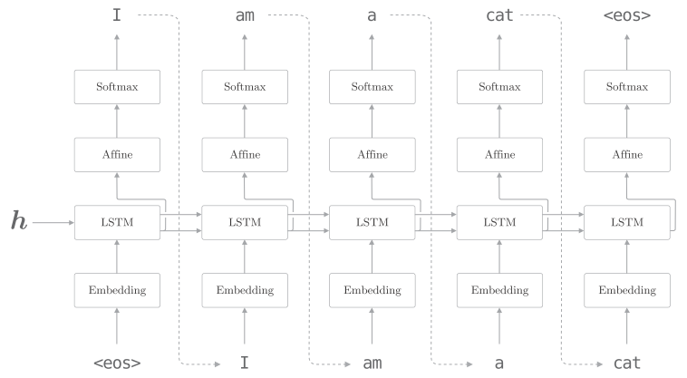
解码器的结构和前面的神经网络相同, 不过也有稍许的差异, 就是LSTM会接收向量$h$. 在前面的神经网络中, LSTM层不接收任何信息(接收初始化为0的向量).

`<eos>`在编码器中是生成文本的信号, 在解码器中是结束的信号. 在其他文献中也有使用`<go>`,`<start>`或者`_`作为分隔符的例子.
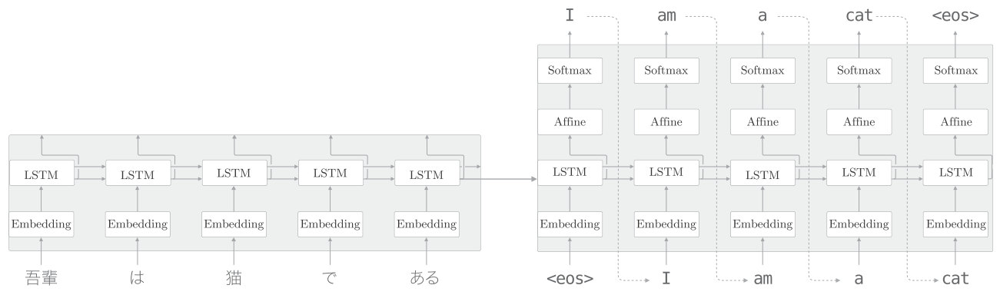
上图是seq2seq完整的结构, 由两个LSTM层构成. LSTM层的隐状态是编码器和解码器的"桥梁".


## 应用
将"加法"视为一个时序转换的问题, 具体来说, 在seq2seq学习后, 在输入"57+5"字符串后, 能正确回答"62".

之前的word2vec中, 我们把文本以单词为单位进行分割. 而本节, 我们将不以单词为单位, 而是以字符为单位进行分割, 例如"57+5"会被处理为`['5','7','+','5']`.

注意不同的加法问题("57+5"或"628+521")及其回答("62"或者"1149")的字符数是不相同的. 在使用批数据进行学习时, 需要保证一个批次内各个样本的数形状是一致的. 在处理可变长数据时, 最简单的方法是使用padding.
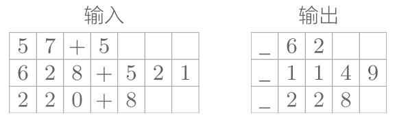
本次将处理的问题限制在0~999的两个数的加法. 因此, 包括"+"在内, 输入的最大字符数是7. 另外, 加法的结果最大的是4个字符(最大为"999+999=1998").

在输出的开始处加上了分隔符"_", 使得输出数据的字符统一为5. 这个分隔符作为通知解码器开始生成文本的信号使用. 对于解码器的输出, 可在监督标签中插入表示字符输出结束的分隔符("_63_").

通过填充对齐数据的大小,可以处理可变长度的时序数据. 但是, 因为使用了填充, seq2seq需要处理原本不存在的填充用字符, 所以如果追求严谨, 使用填充时需要向seq2seq添加一些填充专用的处理, 比如: 在解码器中输入填充时, 不应计算其损失(向Softmax with loss添加mask功能来解决). 再比如: 在编码器中输入填充时, LSTM层应按原样输出上一时刻的输入.

## seq2seq的实现

### Encoder类
Encoder类接收字符串, 将其转换为向量$h$.

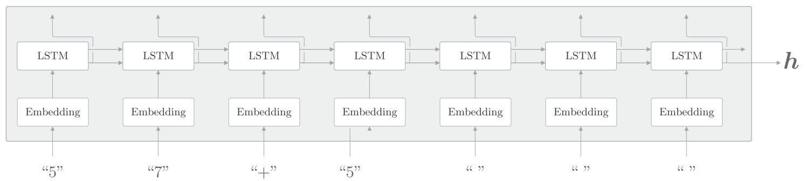

Encoder类由Embedding层和LSTM层组成. Embedding层将字符ID转化为字符向量, 然后将字符向量输入LSTM层.

LSTM层向右输出隐藏状态和记忆单元, 向上输出隐状态. 这里因为上方不存在层, 所以丢弃LSTM层向上的输出. 在编码器处理完最后一个字符后, 输出LSTM层的隐状态$h$. 然后, 这个隐藏状态$h$被传递给解码器.

编码器只将LSTM的隐状态传递给解码器. 尽管也可以把LSTM的记忆单元传递给解码器, 但我们通常不太会把LSTM的记忆单元传递给其他层. 这是因为, LSTM的记忆单元被设计为只给自身使用.

python实现:
```python
class Encoder:
    def __init__(self, vocab_size, wordvec_size, hidden_size):
        V, D, H = vocab_size, wordvec_size, hidden_size
        rn = np.random.randn
        embed_W = (rn(V, D) / 100).astype('f')
        lstm_Wx = (rn(D, 4 * H) / np.sqrt(D)).astype('f')
        lstm_Wh = (rn(H, 4 * H) / np.sqrt(H)).astype('f')
        lstm_b = np.zeros(4 * H).astype('f')
        self.embed = TimeEmbedding(embed_W)
        self.lstm = TimeLSTM(lstm_Wx, lstm_Wh, lstm_b, stateful=False)
        self.params = self.embed.params + self.lstm.params
        self.grads = self.embed.grads + self.lstm.grads
        self.hs = None
```
初始化方法接收vocab_size, wordvec_size, hidden_size这3个参数.vocab_size是词汇量, 字符的种类. 这里总共有13种字符(数字0~9,"+"," ","_"). wordvec_size对应字符向量的维数, hidden_size对应于LSTM层的隐状态的维数.

这个初始化方法进行权重参数的初始化和层的生成. 最后, 将权重参数和梯度分别归纳在成员变量params和grads的列表中. 因为这次并不保持Time LSTM层的状态, 所以设定stateful=False.

在之前的语言模型处理的是只有一个长时序数据的问题. 那时我们设定Time LSTM层的参数stateful=True, 以在保持隐状态的同时, 处理长时序数据. 而这次是由多个短时序数据的问题. 因此, 针对每个问题重设LSTM的隐状态(0向量).

```python
def forward(self, xs):
    xs = self.embed.forward(xs)
    hs = self.lstm.forward(xs)
    self.hs = hs
    return hs[:, -1, :]
def backward(self, dh):
    dhs = np.zeros_like(self.hs)
    dhs[:, -1, :] = dh
    dout = self.lstm.backward(dhs)
    dout = self.embed.backward(dout)
    return dout
```

编码器的正向传播调佣Time Embedding层和Time LSTM层的`forward()`方法, 然后取出Time LSTM层的最后一个时刻的隐状态, 将它作为编码器的`forward()`方法的输出.

在编码器的反向传播中, LSTM层的最后一个隐状态的梯度是`dh`, 这个`dh`是从解码器传来的梯度. 在反向传播的实现中, 先生成元素为0的张量`dhs`, 再将`dh`存放放到这个`dhs`中的对应位置. 剩下的就是调用Time Embedding层和TIme LSTM层的`backward()`方法.

## Decoder类
Decoder类接收Encoder类输出的$h$, 输出目标字符串.
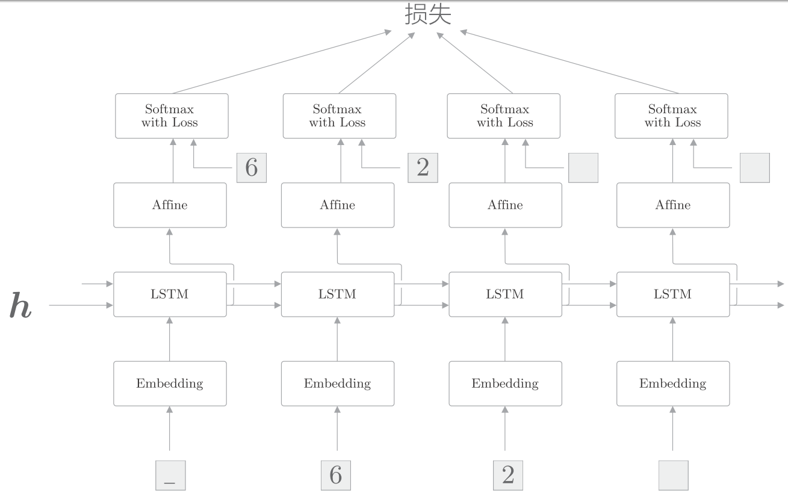
这里使用了监督数据"_62"进行学习, 输入的数据是`['_','6','2',' ']`, 对应的输出是`['6','2',' ',' ']`.

在使用RNN进行文本生成时, 学习时和生成时的数据输入方法不同. 
- 在学习时, 因为已经知道正确解, 所以可以整体地输入时序方向上的数据. 
- 相对地, 在推理时(生成新字符串时), 则只能输入第1个通知开始的分隔符(本次为"_").然后, 输出1个字符, 并将这个字符作为下一个输入, 如此重复该过程.

另外, 因为和生成文本不同, 我们需要确定性的文字, 所以使用argmax, 另外没有使用Softmax层, 而是从Affine层中选择最大的作为最终结果, 如下图:
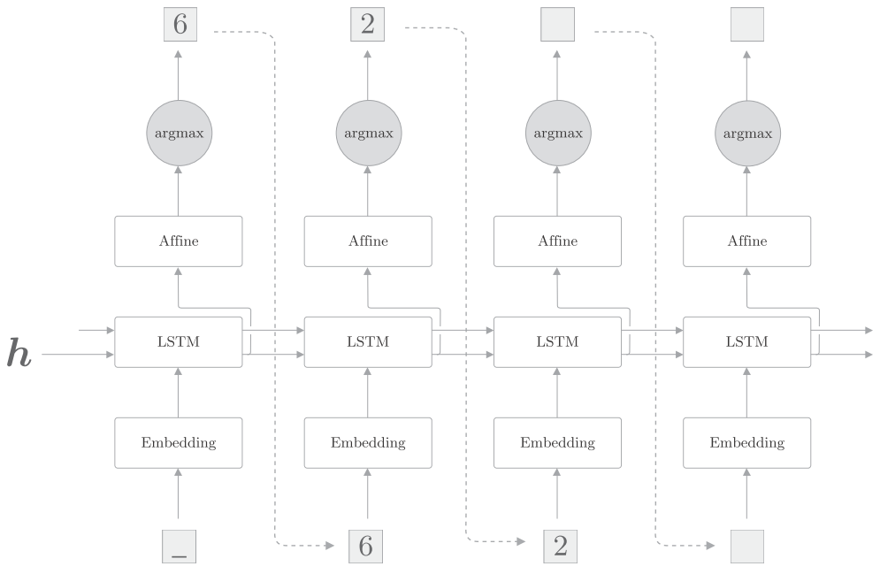

在解码器中, 学习和生成时处理Softmax层的方式是不一样的. 因此, Softmax with loss层交给伺候实现的seq2seq类处理, Decoder类仅承担Time Softmax with loss层之前的部分.
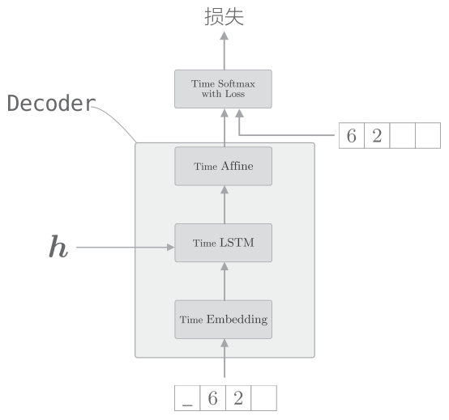
python实现:
```python
class Decoder:
    def __init__(self, vocab_size, wordvec_size, hidden_size):
        V, D, H = vocab_size, wordvec_size, hidden_size
        rn = np.random.randn
        embed_W = (rn(V, D) / 100).astype('f')
        lstm_Wx = (rn(D, 4 * H) / np.sqrt(D)).astype('f')
        lstm_Wh = (rn(H, 4 * H) / np.sqrt(H)).astype('f')
        lstm_b = np.zeros(4 * H).astype('f')
        affine_W = (rn(H, V) / np.sqrt(H)).astype('f')
        affine_b = np.zeros(V).astype('f')
        self.embed = TimeEmbedding(embed_W)
        self.lstm = TimeLSTM(lstm_Wx, lstm_Wh, lstm_b, stateful=True)
        self.affine = TimeAffine(affine_W, affine_b)
        self.params, self.grads = [], []
        for layer in (self.embed, self.lstm, self.affine):
            self.params += layer.params
            self.grads += layer.grads
    def forward(self, xs, h):
        self.lstm.set_state(h)
        out = self.embed.forward(xs)
        out = self.lstm.forward(out)
        score = self.affine.forward(out)
        return score
    def backward(self, dscore):
        dout = self.affine.backward(dscore)
        dout = self.lstm.backward(dout)
        dout = self.embed.backward(dout)
        dh = self.lstm.dh
        return dh
```

Decoder类在学习时和在生成文本时的行为不同. 上面的`forward()`方法是假定在学习时使用的.将生成文本的方法实现为`generate()`

```python
def generate(self, h, start_id, sample_size):
    sampled = []
    sample_id = start_id
    self.lstm.set_state(h)
    for _ in range(sample_size):
        x = np.array(sample_id).reshape((1, 1))
        out = self.embed.forward(x)
        out = self.lstm.forward(out)
        score = self.affine.forward(out)
        sample_id = np.argmax(score.flatten())
        sampled.append(int(sample_id))
    return sampled
```
`generate()`方法有三个参数:
- 隐状态h
- 最开始输入的字符串ID start_id
- 生成的字符数量sample_size
这里重复如下操作: 输入一个字符, 选择Affine层输出的得分中最大值的字符ID.

这次问题中, 需要将编码器的输出$h$设定给解码器的Time LSTM.此时, 通过设置TIme LSTM层为stateful, 可以不重设隐藏状态, 在保持编码器的$h$同时, 进行正向传播.

python实现完整的seq2seq:
```python
class Seq2seq(BaseModel):
    def __init__(self, vocab_size, wordvec_size, hidden_size):
        V, D, H = vocab_size, wordvec_size, hidden_size
        self.encoder = Encoder(V, D, H)
        self.decoder = Decoder(V, D, H)
        self.softmax = TimeSoftmaxWithLoss()
        self.params = self.encoder.params + self.decoder.params
        self.grads = self.encoder.grads + self.decoder.grads
    def forward(self, xs, ts):
        decoder_xs, decoder_ts = ts[:, :-1], ts[:, 1:]
        h = self.encoder.forward(xs)
        score = self.decoder.forward(decoder_xs, h)
        loss = self.softmax.forward(score, decoder_ts)
        return loss
    def backward(self, dout=1):
        dout = self.softmax.backward(dout)
        dh = self.decoder.backward(dout)
        dout = self.encoder.backward(dh)
        return dout
    def generate(self, xs, start_id, sample_size):
        h = self.encoder.forward(xs)
        sampled = self.decoder.generate(h, start_id, sample_size)
        return sampled
```


## 反转输入数据(Reverse)
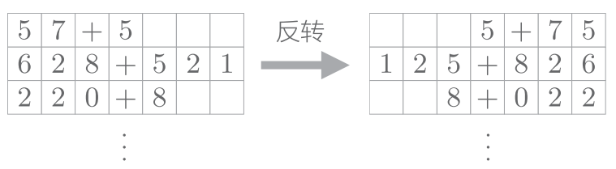
注意这里是直接反转, 而不是将之前的数据和反转的数据同时作为输入.

为什么反转数据后, 学习进展快, 精度提高了呢?直观上的解释是:

吾輩 は 猫 で ある  到 I am a cat 这个问题中:

"吾輩"和"单词I"之间有转换关系, 此时从"吾輩"到"I"的路程必须经过"は""猫""で""ある"这4个单词的LSTM层. 因此在反向传播时, 梯度从"I"抵达"吾輩", 也要受到这个距离的影响.

反转输入语句, 也就是变成"ある で 猫 は  吾輩", 此时"吾輩"和"单词I"彼此相邻, 梯度可以直接传递, 传播变得更容易. 不过, 单词之间的"平均"距离并不会发生改变.

## 偷窥(Peeky)
当前的seq2seq只有最开始时刻的LSTM层利用了$h$

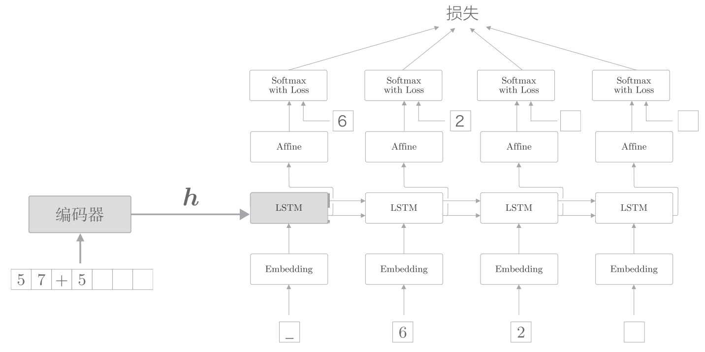

通过偷窥(Peeky)改进后, 将$h$分配给解码器的其它层.

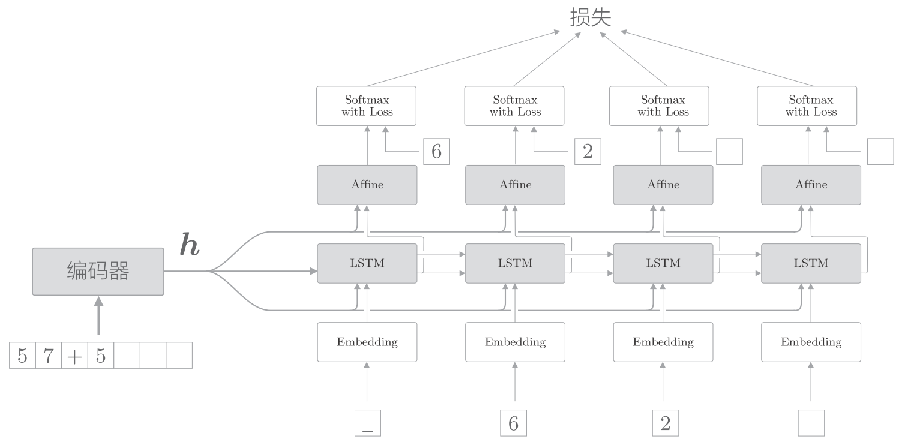

如上图, 编码器的$h$分配给所有时刻的Affine层和LSTM层. 即是其他层也能"偷窥"到编码信息, 这个改进的解码器称为Peeky Decoder. 称使用了Peeky Decoder的seq2seq为 Peeky seq2seq。

有两个向量同时被输入到了LSTM层和Affine层, 这实际上表示两个向量的拼贴(concatenate), 如下图:

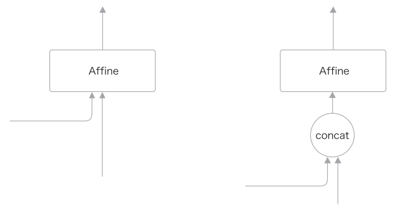

python实现如下:
```python
class PeekyDecoder:
    def __init__(self, vocab_size, wordvec_size, hidden_size):
        V, D, H = vocab_size, wordvec_size, hidden_size
        rn = np.random.randn
        embed_W = (rn(V, D) / 100).astype('f')
        lstm_Wx = (rn( H + D , 4 * H) / np.sqrt(H + D)).astype('f')
        lstm_Wh = (rn(H, 4 * H) / np.sqrt(H)).astype('f')
        lstm_b = np.zeros(4 * H).astype('f')
        affine_W = (rn( H + H , V) / np.sqrt(H + H)).astype('f')
        affine_b = np.zeros(V).astype('f')
        self.embed = TimeEmbedding(embed_W)
        self.lstm = TimeLSTM(lstm_Wx, lstm_Wh, lstm_b, stateful=True)
        self.affine = TimeAffine(affine_W, affine_b)
        self.params, self.grads = [], []
        for layer in (self.embed, self.lstm, self.affine):
            self.params += layer.params
            self.grads += layer.grads
        self.cache = None
    def forward(self, xs, h):
        N, T = xs.shape
        N, H = h.shape
        self.lstm.set_state(h)
        out = self.embed.forward(xs)
        hs = np.repeat(h, T, axis=0).reshape(N, T, H)
        out = np.concatenate((hs, out), axis=2)
        out = self.lstm.forward(out)
        out = np.concatenate((hs, out), axis=2)
        score = self.affine.forward(out)
        self.cache = H
        return score
```


## seq2seq的应用
- 机器翻译：将“一种语言的文本”转换为“另一种语言的文本”
- 自动摘要：将“一个长文本”转换为“短摘要”
- 问答系统：将“问题”转换为“答案”
- 邮件自动回复：将“接收到的邮件文本”转换为“回复文本”
