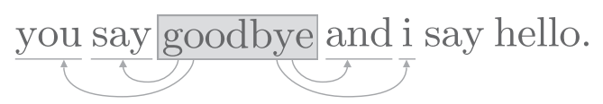
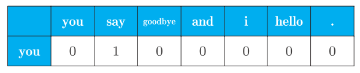
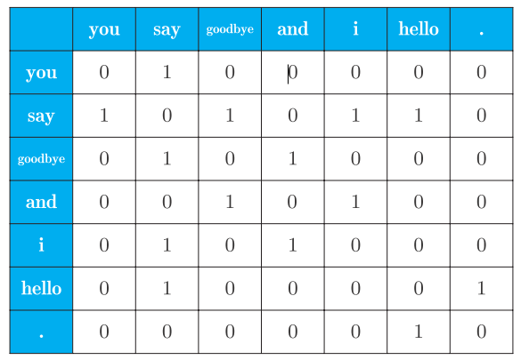
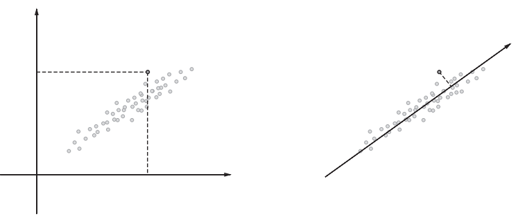
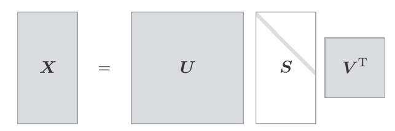
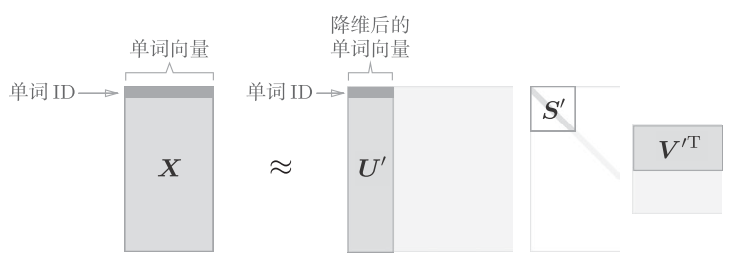

# statistic


比较有名的语料库是Wikipedia和Google News, 另外是莎士比亚和夏目簌石等伟大作家的作品.
文本预处理是指分词, 单词ID转换.

- 分词
```python
text = 'You say goodbye and I say hello.'
text = text.lower()
text = text.replace('.', ' .')
text  # 'you say goodbye and i say hello .'
words = text.split(' ')
words  # ['you', 'say', 'goodbye', 'and', 'i', 'say', 'hello', '.']
```
这把'.'也当成了一个单词来看待.

- 单词ID转换
```python
word_to_id = {}
id_to_word = {}

for word in words:
    if word not in word_to_id:
        new_id = len(word_to_id)
        word_to_id[word] = new_id
        id_to_word[new_id] = word
id_to_word  # {0: 'you', 1: 'say', 2: 'goodbye', 3: 'and', 4: 'i', 5: 'hello', 6:'.'}
word_to_id  # {'you': 0, 'say': 1, 'goodbye': 2, 'and': 3, 'i': 4, 'hello': 5, '.': 6}
```
`id_to_word`负责将单词ID转为为单词, `word_to_id`负责将单词转化为Id

- 将单词列表转换为id
```python
import numpy as np
corpus = [word_to_id[w] for w in words]
corpus = np.array(corpus)
corpus  # array([0, 1, 2, 3, 4, 1, 5, 6])
```

可以将上述的过程, 封装成函数:
```python
def preprocess(text):
    text = text.lower()
    text = text.replace('.', ' .')
    words = text.split(' ')
    word_to_id = {}
    id_to_word = {}
    for word in words:
        if word not in word_to_id:
            new_id = len(word_to_id)
            word_to_id[word] = new_id
            id_to_word[new_id] = word
    corpus = np.array([word_to_id[w] for w in words])
    return corpus, word_to_id, id_to_word

text = 'You say goodbye and I say hello.'
corpus, word_to_id, id_to_word = preprocess(text)
```

## 单词的分布式表示
单词本身没有含义, 单词含义由它所在的上下文形成. 比如"I drink beer", "we drink wine", "drink"附近经常有饮料出现. 另外从"I guzzle beer", "We guzzle wine"可知, "guzzle"和"drink"所在的语境相似, 它俩可能是近义词.
单词的"上下文"是指某个单词周围的单词. 将上下文的大小, 称为窗口大小.窗口大小为1, 则上下文左右各1个单词; 窗口大小为2, 上下文包含左右各2个单词.



## 共现矩阵
基于分布式假设使用向量表示单词, 最简单的方法就是对单词的数量进行计数, 也就是说对其周围出现了多少次什么单词进行计数. 称这种方法是"基于计数的方法"或者"基于统计的方法".

```python
import sys
sys.path.append('..')
import numpy as np
from common.util import preprocess
text = 'You say goodbye and I say hello.'
corpus, word_to_id, id_to_word = preprocess(text)
print(corpus)
## [0 1 2 3 4 1 5 6]
print(id_to_word)
## {0: 'you', 1: 'say', 2: 'goodbye', 3: 'and', 4: 'i', 5: 'hello', 6:'.'}
```
词汇总共有7个, 我们要计算每个单词的上下文所包含的单词的频数. 将窗口大小设为1, 从ID为0的you开始, 单词you的上下文仅有say这个单词:

上图是单词you的上下文共现的单词的频数, 同时也意味着可以用`[0, 1, 0, 0, 0, 0, 0]`来表示单词you.
同样的道理, 计算其他的单词, 我们可以得到:

上图是汇总了所有单词的共线单词表格, 这个表格的各行对应单词的向量, 称为共现矩阵(co-occurence matrix).
python实现共线矩阵:
```python
def create_co_matrix(corpus, vocab_size, window_size=1):
    corpus_size = len(corpus)
    co_matrix = np.zeros((vocab_size, vocab_size), dtype=np.int32)
    for idx, word_id in enumerate(corpus):
        for i in range(1, window_size + 1):
            left_idx = idx - i
            right_idx = idx + i
            if left_idx >= 0:
                left_word_id = corpus[left_idx]
                co_matrix[word_id, left_word_id] += 1
            if right_idx < corpus_size:
                right_word_id = corpus[right_idx]
                co_matrix[word_id, right_word_id] += 1
    return co_matrix
```

## 向量间相似度
测量单词的向量相似度一般使用余弦相似度(cosine similarity):
$similaarity(x,y)=\frac{x\cdot y}{||x||||y||}=\frac{x_1y_1+...+x_ny_n}{\sqrt{x_1^2+...+x_n^2}\sqrt{y_1^2+...+y_n^2}}$
余弦相似度直观地表示了"两个向量在多大程度上指向同一方向".两个向量完全指向相同的方向时, 余弦相似度为1;完全指向相反的方向时, 余弦相似度为-1.
python实现:
```python
def cos_similarity(x, y):
    nx = x / np.sqrt(np.sum(x**2)) # x的正规化
    ny = y / np.sqrt(np.sum(y**2)) # y的正规化
    return np.dot(nx, ny)
```
如果当零向量被当做参数时, 会出现"除数为0"的情况, 解决此类问题的一个常用的方法是, 加上一个微小的值.通过参数设置一个微小的值eps(epsilon),并默认为eps=1e-8:
```python
def cos_similarity(x, y, eps=1e-8):
    nx = x / (np.sqrt(np.sum(x ** 2)) + eps)
    ny = y / (np.sqrt(np.sum(y ** 2)) + eps)
    return np.dot(nx, ny)
```
使用余弦相似度,求you和i的相似度:
```python
import sys
sys.path.append('..')
from common.util import preprocess, create_co_matrix, cos_similarity
text = 'You say goodbye and I say hello.'
corpus, word_to_id, id_to_word = preprocess(text)
vocab_size = len(word_to_id)
C = create_co_matrix(corpus, vocab_size)
c0 = C[word_to_id['you']]  # you的单词向量
c1 = C[word_to_id['i']]    # i的单词向量
print(cos_similarity(c0, c1))  # # 0.7071067691154799
```
说明you和I有一定的相似度.


## 单词相似度排序
当某个单词被作为查询单词时, 将这个查询词相似的单词按降序显示出来.
```python
def most_similar(query, word_to_id, id_to_word, word_matrix, top=5):
    # ❶ 取出查询词
    if query not in word_to_id:
        print('%s is not found' % query)
        return
    print('\n[query] ' + query)
    query_id = word_to_id[query]
    query_vec = word_matrix[query_id]
    # ❷ 计算余弦相似度
    vocab_size = len(id_to_word)
    similarity = np.zeros(vocab_size)
    for i in range(vocab_size):
        similarity[i] = cos_similarity(word_matrix[i], query_vec)
    # ❸ 基于余弦相似度，按降序输出值
    count = 0
    for i in (-1 * similarity).argsort():
        if id_to_word[i] == query:
            continue
        print(' %s: %s' % (id_to_word[i], similarity[i]))
        count += 1
        if count >= top:
            return
```
参数描述:
参数|说明
--|--
query|查询单词
word_to_id|单词到ID的字典
id_to_word|ID到单词的字典
word_matrix|共现矩阵
top|前几位相似的单词


## 点互信息(Pointwise Mutual Information, PMI)
语料库中the和car的共现情况. 将会出现很多"the car"的短语. 他们的共现次数将会很大.car和drive也明显有很强的相关性, 但是只看单词得的出现次数, 那么和drive相比, the和car的相关性更强. 这意味着, 仅仅the是个常用词, 就被认为与car有很强的相关性.
使用点互信息解决这个问题:
$PMI(x,y)=log_2\frac{P(x,y)}{P(x)P(y)}$
其中$P(x)$表示x发生的概率,$P(y)$表示y发生的概率,$P(x,y)$表示x和y同时发生的概率. PMI的值越高, 表明相关性越强.

在自然语言的例子中, $P(x)$就是指单词x在语料库中出现的概率.假设某个语料库中有10000个单词, 单词the出现了100次, 则$P("the")=100/10000=0.01$. 另外,$P(x,y)$标识号单词x和y同时出现的概率. 假设the和car一起一种出现了10次,则$P("the","car")=10/10000=0.001$

将共现矩阵表示为$C$, 将单词x和y的共现次数表示为$C(x,y)$, 将单词x和y的出现次数分别表示为$C(x),C(y)$, 将语料库的单词数量记为N, 则:
$PMI(x,y)=log_2\frac{P(x,y)}{P(x)P(y)=log2\frac{\frac{C(x,y)}{N}}{\frac{C(x)\cdot C(y)}{N\cdot N}}=\frac{C(x,y)\cdot N}{C(x)C(y)}$

假设语料库的单词数量(N)为10000,the出现100次, car出现20次, drive出现10次, the和car共现10次, car和drive共现5次. 从共现次数来看, 与drive相比, the和car的相关性更强. 而从PMI角度来看:
$PMI("the","car")=log_2\frac{10\cdot 10000}{1000\cdot 20}\approx 2.32$
$PMI("car","drive")=log_2\frac{5\cdot 10000}{20\cdot 10}\approx 7.97$
PMI结果是drive和car有更强的相关性.
PMI也有一个问题, 当两个单词的共现次数为0时,$log_20=-\infty$, 为了解决这个问题,使用正的点互信息(Positive PMI,PPMI):
$PPMI(x,y)=max(0,PMI(x,y))$
python实现:
```python
def ppmi(C, verbose=False, eps=1e-8):
    M = np.zeros_like(C, dtype=np.float32)
    N = np.sum(C)
    S = np.sum(C, axis=0)
    total = C.shape[0] * C.shape[1]
    cnt = 0
    for i in range(C.shape[0]):
        for j in range(C.shape[1]):
            pmi = np.log2(C[i, j] * N / (S[j]*S[i]) + eps)
            M[i, j] = max(0, pmi)
            if verbose:
                cnt += 1
                if cnt % (total//100+1) == 0:
                    print('%.1f%% done' % (100*cnt/total))
    return M
```
可以将共现矩阵转换为PPMI矩阵.
```python
import sys
sys.path.append('..')
import numpy as np
from common.util import preprocess, create_co_matrix, cos_similarity,
   ppmi
text = 'You say goodbye and I say hello.'
corpus, word_to_id, id_to_word = preprocess(text)
vocab_size = len(word_to_id)
C = create_co_matrix(corpus, vocab_size)
W = ppmi(C)
```


## 降维
降维(dimensionality reduction), 就是减少向量的维度. 并不是简单地减少, 而是在尽量保留"重要信息"的基础上减少.

考虑到数据的广度, 导入一根新轴, 将原来的二维坐标的点表示在一个坐标轴上. 选择新轴时, 要考虑数据的广度. 因此使用一维的值也能捕获数据的本质差异.
向量中的大多数元素为0的矩阵(或向量)称为稀疏矩阵(或稀疏向量).从稀疏线向量中找出重要的轴, 用更少的维度对其进行重新表示. 结果, 稀疏矩阵就会被转化为大多搜狐元素均不为0的密集矩阵.

降维的方法有很多, 我们使用奇异值分解(Singular Value Decomposition, SVD).SVD将任意矩阵分解为3个矩阵的乘积:
$$C=USV^T$$
$U$和$V$是列向量彼此正交的正交矩阵, $S$是除了对角线元素以外其余元素均为0的对角矩阵.




矩阵$S$的奇异值小, 对应的基轴的重要性低, 因此, 可以通过去除矩阵$U$中的多余的列向量来近似原始矩阵.


以PPMI矩阵来说, 矩阵$X$的各行包含对应的ID的单词向量, 可以使用降维后的矩阵$U^'$来表示.
python实现:
```python
import sys
sys.path.append('..')
import numpy as np
import matplotlib.pyplot as plt
from common.util import preprocess, create_co_matrix, ppmi
text = 'You say goodbye and I say hello.'
corpus, word_to_id, id_to_word = preprocess(text)
vocab_size = len(id_to_word)
C = create_co_matrix(corpus, vocab_size, window_size=1)
W = ppmi(C)
## SVD
U, S, V = np.linalg.svd(W)
## 如果要降到二维向量, 只需取出前两个元素即可
print(U[0, :2])
## [ 3.409e-01 -1.110e-16]


```
