# word2vector


- 基于统计的方法的问题:语料库处理的单词数量非常大, 对n*n的矩阵, SVD的复杂度是$O(n^3)$. 

- 而基于推理的方法使用神经网络, 通过在mini-batch数据上进行学习. 大大降低了计算难度.

当给出周围的单词(上下文), 预测"?"会出现的单词就是推理.
"you ? goodbye and i say hello"


## 神经网络单词的处理方法
将单词转换为one-hot表示(one-hot向量), 只有一个元素是1, 其他元素都是0.比如在"you say goodbye and i say hello"语料中, 一共有7个单词("you","say","goodbye","and","i","say","hello","."). 转换为one-hot表示为:

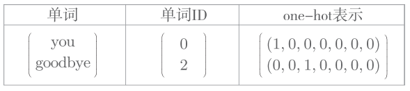

这样将单词转换为固定长度的向量, 神经网络的输入层的神经元个数就能固定下来:

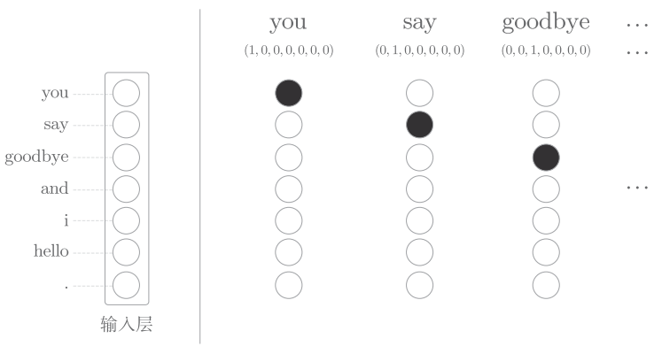

输入层由7个神经元表示, 分别对应一个单词的7维的one-hot表示.只要将单词表示为向量, 这些向量就可可以由构成神经网络的各种层来处理.

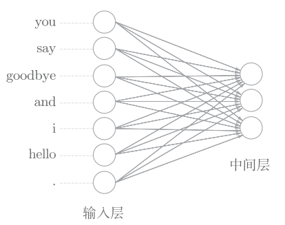

也可以表示为:

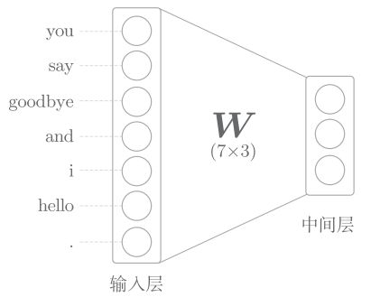

python实现全连接层变换:
```python
import numpy as np
c = np.array([[1, 0, 0, 0, 0, 0, 0]])  # 输入
W = np.random.randn(7, 3)              # 权重
h = np.dot(c, W)                       # 中间节点
print(h)
## [[-0.70012195  0.25204755 -0.79774592]]
```
c是one-hot表示, 单词ID对应的元素是1, 其他地方都是0, 因此c和w的矩阵乘积相当于"提取"权重的对应行向量.
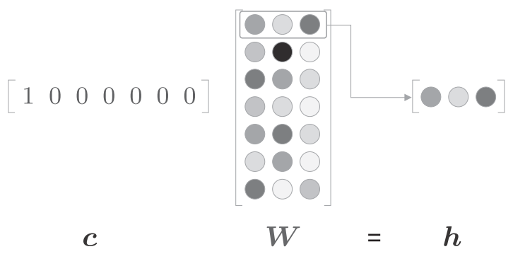


## 简单的word2vec
实现continuous bag of words(cbow)的模型.准确的来说CBOW和skip-gram模型是word2vec中使用的两个神经网络.word2vec则表示的是程序或者工具.

CBOW模型是根据上下文预测目标词的神经网络.它有两个输入层, 经过中间层到达输出层. 从输入层到中间层的变换由相同的全连接层($W_{in}$)完成, 从中间层到输出层神经元的变换由另一个全连接层($W_{out}$)完成. 因为我们对上下文仅考虑两个单词, 所以输入层有两个, 如果上下文考虑N个单词, 则输入层会有N个.

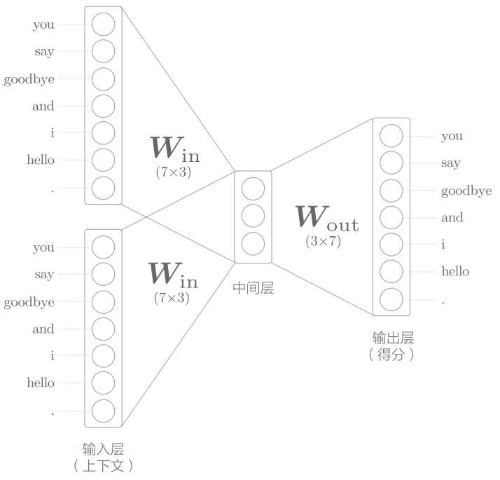

中间层的神经元是各个输入层经全连接层变换后得到的值的"平均".如上例中: 经全连接层变换后, 第1个输入层转换为$h_1$, 第2个输入层转换为$h_2$, 那么中间层的神经元是$\frac{1}{2}(h_1+h_2)$.

输出层有7个神经元, 这些神经元对应各个单词. 输出层的神经元是各个单词的得分, 它的值越大, 说明对应单词的出现概率就越高, 使用softmax函数获得.

从输入层到中间层的变换由全连接层($W_{in}$)完成. 此时, 全连接层的权重$W_{in}$是一个7*3的矩阵, 这个权重就是我们要的单词的分布式表示.

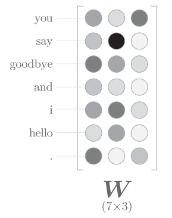

$W_{in}$的各行保存着各个单词的分布式表示. 通过反复学习, 不断更更新各个单词的分布式表示, 以正确地从上下文预测出应当出现的单词.

中间层的神经元数量比输入层少这一点很重要. 中间层需要将预测单词所需的信息进行压缩保存, 从而产生密集的向量表示. 中间层被写入了我们人类无法解读的代码, 这相当于"编码"工作. 而从中间层的信息获得期望结果的过程则称为"解码".

从层视角表示CBOW模型:

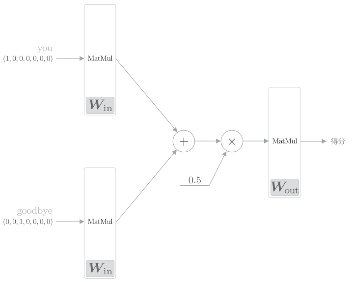

SBOW模型宜开有两个MatMul层, 这两个层的输出被加在一起, 然后得到的值乘以0.5求均值, 得到中间层的神经元. 最后将另外一个MatMul层应用于中间层的神经元, 输出得分.

python实现:
```python
import sys
sys.path.append('..')
import numpy as np
from common.layers import MatMul
## 样本的上下文数据
c0 = np.array([[1, 0, 0, 0, 0, 0, 0]])
c1 = np.array([[0, 0, 1, 0, 0, 0, 0]])
## 权重的初始值
W_in = np.random.randn(7, 3)
W_out = np.random.randn(3, 7)
## 生成层
in_layer0 = MatMul(W_in)
in_layer1 = MatMul(W_in)
out_layer = MatMul(W_out)
## 正向传播
h0 = in_layer0.forward(c0)
h1 = in_layer1.forward(c1)
h = 0.5 * (h0 + h1)
s = out_layer.forward(h)

print(s)
## [[ 0.30916255  0.45060817 -0.77308656  0.22054131  0.15037278
##   -0.93659277 -0.59612048]]

```
首先将权重矩阵`W_in`和`W_out`初始化.

然后生成与上下文单词数量等量(这里是2个)的处理输入层的MatMul层, 输出侧仅生成一个MatMul层. 注意输入侧的MatMul层共享权重矩阵`W_in`.

之后, 输入侧的MatMul层(in_layer0和in_layer1)调用forward()方法, 计算中间数据, 并通过输出侧的MatMul层(out_layer)计算各个单词的得分.

## CBOW模型的学习

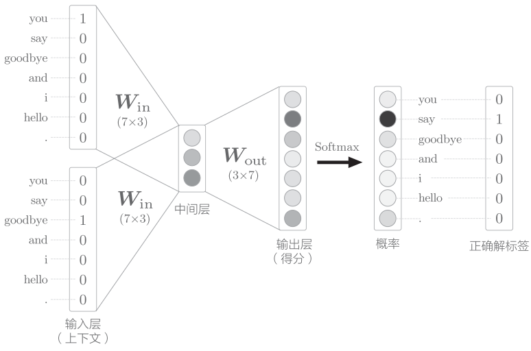
如上图, 上下文是you和goodbye, 正确解标签是say.

这里我们处理的模型是一个进行多分类的神经网络. 首先使用Softmax函数将得分转化为概率, 再求这些概率和监督标签之间的交叉熵误差, 并将其作为损失进行学习:

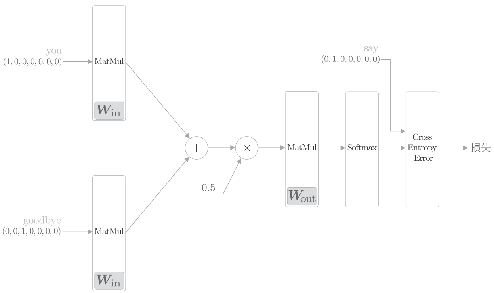

将Softmax和Cross Entropy Error合并为Softmax with Loss层, 则可表示为:

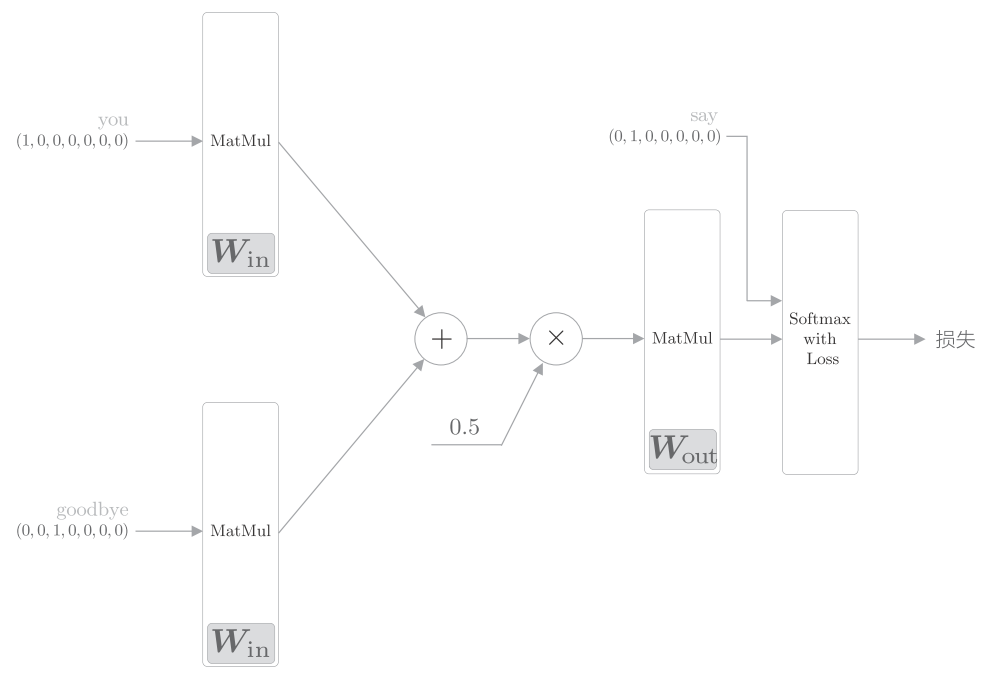

word2vec中使用的网络有两个权重, 分别是输入侧的全连接层的权重($W_{in}$)和输出侧的权重($W_{out}$).两个权重都保存了对单词含义的编码的向量.

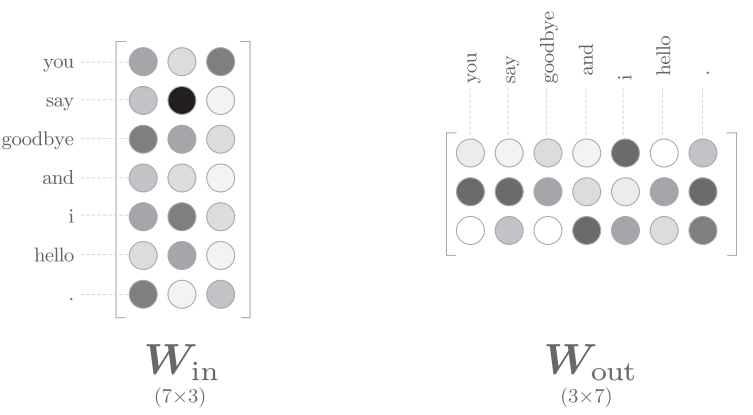

一般使用输入侧的$W_{in}$作为最终的单词的分布式表示.另外在GloVe方法中, 通过将两个权重相加, 也获得了良好的效果.

## word2vec学习数据准备

从语料库生成上下文和目标词, 如图所示:

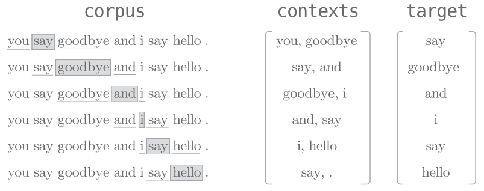

我们对语料库中的单词操作, 得到右侧的contexts(上下文)和target(目标词).contexts的各行作为神经网络的输入, target的各行称为正确解标签.

python实现从语料库生成上下文和目标词的函数

```python
import sys
sys.path.append('..')
from common.util import preprocess
text = 'You say goodbye and I say hello.'
corpus, word_to_id, id_to_word = preprocess(text)
print(corpus)
## [0 1 2 3 4 1 5 6]
print(id_to_word)
## {0: 'you', 1: 'say', 2: 'goodbye', 3: 'and', 4: 'i', 5: 'hello', 6:'.'}
```
然后从ID列表corpus生成contexts和target.

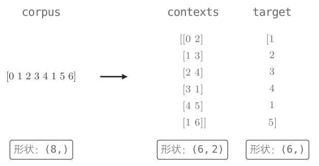

contexts是二维数组, 第0维保存各个上下文的数据. 具体来说, `contexts[0]`保存的是第0个上下文. 同样的道理`target[0]`保存的是第0个目标词. python实现如下:

```python
def create_contexts_target(corpus, window_size=1):
    target = corpus[window_size:-window_size]
    contexts = []
    for idx in range(window_size, len(corpus)-window_size):
        cs = []
        for t in range(-window_size, window_size + 1):
            if t == 0:
                continue
            cs.append(corpus[idx + t])
        contexts.append(cs)
    return np.array(contexts), np.array(target)
contexts, target = create_contexts_target(corpus, window_size=1)
print(contexts)
## [[0 2]
##  [1 3]
##  [2 4]
##  [3 1]
##  [4 5]
##  [1 6]]
print(target)
## [1 2 3 4 1 5]
```

下面将上下文和目标词转换为one-hot表示:

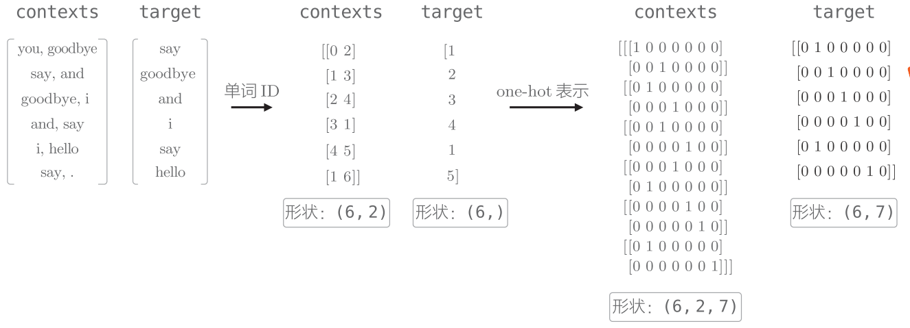

使用ID时contexts的形状是(6,2),将其转换为one-hot表示后, 其形状变成了(6,2,7).

## CBOW模型的实现
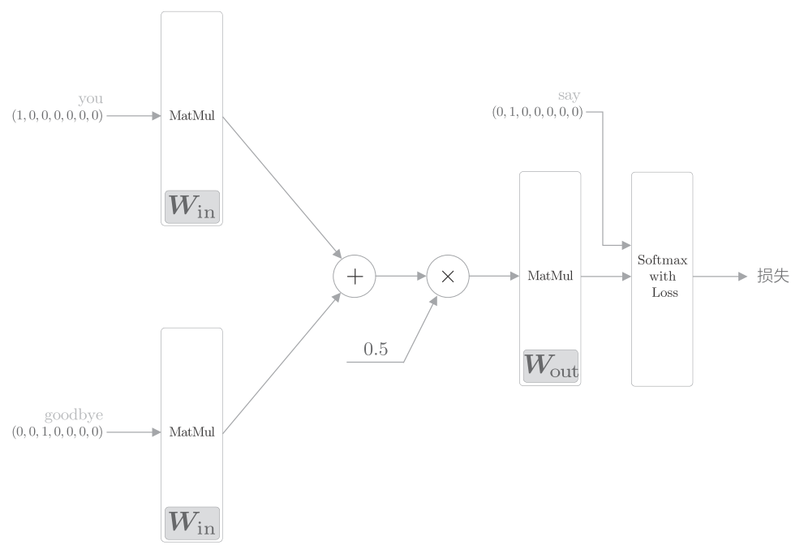

python实现如下:

首先看初始化层
```python
import sys
sys.path.append('..')
import numpy as np
from common.layers import MatMul, SoftmaxWithLoss
class SimpleCBOW:
    def __init__(self, vocab_size, hidden_size):
        V, H = vocab_size, hidden_size
        # 初始化权重
        W_in = 0.01 * np.random.randn(V, H).astype('f')
        W_out = 0.01 * np.random.randn(H, V).astype('f')
        # 生成层
        self.in_layer0 = MatMul(W_in)
        self.in_layer1 = MatMul(W_in)
        self.out_layer = MatMul(W_out)
        self.loss_layer = SoftmaxWithLoss()
        # 将所有的权重和梯度整理到列表中
        layers = [self.in_layer0, self.in_layer1, self.out_layer]
        self.params, self.grads = [], []
        for layer in layers:
            self.params += layer.params
            self.grads += layer.grads
        # 将单词的分布式表示设置为成员变量
        self.word_vecs = W_in
```

然后实现前向传播`forward()`函数

```python
def forward(self, contexts, target):
    h0 = self.in_layer0.forward(contexts[:, 0])
    h1 = self.in_layer1.forward(contexts[:, 1])
    h = (h0 + h1) * 0.5
    score = self.out_layer.forward(h)
    loss = self.loss_layer.forward(score, target)
    return loss
```

最后实现后向传播`backward()`函数

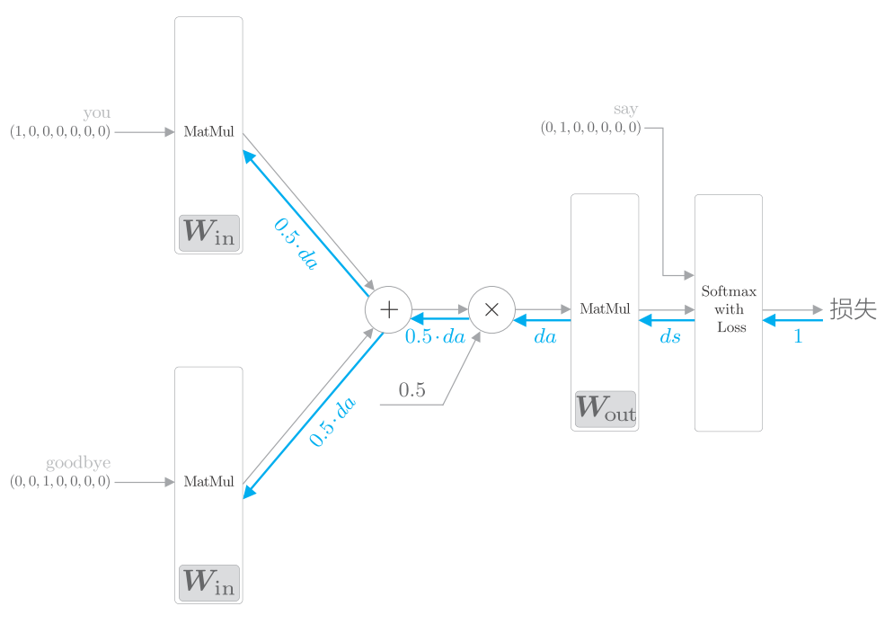


```python
def backward(self, dout=1):
    ds = self.loss_layer.backward(dout)
    da = self.out_layer.backward(ds)
    da *= 0.5
    self.in_layer1.backward(da)
    self.in_layer0.backward(da)
    return None
```

## CBOW模型和概率
当给定某个上下文时, 输出目标词的概率.这里语料库包含$w_1,w_2,...,w_T$等单词, 考虑窗口大小为1的情况, 则给定上下文$w_{t-1}$和$w_{t+1}$时目标词为$w_t$的概率为:

$$P(w_t|w_{t-1},w_{t+1})$$

使用上式可更简洁的表示CBOW模型的损失函数. 回想交叉熵误差函数:
$$L=-\sum_kt_klogy_k$$

其中,$y_k$表示第$k$个事件发生的概率.$t_k$是监督标签, 它是一个one-hot向量的元素, 对应正解的元素为1, 其他元素都是0. 考虑到这一点, 则交叉熵误差函数可以表示为:

$$L=-logP(w_t|w_{t-1},w_{t+1})$$

CBOW模型的损失函数只是对概率取log, 并加上负号, 这也称为负对数似然(negative log likelihood). 如果损失函数可以写为:
$$L=-\frac{1}{T}\sum_{t=1}^{T}logP(w_t|w{t-1},w{t+1})$$

## skip-gram模型
skip-gram是反转了CBOW模型.

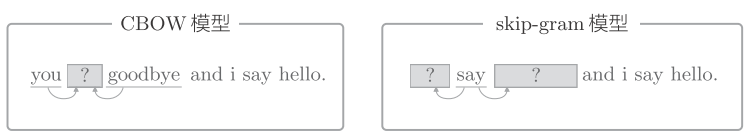

如上图, CBOW模型从上下文的多个单词预测中间的单词, 而skip-gram模型则从中间的单词预测周围的多个单词.

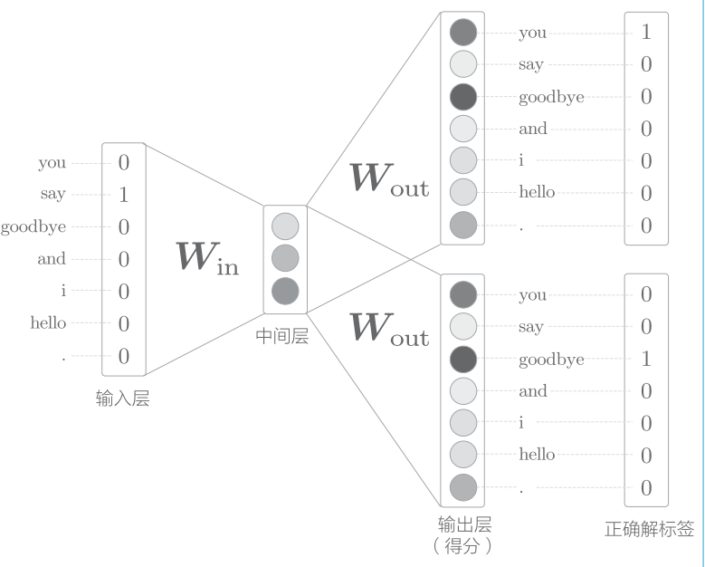

输入层只有一个, 输出层的数量则与上下文的单词的个数相等. 因此, 首先要分别求出各个输出层的损失, 然后将他们加起来作为最后的损失.

##  Embedding
假设词汇量有100万个, CBOW模型的中间层神经元有100个,则:

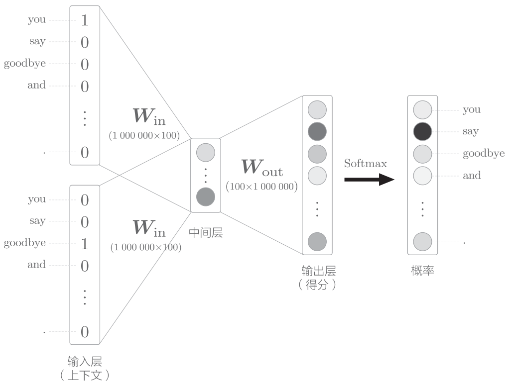

输入层和输出层存在100万个神经元, 有两个地方的计算会出现瓶颈:
输入层和one-hot表示和权重矩阵$W_{in}$的乘积. 比如在词汇量有100万个的情况下, 仅one-hot表示本身就需要占用100万个元素的内存大小. 此外还要计算one-hot表示的权重矩阵$W_{in}$的乘积.

之前, 我们将单词转换为了one-hot表示, 并将其输入了MatMul层, 在MatMul层中计算one-hot表示和权重矩阵的乘积. 这里考虑词汇量是100万个的情况, 中间层的神经元个数是100, 则:

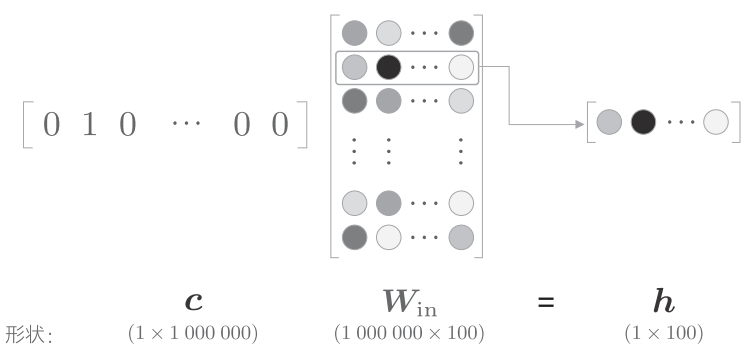

因为语料库的词汇量有100万个, 则单词的one-hot表示的维数也是100万, 我们需要计算这个巨大向量和权重矩阵的乘积. 但是, 如图所示, 乘积所表达的意思无非是将矩阵的某个特定的行取出来.因此, 直觉上将单词转换为one-hot向量和处理和MatMul层中的矩阵乘法似乎没有必要.

我们创建一个从权重参数中抽取"id对应行(向量)"的层, 我们称为Embedding层(来自于word embedding).

python实现:
```python
import numpy as np
W = np.arange(21).reshape(7, 3)
W
## array([[ 0,  1,  2],
##        [ 3,  4,  5],
##        [ 6,  7,  8],
##        [ 9, 10, 11],
##        [12, 13, 14],
##        [15, 16, 17],
##        [18, 19, 20]])
W[2]
## array([6, 7, 8])
W[5]
## array([15, 16, 17])
```
另外, 从权重$W$中一次性提取多行的处理也很简单, 只需要指定行号即可:
```python
idx = np.array([1, 0, 3, 0])
W[idx]
## array([[ 3,  4,  5],
##        [ 0,  1,  2],
##        [ 9, 10, 11],
##        [ 0,  1,  2]])
```
我们一次性提取了4个索引(1,0,3,0), 通过将数组作为参数, 可以一次性提取多行, 用于mini-batch处理.python实现embedding的`forwart()`方法
```python
class Embedding:
    def __init__(self, W):
        self.params = [W]
        self.grads = [np.zeros_like(W)]
        self.idx = None
    def forward(self, idx):
        W, = self.params
        self.idx = idx
        out = W[idx]
        return out
```
`params`和`grads`作为成员变量, 并在成员变量`idx`中以数组的形式保存需要提取的行的索引(单词ID).

接下来是反向传播. Embedding层的正向传播只是从权重矩阵$W$中提取特定的行, 并将该特定行的神经元原样传给下一层. 因此, 在反向传播时, 从上一层(输出层侧的层)传过来的梯度将原样传给下一层(输入侧的层). 不过, 从上一层传来的梯度会被应用到权重梯度$dW$的特定行(idx), 如图:
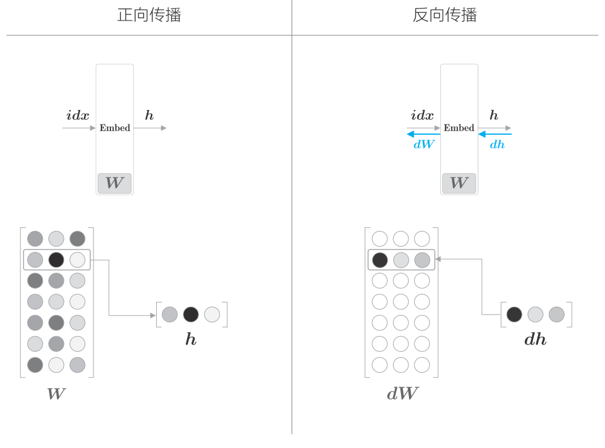
python实现`backward()`:
```python
def backward(self, dout):
    dW, = self.grads
    dW[...] = 0
    for i, word_id in enumerate(self.idx):  # 考虑idx多次出现的情况
        dW[word_id] += dout[i]
    # 或者
    # np.add.at(dW, self.idx, dout)
    return None

```
取出权重梯度$dW$, 通过`dW[...] = 0`将`dW`的元素设为0. 然后将上一层传来的梯度`dout`写入`idx`指定的行. 这里创建了和权重 W相同大小的矩阵 dW，并将梯度写入了 dW对应的行。但是，我们最终想做的事情是更新权重 W，所以没有必要特意创建 dW（大小与 W相同）。相反，只需把需要更新的行号（idx）及其对应的梯度（dout）保存下来，就可以更新权重（W）的特定行。但是，这里为了兼容已经实现的优化器类（Optimizer），所以写成了现在的样子。

##  Negative Sampling

中间层之后的计算. 首先, 中间层和权重矩阵$W_{out}$的乘积需要大量的计算. 其次, 随着词汇量的增加, Softmax层的计算量也会增加.
考虑词汇量为100万个, 中间层神经元个数为100个的word2vec(CBOW)模型, 如图:

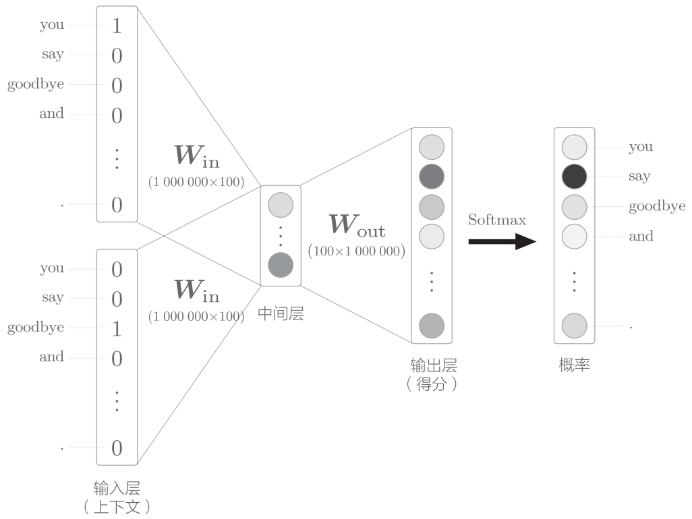

如上图, 输入层和输出层有100万个神经元.通过引入Embedding层, 节省了输入层中不必要的计算. 剩下的问题就是中间层之后的处理:
- 中间层的神经元和权重矩阵$W_{out}$的乘积
- Softmax层的计算

第1个问题在于巨大的矩阵乘积计算. 中间层向量的大小是100, 权重矩阵的大小是100*1000000, 如此巨大的矩阵乘积计算需要大量时间和空间.

另外Softmax也会发生同样的问题. 换句话说, 随着词汇量的增加, Softmax的计算量也会增加:

$$y_k=\frac{exp(s_k)}{\sum_{i=1}^{1000000}exp(s_i)}$$

上式是第k个元素(单词)的Softmax的计算公式(各个元素的得分为$s_1$,$s_2$,...).分母要进行1000000次的exp计算, 计算量和词汇量呈正比.

我们考虑将多分类转换为二分类. 比如,神经网络来回答"当上下文是you和goodbye时, 目标词是say嘛"这个问题, 这时输出层值需要一个神经元即可, 如图:

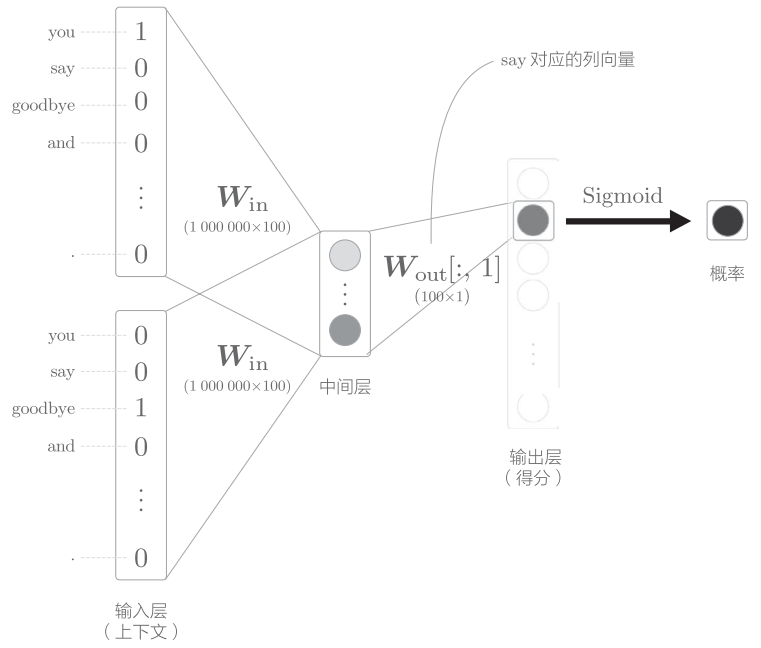

要计算中间层和输出侧的权重矩阵的乘积, 只需要提出say对应的列(单词向量), 并用它与中间层的神经元计算内积即可.

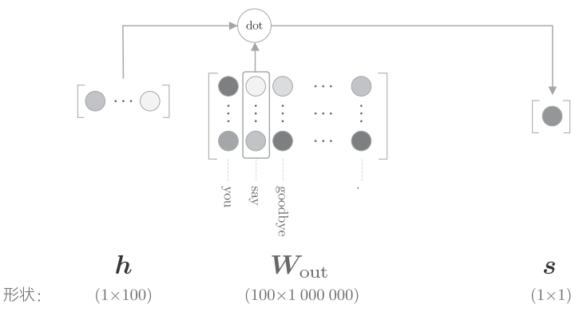

输出侧的权重$W_{out}$中保存了各个单词ID对应的单词向量.此处, 我们提取say这个单词向量, 再求这个向量和中间层神经元的内积, 就是最终的结果.

二分类和多分类的顺势函数均为交叉熵误差, 式子分别为:

$$L=-(tlogy+(1-t)log(1-y))$$
$$L=-\sum_kt_klog{y_k}$$

他们仅仅是写法不同而已, 实际上表示的内容是一致的. 如果输出层只有两个神经元, 则完全一致.

下面将多分类问题转换为二分类:

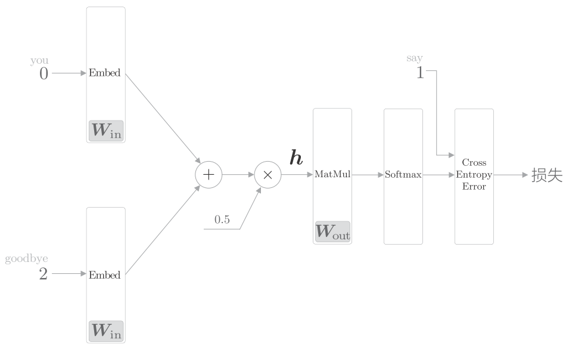

上图中上下文是you和goodbye, 作为正解的目标词是say(you的id为0, say的id为1, goodbye的id为2).

将上图的神经网络转化成二分类的神经网络:

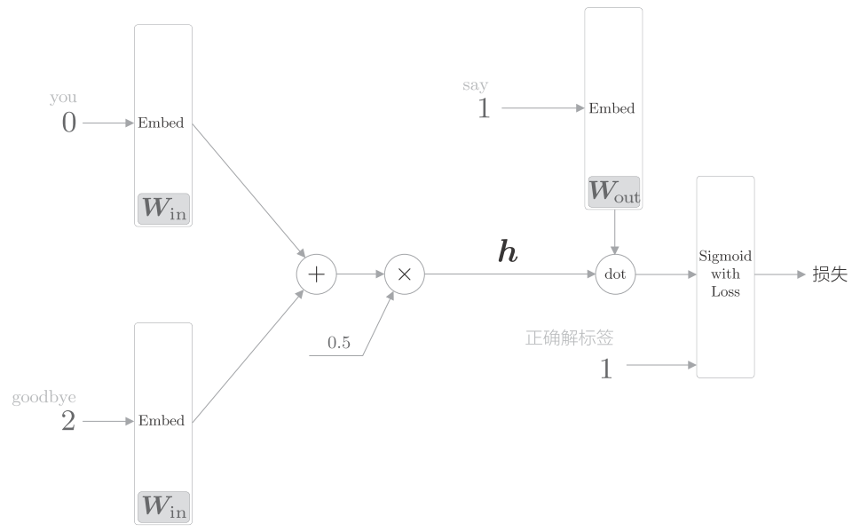


上述过程只解决了正解问题, 既只能正确的预测say, 但是对错误的词语还无法预测, 我需要对负例进行学习.不需要对所有的负例进行学习, 只使用少量负例即可(一般5~10个)这就是负采样的含义.

在进行负采样时, 基于语料库的统计数据进行采样的方法比随机抽样要好, 既将语料库中经常出现的单词容易被抽到, 让语料库中不经常出现的单词难以被抽到. 也就是说处理稀有单词的重要性低.

负采样方法既可以求将正例作为目标词时的损失, 同时也可以采样若干个负例, 对这些负例求损失. 然后讲这些数据(正例+负例)的损失加起来, 作为最终的损失.

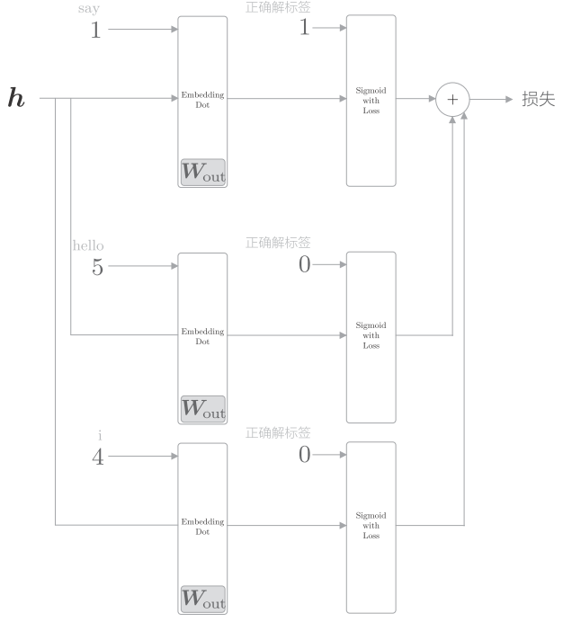

如上图, 正例(say)和之前一样, 向Sigmoid with Loss层输入正确解标签1, 而因为负例(hello和i)是错误答案, 所以要想Sigmoid with Loss层输入正确解标签0. 然后, 将各个数据的损失相加, 作为最终输出.


