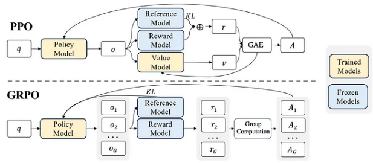

# GRPO与PPO

近端策略优化(Proximal Policy Optimization, PPO)和分组相对策略优化(Group Relative Policy Optimization, GRPO)主要区别在于它们的优势估计和计算效率方法。
GRPO 消除了PPO 依赖于单独的价值模型, 取而代之的是基于组的相对优势估计，从而降低了内存和计算成本。

如下图所示:
1. PPO: 
    1. 策略模型为给定的输入 q 生成输出 O。
    2. 一个单独的价值模型预测基线 v，与广义优势估计 （GAE） 一起使用来计算优势 A。
    3. 奖励 r 包括使用参考模型和奖励模型计算的 KL 惩罚项。
2. GRPO
    1. 为每个 q 生成多个输出 {o1，o2,...,oG}，并使用奖励模型计算它们的奖励 {r1，r2,...,rG}。
    2. 分组计算使这些奖励标准化，在没有价值模型的 A1、A2,..., AG 中提供相对优势。
    3. 经过训练的策略和参考模型之间的 KL 背离直接添加到损失中，从而简化了训练。

🍐举例, 机器人选择路径:

假设机器人在一个迷宫中，必须在三条路径（A、B 和 C）之间进行选择才能达到目标。以下是 GRPO 的分步工作原理：

1. 机器人会尝试每条路径几次并记录结果。

    1. 路径 A：3 次中有 2 次成功。
    2. 路径 B：3 次中有 1 次成功。
    3. 路径 C：3 次成功 3 次。

2. 机器人会计算每个路径的成功率：
    1. 路径 A：66.67% 的成功率。
    2. 路径 B：33.33% 的成功率。
    3. 路径 C：100% 成功率。

3. 比较路径：

    机器人会比较这些成功率，看看哪条路径是最好的。路径 C 显然是最好的，因为它的成功率最高。

4. 调整策略：

    器人会更新其策略，以便将来更频繁地选择路径 C。但它并没有完全忽略路径 A 和 B。它仍然偶尔尝试他们，看看他们是否有所改善。

5. 受控更新：

    机器人确保不会过于剧烈地改变其策略。例如，它可能会将选择路径 C 的概率从 30% 增加到 50%，但不会增加到 100%。这样，它仍然可以探索其他路径并了解更多信息。

## 参考
1. https://deepseek.csdn.net/67aae53382931a478c542a56.html
2. https://www.cnblogs.com/ghj1976/p/18699261/jie-du-deepseekr1zero-he-deepseekr1-de-qian-shi-ji
3. https://ai.plainenglish.io/deepseek-r1-understanding-grpo-and-multi-stage-training-5e0bbc28a281
4. https://medium.com/data-science-in-your-pocket/what-is-grpo-the-rl-algorithm-used-to-train-deepseek-12acc19798d3