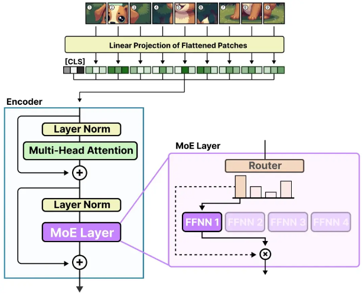

# deepseek_moe

## 概述
混合专家模型（MoE）技术通过使用众多不同的子模型（即 "专家网络"）来提升大语言模型（LLMs）的性能.

MoE 的两大核心组成部分如下：
1. 专家网络: 每个前馈神经网络层（FFNN）都配备有一组 "专家网络"，可以根据需要选择其中的子集。
2. 门控网络(路由器): 它负责决定哪些 tokens 应该被传递给哪些专家网络。

✨注意，"专家网络" 并非专注于某个特定领域（如 "心理学" 或 "生物学"）的专家，它们更多的是在单词层面上学习句法信息.

## 专家网络

先来研究混合专家模型（Mixture of Experts，MoE）试图优化的结构: 密集层（dense layers）。

### 密集层（Dense Layers）

混合专家模型（Mixture of Experts，MoE）的概念源自大语言模型（LLMs）的一个基本组件，也就是前馈神经网络（Feedforward Neural Network，FFNN）。

在标准的仅包含解码器的 Transformer 架构中，前馈神经网络通常应用于层归一化（layer normalization）之后：

前馈神经网络利用注意力机制生成的上下文信息，进一步处理以捕捉数据中的复杂关系。但是，前馈神经网络的规模增长速度很快。为了掌握这些复杂的关系，它往往需要对输入信息进行扩展处理：

### 稀疏层（Sparse Layers）

在传统的 Transformer 中，FFNN 被称作密集模型（dense model），因为它的所有参数（包括权重和偏置项）都会被激活。

与此相对的是，稀疏模型（sparse models）只激活了其参数总数的一部分，这与混合专家模型（Mixture of Experts）密切相关。我们可以把密集模型分解成若干小块（即所谓的 "专家网络"），重新训练它们，并且在任何特定时刻只激活一部分 "专家网络"：

这种方法的核心理念是，每个 "专家网络" 在训练过程中会学习到不同的信息。而在推理阶段，只有那些与当前任务最相关的 "专家网络" 会被调用。

### 专家网络学习了什么？
在 Mixtral 8x7B 论文中提供了一个很好的案例，其中每个 token 都根据首次选择的专家网络进行了着色。

这张图片也表明，专家网络通常更关注句法结构, 处理某些特定类型的 tokens ，而不是特定领域的内容。

## 门控网络(路由机制)

就在专家网络之前，会添加一个路由器（也称为门控网络），它会被训练来为给定的 token 选择专家网络。

### 门控网络(路由器)

路由器（或称门控网络）本身也是一个前馈神经网络（FFNN），其作用是基于特定的输入来挑选合适的专家网络。它会输出一系列概率值，用以确定最匹配的专家网络：

专家层（expert layer）将所选专家网络的输出结果与门控值（即选择概率）相乘后返回。

路由器与被选中的少数专家网络共同组成了 MoE 层：

## 视觉模型中的 MoE
MoE 不仅仅是一种仅适用于语言模型的技术。视觉模型（如 ViT）使用基于 transformer 的架构，因此也有潜力使用 MoE。

简单回顾一下，ViT（Vision-Transformer）是一种将图像分割成 patches 的架构，这些 patch 的处理方式与 token 类似。

这些 patchs（或 tokens）随后会被投影到嵌入向量中（并加上位置嵌入向量），然后被送入常规的编码器中：

一旦这些 patches 进入编码器，它们就像 tokens 一样被处理，这使得这种架构非常适合用于 MoE。

Vision-MoE（V-MoE）是第一次在图像模型中实现 MoE 的尝试。7 它采用了我们之前看到的 ViT，并将编码器中的密集 FFNN 层替换为稀疏 MoE。

这使得 ViT 模型（通常模型规模小于语言模型），可以通过添加专家网络来进行大规模扩展。

为了减少硬件限制，每个专家网络都设置了较小的预定义容量，因为图像通常包含许多 patch 。然而，低容量往往导致 patch 被丢弃（类似于 token 溢出）。

为了保持较低的专家网络容量，网络会为每个 patch 分配重要性分数，并优先处理这些得分较高的 patches，这样使得溢出的 patches 一般就不那么重要了。这种方法被称为批量优先级路由（Batch Priority Routing）。

因此，即使 token 的数量减少，我们仍然应该看到重要的 patch 被成功路由。

## 参考
1. https://my.oschina.net/IDP/blog/16513157
2. https://newsletter.maartengrootendorst.com/p/a-visual-guide-to-mixture-of-experts