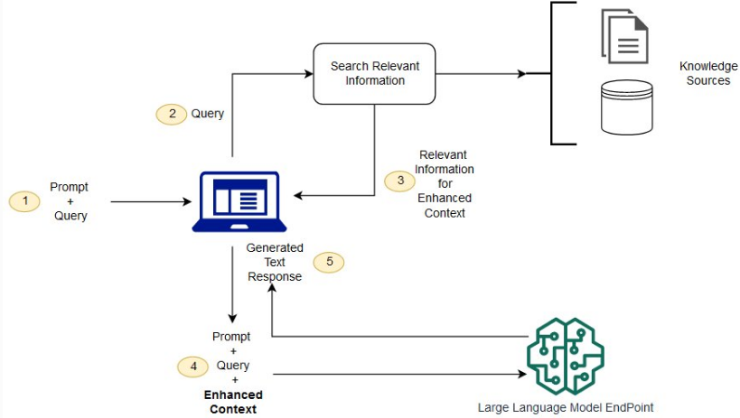

## 检索增强

检索增强生成（RAG）是指对大型语言模型输出进行优化，使其能够在生成响应之前引用训练数据来源之外的权威知识库。这些都无需重新训练模型。其优势:


## 工作原理
1. 创建外部数据

    LLM 原始训练数据集之外的新数据称为外部数据。

    1. API、数据库或文档存储库。数据可能以各种格式存在，例如文件、数据库记录或长篇文本。
    2. 数据转换为数字表示形式并将其存储在向量数据库中

2. 检索相关信息

    用户查询将转换为向量表示形式，并与向量数据库匹配。

    例如，考虑一个可以回答组织的人力资源问题的智能聊天机器人。如果员工搜索：“我有多少年假？”，系统将检索年假政策文件以及员工个人过去的休假记录。这些特定文件将被获取，因为它们与员工输入的内容高度相关。

3. 增强 LLM 提示

    RAG 模型通过在上下文中添加检索到的相关数据来增强用户输入（或提示）。





## 实战


```python
from langchain_community.document_loaders import PDFPlumberLoader
from langchain_experimental.text_splitter import SemanticChunker
from langchain_community.embeddings import HuggingFaceEmbeddings
from langchain_community.vectorstores import FAISS
from langchain_community.llms import Ollama
from langchain.prompts import PromptTemplate
from langchain.chains.llm import LLMChain
from langchain.chains.combine_documents.stuff import StuffDocumentsChain
from langchain.chains import RetrievalQA

## 获得知识
loader = PDFPlumberLoader("Cross-Entropy Demystified.pdf")
docs = loader.load()


## 对文本进行切分(可选)
text_splitter = SemanticChunker(HuggingFaceEmbeddings())
documents = text_splitter.split_documents(docs)


## 创建向量库
embedder = HuggingFaceEmbeddings()
vector = FAISS.from_documents(documents, embedder)
retriever = vector.as_retriever(search_type="similarity", search_kwargs={"k": 3})


llm = Ollama(model="deepseek-r1:1.5b")

prompt = """
Use the following context to answer the question.
Context: {context}
Question: {question}
Answer:"""

QA_PROMPT = PromptTemplate.from_template(prompt)


llm_chain = LLMChain(llm=llm, prompt=QA_PROMPT)
combine_documents_chain = StuffDocumentsChain(llm_chain=llm_chain, document_variable_name="context")

qa = RetrievalQA(combine_documents_chain=combine_documents_chain, retriever=retriever)

response = qa('信息熵是什么')["result"]
```

## 参考
1. https://dev.to/ajmal_hasan/setting-up-ollama-running-deepseek-r1-locally-for-a-powerful-rag-system-4pd4
2. https://www.analyticsvidhya.com/blog/2025/01/rqa-system-with-deepseek-r1/
3. https://stackoverflow.blog/2023/10/18/retrieval-augmented-generation-keeping-llms-relevant-and-current/
4. https://app.datacamp.com/learn/tutorials/llama-3-1-rag?registration_source=google_onetap
5. https://aws.amazon.com/what-is/retrieval-augmented-generation/