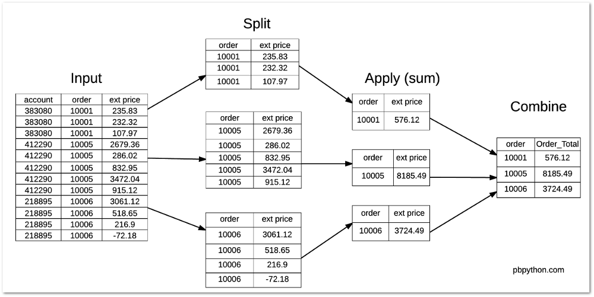

# 分组groupby

1. filter, 以分组为对象, 过滤整个分组对象
1. agg, 以每个分组为对象, 结果是将分组所有数据所有数据聚合的结果赋值给分组索引, 一组对应一个值
2. transform, 将分组计算的结果, 结果是将分组所有数据聚合的结果赋值给每一条记录, 一条记录对应一个值
3. apply, 可以完成filter, agg, transform的所有操作, 他们无法做成的, 可以使用

    使用如下数据集进行说明:

    ```python
    import pandas as pd
    df = pd.DataFrame({
                    "name": ["wang","wei","zhao","li","wu"],
                    "gender": ["boy","girl","girl","boy","girl"],
                    "score": [56,67,47,87,None]
                    })
    ```

    1. 使用apply实现agg操作

        ```python
        df.groupby('gender').apply(lambda x: x.sum()).reset_index(drop=True)
        df.groupby('gender').sum().reset_index(drop=True)
        ```
    
    2. 使用apply实现transform操作

        ```python
        def trans(dfgroup):
            dfgroup['trans'] = dfgroup['score'].sum()
            return dfgroup


        df.groupby('gender').apply(trans).reset_index(drop=True)
        df.groupby('gender').transform(sum).reset_index(drop=True)
        ```
    3. 使用apply实现filter操作

        ```python
        def filter(dfgroup):
            if dfgroup['score'].sum()<= 115:
                dfgroup=None
                
            return dfgroup

        df.groupby('gender').apply(filter).reset_index(drop=True)
        df.groupby('gender').filter(lambda x: x['score'].sum() > 115).reset_index(drop=True)
        ```


## 参考
1. https://pandas.pydata.org/docs/user_guide/groupby.html


## 数据准备

id|account|name|order_id|sku|quantity|unit_price|ext_price
--|--|--|--|--|--|--|--
0|383080|Will LLC|10001|B1-20000|7|33.69|235.83
1|383080|Will LLC|10001|S1-27722|11|21.12|232.32
2|383080|Will LLC|10001|B1-86481|3|35.99|107.97
3|412290|Jerde-Hilpert|10005|S1-06532|48|55.82|2679.36
4|412290|Jerde-Hilpert|10005|S1-82801|21|13.62|286.02
5|412290|Jerde-Hilpert|10005|S1-06532|9|92.55|832.95
6|412290|Jerde-Hilpert|10005|S1-47412|44|78.91|3472.04
7|412290|Jerde-Hilpert|10005|S1-27722|36|25.42|915.12
8|218895|Kulas Inc|10006|S1-27722|32|95.66|3061.12
9|218895|Kulas Inc|10006|B1-33087|23|22.55|518.65
10|218895|Kulas Inc|10006|B1-33364|3|72.30|216.90
11|218895|Kulas Inc|10006|B1-20000|-1|72.18|-72.18

字段解释:
1. `id`: 订单的唯一标识
2. `account`: 用户的账号
3. `name`: 用户的名称
4. `order_id`: 订单id(1个订单可以由多个商品)
5. `sku`: 商品名称
6. `quantity`: 商品的个数
7. `unit_price`: 每个商品的价格
8. `ext_price`: `unit_price` * `quantity`

可以看到有三个不同的订单(orders), 10001,10005和10006. 每个订单有多种商品(sku).

```python
import pandas as pd
df = pd.DataFrame({
    "id":[0,1,2,3,4,5,6,7,8,9,10,11],
    "account":[383080,383080,383080,412290,412290,412290,412290,412290,218895,218895,218895,218895],
    "name":["Will LLC","Will LLC","Will LLC","Jerde-Hilpert","Jerde-Hilpert","Jerde-Hilpert","Jerde-Hilpert","Jerde-Hilpert","Kulas Inc","Kulas Inc","Kulas Inc","Kulas Inc"],
    "order_id":[10001,10001,10001,10005,10005,10005,10005,10005,10006,10006,10006,10006],
    "sku":["B1-20000","S1-27722","B1-86481","S1-06532","S1-82801","S1-06532","S1-47412","S1-27722","S1-27722","B1-33087","B1-33364","B1-20000"],
    "quantity":[7,11,3,48,21,9,44,36,32,23,3,-1],
    "unit_price":[33.69,21.12,35.99,55.82,13.62,92.55,78.91,25.42,95.66,22.55,72.30,72.18],
    "ext_price":[235.83,232.32,107.97,2679.36,286.02,832.95,3472.04,915.12,3061.12,518.65,216.90,-72.18]
})
```

## 聚合

求每个order的总价
```python
df.groupby('order_id')["ext_price"].sum()
"""
order_id
10001     576.12
10005    8185.49
10006    3724.49
"""
```


## DataFrameGroupBy与SeriesGroupBy对象

```python
df.groupby("order_id")  # <pandas.core.groupby.generic.DataFrameGroupBy 对象，注意是DataFrameGroupBy
df.groupby("order_id").sum()  
## 1. 因为account不能sum，所以结果自动忽略
## 2. goupby的column的value，作为index
"""
       ext_price
order_id           
10001     576.12
10005    8185.49
10006    3724.49
"""
## 3. 可以从DataFrameGroupBy对象中按列名取出SeriesGroupBy
df.groupby("order_id")["ext_price"]  #　pandas.core.groupby.generic.SeriesGroupBy 对象，注意是SeriesGroupBy
df.groupby("order_id")["ext_price"].sum() # 分组列自动作为索引
"""
order_id
10001     576.12
10005    8185.49
10006    3724.49
"""
## 4. 不将分组列作为索引
df.groupby("A", as_index=False).sum() # 不将分组列作为索引
"""
  gender  score
0    boy  143.0
1   girl  114.0
"""
```
## 定制聚合结果

```python
df.groupby("order_id").agg(np.sum)
df.groupby("order_id").agg([np.sum, np.mean, np.std]) # 同时计算多个聚合
df.groupby("order_id").agg([lambda x: x.max() - x.min()]) # 自定义聚合函数
df.groupby("order_id").agg({'ext_price': np.sum,
			         		'account': lambda x: len(x)}) # 对不同该类进行聚合,`ext_price'列求和，'account`列计算个数
```

## 过滤(having)
```python
df.groupby('order_id').filter(lambda x: len(x) > 3) # 分组后个数大于2的组，只有girl
```


参考:
https://pbpython.com/pandas_transform.html
https://pandas.pydata.org/docs/reference/api/pandas.DataFrame.groupby.html
https://pandas.pydata.org/pandas-docs/stable/user_guide/groupby.html#aggregation