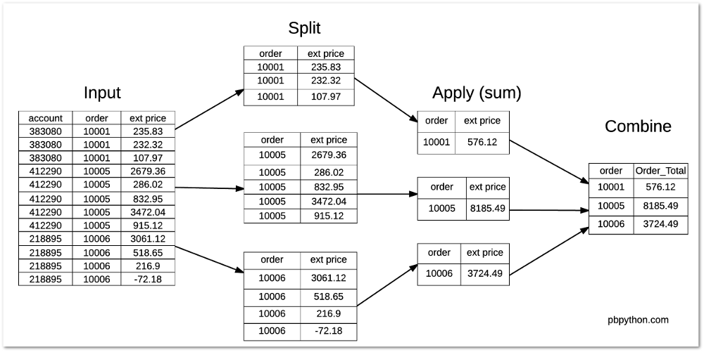
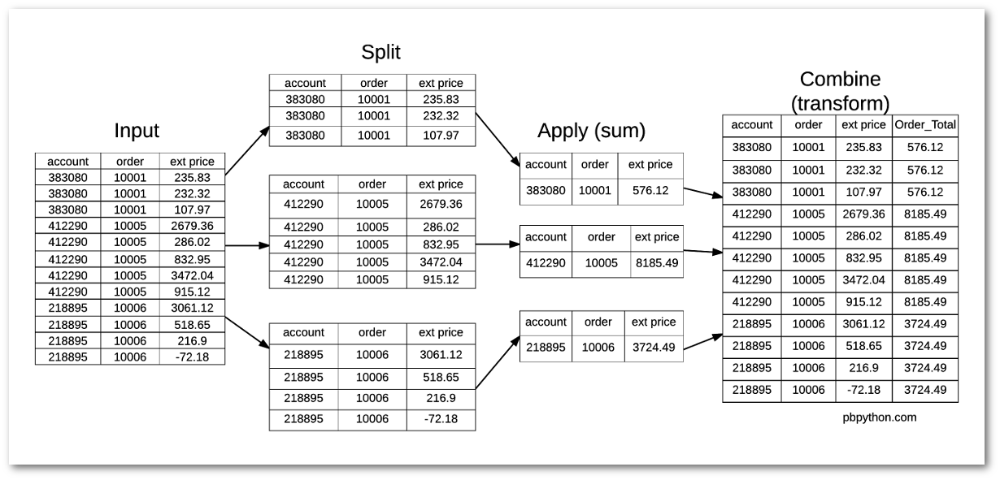

## 测试数据


```python
import pandas as pd
df = pd.DataFrame({
                "name": ["wang","wei","zhao","li","wu"],
                "gender": ["boy","girl","girl","boy","girl"],
                "score": [56,67,47,87,None]
                })

df.groupby('gender')[['name']].transform(len)

#    name
# 0     2
# 1     3
# 2     3
# 3     2
# 4     3

```


# transform

<font style="background: lightgreen">pandas的transform函数类似于sql的over()</font>


## 数据准备

id|account|name|order_id|sku|quantity|unit_price|ext_price
--|--|--|--|--|--|--|--
0|383080|Will LLC|10001|B1-20000|7|33.69|235.83
1|383080|Will LLC|10001|S1-27722|11|21.12|232.32
2|383080|Will LLC|10001|B1-86481|3|35.99|107.97
3|412290|Jerde-Hilpert|10005|S1-06532|48|55.82|2679.36
4|412290|Jerde-Hilpert|10005|S1-82801|21|13.62|286.02
5|412290|Jerde-Hilpert|10005|S1-06532|9|92.55|832.95
6|412290|Jerde-Hilpert|10005|S1-47412|44|78.91|3472.04
7|412290|Jerde-Hilpert|10005|S1-27722|36|25.42|915.12
8|218895|Kulas Inc|10006|S1-27722|32|95.66|3061.12
9|218895|Kulas Inc|10006|B1-33087|23|22.55|518.65
10|218895|Kulas Inc|10006|B1-33364|3|72.30|216.90
11|218895|Kulas Inc|10006|B1-20000|-1|72.18|-72.18

字段解释:
1. `id`: 订单的唯一标识
2. `account`: 用户的账号
3. `name`: 用户的名称
4. `order_id`: 订单id(1个订单可以由多个商品)
5. `sku`: 商品名称
6. `quantity`: 商品的个数
7. `unit_price`: 每个商品的价格
8. `ext_price`: `unit_price` * `quantity`

可以看到有三个不同的订单(orders), 10001,10005和10006. 每个订单有多种商品(sku).


```python
import pandas as pd
df = pd.DataFrame({
    "id":[0,1,2,3,4,5,6,7,8,9,10,11],
    "account":[383080,383080,383080,412290,412290,412290,412290,412290,218895,218895,218895,218895],
    "name":["Will LLC","Will LLC","Will LLC","Jerde-Hilpert","Jerde-Hilpert","Jerde-Hilpert","Jerde-Hilpert","Jerde-Hilpert","Kulas Inc","Kulas Inc","Kulas Inc","Kulas Inc"],
    "order_id":[10001,10001,10001,10005,10005,10005,10005,10005,10006,10006,10006,10006],
    "sku":["B1-20000","S1-27722","B1-86481","S1-06532","S1-82801","S1-06532","S1-47412","S1-27722","S1-27722","B1-33087","B1-33364","B1-20000"],
    "quantity":[7,11,3,48,21,9,44,36,32,23,3,-1],
    "unit_price":[33.69,21.12,35.99,55.82,13.62,92.55,78.91,25.42,95.66,22.55,72.30,72.18],
    "ext_price":[235.83,232.32,107.97,2679.36,286.02,832.95,3472.04,915.12,3061.12,518.65,216.90,-72.18]
})
```


## 分组groupby
如上, 通过分组我们可以计算每个订单的总价格, 并将结果按**聚合列**去重.


```python
df.groupby('order_id')["ext_price"].sum()
"""
order
10001     576.12
10005    8185.49
10006    3724.49
Name: ext price, dtype: float64
"""
```


可以看到在**Combine**这一步时, 是将组内的数据进行**去重**了


## 分组transform

通过transform也可以计算每个订单的总价格, 而且结果是没有去重
```python
df.groupby('order_id')["ext_price"].transform('sum')
## df.groupby('order_id')["ext_price"].transform(lambda x: x.sum())  # 等价的写法, 替换sum, 其中的x就是被分组后的ext_price
"""
0      576.12
1      576.12
2      576.12
3     8185.49
4     8185.49
5     8185.49
6     8185.49
7     8185.49
8     3724.49
9     3724.49
10    3724.49
11    3724.49
Name: ext price, dtype: float64
"""
```




可以看到在**Combine**这一步时, 没有将组内的数据进行**去重**.

通过`transform`我们可以方便的计算, 每个商品占订单的百分比:
```python
df["Order_Total"] = df.groupby('order_id')["ext_price"].transform('sum')
df["Percent_of_Order"] = df["ext_price"] / df["Order_Total"]
"""
0     0.409342
1     0.403249
2     0.187409
3     0.327330
4     0.034942
5     0.101759
6     0.424170
7     0.111798
8     0.821890
9     0.139254
10    0.058236
11   -0.019380
Name: Percent_of_Order, dtype: float64
"""
```


## 另一种实现transform的方法

group对象apply是对每个分组对象操作，既lambda中的x。
```python
df.groupby('order_id').apply(lambda x: x.sort_values('ext_price')).reset_index(drop=True) # 分组后根据成绩排序
```

## 参考:
1. https://pbpython.com/pandas_transform.html