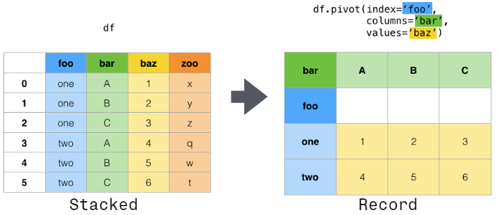

# 索引index_pivot


数据透视表类似于分组操作.



他们3个的区别是:
1. pivot_table, crosstab相较于pivot方法多了聚合的方法.
2. pivot_table可以直接使用列名, crosstab只能接收Series


```python
import pandas as pd

df = pd.DataFrame({
    '1': ['A', 'B', 'A', 'B'],
    '2': ['C', 'D', 'D', 'C'],
    '3': ['E', 'F', 'E', 'F'],
    '4': [1, 2, 3, 4]
})

df.pivot(index='1', columns='2', values='4')  # 类似分组

# 2  C  D
# 1      
# A  1  3
# B  4  2

df.pivot(index='1', columns='3', values='4')  # 报错, 因为pivot没有聚合功能

pd.pivot_table(df, index='1', columns='3', values='4', aggfunc='sum')

# 3    E    F
# 1          
# A  4.0  NaN
# B  NaN  6.0


pd.crosstab(index=df['1'], columns=df['3'], values=df['4'], aggfunc=sum)

# 3    E    F
# 1          
# A  4.0  NaN
# B  NaN  6.0

pd.pivot_table(df, index='1', columns='2', values='4', aggfunc='sum')

# 2  C  D
# 1      
# A  1  3
# B  4  2

pd.crosstab(index=df['1'], columns=df['2'], values=df['4'], aggfunc=sum)

# 2  C  D
# 1      
# A  1  3
# B  4  2

```


## API

### pivot


1. 参数
    ```python
    pandas.pivot(
        data,                   # DataFrame
        *, 
        columns,                # str or object or a list of str, 哪一列的值作为列名
        index=<no_default>,     # str or object or a list of str, optional, 哪一列的值作为索引, 不指定则使用原索引
        values=<no_default>     # str, object or a list of the previous, optional, 那一列的值作为值. 如果不指定, 则所有剩余的列都会使用
    )

    ```
2. 返回

    DataFrame

### pivot_table

### crosstab


## 参考
1. https://pandas.pydata.org/docs/user_guide/reshaping.html
1. https://pandas.pydata.org/docs/reference/api/pandas.pivot_table.html#pandas.pivot_table
2. https://pandas.pydata.org/docs/reference/api/pandas.DataFrame.pivot.html#pandas.DataFrame.pivot


