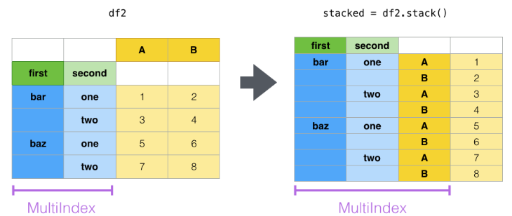
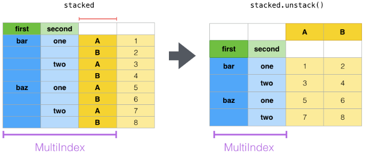
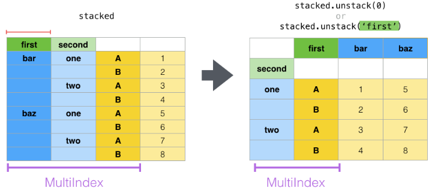

# 索引index_stack

stack是将列名转换为索引. 如下图, 列名['A','B']转换成了第3列索引

unstack是将索引列的分类, 转化为列名. 多重索引, 从左到右, 索引的位置为别是[0,1,2]. unstack默认取最大位置的索引.

当然可以指定索引位置, 进行unstack.

## 参考
1. https://pandas.pydata.org/docs/user_guide/reshaping.html
1. https://pandas.pydata.org/docs/reference/api/pandas.DataFrame.stack.html#pandas.DataFrame.stack
2. https://pandas.pydata.org/docs/reference/api/pandas.DataFrame.unstack.html#pandas.DataFrame.unstack

