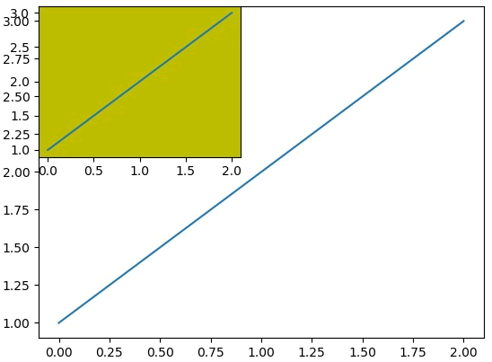

# subplot

`fig.add_subplot`仅仅返回指定位置的1个坐标系(axes), 不同于`fig.subplots`同时返回多个坐标系(axes)


## 参数
`fig.add_subplot(nrows, ncols, index)`

nrows 与 ncols 表示要划分几行几列的子区域（nrows*nclos表示子图数量），index 的初始值为1，用来选定具体的某个子区域。
例如： add_subplot(233)表示在当前画布的右上角创建一个两行三列的绘图区域（如下图所示），同时，选择在第 3 个位置绘制子图。
需要注意的是, 其他没有选择的区域并没有绘制任何图形

![1.png]


## 返回
`fig.add_subplot`仅仅返回指定位置的1个坐标系(axes)


## 应用

```python
import matplotlib.pyplot as plt
fig = plt.figure()
ax1 = fig.add_subplot(111)
ax1.plot([1,2,3])
ax2 = fig.add_subplot(221, facecolor='y')  # 覆盖第一次绘画的区域
ax2.plot([1,2,3])
```



## plot


## 应用
```python
import numpy as np
import matplotlib.pyplot as plt
t = np.arange(0., 5., 0.2)
fig, axe = plt.subplots()
lines = axe.plot(t, t, 'r--o') # 等价于axe.plot(t, t, c='r', ls='--', marker='o')
```

## API
`matplotlib.pyplot.plot(*args, scalex=True, scaley=True, data=None, **kwargs)`

### 参数

参数|描述
--|--
x| x axis
y| y axis
alpha| 透明度
color or c| 颜色
fillstyle | 填充样式
label | 标签, 名称, 和legend关联
linestyle or ls | '-' or 'solid' , '--' or 'dashed', '-.' or 'dashdot', ':' or 'dotted'
linewidth or lw | 线宽
marker|数据对应点的形状,具体[参考](https://matplotlib.org/stable/api/markers_api.html#module-matplotlib.markers)
markeredgecolor or mec| 
markeredgewidth or mew|
markerfacecolor or mfc|
markersize or ms|
fmt|maker, line, with的快捷方法, 详细见下面的小节`[marker][line][color]`

### 返回
list of [Line2D](https://matplotlib.org/stable/api/_as_gen/matplotlib.lines.Line2D.html#matplotlib.lines.Line2D)

## 样式设置
通过`markers`, `linestyle`, `color`来控制折线的样式.

### Markers
[参考](https://matplotlib.org/stable/api/markers_api.html#module-matplotlib.markers)
参数|描述
--|--
'.'|point marker
','|pixel marker
'o'|circle marker
'v'|triangle_down marker
'^'|triangle_up marker
'<'|triangle_left marker
'>'|triangle_right marker

### Line Styles
参数|描述
--|--
'-'|solid line style
'--'|dashed line style
'-.'|dash-dot line style
':'|dotted line style

### colors
[参考](https://matplotlib.org/stable/tutorials/colors/colormaps.html)
可以使用简称'b',或全称'blue', 或'#008000'
参数|描述
--|--
'b'|blue
'g'|green
'r'|red
'c'|cyan
'm'|magenta
'y'|yellow
'k'|black
'w'|white

## Format Strings
plot的第三个参数， 用来设置折线的样式。
语法: `fmt = '[marker][line][color]'`


参考:
https://matplotlib.org/stable/api/_as_gen/matplotlib.pyplot.plot.html#matplotlib.pyplot.plot


参考:
https://matplotlib.org/stable/api/figure_api.html#matplotlib.figure.Figure.add_subplot
http://m.biancheng.net/matplotlib/subplot.html