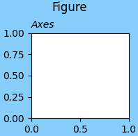

# figure


## 最佳实践

创建画板的两种方法:
1. plt.figure()创建画板, 然后add_subplot()添加坐标系(Axes)
2. fig, axs = plt.subplots(), 直接创建画板和坐标系, 可以看成是figure()和add_subplot()的组合


## 概念

最高等级的container Artist是`matplotlib.figure.Figure`, 可以使用`matplotlib.pyplot.figure()`来创建.
当添加subplots(`subplots(), add_subplot()`)或axes(`add_axes()`)是, 这些对象会被添加到`Figure.axes`列表中.

```python
fig = plt.figure(figsize=(2, 2), facecolor='lightskyblue',
                 layout='constrained')
fig.suptitle('Figure')
ax = fig.add_subplot()
ax.set_title('Axes', loc='left', fontstyle='oblique', fontsize='medium')
```



上图中蓝色区域是figure(画板), 白色区域是add_subplot()增加的Axes(坐标系)


## 参数
参数|描述
--|--
`num` |`int or str` |`figure`的id
`figsize`|`(float, float)`, 默认`[6.4, 4.8]`, Width, height in inches
`dpi`|`float`, 默认`100.0`, The resolution of the figure in dots-per-inch.
`facecolor`|`color`, 默认`white`, 背景颜色
`edgecolor`|`color`, 默认`white`, 边框颜色


## 返回
```python
class matplotlib.figure.Figure(figsize=None, dpi=None, *, facecolor=None, edgecolor=None, linewidth=0.0, frameon=None, subplotpars=None, tight_layout=None, constrained_layout=None, layout=None, **kwargs)[source]
```


## 参考:
1. https://matplotlib.org/stable/users/explain/figure/figure_intro.html
2. https://matplotlib.org/stable/api/_as_gen/matplotlib.pyplot.figure.html
3. https://matplotlib.org/stable/api/figure_api.html#matplotlib.figure.Figure