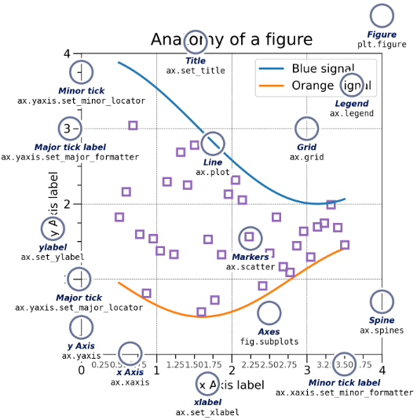

# axes

`matplotlib.axes.Axes` 容器, 是坐标系, 用来绘制具体的图像,可以用来创建`primitives artist`对象, 并设置他们的样式.



可以通过ax对象来创建和修改artist对象, 如:
1. 标题
2. 坐标轴
3. 数据图: 线, 点


### 构造参数
不直接构造, 通过subplot()方法直接获取


### 


比如创建一个`Line2D`对象:


```python
line, = ax.plot(x, y, '-', color='blue', linewidth=2)
line  # <matplotlib.lines.Line2D at 0xd378b0c>
```

`plot()`返回包含多个`Line2D`对象的列表, 因为我们可以传入的`x,y`可以是列表. 这里我们使用`,`进行解包. 该`Line2D`同时被加入到了`Axes.lines`列表中.


```python
print(ax.lines)  # [<matplotlib.lines.Line2D at 0xd378b0c>]
```

有些图像, 比如直方图(hist)会包含多个`primitives artist`对象
```python
n, bins, rectangles = ax.hist(np.random.randn(1000), 50)
```


## axes创建primitives artist

Axes helper method|Artist|Container|例子
--|--|--|--
`ax.annotate` - text annotations|Annotation|ax.texts|`ax.annotate('local max', xy=(2, 1), xytext=(3, 1.5),arrowprops=dict(facecolor='black', shrink=0.05))`
bar - bar charts|Rectangle|ax.patches
errorbar - error bar plots|Line2D and Rectangle|ax.lines and ax.patches
fill - shared area|Polygon|ax.patches
hist - histograms|Rectangle|ax.patches
imshow - image data|AxesImage|ax.images
`ax.legend()` - Axes legend|Legend|ax.get_legend()|`ax.legend(("phase field", "level set", "sharp interface"),shadow=True, loc=(0.01, 0.48), handlelength=1.5, fontsize=16)`
`ax.plot()` - xy plots|Line2D|ax.lines
scatter - scatter charts|PolyCollection|ax.collections
`ax.text()` - text|Text|ax.texts|`ax.text(0, 0.1, r"$\delta$",color="black", fontsize=24,horizontalalignment="center", verticalalignment="center",bbox=dict(boxstyle="round", fc="white", ec="black", pad=0.2))`
`ax.grid()`|参考线|
`ax.secondary_xaxis()` - 绘制第二坐标轴||`ax.secondary_xaxis('top', functions=(np.rad2deg, np.deg2rad))`
`ax.xaxis(yaxis)` - 获得坐标轴, 不需要绘制|Axis|`ax.xaxis(yaxis)`|


## 设置样式
直接使用`matplotlib.axes.Axes.set()`方法来设置坐标轴相关的对象, [参考官网](https://matplotlib.org/stable/api/_as_gen/matplotlib.axes.Axes.set.html).

参数|描述|举例
--|--|--
alpha|透明度
facecolor|背景颜色
title|标题|`ax.set_title(r'$\sigma_i=15$')`
xlabel(ylabel)|x,y轴名称
xlim(ylim)|x,y轴区间范围|`ax.set(xlim=(0, 8))`
xscale(yscale)|x,y轴标尺,比如`log`, 默认是`linear`|`ax.set_yscale('log')`
xticks(yticks)|显示刻度值范围及步长|`set_xticks(np.arange(0, 100, 30), ['zero', '30', 'sixty', '90'])`
xticklabels(yticklabels)|显示刻度的样式, 设置为空数组`[]`则不显示|`ax.set(xticklabels={labels:["$-1$", r"$\pm 0$", "$+1$"], color:"k", size:20})`


## API参考说明
### Plotting 绘制对象
可以绘制各种对象, 在官方文档的[plotting章节](https://matplotlib.org/stable/api/axes_api.html#plotting), 大致分为:
1. 基础图形(Basic), 比如折线图, 点图, 条形图等
2. Spans
3. Spectral
4. 统计图形(statistics), 比如箱型图
5. Binned, 比如hist
6. Contours,
7. 2D arrays, 比如展示图片
8. Unstructured triangles
9. Text and annotations, 比如文本说明等
10. 

### Clearing 清除图像
清空坐标系内容, 参考[Clearing章节](https://matplotlib.org/stable/api/axes_api.html#clearing)


### Appearance
参考[Appearance](https://matplotlib.org/stable/api/axes_api.html#appearance)
1. 获得axis坐标轴对象
2. 设置坐标轴展示与否
3. 设置参考线grid
4. 设置背景颜色facecolor


### Axis / limits
参考[Axis / limits](https://matplotlib.org/stable/api/axes_api.html#axis-limits)

1. Axis limits and direction, 设置坐标轴的范围
2. Axis labels, title, and legend, 设置坐标轴的标签, 标题 还有事例(legend)
3. Axis scales, 设置坐标轴的缩放
4. Ticks and tick labels, 设置坐标轴的刻度名


 [API参考](https://matplotlib.org/stable/api/axes_api.html)