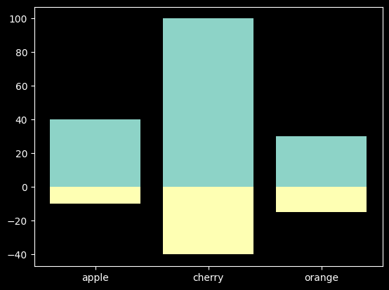

# bar2


## 基础
```python
import matplotlib.pyplot as plt
fig, ax = plt.subplots()
fruits = ['apple',  'cherry', 'orange']
counts = [40, 100, 30]
ax.bar(fruits, counts)
plt.show()
```


## bar_label

使用`bar_label()`给条形图增加数量说明

```python
import matplotlib.pyplot as plt
fig, ax = plt.subplots()
fruits = ['apple',  'cherry', 'orange']
counts = [40, 100, 30]
p = ax.bar(fruits, counts)
ax.bar_label(p, label_type='center')
plt.show()

```


## stack_bar


### 普通堆积图

```python
import matplotlib.pyplot as plt
fig, ax = plt.subplots()
fruits = ['apple',  'cherry', 'orange']
counts_good = [40, 100, 30]
counts_bad = [10, 40, 15]
ax.bar(fruits, counts_good)
ax.bar(fruits, counts_bad, bottom=counts_good)
plt.show()
```


### stack_bar_center

既能比较整体的长度, 又能比较分组的长度

```python
import matplotlib.pyplot as plt
fig, ax = plt.subplots()
fruits = ['apple',  'cherry', 'orange']
counts_good = [40, 100, 30]
counts_bad = [-10, -40, -15]
ax.bar(fruits, counts_good)
ax.bar(fruits, counts_bad)
plt.show()

```



### stack_bar_ratio
比较分组占比的差异


```python
import matplotlib.pyplot as plt
fig, ax = plt.subplots()
fruits = ['apple',  'cherry', 'orange']

counts_good = [40, 100, 30]
counts_bad = [10, 40, 15]
counts_all = [50, 140, 45]

counts_good_ratio = [0.8, 0.71, 0.66]
counts_bad_ratio = [0.2, 0.29, 0.34]

ax.bar(fruits, counts_good_ratio)
ax.bar(fruits, counts_bad_ratio, bottom=counts_good_ratio)
plt.show()
```

## group_bar
作用同堆积图类似


```python
import matplotlib.pyplot as plt
fig, ax = plt.subplots()

## 基础数据
fruits = ['apple',  'cherry', 'orange']
counts_good = [40, 100, 30]
counts_bad = [10, 40, 15]

## 设置两组数据x坐标值
data_lenth = len(counts_good)
width = 0.8
dim = 2
dim_width = width / dim

counts_good_x = [x for x in range(data_lenth)]
counts_bad_x = [x + dim_width for x in range(data_lenth)]
data_ticks = [x + 0.5*dim_width for x in range(data_lenth)]

ax.bar(counts_good_x, counts_good, dim_width)
ax.bar(counts_bad_x, counts_bad, dim_width)


## 设置标签
ax.set_xticks(data_ticks, labels=fruits)
plt.show()

```


## API
`Axes.bar(x, height, width=0.8, bottom=None, *, align='center', data=None, **kwargs)`
## 参数
参数|描述
--|--
`x: float or array-like`| x轴坐标, 对应每个矩形的中心
`height: float or array-like`|y轴坐标, 对应矩形的长度
`width: float or array-like, default: 0.8`|矩形的宽度
`bottom: float or array-like, default: 0`|矩形距离底部的距离
`align: {'center', 'edge'}, default: 'center'`|对齐方式, 默认是中心

## 返回
返回`BarContainer`对象, 包含了所有的bar对象

参考:
https://matplotlib.org/stable/plot_types/basic/bar.html


## 参考
1. https://matplotlib.org/stable/api/_as_gen/matplotlib.axes.Axes.bar.html#matplotlib.axes.Axes.bar