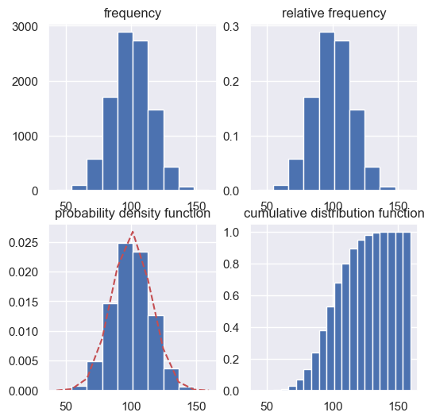
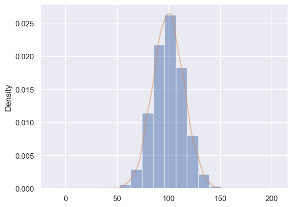

# hist


直方图主要用来查看数据的分布.


## 频数, 频率, 密度, 累计
```python
import numpy as np
import matplotlib.pyplot as plt
from scipy.stats import norm

fig, axs = plt.subplots(2,2, figsize=(6,6))

## 构建数据

mu, sigma = 100, 15
data = mu + sigma * np.random.randn(10000)

## [0,0]位置-频数图
n, bins, patches = axs[0][0].hist(data,bins=10)
axs[0][0].set(title="frequency")

## [0,1]位置-频率图, 纵轴的频率, 使用weights参数控制
weights = np.ones_like(data )/float(len(data))
n, bins, patches = axs[0][1].hist(data,bins=10, weights=weights)
axs[0][1].set(title="relative frequency")

## [1, 0]位置-概率密度, 纵轴是似然值, 使用density参数控制

mu = np.mean(data)
sigma = np.std(data)
y = norm.pdf(bins, mu, sigma)

axs[1][0].plot(bins, y, 'r--')
axs[1][0].hist(data, bins=10, density=True)
axs[1][0].set(title="probability density function")

## [1, 1]位置-累计密度函数

axs[1][1].hist(data,20,density=1, cumulative=True)
axs[1][1].set(title="cumulative distribution function")

fig.show()
```



## 快捷绘制分布以及密度
上例中使用scipy计算出密度曲线, 下面使用pandas自带的密度曲线绘制


```python
import numpy as np
import matplotlib.pyplot as plt
import pandas as pd

fig, ax = plt.subplots()

mu, sigma = 100, 15
data = mu + sigma * np.random.randn(10000)
data = pd.Series(data)

ax.hist(data, 10, density=True, alpha=0.5)
data.plot(kind = 'kde', alpha=0.5)

plt.show()

```



## API
### 参数
参数|描述
--|--
x | sequence,
bins| int or sequence, 如果是int则直接在range中划分成int个bins. 如果是sequence, 比如[1,2,3,4], 第一个bin是`[1,2)`,第二个是`[2,3)`, 最后一个是`[3,4]`注意只有最后是个右闭的
range| tuple, 默认是`(x.min(), x.max())`
density| boole, 默认是False, 如果为True, 则返回probability density: 每个bin将数量除以总数量
weights| sequence, 默认为None,  每个bin的权重
cumulative| bool, 默认为False
bottom| array-like or scalar, 每个bin的位置, 每个bin的位置是bottom to bottom + hist(x, bins). 如果是scalar, 所有的同时移动
histtype| {'bar', 'barstacked', 'step', 'stepfilled'}, default: 'bar'
align| {'left', 'mid', 'right'}, default: 'mid'
orientation| {'vertical', 'horizontal'}, default: 'vertical'
color|color or array-like of colors, 默认为None
label|str, 默认为None
stackedbool| default: False

### 返回

返回|描述
--|--
`n`: `array or list of arrays`|array, 每个bin的值
`bins`: `array`|array, bin边缘对应的值, 长度是bins的数量+1, 因为从第一个的左边缘一直到最后一个的右边缘
`patches`: `BarContainer or list of a single Polygon`|一些artists


## np.histogram
[官网API](https://numpy.org/doc/stable/reference/generated/numpy.histogram.html)
直方图(hist), 本质是还是条形图(bar). x轴是bin的坐标, y轴的bin中数据的个数. `numpy`中的`histogram`可以生成x和y的数据.
```python
a = np.random.rand(100)
hist,bins = np.histogram(a,bins=5,range=(0,1))
print(hist)  # [19 30 15 16 20]
print(bins)  # [ 0.   0.2  0.4  0.6  0.8  1. ]
```

### 参数
`histogram(a,bins=10,range=None,weights=None,density=False)`

参数|描述
--|--
a|是待统计数据的数组；
bins|指定统计的区间个数；
range|是一个长度为2的元组，表示统计范围的最小值和最大值，默认值None，表示范围由数据的范围决定
weights|为数组的每个元素指定了权值,histogram()会对区间中数组所对应的权值进行求和
density|为True时，返回每个区间的概率密度；为False，返回每个区间中元素的个数

### 返回
返回值|描述
--|--
hist array|The values of the histogram. See density and weights for a description of the possible semantics.
bin_edgesarray of dtype float|Return the bin edges (length(hist)+1).
