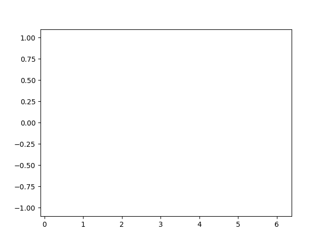

# animation

matplotlib中有两个创建动画的类`FuncAnimation`和`ArtistAnimation`. `FuncAnimation`是比较容易理解和使用更广泛的, 所以我们也使用它.

我们将自定义一个`animate`方法, 作为`FuncAnimation`的参数, `FuncAnimation`将根据`animate`的内容逐帧创建动画.


## API
`FuncAnimation(fig, func, frames=None, init_func=None, interval=200,**kwargs)`


参数|描述
--|--
`fig`|`Figure`对象
`func`|图像更新方法, 参数是帧数
`interval`|两帧间隔的时间
`frames`|总帧数
`init_func`|在调用`func`方法之前调用的方法


## 动画的理解
1. 如果是点的移动, 直接更新坐标`(x,y)`即可
2. 如果是线或者柱形图, 增长和减小, 则用新的图形替换旧的图形, 而不是只绘制增量部分. 是绘制存量+增量部分

    ```python
    line, = ax.plot([], [])
    x = np.linspace(0, 2*np.pi, num=50)
    y = np.sin(x)
    def animate(i):
        line.set_data(x[:i], y[:i])
        return line,
    ```

## 直线增长类型

```python
import numpy as np
import matplotlib.pyplot as plt
from matplotlib.animation import FuncAnimation

## 设置画板
fig, ax = plt.subplots()
ax.set(xlim=(-0.1, 2*np.pi+0.1), ylim=(-1.1, 1.1))

## 创建图形, 以及相关的数据
### 1. 创建一个空直线, animate方法会来更新它
line, = ax.plot([], [])
### 2. 创建数据
x = np.linspace(0, 2*np.pi, num=50)
y = np.sin(x)

### 3. 定义动画方法
#### 参数i 代表了动画的当前帧, 范围是0到动画的最大帧数
#### 注意返回值line后面有逗号, 因为FuncAnimation要求animate返回一个tuple对象
def animate(i):
    line.set_data(x[:i], y[:i])
    return line,

## 创建FuncAnimation
### 1. frames是设置动画总共有多少帧, 默认是做[0,len(x))帧, 即0-49帧, 所以我们要额外加1帧
### 2. interval两帧之间间隔多少毫秒
### 3. blit只绘制之前没有绘制的部分
anim = FuncAnimation(fig, animate, frames=len(x)+1, interval=30, blit=True)
## anim.save('sin.mp4')
anim.save('sin.gif')
```




## 文本案例

```python
import numpy as np
import matplotlib.pyplot as plt
from matplotlib.animation import FuncAnimation

## 设置画板
fig, ax = plt.subplots()
ax.set(xlim=(-1, 1), ylim=(-1, 1))

## 创建图形, 以及相关的数据
### 1. 创建一个text, animate方法会来更新它
### 2. 创建数据
string_to_type = 'abcdefghijklmnopqrstuvwxyz0123'
label = ax.text(0, 0, string_to_type[0],
                ha='center', va='center',
                fontsize=12)


### 3. 定义动画方法
#### 参数i 代表了动画的当前帧, 范围是0到动画的最大帧数
#### 注意返回值line后面有逗号, 因为FuncAnimation要求animate返回一个tuple对象
def animate(i):
    label.set_text(string_to_type[:i+1])
    ax.set_ylabel('Time (s): ' + str(i/10))
    ax.set_title('Frame ' + str(i))
    return label,
## 创建FuncAnimation
### 1. frames是设置动画总共有多少帧, 默认是做[0,len(x))帧, 所以我们要额外加1帧
### 2. interval两帧之间间隔多少毫秒
### 3. blit只绘制之前没有绘制的部分
anim = FuncAnimation(fig, animate, frames=len(string_to_type)+1, interval=30, blit=True)
## anim.save('2.mp4')
anim.save('2.gif')
```

## 使用Writer控制输出格式即帧率


**时间与帧数换算**
1. frames 总帧数, 这个由数据确定, 比如总共有多少个字符串, X会变化多少次
2. fps 帧率, 每秒播放所少帧
3. time = frames/fps


```python
import numpy as np
import matplotlib.pyplot as plt
from matplotlib.animation import FuncAnimation, PillowWriter, FFMpegWriter

## 设置画板
fig, ax = plt.subplots()
ax.set(xlim=(-1, 1), ylim=(-1, 1))


## 创建图形, 以及相关的数据
### 1. 创建一个text, animate方法会来更新它
### 2. 创建数据
string_to_type = 'abcdefghijklmnopqrstuvwxyz0123'
label = ax.text(0, 0, string_to_type[0],
                ha='center', va='center',
                fontsize=12)
fps = 3
### 3. 定义动画方法
#### 参数i 代表了动画的当前帧, 范围是0到动画的最大帧数
#### 注意返回值line后面有逗号, 因为FuncAnimation要求animate返回一个tuple对象
def animate(i):
    label.set_text(string_to_type[:i+1])
    ax.set_ylabel('Time (s): ' + str(i/fps))
    ax.set_title('Frame ' + str(i))
    return label,
## 创建FuncAnimation
### 1. frames是设置动画总共有多少帧, 默认是做[0,len(x))帧, 所以我们要额外加1帧
### 2. interval两帧之间间隔多少毫秒
### 3. blit只绘制之前没有绘制的部分
anim = FuncAnimation(fig, animate, frames=len(string_to_type)+1, blit=True)
anim.save('text.mp4', writer=FFMpegWriter(fps=fps))
anim.save('text.gif',writer=PillowWriter(fps=fps) )
fig.show()
```


## 动态柱状图

```python
import matplotlib.pyplot as plt
from matplotlib.animation import FuncAnimation
import numpy as np
 
fig, ax = plt.subplots(figsize=(6, 3))
x = range(20)
y = [0] * 20
 
bars = ax.bar(x, y, color="blue")
ax.axis([0, 20, 0, 10])  # x-axis from 0 to 20
                         # y-axis from 0 to 10
 
def update(frame):
    y[frame] = np.random.randint(0, 10)
    bars[frame].set_height(y[frame])
 
anim = FuncAnimation(fig, update, frames=20, interval=100)
plt.show()
```


**增长柱状图案例**

```python
import matplotlib.pyplot as plt
import matplotlib.animation as animation
from bokeh.sampledata.gapminder import population

import numpy as np
import pandas as pd

countries = ["China", "United States", "India", "Germany", "United Kingdom", "Russia", "France",
             "Australia", "Brazil", "Pakistan"]
countries = sorted(countries)
population = population[population.index.isin(countries)]

def create_tick_label(pop):
    if pop >= 1e9:
        return "{:.2f} Bn".format(pop/1e9)
    else:
        return "{:.2f} Mn".format(pop/1e6)

### Create Initial Chart
xdata, ydata = range(10), population[["1964"]].values.flatten()

fig, ax = plt.subplots()
fig.set_figheight(8)
fig.set_figwidth(15)

ax.set_title("Population Over Time (1964-2013)", loc="left", fontdict=dict(fontsize=20, fontweight="bold"), pad=10)

bars = ax.bar(x=list(xdata), height=ydata, width=0.85, color=plt.cm.tab10.colors)

ax.set_ylim(0, 1.5e9)

ax.set_xlabel("Countries")
ax.set_ylabel("Population")

ax.set_yticks(np.arange(0,1.6e9,0.2e9), [create_tick_label(pop) for pop in np.arange(0,1.6e9,0.2e9)])

ax.hlines(1.3e9,-0.5,10, linewidth=5.0, color="tomato", linestyle="dashed", label="1.3 Billion")
ax.hlines(1e9,-0.5,10, linewidth=5.0, color="orange", linestyle="dashed", label="1 Billion")
ax.hlines(0.5e9,-0.5,10, linewidth=5.0, color="green", linestyle="dashed", label="Half Billion")

ax.grid(axis="y")

year_label = ax.text(-0.5, 750e6, "Year: 1964", fontsize=20, color="tomato", fontweight="bold")

country_labels = []
for country, i, pop in zip(countries, xdata, ydata):
    label = ax.text(i, pop, country, color="black", fontsize=9, ha="center", va="bottom", fontweight="bold")
    country_labels.append(label)

plt.legend(loc="best")

### Data Generator
def data_gen():
    for year in range(1965,2014):
        yield year, population[[str(year)]].values.flatten()


### Animation Function
def run(data):
    year, bar_heights = data
    for i, bar in enumerate(bars.patches):
        bar.set_height(bar_heights[i]) ## Update Line

    year_label.set_text("Year: {}".format(year))

    for i, height in enumerate(bar_heights):
        country_labels[i].set_position((i, height))

    return bars

anim = animation.FuncAnimation(fig, run, data_gen, interval=100, repeat=False)

plt.show()
```


## 直线图案例

```python
import matplotlib.pyplot as plt
import matplotlib.animation as animation

import numpy as np
import pandas as pd

from datetime import datetime, date

apple_df = pd.read_csv("~/datasets/AAPL.csv")

### Convert date from string to datetime.date object.
xdata = [date.fromisoformat(dt) for dt in apple_df[:22]["Date"].values.tolist()]
y1data = apple_df[:22]["Open"].values.tolist()
y2data = apple_df[:22]["High"].values.tolist()
y3data = apple_df[:22]["Low"].values.tolist()
y4data = apple_df[:22]["Close"].values.tolist()

### Create Initial Chart
fig, ax = plt.subplots()

fig.set_figheight(10)
fig.set_figwidth(15)

ax.set_title("Apple OHLC Prices")

line1, = ax.plot(xdata, y1data, lw=2, label="Open", color="tomato")
line2, = ax.plot(xdata, y2data, lw=2, label="High", color="dodgerblue")
line3, = ax.plot(xdata, y3data, lw=2, label="Low", color="lime")
line4, = ax.plot(xdata, y4data, lw=2, label="Close", color="orange")

ax.set_ylim(150, 350)
ax.set_xlim(date(2019,4,5), date(2020,5,1))

ax.set_xlabel("Date")
ax.set_ylabel("Price ($)")

ax.grid()

plt.legend(loc="best")

### Data Generator
def data_gen():
    dates = apple_df[22:]["Date"].values.tolist()
    os, hs, ls, cs = apple_df[22:]["Open"], apple_df[22:]["High"], apple_df[22:]["Low"], apple_df[22:]["Close"]
    for dt, o,h,l,c in zip(dates, os, hs, ls, cs):
        yield date.fromisoformat(dt), o,h,l,c ## Convert date from string to datetime.date object.

### Animation Function
def run(data):
    # update the data
    date, o,h,l,c = data
    xdata.append(date)
    y1data.append(o)
    y2data.append(h)
    y3data.append(l)
    y4data.append(c)

    line1.set_data(xdata, y1data) ## Update Line
    line2.set_data(xdata, y2data) ## Update Line
    line3.set_data(xdata, y3data) ## Update Line
    line4.set_data(xdata, y4data) ## Update Line

    return line1, line2, line3, line4

anim = animation.FuncAnimation(fig, run, data_gen, interval=15, repeat=False)

plt.show()
```


## 泡泡图案例

```python
import matplotlib.pyplot as plt
import matplotlib.animation as animation
from bokeh.sampledata.gapminder import population

import numpy as np
import pandas as pd

countries = ["China", "United States", "India", "Germany", "United Kingdom", "Russia", "France",
             "Australia", "Brazil", "Pakistan"]
countries = sorted(countries)
population = population[population.index.isin(countries)]

def create_tick_label(pop):
    if pop >= 1e9:
        return "{:.2f} Bn".format(pop/1e9)
    else:
        return "{:.2f} Mn".format(pop/1e6)

### Create Initial Chart
xdata, ydata = [1964,]*10, population[["1964"]].values.flatten()

fig, ax = plt.subplots()
fig.set_figheight(8)
fig.set_figwidth(15)

ax.set_title("Population Over Time (1964-2013)", loc="left", fontdict=dict(fontsize=20, fontweight="bold"), pad=10)

points = ax.scatter(x=ydata, y=range(10), s=ydata/1e5, alpha=0.8, color=plt.cm.tab10.colors)

ax.set_xlabel("Population")
ax.set_ylabel("Countries")

ax.set_xlim(0, 1.5e9)
ax.set_ylim(-1,10)

ax.set_yticks(range(10), countries)
ax.set_xticks(np.arange(0,1.6e9,0.2e9), [create_tick_label(pop) for pop in np.arange(0,1.6e9,0.2e9)])

ax.vlines(1.3e9,-0.5,10, linewidth=5.0, color="tomato", linestyle="dashed", label="1.3 Billion")
ax.vlines(1e9,-0.5,10, linewidth=5.0, color="orange", linestyle="dashed", label="1 Billion")
ax.vlines(0.5e9,-0.5,10, linewidth=5.0, color="green", linestyle="dashed", label="Half Billion")

ax.grid(axis="both")

plt.legend(loc="best")

year_label = ax.text(1.05e9, 9.2, "Year: 1964", fontsize=20, color="tomato", fontweight="bold")

### Data Generator
def data_gen():
    for year in range(1965,2014):
        yield year, population[[str(year)]].values.flatten()

### Animation Function
def run(data):
    year, point_sizes = data
    points.set_sizes(point_sizes/1e5)
    points.set_offsets(list(zip(point_sizes, range(10))))

    year_label.set_text("Year: {}".format(year))

    return points

anim = animation.FuncAnimation(fig, run, data_gen, interval=100, repeat=False)

plt.show()
```

## 点沿着方程曲线移动

```python
import matplotlib.pyplot as plt
from matplotlib.animation import FuncAnimation
import numpy as np
fig, ax = plt.subplots(figsize=(6, 6))
ax.set(xlim=[0,10],ylim=[0,10])

x = np.linspace(0.1,10,1000)

def func(x):
    return 10/x
y = func(x)

ax.plot(x,y)
sca = ax.scatter([6],[func(6)])


frames = 10

def update(i):
    x = 6-(6-2)/frames * i
    y = func(x)
    sca.set_offsets((x,y))  # 不要被方法名迷惑, 就是在设置点的位置

anim = FuncAnimation(fig, update, frames=frames, interval=100)

fig.show()

```


参考:
https://blog.finxter.com/matplotlib-animation/
https://brushingupscience.com/2016/06/21/matplotlib-animations-the-easy-way/
https://brushingupscience.com/2019/08/01/elaborate-matplotlib-animations/
https://holypython.com/how-to-create-matplotlib-animations-the-ultimate-guide/
https://holypython.com/how-to-save-matplotlib-animations-the-ultimate-guide/
https://coderslegacy.com/python/matplotlib-funcanimation/
https://coderzcolumn.com/tutorials/data-science/matplotlib-animations