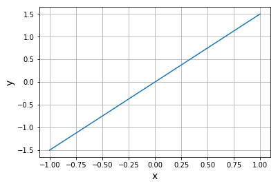
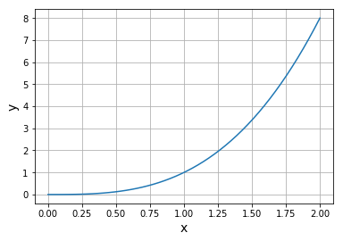
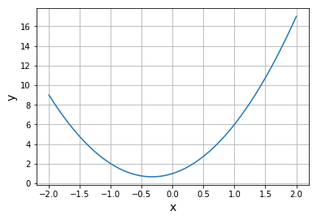
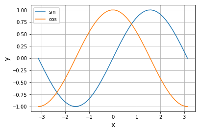
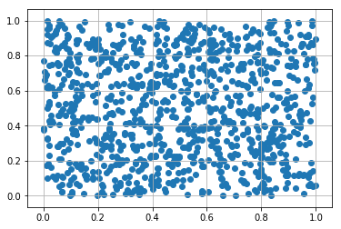
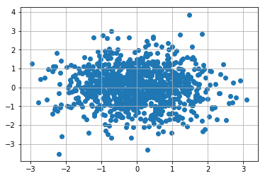

# generator

## 变量与常量
1. 变量: 可以变化的符号, 比如$1,2.5,-5$等, 另外$a,b$等字母和$\alpha,\beta$等希腊字母也用来表示常量
2. 常量: 不能变化的具体的数字, 比如$x,y$

使用变量和常量表示公式:
$$
y=ax
$$
其中:$x,y$是变量, $a$是常量
```python
import numpy as np
import matplotlib.pyplot as plt

a = 1.5  # a: 常量
x = np.linspace(-1,1)  # x: 变量-1到1的范围
y = a * x  # y: 变量

plt.plot(x, y)
plt.xlabel("x", size=14)
plt.ylabel("y", size=14)
plt.grid()
plt.show()
```
根据$y=ax$绘制了直线, $x,y$发生变化, 而$a$不变.


## 函数
函数是决定某个值$x$与其从属值$y$之间关系的概念. 例如, 如果$x$决定$y$的值, 则函数$f$可以表示为:
$$
y=f(x)
$$
也就是说$y$是$x$的函数.
更多的例子:
$$
\begin{align*}
& y=3x  \\
& y=3x+2  \\
& y=3x^2+2x+1
\end{align*}
$$

数学中的函数和编程中的函数很相似.
1. 数学中的表示为 $y=f(x)$, 包含带入函数的值$x$,以及经过函数处理后得到的$y$
2. 编程中的表示为 `def func(para): return res`, 包含传入函数的参数`para`, 和返回值`res`

用编程的函数实现数学函数$y=3x+2$
```python
def my_func(x):  # 使用名为my_func的Python函数来实现数学公式
    return 3*x + 2  #  返回3x + 2

x = 4  # 全局变量，并非与上述的参数x为同一变量
y = my_func(x)  # y = f(x)
print(y)
```

## 幂与平方根
### 幂
将相同的数字多次相乘, 被称为幂. 例如$2 \times 2 \times 2=2^3$, 读作2的3次方.
以此类推,将$x,y$做为变量, $a$为常量, 幂可以表示为:
$$
y=x^a
$$
如果$a=0$,$y=1$,则$x^0=1$
有关幂的性质如下:
$$
\begin{align*}
(x^a)^b=x^{ab}  \\
x^ax^b=x^{a+b}  \\
x^{-a}=\frac{1}{x^a}
\end{align*}
$$

在python中,幂被记作`**`:
```python
import numpy as np
import matplotlib.pyplot as plt

def my_func(x):
    a = 3
    return x**a  # x的a次方

x = np.linspace(0, 2)
y = my_func(x)  # y = f(x)

plt.plot(x, y)
plt.xlabel("x", size=14)
plt.ylabel("y", size=14)
plt.grid()
plt.show()
```


### 平方根
幂的逆运算.平方根有正值和负值, 例如9的平方根为3和-3.
$$
y=\sqrt{x}
$$
python实现:
```python
import numpy as np
import matplotlib.pyplot as plt

def my_func(x):
    return np.sqrt(x)  # x的正平方根。与x**(1/2)相同

x = np.linspace(0, 9)
y = my_func(x)  # y = f(x)

plt.plot(x, y)
plt.xlabel("x", size=14)
plt.ylabel("y", size=14)
plt.grid()
plt.show()
```

## 多项式函数
由多项组成的函数, 称为多项式函数.比如:
$$
\begin{align*}
& y=3x^2+2x+1 \\
& y=4x^3+2x^2+x+3
\end{align*}
$$
定义如下:
$$
y=a_nx^n+...+a_1x+a_0
$$
像这样x右肩上的最大整数(次方)为n的多项式被称为n次多项式.
```python
import numpy as np
import matplotlib.pyplot as plt

def my_func(x):  
    return 3*x**2 + 2*x + 1

x = np.linspace(-2, 2)
y = my_func(x)  # y = f(x)

plt.plot(x, y)
plt.xlabel("x", size=14)
plt.ylabel("y", size=14)
plt.grid()
plt.show()
```



## 三角函数
$$
sin\theta = \frac{对边}{斜边}  \\
cos\theta = \frac{邻边}{斜边}  \\
tan\theta = \frac{对边}{邻边}
$$
$sin\theta, cos\theta, tan\theta$被称为三角函数, 满足以下关系:
$$
(sin\theta)^2+(cos\theta)^2=1 \\
tan\theta = \frac{sin\theta}{cos\theta}
$$
三角函数使用弧度作为角度$\theta$的单位.$\pi$相当于180度.

```python
import numpy as np
import matplotlib.pyplot as plt

def my_sin(x):  
    return np.sin(x)  # sin(x)

def my_cos(x):
    return np.cos(x)  # cos(x)

x = np.linspace(-np.pi, np.pi)  #从-π到π（弧度）为止
y_sin = my_sin(x)
y_cos = my_cos(x)

plt.plot(x, y_sin, label="sin")
plt.plot(x, y_cos, label="cos")
plt.legend()

plt.xlabel("x", size=14)
plt.ylabel("y", size=14)
plt.grid()

plt.show()
```



## 总和与总积
### 总和
将所有数值相加:
$$
a_1+a_2+...+a_n
$$
可以简写成:
$$
\sum_{k=1}^n a_k
$$
例如之前的多项式就可以写成:
$$
y=a_nx^n+a_{n-1}x^{n-1}+...+a_1x+a_0 = \sum_{k=0}^na_kx^k
$$
```python
import numpy as np

a = np.array([1, 3, 2, 5, 4])  # 从a1到a5
y = np.sum(a)  # 求和
print(y)
```

### 总积
将多个数值相乘:
$$
a_1a_2...a_{n-1}a_n
$$
可以简写成:
$$
\prod_{k=1}^na_k
$$

```python
import numpy as np

a = np.array([1, 3, 2, 5, 4])  # 从a1到a5
y = np.prod(a)  # 求乘积
print(y)
```


## 随机数
在机器学习中, 随机数被用于参数的初始化中.
```python
import numpy as np

r_int = np.random.randint(6) + 1  # 将0到5之间的随机数加1
print(r_int)  # 随机显示1到6
```
### 随机均匀分布
```python
import numpy as np
import matplotlib.pyplot as plt

n = 1000  # 样本数
x = np.random.rand(n)  # 0~1 的均匀随机数
y = np.random.rand(n)  # 0~1 的均匀随机数

plt.scatter(x, y)  # 绘制散点图
plt.grid()
plt.show()
```


### 正态分布
```python
import numpy as np
import matplotlib.pyplot as plt

n = 1000  # 样本数
x = np.random.randn(n)  # 遵循正态分布的随机数
y = np.random.randn(n)  # 遵循正态分布的随机数

plt.scatter(x, y)  # 绘制散点图
plt.grid()
plt.show()
```


## 绝对值
机器学习中, 绝对值有时被用于把握以0位中心的值的拓展情况.

$$
|x|=
\begin{cases}
    -x，& x<0 \\
    x, & x \geq 0
\end{cases}
$$
比如:
$$
|-5|=5 \\
|5| = 5
$$
```python
import numpy as np

x = [-5, 5, -1.28, np.sqrt(5), -np.pi/2]  # 将各个值储存进列表
print(np.abs(x))  # 求绝对值
```


