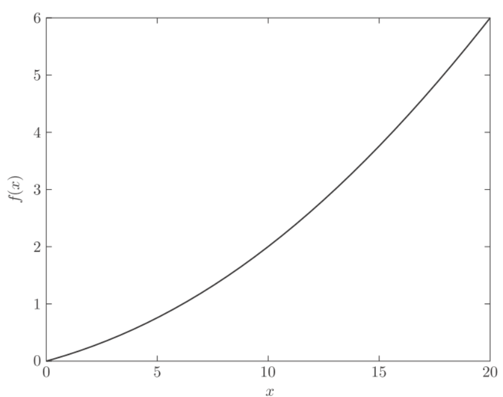
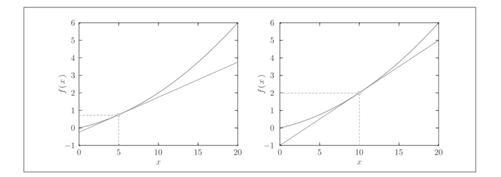
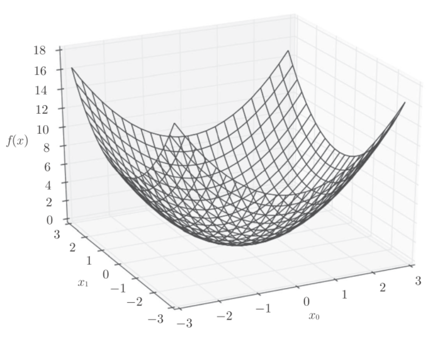
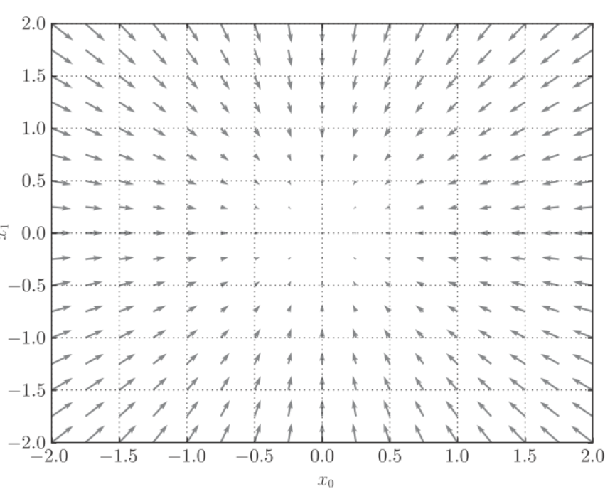
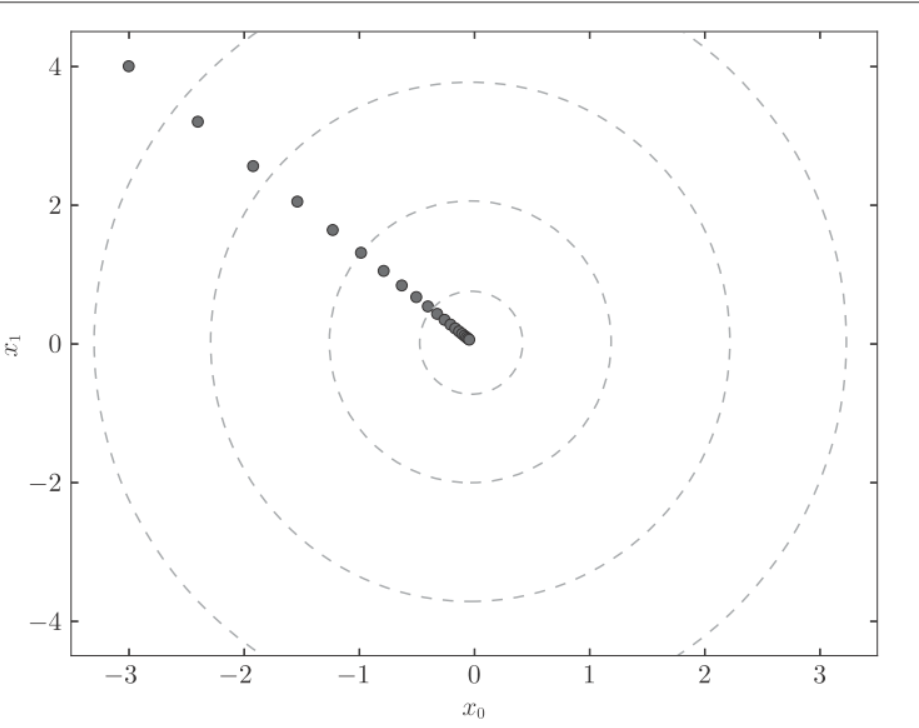

# annotate

导数就是表示某个瞬间的变化量:
$\frac{df(x)}{dx}=\lim\limits_{h->0}\frac{f(x+h)-f(x)}{h}$
$\frac{df(x)}{dx}$表示$f(x)$关于$x$的导数, 即$f(x)$相对于$x$的变化程度, x的微小变化将导致函数$f(x)$的值在多大程度上发生变化.其中, 微小变化的$h$无限趋近0, 表示为$\lim\limits_{h->0}$.


python实现:
```python
def numerical_diff(f, x):
    h = 10e-50
    return (f(x+h) - f(x)) / h
```
函数有两个参数: "函数f"和"传给函数f的参数". 这样的实现有两个问题:
- rounding error, 由于h太小, 会被四舍五入`np.float32(1e-50)=0`
- 导数应该对应x处的斜率(切线), 但实际计算的是$(x+h)$和$x$之间的斜率(因为h不可能无限接近0).

为了减少这个误差, 我们可以计算函数f在$(x+h)$和$(x-h)$之间的差分, 这种方法以x为中心, 称为中心差分(x+h和x之间的差分称为向前差分)

```python
def numerical_diff(f, x):
    h = 1e-4 # 0.0001
    return (f(x+h) - f(x-h)) / (2*h)
```
微小的差分求导数的过程称为数值微分(numerical differentiation), 而基于数学式的推导求导数的过程，则用“解析性”(analytic). 如$y=x^2$的导数, 可以通过$\frac{dy}{dx}=2x$求解.


## 数值微分的例子


python实现公式:$y=0.01x^2+0.1x$:
```python
def function_1(x):
    return 0.01*x**2 + 0.1*x

import numpy as np
import matplotlib.pylab as plt
x = np.arange(0.0, 20.0, 0.1) # 以0.1为单位，从0到20的数组x
y = function_1(x)
plt.xlabel("x")
plt.ylabel("f(x)")
plt.plot(x, y)
plt.show()
```



计算$x=5$和$x=10$的导数

```python
numerical_diff(function_1, 5)  # 0.1999999999990898
numerical_diff(function_1, 10)  # 0.2999999999986347
```
$f(x)=0.01x^2+0.1x$的解析结果是$\frac{df(x)}{dx}=0.02x+0.1$. 因此在$x=5$和$x=10$处真正的导数是0.2和0.3, 和上述结果相比, 误差非常小.



## 偏导数
python实现函数$f(x_0,x_1)=x_0^2+x_1^2$:
```python
def function_2(x):
    return x[0]**2 + x[1]**2
    # 或者return np.sum(x**2)
```
画出该函数的图像:


因为函数中有两个变量, 所以要区分对哪个变量求导数, 是$x_0$还是$x_1$, 有多个变量的函数的导数称为偏导数, 写作$\frac{\partial f}{\partial x_0}$, $\frac{\partial f}{\partial x_1}$


求$x_0=3,x_1=4$时, 关于$x_0$的偏导数$\frac{\partial f}{\partial x_0}$
```python
def function_tmp1(x0):
    return x0*x0 + 4.0**2.0
numerical_diff(function_tmp1, 3.0)  # 6.00000000000378
```

求$x_0=3,x_1=4$时, 关于$x_1$的偏导数$\frac{\partial f}{\partial x_1}$
```python
def function_tmp2(x1):
    return 3.0**2.0 + x1*x1
numerical_diff(function_tmp2, 4.0)  # 7.999999999999119
```
这些问题中, 我们定义了单变量的函数, 并且对这个函数求导. 例如第一个, 固定了$x_1=4$的新函数, 然后对$x_0$进行求导


## 梯度(gradient)
我们分别计算了$x_0,x_1$的偏导数, 就可以组成$(\frac{\partial f}{\partial x_0},\frac{\partial f}{\partial x_1})$, 这样的向量称为梯度(gradient)
python实现:
```python
def numerical_gradient(f, x):
    h = 1e-4 # 0.0001
    grad = np.zeros_like(x) # 生成和x形状相同的数组
    for idx in range(x.size):
        tmp_val = x[idx]
        # f(x+h)的计算
        x[idx] = tmp_val + h
        fxh1 = f(x)
        # f(x-h)的计算
        x[idx] = tmp_val - h
        fxh2 = f(x)
        grad[idx] = (fxh1 - fxh2) / (2*h)
        x[idx] = tmp_val # 还原值
    return grad
```
应用:
```python
numerical_gradient(function_2, np.array([3.0, 4.0]))  # array([ 6.,  8.])
numerical_gradient(function_2, np.array([0.0, 2.0]))  # array([ 0.,  4.])
numerical_gradient(function_2, np.array([3.0, 0.0]))  # array([ 6.,  0.])
```

$f(x_0,x_1)=x_0^2+x_1^2$的梯度呈现为有向向量(箭头), 梯度指向函数$f(x_0,x_1)$的最低处(最小值).另外, 离最低处越远, 箭头越大.



## 梯度法
在梯度法中, 函数的取值从当前位置沿着梯度方向前进一定距离, 然后在新的方向重新求梯度, 再沿着新梯度的方向前进, 如此反复, 不断地沿梯度前进.

$x_0=x_0-\eta\frac{\partial f}{\partial x_0}$
$x_1=x_1-\eta\frac{\partial f}{\partial x_1}$

$\eta$表示更新量, 在神经网络中, 称为学习率(learning rate), 表示一次mini-batch迭代中, 学习多少, 多大程度上更新参数.

python实现梯度下降法:

```python
def gradient_descent(f, init_x, lr=0.01, step_num=100):
    x = init_x
    for i in range(step_num):
        grad = numerical_gradient(f, x)
        x -= lr * grad
    return x
```

参数`f`是进行最优化的函数, `init_x`是初始值, `lr`是学习率(learning rate), `step_num`是重复次数.

应用: 使用梯度法求$f(x_0,x_1)=x_0^2+x_1^2$的最小值
```python
def function_2(x):
    return x[0]**2 + x[1]**2
init_x = np.array([-3.0, 4.0])
gradient_descent(function_2, init_x=init_x, lr=0.1, step_num=100)
## array([ -6.11110793e-10,   8.14814391e-10])
```
最终的结果(-6.11110793e-10,8.14814391e-10)非常接近(0,0), 下图是梯度法的更新过程



## 神经网络的梯度
神经网络的梯度是指损失函数关于权重参数的梯度, 比如一个2*3的权重$W$的神经网络, 损失函数用$L$表示, 则梯度可以用$\frac{\partial L}{\partial W}$表示:
$$
W=
\left(\begin{matrix}
w_{11},w_{12},w_{13} \\
w_{21},w_{22},w_{23}
\end{matrix}\right)
$$

$$
\frac{\partial L}{\partial W}=
\left(\begin{matrix}
\frac{\partial L}{\partial w_{11}},\frac{\partial L}{\partial w_{12}},\frac{\partial L}{\partial w_{13}} \\
\frac{\partial L}{\partial w_{21}},\frac{\partial L}{\partial w_{22}},\frac{\partial L}{\partial w_{23}}
\end{matrix}\right)
$$
第1行,第1列的元素$\frac{\partial L}{\partial w_{11}}$当$w_{11}$稍微变化时, 损失函数$L$会发生多大变化.

