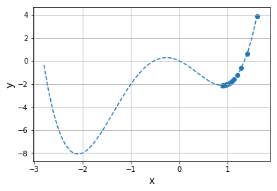

# differential

## 极限与微分

### 极限
极限是指当函数中的变量的值接近某个值时, 函数的值无限接近的值.
例如, 假设在函数$y=x^2+1$中, $x$逐渐减小到接近0.
- x=2时, y=5
- x=1时, y=2
- x=0.5时, y=1.25
- x=0.1时, y=1.01
- x=0.01时, y=1.0001

通过这些结果会发现, x越接近0, y就越接近1. 用极限公式表示为:
$$
\lim_{x \to 0}y=lim_{x \to 0}(x^2+1)=1
$$
公式表达的含义是 当$x$无限接近0时, y无限接近1.

### 微分
在函数$y=f(x)$中, 假设x的微小变化量为$\Delta x$, 那么当x的变化为$\Delta x$时,y的值为:
$$
y=f(x+\Delta x)
$$
此时, y的微小变化为:
$$
\Delta y = f(x+\Delta x)- f(x)
$$
则y的微小变化$\Delta y$与x的微小变化$\Delta x$的比率可以表示为:
$$
\frac{\Delta y}{\Delta x}=\frac{f(x+\Delta x)-f(x)}{\Delta x}
$$
令$\Delta x$的值无限接近于0时:
$$
f'(x)=\lim_{\Delta x \to 0}\frac{f(x+\Delta x)-f(x)}{\Delta x}
$$
这里的$f'(x)$称作$f(x)$的导数(或导函数). 而从函数$f(x)$得到导数$f'(x)$的行为, 称为对函数$f(x)$的微分.
导数还可以表示为:
$$
f'(x)=\frac{df(x)}{dx}=\frac{d}{dx}f(x)
$$
y相对于x的变化率称为斜率, 导数可以用于确定单变量函数上的某一点的斜率.


### 微分公式
在$r$是任意实数的情况下:
$$
\frac{df(x)}{dx}=\frac{dx^r}{dx}=rx^{r-1}
$$
对$f(x)+g(x)$进行微分时:
$$
\frac{d[f(x)+g(x)]}{dx}=\frac{df(x)}{dx}+\frac{dg(x)}{dx}
$$
对$f(x)g(x)$进行微分时:
$$
\frac{d[f(x)+g(x)]}{dx}=g(x)\frac{df(x)}{dx}+f(x)\frac{dg(x)}{dx}
$$
如果k是任意实数, 则:
$$
\frac{dkf(x)}{dx}=k\frac{df(x)}{dx}
$$

使用python绘制切线:
函数 $f(x )=3x^2+4x-5$ 在 $x=1$ 时的切线
```python
import numpy as np
import matplotlib.pyplot as plt

def my_func(x):
    return 3*x**2 + 4*x - 5

def my_func_dif(x):  # 导数
    return 6*x + 4

x = np.linspace(-3, 3)
y = my_func(x)

a = 1
y_t = my_func_dif(a)*x + my_func(a) - my_func_dif(a)*a  # x=1时的切线。使用切线的计算式

plt.plot(x, y, label="y")
plt.plot(x, y_t, label="y_t")
plt.legend()

plt.xlabel("x", size=14)
plt.ylabel("y", size=14)
plt.grid()

plt.show()
```

## 连锁率(chain rule)
对复合函数进行微分.
### 复合函数
$$
y=f(u) \\
u=g(x)
$$
由多个函数复合表示的函数, 如$y=(x^2+1)^3$是一个复合函数:
$$
y=u^3 \\
u=x^2+1
$$

### 连锁率(chain rule)
复合函数的微分可以用组成函数的导数的乘积来表示, 这就是连锁率.
$$
\frac{dy}{dx}=\frac{dy}{du}\frac{du}{dx}
$$
当y是u的函数,u是x的函数时, 可以用上式进行微分.例如:
$$
y=(x^3+2x^2+3x+4)^3
$$
其中$u$为:
$$
u=x^3+2x^2+3x+4
$$
则$y$为:
$$
y=u^3
$$
通过连锁率公式计算:
$$
\begin{align*}
\frac{dy}{dx}=&\frac{dy}{du}\frac{du}{dx} \\
=&3u^2(3x^2+4x+3) \\
=&3(x^3+2x^2+3x+4)(3x^2+4x+3)  
\end{align*}
$$

## 偏微分
偏微分用给一个变量对多变量函数进行的微分. 在机器学习中, 用于确定单个参数的变化对整体的影响.

### 偏微分
对具有多个变量的函数, 仅用一个变量进行的微分被称为偏微分. 在偏微分过程中, 其他变量被视为常数.
$$
\frac{\partial}{\partial x}f(x,y)=\lim_{\Delta x \to 0}\frac{f(x+\Delta x,y)-f(x,y)}{\Delta x}
$$

假设函数$f(x,y)$具有以下变量$x,y$:
$$
f(x,y)=3x^2+4xy+5y^3
$$
在偏微分时, y被当做常数处理, 需要利用微分公式用x进行微分.
$$
\frac{\partial}{\partial x}f(x,y)=6x+4y
$$
这种通过偏微分求出的函数被称为偏导数. 此时, 偏导数是在y值固定的情况下,$f(x,y)$的变化与x的变化的变化之比.
$f(x,y)$中y的偏微分如下, 此时x是常量:
$$
\frac{\partial}{\partial y}f(x,y)=4x+15y^2
$$
这个结果代表x固定时, $f(x,y)$的变化与y的变化之比.


## 全微分
使用所有变量的微小变化来确定多变量函数的微小变化.
双变量函数$z=f(x,y)$的全微分表达式为:
$$
dz=\frac{\partial z}{\partial x}dx + \frac{\partial z}{\partial y}dy
$$
分别将x的偏微分与x的微小变化$dx$相乘,将y的偏微分与y的微小变化$dy$相乘, 最后将二者的积求和就可以得到z的微小变化$dz$.

## 自然常数与自然对数
### 自然常数
自然常数 $e$同圆周率$pi$一样,是一个无穷的小数:
$$
e = 2.718281828459...
$$
可以通过下面等式求$e$的值:
$$
e = \lim_{n \to \infty}(1+\frac{1}{n})^n
$$
当n变大时,$(1+\frac{1}{n})^n$逐渐接近于$e$的值.
自然常数经常用于幂的形式:
$$
y=e^x
$$
这个等式的特点是,使用x求微分, 公式不变:
$$
\frac{dy}{dx}=\lim_{\Delta x \to 0} \frac{e^{x-\Delta x}-e^x}{\Delta x}
$$
另外,还有一种写法是:
$$
y=exp(x)
$$
python获取自然对数
```python
import numpy as np

print(np.e)  # 自然常数
print(np.exp(1))  # e的1次方
```
绘制自然常数的幂的图像
```python
import numpy as np
import matplotlib.pyplot as plt

x = np.linspace(-2, 2)
y = np.exp(x)   # 自然常数的幂

plt.plot(x, y)

plt.xlabel("x", size=14)
plt.ylabel("y", size=14)
plt.grid()

plt.show()
```

### 自然对数
对$y=a^x(a>0,a \neq 1)$进行变形, 使左边为x, 可以表示如下:
$$
x=\log_ay
$$
x表示使a进行乘方后等于y的数字.
将x与y的位置互换:
$$
y=\log_ax
$$
$\log_ax$被称为对数.
当a等于自然常数e时, $\log_ex$被称为自然对数.
$$
y= \log_ex
$$
e的y次方等于x, 自然对数本身表示, 将e进行几次方后等于x. 自然常数经常会被省略:
$$
y=\log_x
$$
自然对数的常用性质:
$$
\log_apq=\log_ap + \log_aq \\
\log_a\frac{p}{q} = \log_ap-\log_aq \\
\log_ap^r = r\log_ap
$$

### 自然对数与导数
自然对数的导数:
$$
\frac{d}{dx}\log x = \frac{1}{x}
$$
导数的形式简单是自然对数的优点之一.
也可以用自然对数表示幂的导数, 如$y=a^x$:
$$
\frac{d}{dx}a^x = a^x\log a
$$
当a等于自然常数e时:
$$
\frac{d}{dx}e^x = e^x
$$
即使将自然常数的幂进行微分, 其结果仍然保持原来的形式.由于微分起来比较简单, 因此存在幂的函数中经常会用到自然常数.

python使用log()函数计算自然对数
```python
import numpy as np

print(np.log(np.e))  # 自然常数的自然对数
print(np.log(np.exp(2)))   # 自然常数平方的自然对数
print(np.log(np.exp(12)))  # 自然常数12次方的自然对数

```
绘制自然对数的图像
```python
import numpy as np
import matplotlib.pyplot as plt

x = np.linspace(0.01, 2) # 无法令x为0
y = np.log(x)  # 自然対数

plt.plot(x, y)

plt.xlabel("x", size=14)
plt.ylabel("y", size=14)
plt.grid()

plt.show()
```

### sigmoid函数
$$
y= \frac{1}{1+exp(-x)}
$$
微分可得:
$$
\frac{dy}{dx}=(1-y)y
$$
Sigmoid 函数及其导数的图像/
```python
import numpy as np
import matplotlib.pylab as plt

def sigmoid_function(x):  # Sigmoid函数
    return 1/(1+np.exp(-x))

def grad_sigmoid(x): # Sigmoid函数的导数
    y = sigmoid_function(x)
    return (1-y)*y

x = np.linspace(-5, 5)
y = sigmoid_function(x)
y_grad = grad_sigmoid(x)

plt.plot(x, y, label="y")
plt.plot(x, y_grad, label="y_grad")
plt.legend()

plt.xlabel("x", size=14)
plt.ylabel("y", size=14)
plt.grid()

plt.show()
```

## 梯度下降法

### 梯度下降法
梯度法是根据函数的微分值搜索最小值的算法. 梯度下降法也是一种梯度法, 通过向最陡方向下降查找最小值.
首先研究$f(\vec{x})$这个多变量函数的最小值:
$$
f(\vec{x})=f(x_1,x_2,...,x_n)
$$
可以适当地为$\vec{x}$确定一个初始值, 接下来$\vec{x}$所有的元素都会通过下面的表达式更新:
$$
x_i = x_i - \eta\frac{\partial f(\vec{x})}{\partial x_i}
$$
$\eta$被称为学习系数的常数, 决定$x_i$的更新速度. 根据表达式, 斜率$\frac{\partial f(\vec{x})}{\partial x_i}$越大(越陡), $x_i$值的变化就越大.
重复次操作, 知道$f(\vec{x})$停止变化(斜率为0), 求得$f(\vec{x})$的最小值.

使用梯度下降法求得:
$$
f(x) = x^2 -2x
$$
的最小值

```python
import numpy as np
import matplotlib.pyplot as plt

def my_func(x):  # 计算最小值的函数
    return x**2 - 2*x

def grad_func(x): # 导数
    return 2*x - 2

eta = 0.1  # 学习系数
x = 4.0  # 为x设定初始值
record_x = []  # x的记录
record_y = []  # y的记录
for i in range(20):  # 将x更新20次
    y = my_func(x)
    record_x.append(x)
    record_y.append(y)
    x -= eta * grad_func(x)  # 式（5-9）

x_f = np.linspace(-2, 4)# 显示范围
y_f = my_func(x_f)  

plt.plot(x_f, y_f, linestyle="dashed") # 用虚线显示函数
plt.scatter(record_x, record_y)  # 显示x与y的记录

plt.xlabel("x", size=14)
plt.ylabel("y", size=14)
plt.grid()

plt.show()
```

### 局部最小值
不过, 通过梯度下降法求出的最小值不是严格意义上的最小值.
最小值分为全局最小值和局部最小值. 比如求如下函数的最小值:
$$
f(x) = x^4 + 2x^3 - 3x^2 -2x
$$
```python
import numpy as np
import matplotlib.pyplot as plt

def my_func(x):  # 计算最小值的函数
    return x**4 + 2*x**3 - 3*x**2 - 2*x

def grad_func(x):  # 导数
    return 4*x**3 + 6*x**2 - 6*x - 2

eta = 0.01  # 学习系数
x = 1.6  # 为x设定初始值
record_x = []  # x的记录
record_y = []  # y的记录
for i in range(20):  # 将x更新20次
    y = my_func(x)
    record_x.append(x)
    record_y.append(y)
    x -= eta * grad_func(x)  # 式（5-9）

x_f = np.linspace(-2.8, 1.6)   # 显示范围
y_f = my_func(x_f)  

plt.plot(x_f, y_f, linestyle="dashed")  # 用虚线显示函数
plt.scatter(record_x, record_y)   # 显示x与y的记录

plt.xlabel("x", size=14)
plt.ylabel("y", size=14)
plt.grid()

plt.show()
```

