## 如何求圆的面积
圆的面积是$\pi R^2$, 是如何求得呢?

首先, 将圆分割成无数个小圆环.

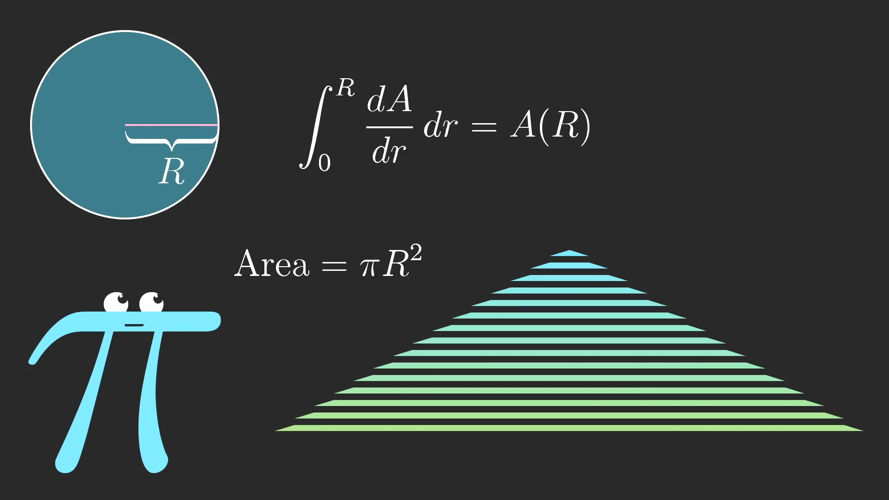

每个圆环近似的可以看成是一个长方型.

每个圆环的长度是$2\pi r$

每个小圆环的宽度是$dr$, 具体值取决于圆环的个数, 圆环个数越多, $dr$越小; 圆环个数越少, $dr$越大.

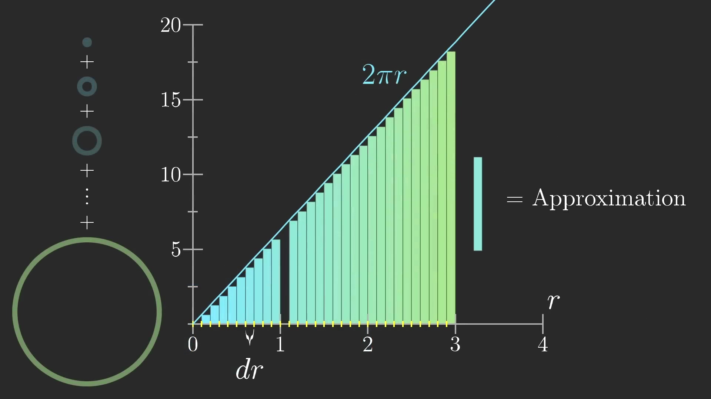

随着圆环个数增加, 圆的面积近似等于直线$2 \pi r$下面的面积.

这里以$r=3$为例, 

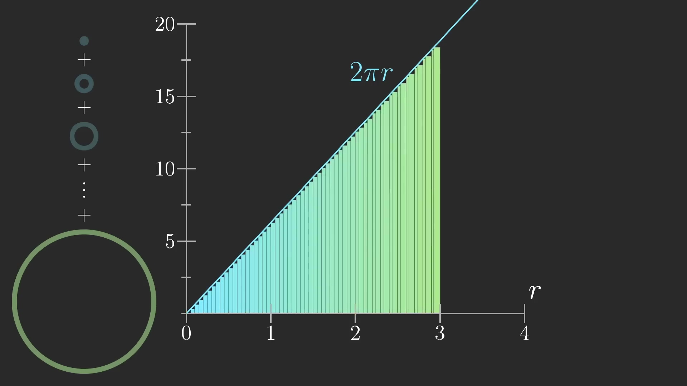

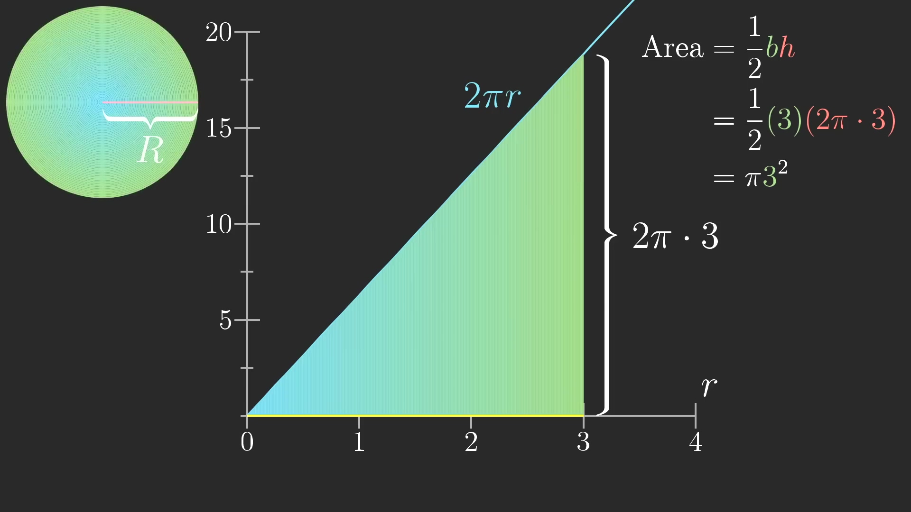

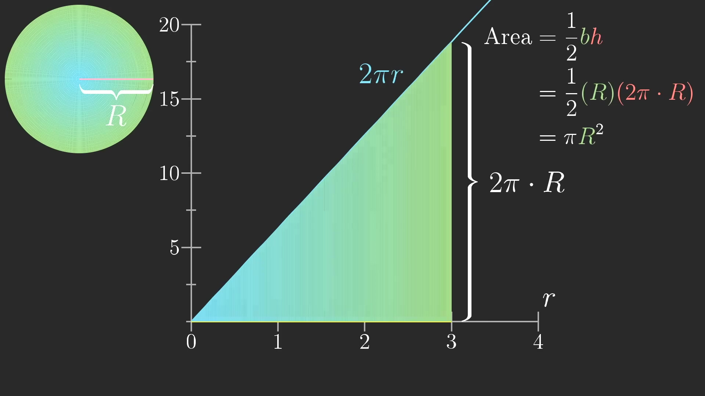

这里$dr$可以选择任意值, 越小越接近真实的面积.

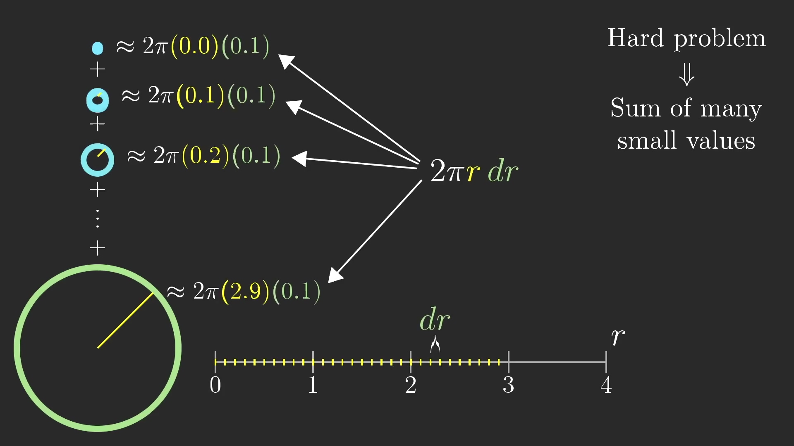

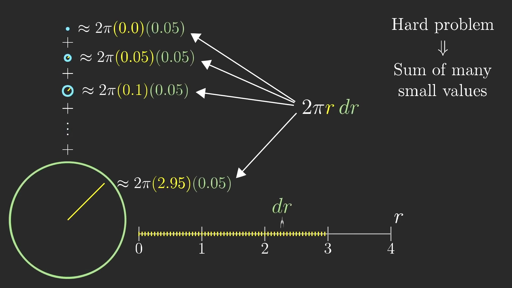

## 如何求小车行驶的路程

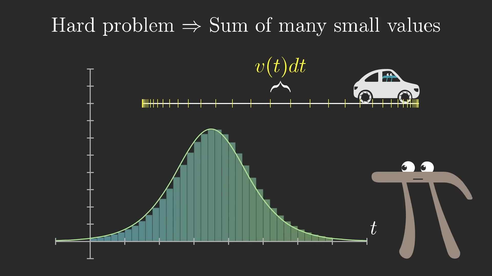
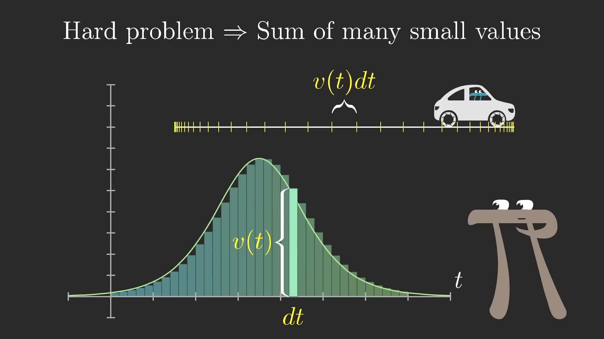

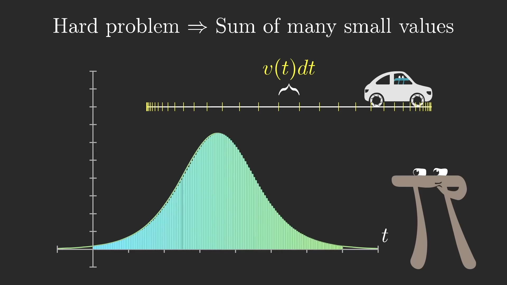
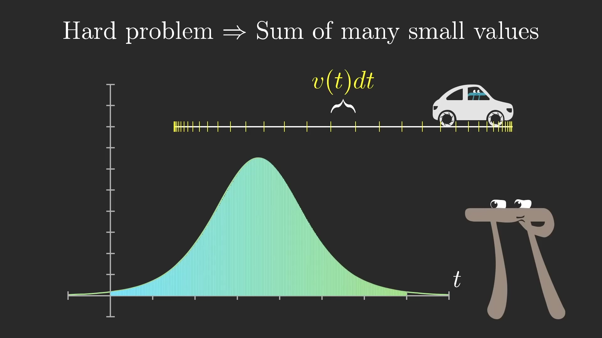

## 如何求任意曲线下方的面积

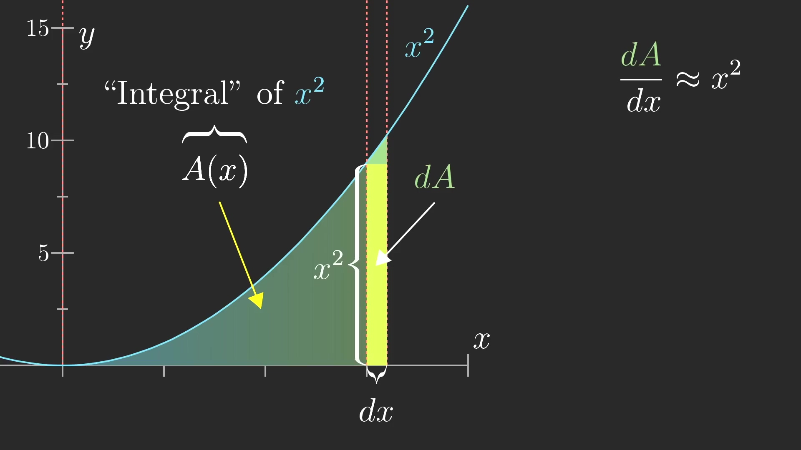
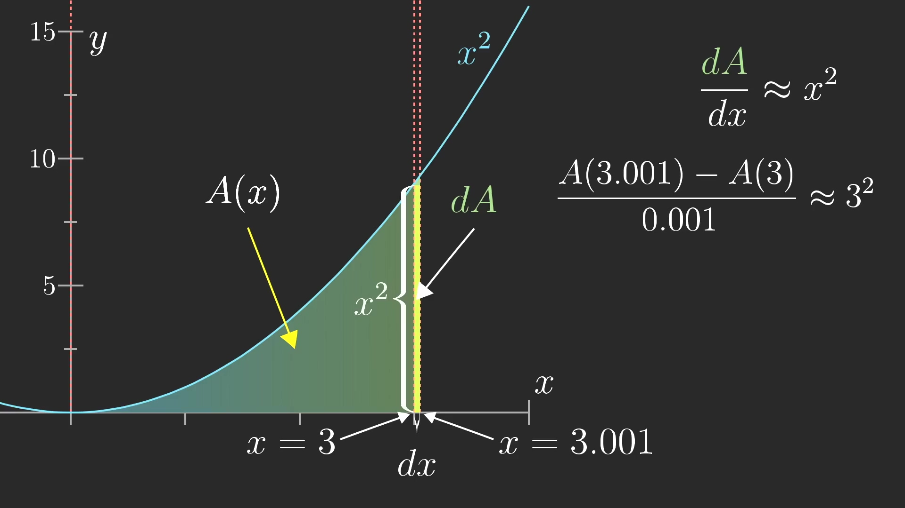
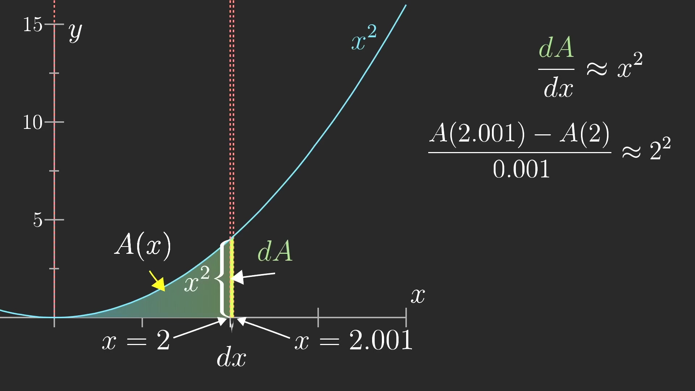
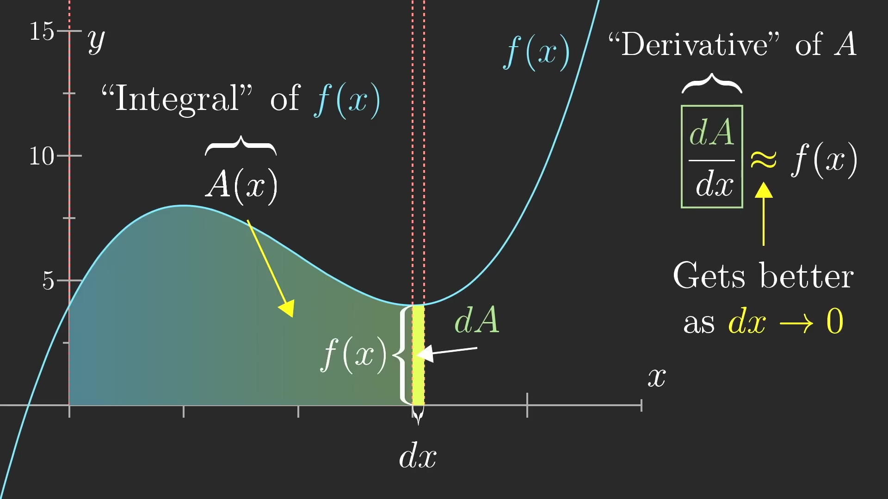

