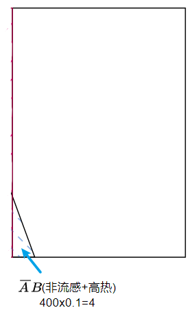
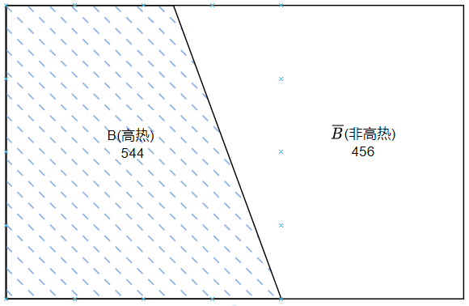
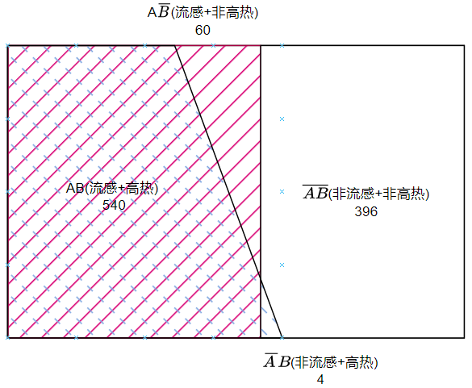

# 贝叶斯

贝叶斯推理的基本思想是：
1. 首先对事物的可能性做一个`先验判断`，这个先验判断可能来自于`主观的猜想`, 或者以往`数据统计的结果`.
2. 然后根据`新的信息`(新观察到的现象)对`先验判断`进行`修正`
3. 最后获得一个`基于新信息`的对事物存在可能性的`后验判断`。

例如, 感冒分为流感(病毒引起)和非流感(非病毒引起). 
医院的感冒科室统计历史的患者得出有60%的概率会患流感, 40%为非流感, 这就是`先验判断`, 也就说医生不经过任何诊断仅根据历史信息, 可以确定60%的患者得了流感.
进一步如果此人`持续发高烧`，那么根据这一新信息，我们认为此人患上流感的可能性就更大了，而这就是`后验判断`。
注意, 我们本例研究是就是已经患病的人(默认来感冒科室的人都是患感冒的, 只不过不知道是流感还是非流感)

具体的:
一个患者有60%的概率属于流感患者, 我们形成先验判断：在近来的1000位患者中，估计有600人所患的是流感。图中红色表示流感.

接下来假设，医学研究表明：
1. 一方面，一个`流感的患者`持续高热的概率为90%，那么在600个流感患者中，估计有540人持续高热, 图中红色表示流感600人, 蓝色表示发热, 二者重合的部分就是既有流感又高热的占红色区域的90%, 即600*0.9=540人

1. 另一方面，一个`非流感的患者`持续高热的概率为1%，那么在400个非流感型感冒患者中，估计有4人持续高热。

基于上述假设，现在我们提出问题：如果体温检测某人持续高热，那么其患上流感的概率有多大呢？从对症下药的角度来说，这是一个具有重要现实意义的问题。
从直觉上看，这个比例应该大于先验概率60%，因为这544(600x0.9+400x0.1)个患者是具有典型流感症状(高热)的感冒患者。

那么，这个比例究竟有多大呢？其实，我们需要计算的是一个后验的条件概率，这里的条件就是指`患者持续高热`这一新信息。

首先定义事件:
1. A: 表示得流感, $\overline{A}$: 非流感
2. B: 表示高热, $\overline{B}$: 非高热

做出全局图来说明:

1. $P(B|A)$表示患有流感前提下, 初选持续高热的概率, 称为`似然率`, 540/(540+60)=0.9
2. $P(A)$表示某人患流感的`先验概率`(`全局概率`), (540+60)/1000 = 0.6
3. $P(B)$表示持续高热的`先验概率`(`全局概率`), (396+4)/1000 = 0.4
4. $P(AB)$表示患有流感且高热的`全局概率`, 540/1000=0.54
5. $P(A\overline{B})$表示患有流感且非高热的`全局概率`, 60/1000=0.06
6. $P(\overline{A}B)$表示非流感且高热的`全局概率`,4/1000=0.004
7. $P(\overline{AB})$表示非流感且非高热的`全局概率`, 396/1000=0.396
8. $P(A|B)$表示患者高热情况下, 患有流感的概率, 此条件概率称为`后验概率`, 540/(540+4)=0.99, 和后面使用贝叶斯定理计算的结果相同

## 贝叶斯定理
我们已知:
1. $P(B|A)$,即$P(高热|流感)$, 在已知流感的前提下, 有发热症状的概率是0.9
2. $P(B|\overline{A})$,即$P(高热|非流感)$, 在已知非流感的前提下, 有发热症状的概率是0.1
3. $P(A)$,即$P(流感)$, 流感的全局概率
4. $P(\overline{A})$, 即$P(非流感)$, 非流感的全局概率, 通过$P(\overline{A})=1-P(A)$求出
5. $P(B)$, 即$P(高热)$, 高热的全局概率, 通过全概率公式$P(B)=P(B|A)P(A)+P(B|\overline{A})P(\overline{A})$来求

通过贝叶斯公式, 可求$P(A|B)$:
$$
\begin{align*}
P(A|B)=&\frac{P(B|A)}{P(B)} * P(A)  \\
=&\frac{P(B|A)}{P(B|A)P(A)+P(B|\overline{A})P(\overline{A})} * P(A)  \\
=&\frac{0.9}{0.9*0.6+0.1*0.4} * 0.6  \\
=& 0.99
\end{align*}
$$
即如果观察到患者有发热的症状, 则该患者患流感的概率从0.6提升到0.99

## 调整因子

上式中的$\frac{P(B|A)}{P(B)}$就是`调整因子`. 它决定了对先验概率的调整程度.
1. 当`调整因子`大于1时, 提升先验概率
2. 当`调整因子`等于1时, 先验概率不变
3. 当`调整因子`小于1是, 降低先验概率
   
`调整因子`本质上反映了新信息对推断的价值。

`调整因子`是如何被决定的呢
在本例中, 有一定比例的非流感患者, 而这些人出现持续高热症状的概率非常低:
$$
P(B|\overline{A}) \cdot P(\overline{A}) = 0.01 * 0.4 = 0.004
$$
结果使得分母变小,
$$
P(B)=P(B|A) \cdot P(A) + P(B|\overline{A}) \cdot P(\overline{A}) = 0.9 * 0.6 + 0.01 * 0.4 = 0.544
$$
从而导致`调整因子`$\frac{P(B|A)}{P(B)}$之比等于1.65, 大于1.

调整因子大于1的直觉解释是, 在根据某种病状(高热)反推病因(流感)时, 如果此症状对某种病因具有一定的特异性(某种病(流感)大概率会出现此症状(高热), 而该症状总体(非流感)来说比较少见, 因为其他病因(非流感)出现此症状(高热)的概率很小), 那么给定此症状(高热)的出现，某种病因(流感)存在的可能性就显著高于先验概率。

### 调整因子的调整方向
调整因子等于1的情况如何呢?不妨假设非流感发热的概率和流感发热的概率相同都是0.9.
$$
\begin{align*}
P(A|B)=&\frac{P(B|A)}{P(B)} * P(A)  \\
=&\frac{P(B|A)}{P(B|A)P(A)+P(B|\overline{A})P(\overline{A})} * P(A)  \\
=&\frac{0.9}{0.9*0.6+0.9*0.4} * 0.6  \\
=& 1 * 0.6  \\ 
=& 0.6
\end{align*}
$$
可以看到由于`发热`在`流感`和`非流感`两个病因之间没有差别(相等), 都是0.9, 所以发热这个信息调整力度为1, 不影响先验概率. 同样的道理, 我们可以将发热概率再流感和非流感情况下调整为其他同样的值, 上述结论也是成立的.

那么`发热`在`流感`发生概率高于`发热`在`非流感`的概率, 调整因子就一定会大于1吗? 不妨假设`发热`在`流感`发生的概率为0.9, `发热`在`非流感`发生的概率为0.89, 仅仅高0.01 则
$$
\begin{align*}
P(A|B)=&\frac{P(B|A)}{P(B)} * P(A)  \\
=&\frac{P(B|A)}{P(B|A)P(A)+P(B|\overline{A})P(\overline{A})} * P(A)  \\
=&\frac{0.9}{0.9*0.6+0.89*0.4} * 0.6  \\
=& 1.004 * 0.6  \\ 
=& 0.602
\end{align*}
$$
可以看出是的, 只要`发热`在`流感`发生的概率大于`发热`在`非流感发生`的概率, 就会调整因子就会大于1. 这个结论通过观察分母很容易获得, 因为$P(A)+P(\overline{A})=1$, 所以分母和分子的大小关系, 仅仅取决于$P(B|A)$和$P(B|\overline{A})$的关系:
1. 如果$P(B|A) > P(B|\overline{A})$, 则`调整因子`>1, 实际含义就是症状在某种病因发生概率高于在其他病因发生概率, 则观察到该症状, 会提升先验概率
2. 同理, 如果$P(B|A) < P(B|\overline{A})$, 则`调整因子` < 1, 实际含义就是症状在某种病因发生概率高于在其他病因发生概率, 则观察到该症状, 会降低先验概率
3. 同理, 如果$P(B|A) = P(B|\overline{A})$, 则`调整因子` = 1, 实际含义就是症状在某种病因发生概率高于在其他病因发生概率, 则观察到该症状, 会降低先验概率

### 调整因子的调整力度
那么调整的力度受什么影响呢?不妨设0.1的人会得流感,0.9不会.
$$
\begin{align*}
P(A|B)=&\frac{P(B|A)}{P(B)} * P(A)  \\
=&\frac{P(B|A)}{P(B|A)P(A)+P(B|\overline{A})P(\overline{A})} * P(A)  \\
=&\frac{0.9}{0.9*0.1+0.1*0.9} * 0.1  \\
=& 5 * 0.1  \\ 
=& 0.5
\end{align*}
$$
可见, 我们这里仅仅, 提升了非流感的比例($0.1 \to 0.9$), 这里的调整因子从1.67急剧膨胀5倍, 但因为流感比例降低为0.1, 最终结果仍然是降低的.

如果设0.9的人会得流感,0.1不会.
$$
\begin{align*}
P(A|B)=&\frac{P(B|A)}{P(B)} * P(A)  \\
=&\frac{P(B|A)}{P(B|A)P(A)+P(B|\overline{A})P(\overline{A})} * P(A)  \\
=&\frac{0.9}{0.9*0.9+0.1*0.1} * 0.9  \\
=& 1.097 * 0.9  \\ 
=& 0.9878
\end{align*}
$$
可见, 我们提升了流感的比例($0.1 \to 0.9$), 这里的调整因子反而从1.67降到了1.097, 调整的力度变小了, 但因本身流感比例就很高, 0.9, 所以最终结果仍然是高的.

所以调整力度主要受到$P(\overline{A})$的影响:
1. 如果$P(\overline{A})$很大, 即$P(A)$很小, 则调整因子大, 调整力度大, 但最终结果仍然很小, 因为$P(A)$很小
2. 如果$P(\overline{A})$很小, 即$P(A)$很大, 则调整因子小, 调整力度小, 但最终结果仍然很大, 因为$P(A)$很大

### 总结

为了更清楚地看出这一点，不妨考虑一种极端情况：
假设所有感冒的人都一定会持续高热，即$P(B|A)=P(B)=1$. 此时调整因子等于1, 表明持续高热这种信息的出现对于反推病因毫无价值，或者说$P(A|B)=P(A)$, 亦即持续高热与患流感属于两个独立事件。
再考虑另一种极端情况：
假设仅有流感患者可能会持续高热，亦即$P(B|\overline{A})=0$, 则调整因子等于$\frac{1}{P(A)}$, 进而有:$P(A|B)=\frac{1}{P(A)}*P(A)$=1. 这意味着，一旦某人出现了持续高热症状，就可以确诊其患上了流感，故在这一极端假设下，持续高热的信息对反推病因具有“决定性”价值。

## 基础谬误
行为经济学研究发现，一种典型的认知和行为偏差是，人们很多时候会过度重视`似然率`($P(B|A)$)，忽视`先验概率`($P(A)$)对判断决策的重要影响。行为经济学将`先验概率`称为`基础概率`，将人们因忽视基础概率而出现的认知和行为偏差称为`基础概率谬误`。

假设有一种“比较少见”的恶性疾病。为了诊断这种疾病，科学家发明了一种检测手段。如果有人不幸患上此疾病并接受医学检查，那么医学检查会准确地报出阳性结果。亦即，由A（患上此疾病）可推出B（医学检查呈阳性），似然率等于100%。现在，假设某人在体检时得到了阳性检查结果，这很可能使其惊慌失措。然而，鉴于由A可推出B并不表明由B可反推出A，阳性结果并不意味着此人一定患上了这种恶疾。

首先假设人群中这种疾病的发病率即$P(患病)=0.001$, 若某人患病，则医学检测将准确地报出阳性结果，即$P(阳性|患病)=1$, 若某人健康，医学检测有0.05的可能误报出阳性结果, 即$P(阳性|健康)=0.05$, 现在的问题是，给定某人的检测结果为阳性，其患病的概率有多大呢？
根据贝叶斯法则:
$$
\begin{align*}
    P(患病|阳性)=&\frac{P(阳性|患病)}{P(阳性)}P(患病) \\
    =&\frac{P(阳性|患病)}{P(阳性|患病)*P(患病)+P(阳性|\overline{患病})*P(\overline{患病}))}P(患病)  \\
    =&\frac{1}{1*0.001+0.05*0.999}*0.001  \\
    \sim&19.6*1 \\
    =&0.0196
\end{align*}
$$
因此, 医学检查成阳性的真正患这种病的人不到0.02. 注意虽然由于$P(阳性|患病)=1$以及$P(\overline{患病})=0.999$都极大的强化了调整因子19.6倍, 但是因为先验概率$P(患病)=0.001$极小, 所以最终的结果仍然很小.

## 贝叶斯定理的解读
贝叶斯定理：
$$
\begin{align*}
P(A|B)=&\frac{P(B|A)}{P(B)} * P(A)
\end{align*}
$$

### 看病的例子
定义的两个事件：
$$
A=流感患者,\quad B=有高热症状
$$
知道感冒有60%的是流感病率，这个也称为`先验概率`（大概就是最先就知道的意思），即：
$$
P(A)=60\%
$$
那么你患流感的概率也是60%。而此时也有发热症状, 这个时候相当于出现了新的信息，或者说B条件出现了，可以通过贝叶斯定理对患病的概率进行调整：

调整的结果当然是真正有病的概率急剧上升：
$$
\begin{align*}
P(A|B)=&\frac{P(B|A)}{P(B)} * P(A)  \\
=&\frac{P(B|A)}{P(B|A)P(A)+P(B|\overline{A})P(\overline{A})} * P(A)  \\
=&\frac{0.9}{0.9*0.6+0.1*0.4} * 0.6  \\
=& 0.99
\end{align*}
$$

### 主观概率
贝叶斯定理这种会被新的信息修正的特性特别受主观派的青睐。举个例子，比如要判断明天是否下雨，主观派说，反正一无所知就假设为50%吧：
$$
P(A)=50\%
$$
突然发现，天边似乎有乌云，假设为事件B_1，那用贝叶斯修正一下：

又觉得天气闷热的，假设为事件$B_2$，再用贝叶斯修正一下：

通过不断地信息修正，主观概率会越来越变得客观（对此依然有很多争论，我们无意讨论）：

给定一组所关心事件的先验概率, 如果收到新的消息, 那么久更新你对这件发生概率的认识:
$$
在给定新信息下更新事件发生的概率 = \frac{给定事件新信息发生的概率}{新信息无条件发生的概率} \times 事件发生的先验概率  \\
P(事件|信息) = \frac{P(信息|事件)}{P(信息)}P(事件)
$$

### 取球例子
贝叶斯定理的根本思想是:
`后验概率=调整因子 * 先验概率`.
`先验概率`:信息不完整的情况下做出的主观预测
`调整因子`:信息收集不断完善的过程中对先验概率的调整
`后验概率`:经过调整后最终做出的概率预测.

有两个桶, 1号桶里有40个球, 其中30个白球, 10个黑球; 2号桶里也有40个球, 其中20个白球, 20个黑球.
假设几个事件:
A: 抓取1个球, 球来自1号桶
B: 抓取的是白球
C: 抓取1个球, 球来自2号桶

条件概率: 
从1号桶中抽取白球的概率$P(B|A)=30/(30+10)=0.75$; 从2号桶中抽取白球的概率$P(B|C)=20/(20+20)=0.5$

全概率:
抽取一个球, 为白球的概率, 这个概率叫全概率, 是1号桶抽取白球和2号桶抽取白球两个事件的概率之和,
$$
P(B) = P(B|A)P(A) + P(B|C)P(C) = 0.75 \times 0.5 + 0.5 \times 0.5 = 0.625
$$

贝叶斯定理(逆概率):
抓取了一个球是白球, 那么这个白球来自1号桶的概率$P(A|B)$是多少?
$$
P(A|B) = \frac{P(B|A)}{P(B)}P(A)
$$

1. 先求P(A), 抓取一个球, 来自A桶的概率, 叫先验概率, 也就是在没有约束条件下(约束条件是抽取的球颜色是白色)下事件A发生的概率, 这个通过1号桶的球的数量50 除以总的球的数量100, 可得是0.5
2. 再求$\frac{P(B|A)}{P(B)}$, 这个叫`可能性函数`或`调整函数`, 也就是在已知条件下抓取的是白球的情况下, 对`P(A)`进行调整的银子. 根据上文计算的$P(B|A)=0.75,P(B)=0.625$, 可得调整因子$\frac{0.75}{0.625}=1.2$
3. 最后求$P(A|B)$, 也被叫做:
$$
\begin{align*}
  后验概率=& 调整因子 * 先验概率  \\
  P(A|B)=& \frac{P(B|A)}{P(B)} * P(A) 
\end{align*}
$$
也就是说, 抽取一个球, 在信息不完整的情况下, 这个球来自1号桶的概率为0.5; 在我们知道这个球是白球的条件下, 那么这个球来自1号桶的可能性提高了0.2(调整因子为1.2), 则最终抽取的是白球且来自1号桶的概率将提升到0.6.

<!-- 已知某种疾病在人群中有2%的患病率，可以通过某种手段来检测这种疾病，这种手段有90%的正确率。那么被诊断出有病了之后, 就真的就有90%概率有病嘛?

还是来画下树形图，假设有10000个人，2%的患病率就是200个人有病：

正确率90%，这个正确指的是，检测显示有病的是真有病，检测显示没病的是真没病.
下图中:
- `确诊`表示正确的诊断, `有病`诊断为`有病`, `没病`诊断为`没病`
- `误诊`表示错误的诊断, `有病`专断为`没病`, `没病`诊断为`有病`

被诊断出有病包含两种可能性，一种是有病人群中的`确诊`和没病人群中的`误诊`：

也就是说这10000人里面会有180+980=1160人被诊断有病，而真正有病的不过180人，所以如果被检测出有病，真正有病的概率只有：
$$
\frac{180}{1160}\approx 15.5\%
$$

## 基本比率谬误
通过上面的分析可以知道，产生错误认识的原因在于，首先，90%的正确率指的是，有病的人中被确诊的比例（或没病的人被确诊的比例）：

而被诊断出有病了之后真的有病的概率为：

分子是同样的180人，分母不同得到的比例自然不同。

更根本的原因在于忽视了人群分布的基本比例，虽然确诊率高达90%，但是真正患病的人实在太少了，只占所有人中的2%：

没患病的足足有98%，哪怕误诊率为10%，但人多啊，依然有很多被误诊为有病。
这种忽视基本比例导致的错误称为`基本比例谬误`（Base Rate Fallacy）。

基本比率谬误是常常遇到的，再举一个通俗的例子，我向你描述老王的喜好和特征：
- 他爱看书
- 戴一副眼镜
- 彬彬有礼，谈吐得体
- 订阅了《科学美国人》杂志

然后问你，你觉得老王是大学教授，还是做销售工作的？
在大学教授人群中，可能90%有上述特征，但是做销售工作的人群要比教授多得多，基本比率相差悬殊，哪怕销售人员中只有10%符合以上特征，总数上还是要比教授多得多。所以，我建议你回答做销售工作的，这个正确的概率更高。

## 贝叶斯定理
### 条件概率
知某种疾病在人群中有2%的患病率，可以通过某种手段来检测这种疾病，这种手段有90%的正确率。那么如果被检测出有病，真正有病的比率是多少？
我们的样本空间是10000人，而这里两个概率：
$$
\frac{8820}{8820+980}=90\%,\quad\frac{180}{180+20}=90\%,\quad \frac{180}{180+980}\approx 15.5\%
$$
分母都不到10000人，所以它们都是`局部概率`，也就说都是`条件概率`。

先来定义两个事件：
$$
A=“患病的人”,\quad B=“检测显示有病的人”
$$
“90\%的正确率”指的是，患病的条件下，检测显示有病，即：
$$
P(B|A)=\frac{180}{180+20}=90\%
$$
要求的“被诊断出有病了之后真的有病的概率”指的是，检测有病的条件下，真的患病，即：
$$
P(A|B)=\frac{180}{180+980}\approx 15.5\%
$$

### 贝叶斯定理
通过上面的分析知道了，条件给出的是$P(B|A)$，要求的是$P(A|B)$：

那这就是简单的乘法问题了：
$$
\begin{aligned}
    P(B|A)\cdot \frac{P(A)}{P(B)}
        &=\frac{P(AB)}{P(A)}\cdot \frac{P(A)}{P(B)}\\
        \\
        &=\frac{P(AB)}{P(B)}\\
        \\
        &=P(A|B)
\end{aligned}
$$

这就是`贝叶斯定理`:
> 对于同一样本空间$\Omega$中的随机事件$A$、$B$，若$P(B) \ne 0$，有：
$$
P(A|B)=\frac{P(A)}{P(B)}P(B|A)
$$

## 贝叶斯定理的解读2
在诊断问题中，已知检测的正确率有90%，或者说确诊率为90%：
$$
P(B|A)=90\%
$$
而求出来的“被诊断出有病了之后真的有病的概率”为：
$$
P(A|B)\approx 15.5\%
$$
之前说过，差别这么大在于基本比率悬殊，也就是所有人中患者只占了$2\%$，贝叶斯定理正好反映了这点：

P(A)、P(B)是关于所有人的概率：
$$
P(A)=所有人患病的概率，\quad P(B)=所有人检测显示有病的概率
$$
两者的比例就是所谓的基本比率。

## 贝叶斯与全概率
有了全概率公式后，可以得到贝叶斯定理真正的样子：

>设$A_1、A_2、\cdots、A_n$为样本空间$\Omega$的一个分割，则有：
$$
\begin{aligned}
    P(A_i|B)
        &=\frac{P(BA_i)}{P(B)}\\
        \\
        &=\frac{P(B|A_i)}{P(B)}P(A_i)\\
        \\
        &=\frac{P(B|A_i)}{\displaystyle\sum_{i=1}^{n}P(A_i)P(B|A_i)}P(A_i)
\end{aligned}
$$

也就是把$P(B)$分解到分割$A_1、A_2、\cdots、A_n$上去了。
之前已经是这么计算的了，当时没提是为了减小理解的难度。比如疾病检测问题，事件稍微重新定义下：
$$
A_1=“患病的人”,\quad A_2=“没患病的人”,\quad B=“检测显示有病的人”
$$
很显然，$A_1、A_2$就是一个分割，所以：
$$
\begin{aligned}
P(A_1|B)
    &=\frac{P(B|A_1)}{P(B)}P(A_1)\\
    \\
    &=\frac{P(B|A_1)}{P(A_1)P(B|A_1)+P(A_2)P(B|A_2)}P(A_1)\\
    \\
    &=\frac{0.9}{0.02\cdot 0.9+0.98\cdot 0.1}\times 0.02\\
    \\
    &\approx 15.5\%
\end{aligned}
$$ -->