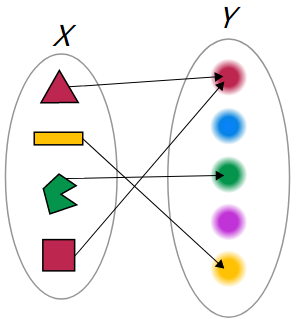
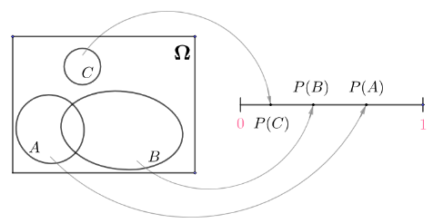
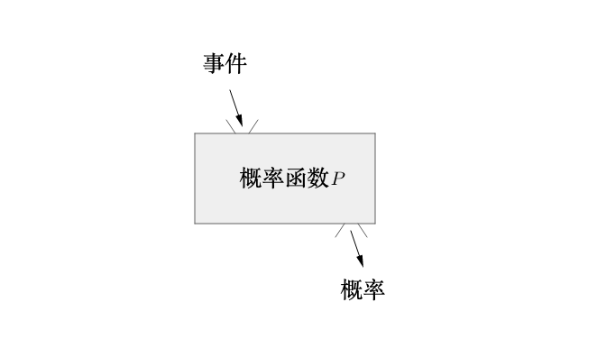

# 概率公理化

## 概率公理化
### 三大公理定义概率
一致某样本空间$\Omega$, 对于其中任一事件A, 定义函数P, 满足以下三大公理:
1. 非负性公理: $P(A)\geq 0$
2. 规范性公理: $P(\Omega)=1$
3. 可加性公理: 设`A_1,A_2,...`为两两不相容事件,既$A_i \cap A_j = \varnothing(i \neq j)$有:
$$
P(A_1 \cup A_2 ...)=P(A_1)+P(A_2)...
$$
则称P为概率函数, $P(A)$称为事件$A$的概率

### P是一个函数
函数是把$X$集合中的元素映射到$Y$中去:

而概率函数$P$则是把样本空间$\Omega$中的事件，映射为[0,1]之间的实数：

把事件A作为自变量传给概率函数P，得到的函数值就是A的概率，比如：
$$
正面的概率=P(\{正面\})
$$
要是想知道：
$$
P(\{正面\})=?
$$
就要借助不同派别了:
- 频率派, 多次事件得到, $P(\{正面\})\approx 0.51$
- 古典派, 等概率, $P(\{正面\}) = P(\{正面\})$
- 主观派, 主观认为, $P(\{正面\})= 0.7$

### 完成概率的定义
学习至此，我们通过：
$$
\begin{cases}
样本空间\\
事件\\
三大公理
\end{cases}
$$
完成了概率函数的定义：

参考:
马同学