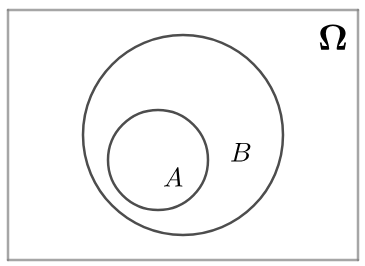
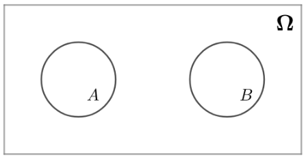
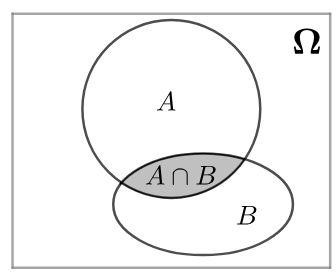
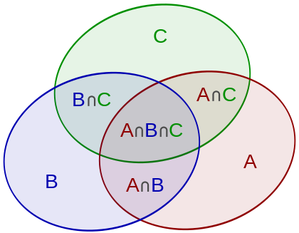

# 事件关系

$$
事件之间的关系=
\begin{cases}
    包含\\
    相等\\
    不相容\\
    对立
\end{cases}
$$

## 包含关系
如果A中的每个元素都是B的元素，则称：
$$
A\subseteq B
$$
韦恩图表示如下：

称作：
$$
A 包含于 B\quad 或\quad B 包含 A
$$
很显然有：
$$
\varnothing\subseteq A\subseteq\Omega
$$
比如:
$$
A=“扔一次骰子得到四点”=\{4\}  \\
B=“扔一次骰子得到偶数点”=\{2,4,6\}
$$
因为：
$$
A\subset B
$$
所以事件$B$包含事件$A$。

## 相等关系
$$
A=B
\quad\equiv\quad
\begin{cases}
    A\subseteq B\\
    B\subseteq A
\end{cases}
$$

有了相等的关系之后，就可以定义：
$$
\begin{array}{c|c|c}
    \hline
    \\
    \quad  子集 \quad&\quad A\subseteq B\quad&\quad A中的每个元素都在B中\quad\\ 
    \quad 真子集 \quad&\quad  A\subset B\quad&\quad A中的每个元素都在B中且A\ne B\quad\\
    \\
    \hline
\end{array}
$$

## 互不相容关系
如果事件$A$、$B$满足：
$$
A\cap B=\varnothing
$$
则称A、B是`互斥`的，或者`互不相容`（mutually exclusive）的。可以用韦恩图表示如下：

互不相容主要描述的是两个事件不会同时发生，比如这两个事件：
$$
A=“扔一次骰子得到5点”=\{5\} \\
B=“扔一次骰子得到6点”=\{6\}
$$
必不可能同时发生，那么两者就是互斥的事件。

## 对立关系
对于样本空间$\Omega$而言，如果$B$由$A$的所有互不相容事件组成，那么$B$就是$A$的`对立事件`，或者称为`逆事件`，当然也有：
$$
B=\overline{A}
$$

举个例子来说明对立事件，这样容易产生直觉。比如，对于“扔一次骰子”而言，样本空间为：
$$
\Omega=\{1,2,3,4,5,6\}
$$
下面两个事件就是对立事件：
$$
A=“扔一次骰子得到奇数点”=\{1,3,5\}  \\
B=“扔一次骰子得到偶数点”=\{2,4,6\}
$$

这两个事件肯定不会同时发生，并且必然会发生其中之一。

## 事件关系小结
$$
\begin{array}{c|c|c}
    \hline
    \\
    \quad  包含 \quad&\quad A\subseteq B\quad 或\quad B\subseteq A\quad\\ 
    \quad 相等 \quad&\quad A\subseteq B\quad 且\quad B\subseteq A\quad\\
    \quad 相交 \quad&\quad A\cap B\ne\varnothing\quad\\
    \quad 互斥 \quad&\quad A\cap B=\varnothing\quad\\
    \quad 对立 \quad&\quad A=\overline{B}\quad\\
    \\
    \hline
\end{array}
$$

## 加法公式
注意和[probability_事件的运算](probability_事件的运算)中的加法公式区别, [probability_事件的运算](probability_事件的运算)是使用元素来表示, 而这里是仅使用事件(集合)来表示.

对于任意两个事件，有：
$$
P(A\cup B)=P(A)+P(B)-P(A\cap B)
$$
也常写作如下的形式：
$$
P(A+B)=P(A)+P(B)-P(AB)
$$
所以这个公式也称为概率的`加法公式`。

推理:
如果A\cap B=\varnothing的话，那么根据可加性就可以得到结论：
$$
\begin{aligned}
    P(A\cup B)
        &=P(A)+P(B)\\
        &=P(A)+P(B)+0\\
        &=P(A)+P(B)+P(\varnothing)\\
        &=P(A)+P(B)-P(A\cap B)
\end{aligned}
$$
如果相交不是空集：

将A\cap B的概率算了两次，所以要把多算的一次给减去，或者说把重复计算的部分给“排斥”出去：
$$
P(A\cup B)=P(A)+P(B)-P(A\cap B)
$$
推广到三个事件：

所以，加法公式也被称作\color{Salmon}{容斥定理}（Inclusion–exclusion principle）。