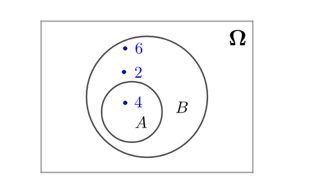
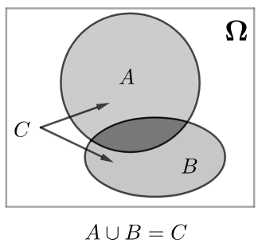
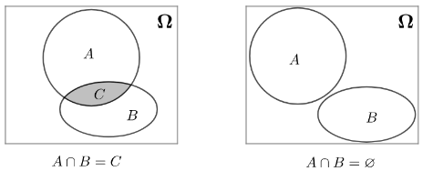
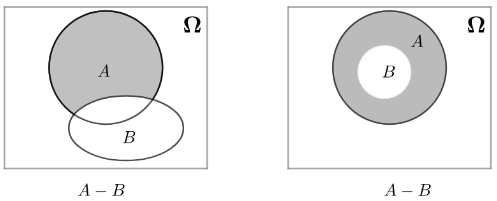
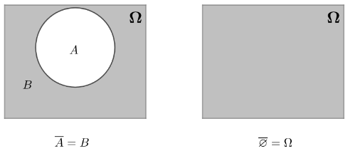

# 事件的运算

已知，“扔一次骰子”中的两个事件为：
$$
A=“扔一次骰子得到四点”=\{4\}
$$
$$
B=“扔一次骰子得到偶数点”=\{2,4,6\}
$$
求这两者概率值的大小：
$$
P(A)\quad\color{red}{?}\quad P(B)
$$
A与B通过韦恩图中画出来是这样的：

正如实数有基本运算“加减乘除”一样，事件（集合）也有基本运算“并交差补”(阴影部分为运算后的结果)：

## 基本运算
### 并运算
对于事件A、B，并运算定义为（$\equiv$表示定义）：
$$
A\cup B\equiv\{x|x\in A\ 或 \ x\in B\}
$$
可用韦恩图表示如下（阴影即为运算结果）：

两个以上事件的并运算可以如下表示（分别为有限个事件和无限个事件）：
$$
\bigcup_{n=1}^{n}S_n=S_1\cup S_2\cup\cdots\cup S_n
$$
$$
\bigcup_{n=1}^{\infty}S_n=S_1\cup S_2\cdots
$$

### 交运算
对于事件A、B，`交运算`定义为：
$$
A\cap B\equiv\{x|x\in A\ 且 \ x\in B\}
$$
可用韦恩图表示如下（阴影即为运算结果）：

两个以上事件的交运算可以如下表示（分别为有限个事件和无限个事件）：
$$
\bigcap_{n=1}^{n}S_n=S_1\cap S_2 \cdots \cap S_n,\quad \bigcap_{n=1}^{\infty}S_n=S_1\cap S_2\cdots
$$

### 差运算
对于事件A、B，定义**差运算**为：
$$
A-B\equiv\{x|x\in A\quad 且\quad x\notin B\}
$$
可用韦恩图表示如下（阴影即为运算结果）：

### 补运算
对于事件A、B，如果：
$$
A=\Omega-B
$$
则称B为A的**补**，记作（其中c代表Complement）：
$$
B=\overline{A}\quad 或\quad B=A^c
$$
可用韦恩图表示如下（阴影即为运算结果）：

### 与代数对比
有很多书会把`并差交`写作`加减乘`, 这样容易理解集合的运算性质:

$$
\begin{array}{c|c|c}
    \hline
    \quad\quad&\quad  类比\quad&\quad 改写 \quad\\
    \hline
    \\
    \quad 并 \quad&\quad  +\quad&\quad A\cup B=A+B \quad\\
    \quad 交 \quad&\quad  \times\quad&\quad A\cap B=AB \quad\\ 
    \quad 差 \quad&\quad  -\quad&\quad A-B \quad\\
    \\
    \hline
\end{array}
$$

## 运算性质

### 交换律
$$
A+B=B+A \\
AB=BA
$$
### 结合律
$$
A+B+C=A+(B+C) \\
ABC=A(BC)
$$
### 分配率
$$
(A+B)C=AC+BC \\
(A-B)C=AC-BC \\
(A\cap B)\cup C=(A\cup C)\cap(B\cup C)
$$

### 摩根定律

$$
\overline{A\cup B}=\overline{A}\cap\overline{B} \\
\overline{A\cap B}=\overline{A}\cup\overline{B}
$$
可以通过这个口诀记忆：长杠变短杠，开口变方向。
德摩根定律拓展到多个事件上也是成立的，记忆方法也是一样的：
$$
\overline{A_1\cup A_2\cup\cdots\cup A_n}=\overline{A_1}\cap\overline{A_2}\cap\cdots\cap\overline{A_n} \\
\overline{A_1\cap A_2\cap\cdots\cap A_n}=\overline{A_1}\cup\overline{A_2}\cup\cdots\cup\overline{A_n}
$$

参考:
马同学