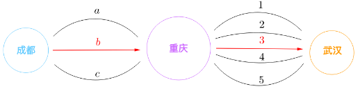
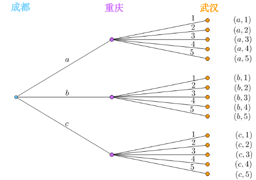
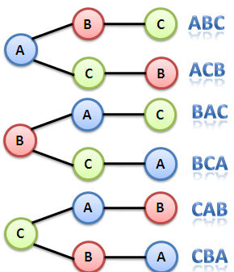
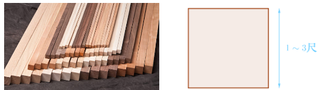
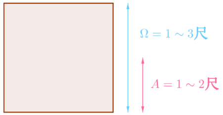

# 古典派概率

古典派是如何通过概率公理化来定义概率的：
对于有限的样本空间，比如：
$$
\Omega=\{1, 2, \cdots, N\}
$$
古典派假设样本空间是等概率的，或者说每个样本点都是等概率的：
$$
P(\{1\})=P(\{2\})=\cdots=P(\{N\})
$$
那么根据规范性公理、可加性公理可得：
$$
P(\{1\})=P(\{2\})=\cdots=P(\{N\})=\frac{1}{N}
$$
对于某事件$A$，根据可加性公理可得：
$$
P(A)=\frac{A中样本点的个数}{\Omega中样本点的个数}
$$
也可以写作（用绝对值来表示个数）：
$$
P(A)=\frac{|A|}{|\Omega|}
$$

比如扔一枚硬币，它的样本空间以及事件$A$为：
$$
\Omega=\{正面,反面\},\quad A=“得到正面”=\{正面\}
$$
根据古典派，$A$的概率为：
$$
P(A)=\frac{1}{2}
$$

古典派的概率定义的核心假设是：`等概率的样本空间`
那什么样的样本空间是等概率的？首先，样本空间需要满足下列原则：
- 互斥：样本点要互斥
- 完全：要包含所有可能的样本点

## 计数
根据古典派，A事件的概率如下计算：
$$
P(A)=\frac{|A|}{|\Omega|}
$$
所以计算的首要问题就是：数清楚$A$和$\Omega$里面有多少样本点，这称为`计数`。

## 加法原理
“扔一次骰子得到奇数”指的是“扔出一点”、“扔出三点”、“扔出五点”都可以, 那么“扔一次骰子得到奇数”的概率为多少？
首先“扔一次骰子”样本空间为：
$$
\Omega=\{1,2,3,4,5,6\}
$$
“扔出一点”、“扔出三点”、“扔出五点”的事件分别为：
$$
A=\{1\},\quad B=\{3\},\quad C=\{5\}
$$
那么“扔一次骰子得到奇数”就是三者之和：
$$
\frac{|A|+|B|+|C|}{|\Omega|}=\frac{1}{2}
$$
这就是`加法原理`，表示的是逻辑上的`或`关系：

>如果某件事有$k$种办法去完成，第1种办法有$m_1$种方法，第2种办法有m_2种方法，$\cdots\cdots$，第k种办法有$m_k$种方法，则完成这个事件总共有$m_1+m_2+\cdots+m_k$种方法。

## 乘法原理
从成都出发到武汉，有如图所示道路可选。如果每条道路的选择是等概率的，那么经由红色道路从成都到达武汉的概率是多少：

### 枚举
可以枚举出这个问题的样本空间：
$$
\Omega=
\{\quad
\begin{matrix}
(a,1),&(a,2),&(a,3),&(a,4),&(a,5),\\
(b,1),&(b,2),&(b,3),&(b,4),&(b,5),\\
(c,1),&(c,2),&(c,3),&(c,4),&(c,5)\\
\end{matrix}
\quad\}
$$
而经过红色道路的事件为：
$$
A=\{(b,3)\}
$$
所以概率为：
$$
P(A)=\frac{|A|}{|\Omega|}=\frac{1}{15}
$$
### 乘法
还可以换一种思路，从成都出发到达重庆有3种方案可选，从重庆出发到达武汉又有5种方案可选：

所以样本空间的个数就为$3\times 5$，所以概率算出来也是$\frac{1}{15}$，这就是`乘法原理`，表示的是逻辑上的“与”关系：

> 如果某件事需经$k$个步骤才能完成，做第1步有$m_1$种方法，做第2步有$m_2$种方法，$\cdots\cdots$，做第$k$步有$m_k$种方法，则完成这个事件总共有$m_1\times m_2\times\cdots\times m_k$种方法。

## 排列
如果有A、B、C三个字母，不重复的情况下，可以组成几个长度为3的字符串？第一位有三种选择，第二位有两种选择，第三位只有一种选择，根据乘法原理，可以组合出$3\times 2\times 1=6$种字符串.

这种计数方法称为：
>从$n$个不同元素中任取$r(r\leq n)$个元素排成一排（不能重复选择元素，要考虑元素的先后顺序），称为一个`排列`（Permutation）。按乘法原理，此种排列共有
$$
n\times (n-1)\times\cdots\times(n-r+1)
$$
种，记作$P_{n}^{r}$，可以读作：$n\ \ \text{Pick}\ \ r$
若$r=n$，称为`全排列`，全排列数共有$n!$个，记为$P_n$。

## 组合
某冰淇淋店有三种口味, 买两个, 总共有几种可能？需要注意的一点，双球冰淇淋是`不区分顺序`的，因为不能用排列的方法来计算。通过枚举可以得到答案是三种.
但怎么通过代数计算出这个答案呢？观察下，上面总共有三组，对每一组中的两个进行排列，这样每一组都有$P_2^2$个排列.
答案已经呼之欲出了，如果不区分顺序，那么这三组虽然进行了排列，我们只看做一种可购买的组合.
根据题意是不区分顺序的，所以：
$$
双球冰淇淋的种类\ =\ \frac{P_3^2}{P_2^2}\ =\ 3
$$

从$n$个不同元素中任取$r(r\leq n)$个元素并成一组(不区分顺序)，称为一个`组合`（Combination），组合总数为：
$$
C_n^r={n\choose r}=\frac{P_{n}^{r}}{r!}=\frac{n!}{r!(n-r)!}
$$
可以读作：$n\ \ \text{Choose}\ \ r$

## 连续的几何概型
有一家原木加工厂，它会把木头切成不同的木方，木方的截面都是正方形，边长会在$1\sim3$尺之间随机浮动：

那么根据古典概率，正方形边长在1\sim2尺之间的概率为多少？
在这里，等概率的样本空间$\Omega$和事件$A$为：

写成代数即：
$$
\Omega=\{x|1 \le x\le 3\},\quad A=\{x|1 \le x\le 2\}
$$
这是无限的样本空间和事件，没法计数，规定用长度来作为计数，所以正方形边长在$1\sim2$尺之间的概率为：
$$
P(A)=\frac{|A|}{|\Omega|}=\frac{2-1}{3-1}=\frac{1}{2}
$$
这种通过长度之比计算概率的方法，称为`几何概型`。