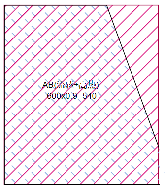
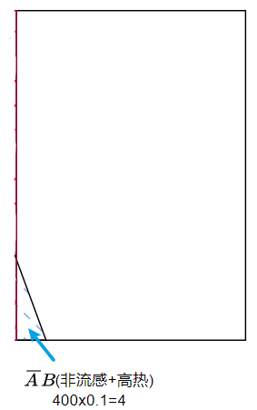
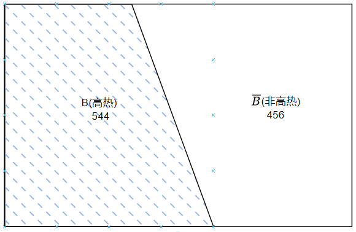
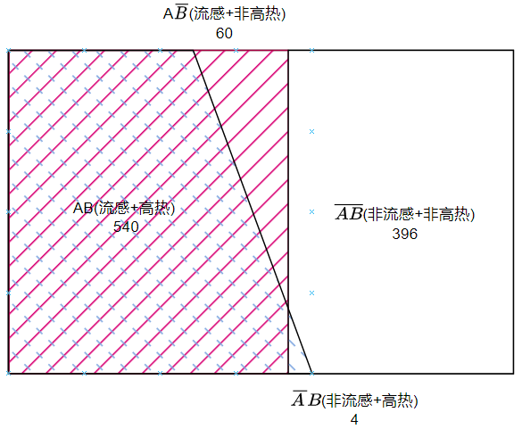

# 全概率

回想一下条件概率的例子:

感冒分为流感(病毒引起)和非流感(非病毒引起). 
定义事件:
1. A: 表示得流感, $\overline{A}$: 非流感
2. B: 表示高热, $\overline{B}$: 非高热
医院的感冒科室统计历史的患者得出有60%的概率会患流感, 40%为非流感. 我们可以估算在近来的1000位患者中，估计有600人所患的是流感。图中红色表示流感.

接下来假设，医学研究表明：
1. 一方面，一个`流感的患者`持续`高热`的概率为90%，那么在600个流感患者中，估计有540人持续`高热`, 图中红色表示流感600人, 蓝色表示高热, 二者重合的部分就是既有`流感`又`高热`的占红色区域的90%, 即600*0.9=540人

2. 另一方面，一个`非流感的患者`持续`高热`的概率为1%，那么在400个`非流感`型感冒患者中，估计有4人持续`高热`。

我们可以算出其中544(600x0.9+400x0.1)个患者是具有典型流感症状(高热)的感冒患者。

综合上述信息, 做出全局图来说明:

## 全局概率
全局概率是指分母是全局的概率, 样本空间是$\Omega$, 这里是所有的1000人, 所以分母都是1000.
1. $P(A)$表示某人患流感的`全局概率`, (540+60)/1000 = 0.6
2. $P(B)$表示持续高热的`全局概率`, (396+4)/1000 = 0.4
3. $P(AB)$表示患有流感且高热的`全局概率`, 540/1000=0.54
8. $P(A\overline{B})$表示患有流感且非高热的`全局概率`, 60/1000=0.06
9. $P(\overline{A}B)$表示非流感且高热的`全局概率`,4/1000=0.004
10. $P(\overline{AB})$表示非流感且非高热的`全局概率`, 396/1000=0.396

注意这里$P(AB) \neq P(A)*P(B)$, 因为二者不独立.
## 局部概率(条件概率)
1. $P(B|A)$表示患有流感前提下, 初选持续高热的`条件概率`
$$
P(B|A) = \frac{P(AB)}{P(A)} = 540/(540+60)=0.9
$$
1. $P(A|B)$表示观察到患者高热症状的前提下, 患有流感的`条件概率`, 
$$
P(A|B) = \frac{P(AB)}{P(B)} = 5540/(540+4)=0.99
$$

## 全概率
所谓的`全概率公式`就是, 当我们知道在患流感的情况, 有高热症状的($AB|A$)和非流感的情况, 有高热的情况($AB|\overline{A}$)的概率, 来求全局有高热症状的(非条件概率)的概率($B|\Omega$).
$$
\begin{align*}
B = BA + B\overline{A} &\to P(B) = P(BA) + P(B\overline{A})  \\
B = B|A \times A + B|\overline{A} \times \overline{A} &\to P(B) = P(B|A)P(A)+P(B|\overline{A})P(\overline{A})  \\
B = \frac{BA}{A} \times A  +   \frac{B\overline{A}}{\overline{A}} \times \overline{A} &\to P(B) = \frac{P(BA)}{P(A)}P(A) + \frac{P(B\overline{A})}{P(\overline{A})}P(\overline{A}) 
\end{align*}
$$
所以根据以上已知的条件, 我们可以计算检测显示有病的人$B_1$的概率为:
$$
\begin{align*}
    P(B) =&P(BA) + P(B\overline{A})  \\
    =&\frac{P(BA)}{P(A)}P(A) + \frac{P(B\overline{A})}{P(\overline{A})}P(\overline{A})  \\
    =& P(B|A)P(A)+P(B|\overline{A})P(\overline{A})  \\
    =& 0.9*0.6+0.1*0.4  \\
    =& 0.544
\end{align*}
$$

## 例题
### 厂房例题
一个电器上篇出售两家工厂生产的电视机, 甲厂的电视机占0.7, 乙厂占0.3. 甲厂的合格率时0.95, 乙厂的合格率为0.8. 则该商店所欲电视机的合格率为:
$$
设A_1为合格电视机, A_2为不合格电视机, A_1 = \overline{A_2} \\
B_1位甲厂电视机, B_2位乙厂电视机, B_1 = \overline{B_2} \\
P(B_1) = 0.7, P(A_1|B_1) =0.95 \\
P(B_2) = 0.3, P(A_1|B_2) = 0.8 \\
\begin{align*}
P(A_1) =& P(B_1) \times P(A_1|B_1) + P(B_2) \times P(A_1|B_2) \\
=&0.7 \times 0.95 + 0.3 \times 0.8  \\
=&0.905
\end{align*}
$$

## 抽签问题
足球比赛的分组一般都由抽签决定：
先抽和后抽概率上会有区别吗？
买彩票的时候，先买和后买又会有区别吗？
这些都称为`抽签问题`，来看一道具体的题就知道了：
袋中有50个乒乓球，其中20个是黄球，30个是白球，今有两人依次随机地从袋中各取一球，取后不放回，则第二个人取得黄球的概率是多少？

可以通过全概率公式来求解，设事件：
$$
A=“第一个人取出的为黄球”
$$
则它的逆事件为：
$$
\overline{A}=“第一个人取出的不是黄球”
$$
很显然这两个是一个分割：
$$
A+\overline{A}=\Omega
$$
要求的事件为：
$$
C=“第二个取出的为黄球”
$$
可以通过全概率公式来计算：
$$
\begin{aligned}
    P(C)
        &=P(A)P(C|A)+P(\overline{A})P(C|\overline{A})\\
        \\
        &=\frac{20}{50}\times\frac{19}{49}+\frac{30}{50}\times\frac{20}{49}\\
        \\
        &=\frac{2}{5}
\end{aligned}
$$
这个结论说明先抽、后抽对概率没有影响。

从全概率公式来看还是比较明显，全概率公式有两个分支：

第一个分支是A事件的条件下，这个时候抽黄球的概率会减小
第二个分支是$\overline{A}$事件的条件下，这个时候抽黄球的概率会增大
两相抵消的结果就是顺序对概率没有影响。

不过如果第一个人抽完之后公示了他的结果，那么就会对第二个人的概率产生影响，这相当于只走了全概率公式中的一个分支。

参考:
马同学