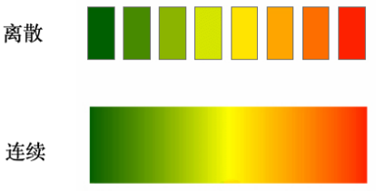
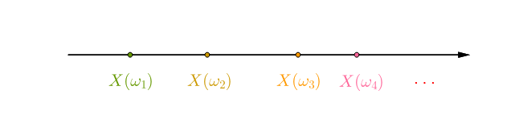
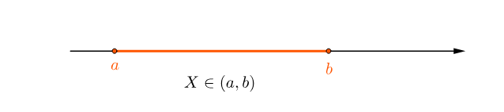

# 随机变量

## 直观理解

随机变量的定义和计算机的变量定义基本相同, 就是使用一个变量表示某个值. 但是在概率论中, 随机变量只能表示某一相同类的值, 比如掷骰子的点数$[1,2,3,4,5,6]$, 水果的种类$[苹果,香蕉,梨]$等.
举例, 投掷一公平骰子1次，则样本空间$\Omega$为:
$$
\Omega = [1,2,3,4,5,6]
$$
令$X=“出现的点数”$, 那么$X=3$, 指的是$[3]$.
另外$X$的可取值为$[1,2,3,4,5,6]$

所以概率论中随机变量其实就是样本空间$\Omega$的一个符号表示, 随机变量的某个取值是样本空间$\Omega$的一个子集.

举一个复杂的例子投掷一公平骰子2次，则样本空间$\Omega$为:
$$
\Omega = [
    (1,1),(1,2),(1,3),(1,4),(1,5),(1,6), \\
    (2,1),(2,2),(2,3),(2,4),(2,5),(2,6), \\
    (3,1),(3,2),(3,3),(3,4),(3,5),(3,6), \\
    (4,1),(4,2),(4,3),(4,4),(4,5),(4,6), \\
    (5,1),(5,2),(5,3),(5,4),(5,5),(5,6), \\
    (6,1),(6,2),(6,3),(6,4),(6,5),(6,6)
    ]
$$

令$X=“出现点数之和”$, 那么$X=3$, 指的是$\{(1,2),(2,1)\}$.
另外$X$的可取值为$[2,3,4,5,6,7,8,9,10,11,12]$

## 定义
随机变量可以将现实中的现象数学化, 比如抛硬币:
- 正面 1
- 反面 2
此对应关系可以更数学地表示为$X$：
$$
X(\omega)=
\begin{cases}
1,&\omega=正面\\
0,&\omega=反面
\end{cases}
$$
$X$就是随机变量.
也就是说$X=1$表示抛硬币的结果是正面.

## 离散与连续
对于离散、连续我们是有一个直观印象的：

随机变量也分为`离散的随机变量`、`连续的随机变量`：

>对于随机变量：
$$
X=X(\omega),\quad \omega\in\Omega
$$
如果随机变量的函数值是实数轴上孤立的点（有限个或者无限个），则称为`离散随机变量`：

如果随机变量的函数值是实数轴上某个区间上所有的值（也可以是$(-\infty, +\infty)$区间），则称为`连续随机变量`：

参考:
马同学

