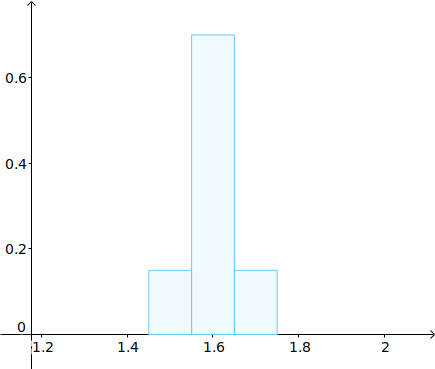
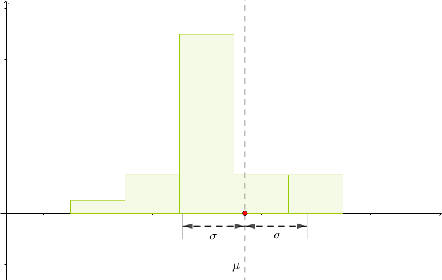
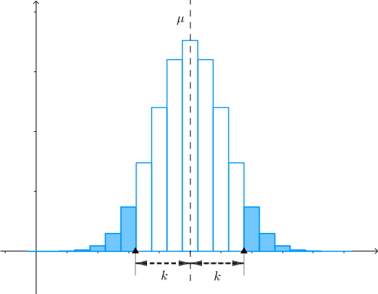

# 方差

两位气步枪运动员的打靶成绩如下（最高10环），你说教练应该选择谁去参加比赛：
$$
\begin{array}{c|c}
    \hline
    &\quad 第一次\quad&\quad 第二次\quad&\quad 第三次\quad&\quad 第四次\quad&\quad 第五次\quad\\
    \hline
    \\
    \quad 小明\quad & 4 & 10 & 4 & 4 & 10 \\
    \quad 小红\quad & 8 & 10 & 7 & 0 & 7 \\
    \\
    \hline
\end{array}
$$
看均值？两个选手是一样的：
$$
算数平均均值的形式: \\
\overline{X}=\frac{4+10+4+4+10}{5}=\frac{8+10+7+0+7}{5}=6.4 \\
加权平均期望的形式:E(X)=\sum_{i=1}^{\infty}x_ip(x_i):  \\
\overline{X}=4*\frac{3}{5}+10*\frac{2}{5}=8*\frac{1}{5}+10*\frac{1}{5}+7*\frac{2}{5}+0*\frac{1}{5}=6.4
$$

首先，小明、小红成绩的各自中心都是：
$$
\overline{X}=6.4
$$
然后来计算各自与中心的距离和，并且除以各自的子弹数（为了避免运算复杂，计算距离的时候就不开根号了，这不会影响比较的结果）：
$$
S_{小明}=\frac{(4-\overline{X})^2+(10-\overline{X})^2+(4-\overline{X})^2+(4-\overline{X})^2+(10-\overline{X})^2}{5}=8.64  \\
也可以写成加权的形式: \\
S_{小明}=\frac{3}{5}*(4-6.4)^2+\frac{2}{5}*(10-6.4)^2=8.64
$$
$$
S_{小红}=\frac{(8-\overline{X})^2+(10-\overline{X})^2+(7-\overline{X})^2+(0-\overline{X})^2+(7-\overline{X})^2}{5}=11.44  \\
也可以写成加权的形式: \\
S_{小红}=\frac{1}{5}*(8-6.4)^2+\frac{1}{5}*(10-6.4)^2+\frac{2}{5}*(7-6.4)^2+\frac{1}{5}*(0-6.4)^2=11.44
$$

因为$S_{小明} < S_{小红}$，所以小红发挥更不稳定。主要原因是她有一枪脱靶，而脱靶意味着小红的下限很低，所以在均值一样的情况下，教练最后决定选择小明参加比赛。

## 方差
刚才分析了，如果有一个数据集，比如说：
$$
X=\{x_1,x_2,\cdots,x_n\}
$$
那么可以如下来衡量这些数据的“集中”程度：
$$
S=\frac{(X_1-\overline{X})^2+(X_2-\overline{X})^2+\cdots+(X_n-\overline{X})^2}{n}
$$
这个思路也可以用来衡量随机变量X的“集中”程度，不过对于随机变量，我们不使用算术平均，而是用加权平均，或者说期望。所以让我们用期望来改写上面的式子：
代数式：
$$
Var(X)=E\left[\Big(X-E(X)\Big)^2\right]
$$
或（在浙江大学的教材中用的是下列符号）：
$$
D(X)=E\left[\Big(X-E(X)\Big)^2\right]
$$
称为随机变量X的`方差`（Variance），也可记作$\sigma^2$或者$\sigma_X^2$。

方差的定义基本上就是刚才的思路，只是把数据集改为了随机变量X，算术平均改为了加权平均。它可以衡量随机变量X的集中程度，越小则越集中。

我们来看一个例子，一班、二班学生的身高分别是随机变量X、Y，各自的概率分布如下：
$$
\begin{array}{c|c}
    \hline
    \quad k\quad &\quad 1.4\quad&\quad 1.5\quad&\quad 1.6\quad&\quad 1.7\quad&\quad 1.8\quad\\
    \hline
    \\
    P(X=k) & 0 & 0.15 & 0.7 & 0.15 & 0\\
    P(Y=k)& 0.05 & 0.15 & 0.5 & 0.15 & 0.15\\
    \\
    \hline
\end{array}
$$

根据这个概率分布，可以算出两个班的平均身高（也就是数学期望）差不多：
$$
\mu_X=1.6,\quad \mu_Y=1.62
$$
但是方差：
$$
\sigma_X^2=E\left[(X-\mu_X)^2\right]=0.003  \\
\sigma_Y^2=E\left[(Y-\mu_Y)^2\right]=0.0106
$$
从图像上也可以看出一班的身高更集中：

### 二阶矩
$$
\sigma^2=E\left[(X-\mu)^2\right]=\sum_{i}(x_i-\mu)^2p(x_i)
$$
其中$(x_i-\mu)^2$是二次项，对比一阶矩$E(X)$而言，方差$\sigma^2$也可以称作`二阶矩`（这在物理中对应惯性矩）。

### 方差的意义
方差在不同场合有不同的意义：
- 刚才看到的运动场合，方差大意味着发挥的不稳定
- 对于抽象的数据集，方差大意味着数据的比较离散
- 在概率论中，方差大意味着概率质量函数的分布比较分散，随机性高
- 金融领域，方差大意味着波动大，风险高

## 标准差
方差有一个问题，单位不对。还是用之前二班学生身高来举例子，其概率分布如下：
$$
\begin{array}{c|c}
    \hline
    \quad X\quad &\quad 1.4\quad&\quad 1.5\quad&\quad 1.6\quad&\quad 1.7\quad&\quad 1.8\quad\\
    \hline
    \\
    P & 0.05 & 0.15 & 0.5 & 0.15 & 0.15\\
    \\
    \hline
\end{array}
$$
我们可以算出平均身高为：
$$
\mu=1.67(米)
$$
注意这里的单位为“米”，其方差为：
$$
\sigma^2=E\left[\Big(X-\mu\Big)^2\right]=0.0131(米^2)
$$
注意此时方差的单位是“米^2”。为了可以和平均身高进行比较，我们就需要把这个单位换算为“米”，最直接的办法就是开根号：
假如随机变量X的方差为Var(X)，则称：
$$
\sigma(X)=\sqrt{Var(X)}
$$
为\color{Salmon}{标准差}，也可以记作$\sigma$或者$\sigma_X$。

有了这个定义之后，就可以算出身高的标准差：
$$
\sigma(X)=\sqrt{Var(X)}\approx 0.1145(米)
$$
根据标准差，可以大致认为身高分布在以$\mu$为中心，$\sigma$为半径的范围内：

## 方差的性质
可以通过下式来化简运算：
$$
Var(X)=E\left(X^2\right)-\mu^2
$$
若c为常数，则：
$$
Var(c)=0
$$
若a、b为常数，则：
$$
Var(aX+b)=a^2Var(X)
$$

## 马尔科夫不等式
期望、方差称为概率质量函数PMF的\color{Salmon}{数字特征}，它们把复杂的概率分布浓缩为一个实数，使得我们可以快速把握概率分布的特征。
现实中还存在这种情况，只知道数字特征而不知道PMF，那么能否通过数字特征尝试重建PMF呢？毕竟PMF可以提供更多的细节。

在新闻上看到“中国男人平均身高1.718米”，也就是说身高X的E(X)=1.718, 既然是平均身高，那么自然会有高有矮，会不会存在身高171.8米的巨人？
这个问题用数学的语言来讲的话，就是要求：
$$
P(X=171.8)=?
$$
但这里只知道平均身高，也就是数学期望E(X)，怎么求出具体的概率值呢？回想下数学期望的定义：
$$
E(X)=\sum_{i=0}^{\infty}x_iP(X=x_i)
$$
由于身高一定大于0的，所以上面累加的每一项都是正数，从而可得：
$$
171.8 P(X=171.8)\le E(X)
$$
进而可以推出：
$$
P(X=171.8)\le \frac{E(X)}{171.8}=1\%
$$
这说明171.8米的巨人存在的概率很低。

## 切比雪夫不等式
在刚才的练习题中可以看到，马尔可夫不等式的估计是相当得差。如果知道方差的话，那么通过\color{Salmon}{切比雪夫不等式}来估计会更加准确：
设X是一随机变量，均值\mu和方差\sigma^2有限，则对任何k > 0有：
$$
P(|X-\mu| \ge k)\le \frac{\sigma^2}{k^2}
$$

例\ 根据官方数据有：
中国人均收入为51350元
收入的标准差为44000元

解\ 根据题干，我们实际上知道了$\mu=51350$，$\sigma=44000$，那么人均收入超过百万的包含在下列不等式中：
$$
|X-51350| \ge 948650
$$
根据切比雪夫不等式有：
$$
P(|X-51350| \ge 948650)\le \frac{44000^2}{948650^2}\approx 0.22\%
$$
也就是千分之二左右，比之前的马尔可夫不等式估计出来的值要小多了。

$P(|X-\mu| \ge k)$指的是与\mu距离大于k的概率，也就是下图中蓝色阴影部分的面积：

当k越大，那么$\frac{\sigma^2}{k^2}$会越小，结合切比雪夫不等式：
$$
P(|X-\mu| \ge k)\le \frac{\sigma^2}{k^2}
$$
也就是说X越远离$\mu$，则概率越小；或者通俗地说，X大概率会围绕在$\mu$附近。