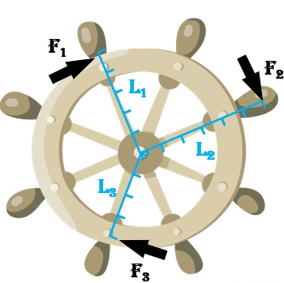
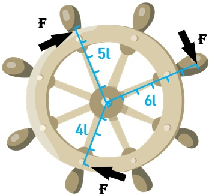
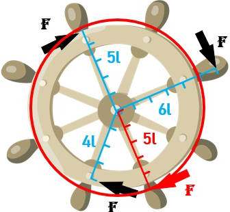

# 矩

说到“矩”，很容易想到物理学上的“力矩”，而“力矩=力臂×力”。我们从力矩开始说起。

## 原点矩
这里有一个船舵，有三个船员都用力转动船舵，不过着手点力臂分别为$L_1,L_2,L_3$。那么平均力矩是多少？

$$
a_1 = \frac{F_1L_1+F_2L_2+F_3L_3}{3}
$$
这个就是一阶矩.

将一阶矩平方就得到了二阶矩,
$$
a_2 = \frac{(F_1L_1)^2+(F_2L_2)^2+(F_3L_3)^2}{3}
$$

一阶平均矩衡量的是矩的平均大小, 但是如果有一个力的方向是相反的, 一阶平均矩衡量的就是输出力矩的平均值. 哪要如何衡量总力矩的平均值呢, 这就是二阶矩要解决的问题. 假设第二个力$F_2$方向和其他力相反, 则一阶矩的平均值为:
$$
a_3 = \frac{F_1L_1-F_2L_2+F_3L_3}{3}
$$
此时$a_3$衡量的是输出的力矩的平均值, 并非所有力矩的平均值.(比如我们想知道三个船员一共使了多少力).这时就可以使用二阶矩来衡量.
$$
a_4 = \frac{(F_1L_1)^2+(-F_2L_2)^2+(F_3L_3)^2}{3}
$$
当然, 也可以使用一阶矩的绝对值来衡量

## 中心矩
在原点矩中, 所谓“原点”，是因为力矩的计算是指向船舵原点的，但既然有指向原点的“原点矩”，就有指向其他位置的矩，这种矩叫“中心矩”。

这个“中心”，指的是哪里呢？是平均值。为了便于理解，我们将上述例子中的力取相等的F。且取$L_1=5l,L_2=6l,L_3=4l$。

那么`中心`指的就是$\frac{4FL+3FL+6FL}{3}=5FL$, 画出来就是这样:

也就是图中的红圈，其代表的力矩是5Fl，这是中心矩计算里的“中心”，也就是力矩的平均值。
### 一阶中心矩
$$
m_1 = \frac{(FL_1-\bar{FL})+(FL_2-\bar{FL})+(FL_3-\bar{FL})}{3}=0
$$
一阶中心矩一定等于零，所以你听到的中心矩一定是从二阶开始的。

### 二阶中心距
$$
m_2 = \frac{(FL_1-\bar{FL})^2+(FL_2-\bar{FL})^2+(FL_3-\bar{FL})^2}{3}
$$
二阶中心矩就是方差。它衡量的是例子中，三个力矩的离散程度。

### 三阶中心距
$$
m_2 = \frac{(FL_1-\bar{FL})^3+(FL_2-\bar{FL})^3+(FL_3-\bar{FL})^3}{3}
$$
三阶中心矩也叫偏度，是的，跟我们之前文章里提到的“偏度因子”是有关的。要记住带“因子/系数”的都是无量纲的，怎样消除的量纲呢，也很简单，对于三阶中心矩，除以标准差的三次方，即可消除量纲。即：
$$
K_3 = \frac{m_3}{\sigma^3}
$$

### 四阶中心距
$$
m_2 = \frac{(FL_1-\bar{FL})^4+(FL_2-\bar{FL})^4+(FL_3-\bar{FL})^4}{3}
$$
四阶中心矩也叫峭度或者峰度。峭度因子是消除量纲后的峭度，方法是除以标准差的四次方。即：
$$
K_4 = \frac{m_4}{\sigma^4}
$$

## 总结
综合上述“原点矩”和“中心矩”的描述，其一般表达式分别为：
原点矩： 
$$
a_k = \frac{1}{n}\sum_{i=1}^n X_i^k
$$
中心矩:
$$
m_k = \frac{1}{n}\sum_{i=1}^n(X_i-\bar X_n)^k
$$

名称|含义
--|--
一阶原点矩|平均值
二阶原点矩|平方的平均值
一阶中心矩|0
二阶中心矩|方差
三阶中心矩|偏度
四阶中心矩|峰度

参考:
https://zhuanlan.zhihu.com/p/57802400