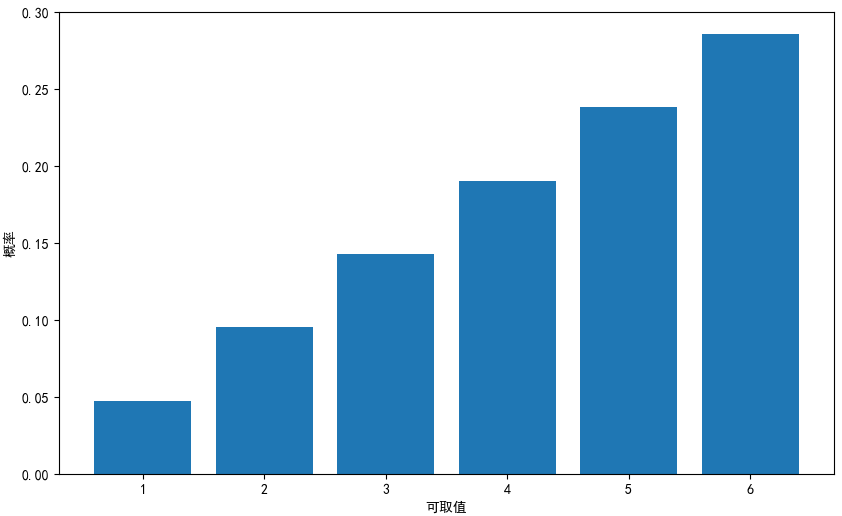

# 一维随机变量

## 概率质量函数
### 定义
在离散情况下, 随机变量$X$的可取值为$[x_1,x_2,...]$, 则$X$取$x_k$的概率可以定义为:
$$
P(X=x_k)=p_k(k=1,2,...)
$$
此时, 概率可看做$x_k$做参数的函数, 即:
$$
f(x_k)=P(X=x_k)
$$
函数$f(x)$称为概率质量函数(probability mass function, PMF)或概率质量函数.

以掷骰子为例, 将可取值的集合$[x_1,x_2,...]$定义为`x_set`, 掷骰子可得到1~6的整数.
```python
import numpy as np
import matplotlib.pyplot as plt
plt.rcParams['font.sans-serif'] = ['SimHei']  # 用来正常显示中文标签
plt.rcParams['axes.unicode_minus'] = False  # 用来正常显示负号
x_set = np.array([1, 2, 3, 4, 5, 6])
```
接下来定义`x_set`对应的概率. **重心偏移**的骰子概率分布:
<font style="background: hotpink">注意: **重心偏移**是指获得点数的概率不均匀, 这里越大的点数获得的概率越大, 如下</font>
点数|1|2|3|4|5|6
--|--|--|--|--|--|--
概率|1/21|2/21|3/21|4/21|5/21|6/21


因此概率$p_k$设定为:
$$
p_1 = P(X=1)=1/21  \\
p_2 = P(X=2)=2/21  \\
...
$$
使用概率密度函数表示为:
$$
f(x)= \begin{cases}
    x/21  &x\in(1,2,3,4,5,6) \\
    0  &(otherwise)
\end{cases}
$$

<font style="background: lightgreen">注意和连续中的概率密度函数(PDF)来区分, 在概率质量函数中对应的值就是概率本身, 而概率密度函数是**质量/长度**是概率的密度, 需要乘以随机变量$X$才能表示概率, 参考[概率密度函数](/probability_连续_概率密度函数/)</font>

### 使用python实现概率质量函数

```python
def f(x):
    if x in x_set:
        return x / 21
    else:
        return 0
```
可取值的集合`x_set`和概率密度函数的集合`f(x)`就是概率分布. 因此$X$是通过`x_set`和`f(x)`作为元素的列表实现的.
<font style="background: yellow">这里$X$变量仅是为了说明概念, 代码中实际并未用到</font>

```python
X = [x_set, f]
```
这样就可以定义随机变量$X$了. 从概率函数中计算各$x_k$的概率$p_k$, 这里以字典的形式显示了$x_k$和概率$p_k$的对应关系.
```python
## 求概率p_k
prob = np.array([f(x_k) for x_k in x_set])
## 以字典的形式显示x_k和p_k的对应关系
dict(zip(x_set, prob))  # {1: 0.048, 2: 0.095, 3: 0.143, 4: 0.190, 5: 0.238, 6: 0.286}
```
绘制直方图观察
```python
fig = plt.figure(figsize=(10, 6))
ax = fig.add_subplot(111)
ax.bar(x_set, prob)
ax.set_xlabel('可取值')
ax.set_ylabel('概率')

plt.show()
```




## 概率质量函数的性质
### 定义
$$
f(x_k) \geq 0 \\
\sum_kf(x_k) = 1
$$
<font style="background: yellow">$X=[x_1,...,x_k]$可以理解为样本空间$\Omega$. 可以将$X$看成一个观察事物的**维度**, 比如观察1000个人, $X$表示是否患病, 则$X=[x_1(患病),x_2(不患病)]$.</font>


### 使用python验证这两个性质
使用`np.all`可以确认概率是否都不小于0. `np.all`只在所有元素都为真的时候返回真.
```python
np.all(prob >= 0)  # True
np.sum(prob)  # 1
```


## 累积分布函数

### 定义
概率质量函数是随机变量$X$取值$x_k$时返回对应概率的函数, 但也经常使用随机变量$X$取值多个$x_k$返回对应概率的函数, 这样的函数$F(x)$被称为累积分布函数(cumulative distribution function, CDF), 定义如下:
$$
F(x) = P(X \leq x) = \sum_{x_k \leq x}f(x_k)
$$

### 使用python实现累积分布函数
python中通过以下函数定义分布函数
```python
def F(x):
    return np.sum([f(x_k) for x_k in x_set if x_k <= x])
```

## 随机变量的线性
比如将随机变量$X$乘以2再加上3后的$2X+3$. 
<font style="background: lightgreen">随机变量的线性变换可用于将随机变量标准化(减均值除方差).</font>

将$2X+3$记为随机变量$Y$, 于是, $Y$的概率分布如下:
```python
y_set = np.array([2 * x_k + 3 for x_k in x_set])
prob = np.array([f(x_k) for x_k in x_set])
dict(zip(y_set, prob))  # {5: 0.048, 7: 0.095, 9: 0.143, 11: 0.190, 13: 0.238, 15: 0.286}
```


## 一维离散型随机变量的数值指标

### 期望值
随机变量的平均值是指多次(无限次)试验中随机变量得到的实现值的平均值. 对于掷骰子这个试验就是指多次掷骰子得到的点数的平均值.假设, 我们投掷n次骰子, 每次获得的点数为$x_k$, 则均值为:
$$
\mu = \frac{x_{k1}+...+x_{kn}}{n}  \\
$$
其中, 脚标第一位表示点数, 第二位表示试验的次数. 我们将相同脚标的试验放在一起, 整理如下:
$$
\mu = \frac{x_1+...+x_1}{n} + ... + \frac{x_6+...+x_6}{n}
$$
假设`x_1`出现a次, `x_2`出现b次, ..., `x_6`出现f次, 则$a+...+f = n$ 上述的式子可以变化为:
$$
\mu = \frac{a}{n}x_1+...+\frac{f}{n}x_6
$$
我们可以看到$\frac{a}{n}$其实就是$P(x_1)$, 所以对于离散型随机变量, 其平均值被定义为随机变量的可能取值和概率的乘积的总和.
$$
E(X) = \sum_k x_kP(x_k)
$$
随机变量的平均值也被称为**期望值(expected value)**, 使用$\mu$或$E(X)$表示.这个公式计算的值与多次试验随机变量得到的实验值的平均值一致.

使用python按照定义计算投掷骰子的点数的期望值:
```python
np.sum([x_k * f(x_k) for x_k in x_set])  # 4.333
```
证明随机变量的期望值是多次试验后得到的实验值的平均值:
```python
sample = np.random.choice(x_set, int(1e6), p=prob)
np.mean(sample)  # 4.333
```
这个结果确实与按照定义计算的期望值一致. 
<font style="background: lightgreen">后面还会学到随机变量的方差和协方差等, 这些都可以认为是无限次试验得到的实验值的方差和协方差</font>

#### 期望的线性性质
考虑将随机变量$X$变换为$2X+3$得到的随机变量$Y$的期望值. 此时, 期望值中$x_k$的部分用$2x_k+3$替换即可得到下面的式子:
$$
E(Y) = E(2X+3) = \sum_k(2x_k + 3)f(x_k)
$$
一般来说, 可以定义随机变量$X$的函数$g(X)$的期望值.
$$
E[g(X)]=\sum_k g(x_k)f(x_k)
$$

```python
def E(X, g=lambda x: x):
    x_set, f = X
    return np.sum([g(x_k) * f(x_k) for x_k in x_set])
```
如果在`g`函数中什么都不指定, 则会计算随机变量$X$的期望值
```python
E(X)  # 4.333
```
随机变量$Y=2X+3$的期望值计算如下:
```python
E(X, g=lambda x: 2*x + 3)  # 11.667
```
期望值具有以下线性性质, 通过该性质, 可以求出形如$aX+b$的变换后的随机变量函数的期望值.
$$
E(aX+b) = aE(x) + b
$$
使用python确认以下:
```python
2 * E(X) + 3  # 11.667
```

### 方差
随机变量的方差也和数据的方差一样, 是表示偏差的指标. 对于离散型随机变量, 如下式所示, 方差被定义为偏差平方的期望值. 这里$\mu$是随机变量$X$的期望值$E(X)$.
$$
V(X)=\sum_k (x_k-\mu)^2 f(x_k)
$$
其中, $\sigma^2$和$V(X)$表示方差
```python
mean = E(X)
np.sum([(x_k-mean)**2 * f(x_k) for x_k in x_set])  # 2.222
```
当然也可以定义变换后的随机变量的方差. 例如, 考虑将随机变量$X$变换为$2X+3$的随机变量$Y$, 此时$Y$的方差有以下公式定义, 其中$\mu = E(2X+3)$:
$$
V(2X+3) = \sum_k[(2x_k +3)-\mu]^2f(x_k)
$$
可以定义随机变量$X$的函数$g(X)$的方差
$$
V[g(X)]=\sum_k(g(x_k)-E[g(X)])^2f(x_k)
$$
先来实现求方差的函数, 其中参数`g`是随机变量的变换函数

```python
def V(X, g=lambda x: x):
    x_set, f = X
    mean = E(X, g)
    return np.sum([(g(x_k)-mean)**2 * f(x_k) for x_k in x_set])

V(X)  # 2.222
V(X, lambda x: 2*x + 3)  # 8.889
```
和期望值一样, 方差$V(2X+3)$也可以通过$V(X)$来计算:
$$
V(aX+b)=a^2V(X)
$$

和期望值一样, 方差$V(2X+3)$也可以通过$V(X)$来计算:
$$
V(aX+b)=a^2V(X)
$$
使用这个公式可以知道$V(2X+3)=2^2V(X)$:
```python
2**2 * V(X)  # 8.889
```